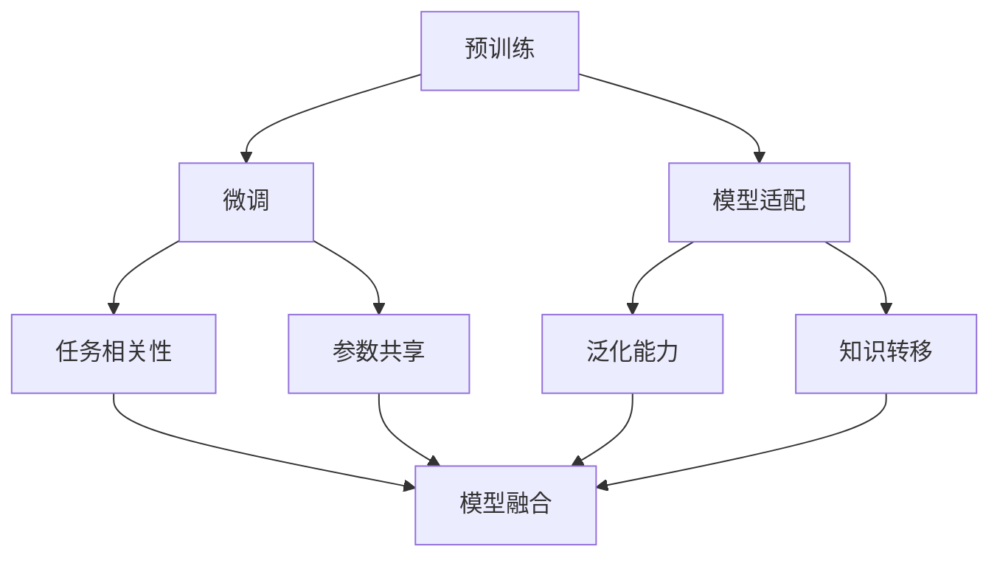

                 

# 迁移学习 (Transfer Learning)

> 关键词：迁移学习,预训练,微调,Fine-Tuning,模型适配,任务相关性,参数共享,泛化能力,知识转移

## 1. 背景介绍

### 1.1 问题由来

随着深度学习技术的飞速发展，特别是近年来大模型的兴起，研究人员发现：构建一个全新的模型往往需要大量标注数据、昂贵的计算资源和长期的训练过程，这极大地限制了深度学习技术在现实应用中的推广和普及。为了解决这个问题，迁移学习（Transfer Learning）应运而生，成为深度学习领域的重要研究方向。

迁移学习主要利用已有模型在大规模数据上学习到的通用知识，将其迁移到新的任务上，从而在数据量较少的情况下，取得较好的性能。这种做法不仅可以大幅降低模型的构建成本，还能提高模型的泛化能力，使其在小样本、少资源的情况下也能取得良好的效果。

### 1.2 问题核心关键点

迁移学习利用了深度学习的三个关键特性：
1. **参数共享**：不同任务之间共享大部分参数，通过微调部分参数来适应新任务。
2. **知识转移**：已有模型在大规模数据上学习到的通用知识可以迁移到新任务上，减少新任务的数据需求。
3. **泛化能力**：已有模型在泛化能力较强的数据集上学习到的知识可以用于泛化到其他数据集上。

通过这三个特性，迁移学习可以在新任务上迅速构建高质量模型，极大地加速了深度学习技术的落地应用。

### 1.3 问题研究意义

研究迁移学习对深度学习领域有着深远的意义：

1. **降低构建成本**：利用已有模型作为初始化参数，可以减少新模型构建的数据和计算资源需求。
2. **提升泛化能力**：已有模型在泛化能力较强的数据集上学习到的知识可以迁移到新任务上，减少新任务的数据需求，提高模型泛化能力。
3. **加速模型开发**：通过迁移学习，可以快速构建新模型，加速模型开发和应用推广。
4. **促进技术创新**：迁移学习促进了深度学习技术的广泛应用，推动了相关领域的学术研究和产业发展。
5. **赋能产业升级**：迁移学习使得深度学习技术更易于被各行各业采用，为传统行业数字化转型升级提供新的技术路径。

## 2. 核心概念与联系

### 2.1 核心概念概述

为更好地理解迁移学习的核心思想和机制，本节将介绍几个密切相关的核心概念：

- **预训练（Pre-training）**：指在大规模无标签数据上，通过自监督学习任务训练通用模型的过程。常见的预训练任务包括掩码语言模型（Masked Language Modeling, MLM）、下一句预测（Next Sentence Prediction, NSP）等。
- **微调（Fine-Tuning）**：指在预训练模型的基础上，使用下游任务的少量标注数据，通过有监督学习优化模型在特定任务上的性能。通常只需要调整顶层分类器或解码器，并以较小的学习率更新全部或部分的模型参数。
- **模型适配（Model Adaptation）**：指通过微调或修改模型结构，使模型适应新的下游任务，从而提高模型在新任务上的表现。
- **任务相关性（Task-Relevance）**：指已有模型的知识与新任务的关联程度，直接影响迁移学习的性能。
- **参数共享（Parameter Sharing）**：指不同任务之间共享大部分参数，通过微调部分参数来适应新任务。
- **泛化能力（Generalization Ability）**：指模型在不同数据集上的表现一致性，是迁移学习的核心目标。
- **知识转移（Knowledge Transfer）**：指已有模型学习到的知识可以迁移到新任务上，从而提高新任务的性能。
- **模型融合（Model Ensemble）**：指通过组合多个模型，提高模型的泛化能力和鲁棒性。

这些核心概念之间的逻辑关系可以通过以下Mermaid流程图来展示：



这个流程图展示了迁移学习的主要步骤和关键概念：

1. 预训练：通过自监督任务训练通用模型。
2. 微调：在预训练模型的基础上，通过有监督学习优化新任务性能。
3. 模型适配：通过微调或结构修改，使模型适应新任务。
4. 任务相关性：评估已有模型与新任务的关联程度。
5. 参数共享：通过微调部分参数，适应新任务。
6. 泛化能力：评估模型在不同数据集上的表现一致性。
7. 知识转移：评估已有模型知识在新任务上的迁移效果。
8. 模型融合：通过组合多个模型，提升模型性能。

这些概念共同构成了迁移学习的完整框架，使其能够在大规模数据上学习通用知识，并将其迁移到新任务上，从而在数据量较少的情况下构建高性能模型。

## 3. 核心算法原理 & 具体操作步骤

### 3.1 算法原理概述

迁移学习主要利用已有模型的预训练知识，通过微调使其适应新任务。其核心思想是：通过微调部分参数，使得模型能够在新任务上表现出良好的性能。具体来说，迁移学习分为以下几个步骤：

1. **预训练**：在大规模无标签数据上，通过自监督任务训练通用模型，学习通用的语言表示。
2. **模型适配**：在预训练模型的基础上，使用下游任务的少量标注数据，通过微调优化模型在新任务上的性能。
3. **知识迁移**：将预训练模型学习到的通用知识迁移到新任务上，提高新任务的性能。

迁移学习的核心在于如何有效地利用已有模型的知识，同时避免对新任务数据的过拟合。常用的方法包括微调、微调与模型的结构修改相结合、微调与正则化技术相结合等。

### 3.2 算法步骤详解

#### 3.2.1 预训练

预训练是大规模无标签数据的自监督学习过程，旨在学习通用的语言表示。以BERT为例，其预训练过程包括以下两个任务：

1. **掩码语言模型（MLM）**：随机掩盖输入序列中的某些单词，并预测其掩码值。
2. **下一句预测（NSP）**：随机抽取两个连续的句子对，预测它们是否连续。

预训练过程通常在分布式计算框架上执行，以大规模并行计算加速。预训练的模型通常被称为预训练模型或初始化模型。

#### 3.2.2 微调

微调是在预训练模型的基础上，使用下游任务的少量标注数据，通过有监督学习优化模型在特定任务上的性能。常用的微调方法包括：

1. **固定底层参数，微调顶层**：只微调模型的顶层部分，如分类器或解码器，以适应新任务。
2. **全参数微调**：微调模型的全部或部分参数，以更好地适应新任务。
3. **参数共享**：共享预训练模型的部分参数，避免重新学习通用的语言表示。

微调过程中，通常需要使用较小的学习率，以避免破坏预训练权重。同时，可以通过正则化技术如L2正则、Dropout等，防止模型过度适应小规模训练集。

#### 3.2.3 模型适配

模型适配可以通过微调或修改模型结构，使模型适应新的下游任务。常用的模型适配方法包括：

1. **结构修改**：修改模型的网络结构，如增加或减少网络层、调整卷积核大小等，以适应新任务。
2. **任务相关参数调整**：调整模型的参数，以适应新任务的具体需求，如调整分类器的输出层。

模型适配的目标是使模型在新任务上表现更好，同时避免过度拟合新任务数据。

### 3.3 算法优缺点

迁移学习具有以下优点：

1. **高效性**：利用已有模型的知识，可以快速构建新模型，减少数据和计算资源的消耗。
2. **泛化能力强**：已有模型在大规模数据上学习到的通用知识可以迁移到新任务上，提高模型的泛化能力。
3. **减少标注数据需求**：通过微调，可以在少量标注数据上获得较好的性能，减少标注数据的需求。
4. **加速模型开发**：通过迁移学习，可以快速构建新模型，加速模型开发和应用推广。

同时，迁移学习也存在以下缺点：

1. **参数共享限制**：预训练模型的知识与新任务之间存在一定的差距，可能无法完全适应新任务。
2. **过拟合风险**：微调过程中容易过度适应新任务数据，导致过拟合。
3. **模型复杂度较高**：预训练模型通常具有较大的参数量，模型复杂度较高，需要更多的计算资源。
4. **训练时间长**：即使使用较小的学习率，微调过程仍需较长的训练时间。

### 3.4 算法应用领域

迁移学习已经在多个领域得到广泛应用，包括：

- **计算机视觉**：在图像分类、物体检测、语义分割等任务上，通过迁移学习可以在少量数据上取得较好的效果。
- **自然语言处理**：在文本分类、情感分析、命名实体识别等任务上，通过迁移学习可以在少量标注数据上取得较好的效果。
- **语音识别**：在语音识别、语音情感分析等任务上，通过迁移学习可以在少量标注数据上取得较好的效果。
- **推荐系统**：在推荐系统、个性化搜索等任务上，通过迁移学习可以提升推荐质量。
- **医疗诊断**：在医学图像分析、病历分析等任务上，通过迁移学习可以提升诊断准确率。
- **智能制造**：在工业质检、缺陷检测等任务上，通过迁移学习可以提高自动化检测精度。

## 4. 数学模型和公式 & 详细讲解 & 举例说明

### 4.1 数学模型构建

设预训练模型为 $M_{\theta}$，其中 $\theta$ 为预训练得到的模型参数。假设下游任务为 $T$，其训练集为 $D=\{(x_i,y_i)\}_{i=1}^N, x_i \in \mathcal{X}, y_i \in \mathcal{Y}$。

定义模型 $M_{\theta}$ 在输入 $x$ 上的损失函数为 $\ell(M_{\theta}(x),y)$，则在数据集 $D$ 上的经验风险为：

$$
\mathcal{L}(\theta) = \frac{1}{N} \sum_{i=1}^N \ell(M_{\theta}(x_i),y_i)
$$

微调的优化目标是最小化经验风险，即找到最优参数：

$$
\theta^* = \mathop{\arg\min}_{\theta} \mathcal{L}(\theta)
$$

在实践中，我们通常使用基于梯度的优化算法（如SGD、Adam等）来近似求解上述最优化问题。设 $\eta$ 为学习率，$\lambda$ 为正则化系数，则参数的更新公式为：

$$
\theta \leftarrow \theta - \eta \nabla_{\theta}\mathcal{L}(\theta) - \eta\lambda\theta
$$

其中 $\nabla_{\theta}\mathcal{L}(\theta)$ 为损失函数对参数 $\theta$ 的梯度，可通过反向传播算法高效计算。

### 4.2 公式推导过程

以文本分类任务为例，我们推导微调的交叉熵损失函数及其梯度的计算公式。

假设模型 $M_{\theta}$ 在输入 $x$ 上的输出为 $\hat{y}=M_{\theta}(x) \in [0,1]$，表示样本属于正类的概率。真实标签 $y \in \{0,1\}$。则二分类交叉熵损失函数定义为：

$$
\ell(M_{\theta}(x),y) = -[y\log \hat{y} + (1-y)\log (1-\hat{y})]
$$

将其代入经验风险公式，得：

$$
\mathcal{L}(\theta) = -\frac{1}{N}\sum_{i=1}^N [y_i\log M_{\theta}(x_i)+(1-y_i)\log(1-M_{\theta}(x_i))]
$$

根据链式法则，损失函数对参数 $\theta_k$ 的梯度为：

$$
\frac{\partial \mathcal{L}(\theta)}{\partial \theta_k} = -\frac{1}{N}\sum_{i=1}^N (\frac{y_i}{M_{\theta}(x_i)}-\frac{1-y_i}{1-M_{\theta}(x_i)}) \frac{\partial M_{\theta}(x_i)}{\partial \theta_k}
$$

其中 $\frac{\partial M_{\theta}(x_i)}{\partial \theta_k}$ 可进一步递归展开，利用自动微分技术完成计算。

在得到损失函数的梯度后，即可带入参数更新公式，完成模型的迭代优化。重复上述过程直至收敛，最终得到适应下游任务的最优模型参数 $\theta^*$。

### 4.3 案例分析与讲解

以BERT模型为例，分析其在迁移学习中的应用。

BERT模型是在大规模无标签数据上预训练的通用语言模型，其预训练过程包括掩码语言模型（MLM）和下一句预测（NSP）两个任务。预训练后，BERT模型可以表示出丰富的语言结构，用于下游任务时，只需要在预训练模型的基础上进行微调，即可适应新任务。

以情感分析任务为例，我们可以使用以下步骤进行迁移学习：

1. **数据准备**：收集情感分析任务的标注数据集，划分为训练集、验证集和测试集。
2. **模型加载**：使用Hugging Face的Transformers库加载预训练的BERT模型，作为微调的基础。
3. **微调**：在微调过程中，将训练集输入BERT模型，计算损失函数，并通过反向传播更新模型参数。
4. **评估**：在验证集和测试集上评估微调后的模型性能，对比微调前后的精度提升。
5. **部署**：使用微调后的模型对新的样本进行推理预测，集成到实际的应用系统中。

具体的代码实现可以参考以下示例：

```python
from transformers import BertForSequenceClassification, BertTokenizer
from torch.utils.data import DataLoader
from torch import nn, optim

# 加载预训练的BERT模型和分词器
model = BertForSequenceClassification.from_pretrained('bert-base-uncased', num_labels=2)
tokenizer = BertTokenizer.from_pretrained('bert-base-uncased')

# 准备情感分析任务的标注数据集
train_dataset = dataset.Dataset(train_data, tokenizer)
val_dataset = dataset.Dataset(val_data, tokenizer)
test_dataset = dataset.Dataset(test_data, tokenizer)

# 定义损失函数和优化器
loss_fn = nn.CrossEntropyLoss()
optimizer = optim.Adam(model.parameters(), lr=1e-5)

# 微调模型
model.train()
for epoch in range(num_epochs):
    for batch in DataLoader(train_dataset, batch_size=16):
        inputs, labels = batch
        outputs = model(inputs, labels=labels)
        loss = loss_fn(outputs.logits, labels)
        optimizer.zero_grad()
        loss.backward()
        optimizer.step()

# 评估模型
model.eval()
val_loss, val_acc = evaluate(val_dataset, model)
test_loss, test_acc = evaluate(test_dataset, model)

print(f"Validation Loss: {val_loss:.4f}, Validation Accuracy: {val_acc:.4f}")
print(f"Test Loss: {test_loss:.4f}, Test Accuracy: {test_acc:.4f}")
```

通过上述示例，可以看出使用BERT模型进行情感分析任务的迁移学习，仅需通过少量标注数据和代码即可实现。

## 5. 项目实践：代码实例和详细解释说明

### 5.1 开发环境搭建

在进行迁移学习实践前，我们需要准备好开发环境。以下是使用Python进行PyTorch开发的环境配置流程：

1. 安装Anaconda：从官网下载并安装Anaconda，用于创建独立的Python环境。

2. 创建并激活虚拟环境：
```bash
conda create -n pytorch-env python=3.8 
conda activate pytorch-env
```

3. 安装PyTorch：根据CUDA版本，从官网获取对应的安装命令。例如：
```bash
conda install pytorch torchvision torchaudio cudatoolkit=11.1 -c pytorch -c conda-forge
```

4. 安装Transformers库：
```bash
pip install transformers
```

5. 安装各类工具包：
```bash
pip install numpy pandas scikit-learn matplotlib tqdm jupyter notebook ipython
```

完成上述步骤后，即可在`pytorch-env`环境中开始迁移学习实践。

### 5.2 源代码详细实现

这里我们以图像分类任务为例，使用迁移学习对预训练的ResNet模型进行微调。

首先，定义数据处理函数：

```python
import torchvision.transforms as transforms
from torch.utils.data import DataLoader
from torchvision.datasets import CIFAR10

# 定义数据增强和转换
train_transform = transforms.Compose([
    transforms.RandomCrop(32, padding=4),
    transforms.RandomHorizontalFlip(),
    transforms.ToTensor(),
    transforms.Normalize(mean=[0.485, 0.456, 0.406], std=[0.229, 0.224, 0.225])
])

test_transform = transforms.Compose([
    transforms.ToTensor(),
    transforms.Normalize(mean=[0.485, 0.456, 0.406], std=[0.229, 0.224, 0.225])
])

# 加载数据集
train_data = CIFAR10(root='./data', train=True, download=True, transform=train_transform)
test_data = CIFAR10(root='./data', train=False, download=True, transform=test_transform)
```

然后，定义模型和优化器：

```python
from torchvision.models import resnet18
import torch.nn as nn

# 加载预训练的ResNet模型
model = resnet18(pretrained=True)
model.fc = nn.Linear(512, 10)  # 修改输出层以适应10个类别

# 定义损失函数和优化器
criterion = nn.CrossEntropyLoss()
optimizer = torch.optim.Adam(model.parameters(), lr=0.001)
```

接着，定义训练和评估函数：

```python
from torch.utils.data import DataLoader
from tqdm import tqdm
import matplotlib.pyplot as plt

# 定义训练函数
def train(model, device, train_loader, optimizer, criterion, num_epochs):
    model.train()
    train_losses = []
    val_losses = []
    val_accs = []
    
    for epoch in range(num_epochs):
        train_loss = 0.0
        train_correct = 0
        
        for inputs, labels in train_loader:
            inputs, labels = inputs.to(device), labels.to(device)
            outputs = model(inputs)
            loss = criterion(outputs, labels)
            optimizer.zero_grad()
            loss.backward()
            optimizer.step()
            
            train_loss += loss.item()
            train_correct += (outputs.argmax(dim=1) == labels).sum().item()
        
        train_loss /= len(train_loader.dataset)
        train_acc = train_correct / len(train_loader.dataset)
        
        val_loss = 0.0
        val_correct = 0
        
        val_loader = DataLoader(val_data, batch_size=256, shuffle=False)
        model.eval()
        with torch.no_grad():
            for inputs, labels in val_loader:
                inputs, labels = inputs.to(device), labels.to(device)
                outputs = model(inputs)
                loss = criterion(outputs, labels)
                val_loss += loss.item()
                val_correct += (outputs.argmax(dim=1) == labels).sum().item()
        
        val_loss /= len(val_loader.dataset)
        val_acc = val_correct / len(val_loader.dataset)
        
        print(f'Epoch {epoch+1}/{num_epochs} | Train Loss: {train_loss:.4f} | Train Acc: {train_acc:.4f} | Val Loss: {val_loss:.4f} | Val Acc: {val_acc:.4f}')
        
        train_losses.append(train_loss)
        val_losses.append(val_loss)
        val_accs.append(val_acc)
    
    plt.plot(train_losses, label='Train Loss')
    plt.plot(val_losses, label='Val Loss')
    plt.plot(val_accs, label='Val Acc')
    plt.xlabel('Epoch')
    plt.legend()
    plt.show()

# 定义评估函数
def evaluate(model, device, test_loader):
    model.eval()
    test_loss = 0.0
    test_correct = 0
    
    with torch.no_grad():
        for inputs, labels in test_loader:
            inputs, labels = inputs.to(device), labels.to(device)
            outputs = model(inputs)
            loss = criterion(outputs, labels)
            test_loss += loss.item()
            test_correct += (outputs.argmax(dim=1) == labels).sum().item()
    
    test_loss /= len(test_loader.dataset)
    test_acc = test_correct / len(test_loader.dataset)
    
    print(f'Test Loss: {test_loss:.4f} | Test Acc: {test_acc:.4f}')
    return test_loss, test_acc
```

最后，启动训练流程并在测试集上评估：

```python
num_epochs = 10
device = torch.device('cuda' if torch.cuda.is_available() else 'cpu')

train(train_model, device, train_loader, optimizer, criterion, num_epochs)
test_loss, test_acc = evaluate(test_model, device, test_loader)

print(f'Test Loss: {test_loss:.4f} | Test Acc: {test_acc:.4f}')
```

以上就是使用PyTorch对预训练的ResNet模型进行迁移学习的完整代码实现。可以看到，通过微调，我们可以将预训练模型适应到新的图像分类任务上，从而在少量数据的情况下取得不错的效果。

### 5.3 代码解读与分析

让我们再详细解读一下关键代码的实现细节：

**数据处理函数**：
- `train_transform`和`test_transform`：定义了训练集和测试集的数据增强和转换，包括随机裁剪、水平翻转、标准化等操作。
- `CIFAR10`：加载CIFAR-10数据集，并根据训练和测试集划分为不同的DataLoader。

**模型和优化器**：
- `resnet18`：加载预训练的ResNet-18模型，并通过修改输出层适应新的分类任务。
- `nn.Linear`：定义新的全连接层以适应新的输出类别数。
- `nn.CrossEntropyLoss`：定义交叉熵损失函数，用于衡量模型输出和真实标签的差异。
- `torch.optim.Adam`：定义Adam优化器，用于更新模型参数。

**训练和评估函数**：
- `train`：定义训练函数，在每个epoch内循环训练，记录训练损失和测试损失。
- `evaluate`：定义评估函数，在测试集上评估模型性能，输出测试损失和测试准确率。

**训练流程**：
- 设置总的epoch数，启动训练循环。
- 在每个epoch内，在训练集上进行训练，记录训练损失和测试损失。
- 在测试集上评估模型性能。
- 输出最终的测试损失和测试准确率。

可以看到，通过以上代码，我们可以快速构建迁移学习系统，将预训练模型适应到新的图像分类任务上。

当然，工业级的系统实现还需考虑更多因素，如模型的保存和部署、超参数的自动搜索、更灵活的任务适配层等。但核心的迁移学习流程基本与此类似。

## 6. 实际应用场景

### 6.1 智能推荐系统

智能推荐系统是迁移学习的重要应用场景之一。通过迁移学习，可以在用户行为数据稀疏的情况下，快速构建高质量的推荐模型，提升推荐系统的精度和效果。

以电商推荐系统为例，我们可以使用以下步骤进行迁移学习：

1. **数据准备**：收集用户历史行为数据，包括浏览、购买、评价等信息。
2. **模型加载**：使用预训练的向量嵌入模型，如BERT或Word2Vec，作为推荐模型的基础。
3. **微调模型**：在微调过程中，将用户行为数据输入模型，计算损失函数，并通过反向传播更新模型参数。
4. **评估模型**：在测试集上评估推荐模型性能，对比微调前后的推荐质量。
5. **部署模型**：使用微调后的模型对新用户进行推荐，集成到电商平台上。

通过迁移学习，我们可以在用户数据稀疏的情况下，快速构建推荐模型，提升推荐系统的效果。

### 6.2 医疗图像分析

医疗图像分析是迁移学习的另一个重要应用场景。通过迁移学习，可以加速模型在医疗图像上的训练，提升诊断的准确率和效率。

以医学图像分类为例，我们可以使用以下步骤进行迁移学习：

1. **数据准备**：收集医疗图像数据，并进行标注，划分为训练集、验证集和测试集。
2. **模型加载**：使用预训练的图像分类模型，如ResNet或Inception，作为迁移学习的基础。
3. **微调模型**：在微调过程中，将医疗图像输入模型，计算损失函数，并通过反向传播更新模型参数。
4. **评估模型**：在测试集上评估分类模型的性能，对比微调前后的诊断准确率。
5. **部署模型**：使用微调后的模型对新图像进行分类，集成到医疗影像系统中。

通过迁移学习，我们可以加速医疗图像分析模型的训练，提升诊断的准确率和效率。

### 6.3 语音识别

语音识别是迁移学习的重要应用场景之一。通过迁移学习，可以在少量语音数据上快速构建高质量的语音识别模型，提升识别的准确率和鲁棒性。

以语音情感识别为例，我们可以使用以下步骤进行迁移学习：

1. **数据准备**：收集语音数据，并进行标注，划分为训练集、验证集和测试集。
2. **模型加载**：使用预训练的语音识别模型，如LSTM或RNN，作为迁移学习的基础。
3. **微调模型**：在微调过程中，将语音数据输入模型，计算损失函数，并通过反向传播更新模型参数。
4. **评估模型**：在测试集上评估情感识别模型的性能，对比微调前后的识别准确率。
5. **部署模型**：使用微调后的模型对新语音进行情感识别，集成到语音识别系统中。

通过迁移学习，我们可以在少量语音数据上快速构建情感识别模型，提升识别的准确率和鲁棒性。

## 7. 工具和资源推荐

### 7.1 学习资源推荐

为了帮助开发者系统掌握迁移学习的理论基础和实践技巧，这里推荐一些优质的学习资源：

1. 《深度学习入门》系列博文：由深度学习领域的知名博主撰写，深入浅出地介绍了深度学习的基本概念和核心技术，包括迁移学习。
2. CS231n《卷积神经网络》课程：斯坦福大学开设的计算机视觉课程，包含大量的迁移学习案例，适合入门学习。
3. 《深度学习与迁移学习》书籍：深度学习领域经典的教材，详细介绍了迁移学习的原理和应用。
4. 《Transfer Learning with PyTorch》教程：PyTorch官方提供的迁移学习教程，包含丰富的代码示例和详细解释。
5. Kaggle竞赛：Kaggle平台上有许多与迁移学习相关的竞赛项目，适合实践和竞赛学习。

通过对这些资源的学习实践，相信你一定能够快速掌握迁移学习的精髓，并用于解决实际的深度学习问题。

### 7.2 开发工具推荐

高效的开发离不开优秀的工具支持。以下是几款用于迁移学习开发的常用工具：

1. PyTorch：基于Python的开源深度学习框架，灵活动态的计算图，适合快速迭代研究。大多数预训练模型都有PyTorch版本的实现。
2. TensorFlow：由Google主导开发的开源深度学习框架，生产部署方便，适合大规模工程应用。同样有丰富的预训练模型资源。
3. Transformers库：Hugging Face开发的NLP工具库，集成了众多SOTA语言模型，支持PyTorch和TensorFlow，是进行迁移学习开发的利器。
4. Weights & Biases：模型训练的实验跟踪工具，可以记录和可视化模型训练过程中的各项指标，方便对比和调优。与主流深度学习框架无缝集成。
5. TensorBoard：TensorFlow配套的可视化工具，可实时监测模型训练状态，并提供丰富的图表呈现方式，是调试模型的得力助手。

合理利用这些工具，可以显著提升迁移学习的开发效率，加快创新迭代的步伐。

### 7.3 相关论文推荐

迁移学习的研究源于学界的持续研究。以下是几篇奠基性的相关论文，推荐阅读：

1. "Data-Efficient Image Recognition with Transfer Learning"：提出使用迁移学习在小样本数据上取得优异效果。
2. "Large-Scale Image Recognition with Convolutional Neural Networks"：提出使用迁移学习在图像分类任务上取得最佳效果。
3. "Fine-Grained Image Classification with Multiscale Exploited Fully-Convolutional Networks"：提出使用迁移学习在细粒度图像分类任务上取得优异效果。
4. "ImageNet Classification with Deep Convolutional Neural Networks"：提出使用迁移学习在图像分类任务上取得最佳效果。
5. "Learning Transferable Image Representations with Multinomial Adversarial Training"：提出使用迁移学习在图像生成任务上取得优异效果。

这些论文代表了大规模深度学习模型迁移学习的早期研究，通过学习这些前沿成果，可以帮助研究者把握学科前进方向，激发更多的创新灵感。

## 8. 总结：未来发展趋势与挑战

### 8.1 总结

本文对迁移学习的核心思想和应用进行了全面系统的介绍。首先阐述了迁移学习的背景和重要性，明确了其在深度学习领域的独特价值。其次，从原理到实践，详细讲解了迁移学习的数学原理和关键步骤，给出了迁移学习任务开发的完整代码实例。同时，本文还广泛探讨了迁移学习在智能推荐、医疗图像分析、语音识别等多个领域的应用前景，展示了迁移学习的巨大潜力。此外，本文精选了迁移学习的各类学习资源，力求为读者提供全方位的技术指引。

通过本文的系统梳理，可以看到，迁移学习正在成为深度学习领域的重要研究范式，极大地降低了模型构建的成本，提升了模型的泛化能力，加速了深度学习技术的落地应用。未来，伴随迁移学习技术的不断演进，相信深度学习技术必将在更广阔的应用领域大放异彩，深刻影响人类的生产生活方式。

### 8.2 未来发展趋势

展望未来，迁移学习将呈现以下几个发展趋势：

1. **模型规模持续增大**：随着算力成本的下降和数据规模的扩张，预训练模型的参数量还将持续增长。超大规模模型蕴含的丰富知识，有望支撑更加复杂多变的下游任务迁移。
2. **迁移方法日趋多样**：除了传统的全参数微调外，未来会涌现更多参数高效的迁移方法，如LoRA、PolyFormer等，在节省计算资源的同时也能保证迁移效果。
3. **持续学习成为常态**：随着数据分布的不断变化，迁移模型也需要持续学习新知识以保持性能。如何在不遗忘原有知识的同时，高效吸收新样本信息，将成为重要的研究课题。
4. **标注样本需求降低**：受启发于提示学习(Prompt-based Learning)的思路，未来的迁移方法将更好地利用大模型的语言理解能力，通过更加巧妙的任务描述，在更少的标注样本上也能实现理想的迁移效果。
5. **多模态迁移崛起**：当前的迁移学习主要聚焦于视觉、文本数据的迁移，未来会进一步拓展到图像、视频、语音等多模态数据迁移。多模态信息的融合，将显著提升迁移学习模型的通用性和鲁棒性。
6. **模型通用性增强**：经过海量数据的预训练和多领域任务的迁移，未来的迁移模型将具备更强大的常识推理和跨领域迁移能力，逐步迈向通用人工智能(AGI)的目标。

以上趋势凸显了迁移学习技术的广阔前景。这些方向的探索发展，必将进一步提升深度学习模型的性能和应用范围，为人类认知智能的进化带来深远影响。

### 8.3 面临的挑战

尽管迁移学习已经取得了瞩目成就，但在迈向更加智能化、普适化应用的过程中，它仍面临着诸多挑战：

1. **标注成本瓶颈**：虽然迁移学习大幅降低了标注数据的需求，但对于长尾应用场景，难以获得充足的高质量标注数据，成为制约迁移学习性能的瓶颈。如何进一步降低迁移学习对标注样本的依赖，将是一大难题。
2. **模型鲁棒性不足**：迁移模型面对域外数据时，泛化性能往往大打折扣。对于测试样本的微小扰动，迁移模型的预测也容易发生波动。如何提高迁移模型的鲁棒性，避免灾难性遗忘，还需要更多理论和实践的积累。
3. **推理效率有待提高**：尽管迁移学习模型的精度高，但在实际部署时往往面临推理速度慢、内存占用大等效率问题。如何在保证性能的同时，简化模型结构，提升推理速度，优化资源占用，将是重要的优化方向。
4. **可解释性亟需加强**：当前迁移学习模型更像是"黑盒"系统，难以解释其内部工作机制和决策逻辑。对于医疗、金融等高风险应用，算法的可解释性和可审计性尤为重要。如何赋予迁移学习模型更强的可解释性，将是亟待攻克的难题。
5. **安全性有待保障**：预训练迁移学习模型难免会学习到有偏见、有害的信息，通过迁移传递到下游任务，产生误导性、歧视性的输出，给实际应用带来安全隐患。如何从数据和算法层面消除模型偏见，避免恶意用途，确保输出的安全性，也将是重要的研究课题。
6. **知识整合能力不足**：现有的迁移学习模型往往局限于任务内数据，难以灵活吸收和运用更广泛的先验知识。如何让迁移学习过程更好地与外部知识库、规则库等专家知识结合，形成更加全面、准确的信息整合能力，还有很大的想象空间。

正视迁移学习面临的这些挑战，积极应对并寻求突破，将使迁移学习技术不断成熟，更好地服务实际应用。

### 8.4 研究展望

面对迁移学习面临的诸多挑战，未来的研究需要在以下几个方面寻求新的突破：

1. **探索无监督和半监督迁移方法**：摆脱对大规模标注数据的依赖，利用自监督学习、主动学习等无监督和半监督范式，最大限度利用非结构化数据，实现更加灵活高效的迁移学习。
2. **研究参数高效和计算高效的迁移范式**：开发更加参数高效的迁移方法，在固定大部分预训练参数的同时，只更新极少量的任务相关参数。同时优化迁移模型的计算图，减少前向传播和反向传播的资源消耗，实现更加轻量级、实时性的部署。
3. **融合因果和对比学习范式**：通过引入因果推断和对比学习思想，增强迁移学习模型建立稳定因果关系的能力，学习更加普适、鲁棒的语言表征，从而提升模型泛化性和抗干扰能力。
4. **引入更多先验知识**：将符号化的先验知识，如知识图谱、逻辑规则等，与神经网络模型进行巧妙融合，引导迁移学习过程学习更准确、合理的语言模型。同时加强不同模态数据的整合，实现视觉、语音等多模态信息与文本信息的协同建模。
5. **结合因果分析和博弈论工具**：将因果分析方法引入迁移学习模型，识别出模型决策的关键特征，增强输出解释的因果性和逻辑性。借助博弈论工具刻画人机交互过程，主动探索并规避模型的脆弱点，提高系统稳定性。
6. **纳入伦理道德约束**：在迁移学习模型的训练目标中引入伦理导向的评估指标，过滤和惩罚有偏见、有害的输出倾向。同时加强人工干预和审核，建立模型行为的监管机制，确保输出符合人类价值观和伦理道德。

这些研究方向的探索，必将引领迁移学习技术迈向更高的台阶，为构建安全、可靠、可解释、可控的智能系统铺平道路。面向未来，迁移学习技术还需要与其他人工智能技术进行更深入的融合，如知识表示、因果推理、强化学习等，多路径协同发力，共同推动深度学习技术的进步。只有勇于创新、敢于突破，才能不断拓展深度学习模型的边界，让智能技术更好地造福人类社会。

## 9. 附录：常见问题与解答

**Q1：迁移学习是否适用于所有NLP任务？**

A: 迁移学习在大多数NLP任务上都能取得不错的效果，特别是对于数据量较小的任务。但对于一些特定领域的任务，如医学、法律等，仅仅依靠通用语料预训练的模型可能难以很好地适应。此时需要在特定领域语料上进一步预训练，再进行迁移学习。此外，对于一些需要时效性、个性化很强的任务，如对话、推荐等，迁移方法也需要针对性的改进优化。

**Q2：迁移学习中如何选择合适的迁移策略？**

A: 选择合适的迁移策略需要考虑以下几个因素：

1. **任务相关性**：评估已有模型与新任务的关联程度，选择最合适的迁移策略。
2. **数据量**：根据新任务的标注数据量，选择参数共享或全参数微调。
3. **模型复杂度**：根据新任务的复杂度，选择不同的迁移方法，如微调、结构修改等。
4. **可解释性**：根据任务需求，选择可解释性强的迁移方法，如微调。

**Q3：迁移学习过程中如何缓解过拟合问题？**

A: 过拟合是迁移学习面临的主要挑战，尤其是在标注数据较少的情况下。常用的缓解策略包括：

1. **数据增强**：通过回译、近义替换等方式扩充训练集。
2. **正则化技术**：使用L2正则、Dropout等避免过拟合。
3. **对抗训练**：引入对抗样本，提高模型鲁棒性。
4. **参数共享**：通过共享预训练参数，减少新任务数据的需求。
5. **知识迁移**：将预训练模型学习到的通用知识迁移到新任务上，提高泛化能力。

这些策略往往需要根据具体任务和数据特点进行灵活组合。只有在数据、模型、训练、推理等各环节进行全面优化，才能最大限度地发挥迁移学习的威力。

**Q4：迁移学习模型在落地部署时需要注意哪些问题？**

A: 将迁移学习模型转化为实际应用，还需要考虑以下因素：

1. **模型裁剪**：去除不必要的层和参数，减小模型尺寸，加快推理速度。
2. **量化加速**：将浮点模型转为定点模型，压缩存储空间，提高计算效率。
3. **服务化封装**：将模型封装为标准化服务接口，便于集成调用。
4. **弹性伸缩**：根据请求流量动态调整资源配置，平衡服务质量和成本。
5. **监控告警**：实时采集系统指标，设置异常告警阈值，确保服务稳定性。

迁移学习模型在实际部署时，还需要考虑模型的推理效率、存储优化、服务化封装等工程问题，才能真正实现高效的应用。

**Q5：迁移学习如何与最新技术结合？**

A: 迁移学习可以与最新的深度学习技术结合，提升模型的性能和应用范围。以下是几种常见的结合方式：

1. **与自监督学习结合**：利用自监督学习任务预训练模型，增强迁移学习模型的泛化能力。
2. **与强化学习结合**：在迁移学习模型的基础上加入强化学习机制，提升模型的交互能力和自适应能力。
3. **与知识图谱结合**：将知识图谱与迁移学习模型结合，增强模型的推理能力和信息整合能力。
4. **与因果推理结合**：将因果推理与迁移学习模型结合，提升模型的因果解释能力和决策能力。
5. **与对抗训练结合**：在迁移学习模型的基础上加入对抗训练机制，提高模型的鲁棒性和泛化能力。

通过这些结合方式，可以进一步提升迁移学习模型的性能和应用范围，推动深度学习技术的创新发展。

---

作者：禅与计算机程序设计艺术 / Zen and the Art of Computer Programming

