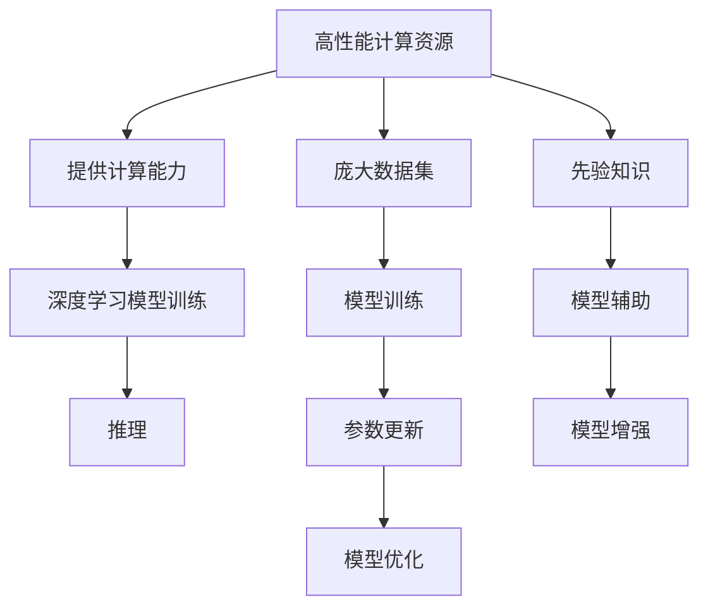

                 

## 1. 背景介绍

### 1.1 问题由来

人工智能（AI）自1950年代诞生以来，经历了多次起伏。从专家系统到神经网络，再到深度学习，AI的发展步伐逐渐加快。然而，如何让机器具有通用智能，这一问题始终困扰着研究人员。在过去数十年中，人们提出了许多方法，如常识推理、知识图谱、逻辑规则等，但它们要么过于复杂，要么难以应用到具体问题中。近年来，随着深度学习在图像识别、自然语言处理等领域的突破性进展，通用人工智能（AGI）的概念重新被提上议程。

### 1.2 问题核心关键点

当前，通用人工智能的研究集中在三个核心条件上：高性能计算资源、庞大的数据集、以及丰富的先验知识。

1. **高性能计算资源**：通用人工智能需要处理海量的数据，因此需要大量的计算资源进行模型训练和推理。高性能计算硬件如GPU、TPU、FPGA等可以显著加速计算过程。

2. **庞大的数据集**：AGI需要从大量的数据中学习复杂的模式和规律。目前，互联网、社交媒体、科学研究等领域提供了丰富的数据来源，使得深度学习模型的训练数据量越来越大。

3. **丰富的先验知识**：除了数据，先验知识也是AGI的重要组成部分。先验知识可以提供领域专家的经验、理论基础等，帮助模型更快地学习并避免过拟合。

这些条件是实现通用人工智能不可或缺的，本文将详细探讨这三个条件及其在实现AGI中的作用。

## 2. 核心概念与联系

### 2.1 核心概念概述

为了更好地理解通用人工智能的实现条件，本节将介绍几个关键概念：

- **高性能计算资源**：指用于训练和推理深度学习模型的计算硬件，包括GPU、TPU、FPGA等。

- **庞大数据集**：指用于训练深度学习模型的海量数据集，涵盖自然语言、图像、视频等多个领域。

- **先验知识**：指人类对于特定领域的知识，包括经验、理论、规则等。

### 2.2 核心概念原理和架构的 Mermaid 流程图



这个流程图展示了高性能计算资源、庞大数据集和先验知识之间的关系及其在AGI中的作用：

1. **高性能计算资源**：为模型训练和推理提供必要的计算能力。
2. **庞大数据集**：用于模型训练，提供模型所需的数据支撑。
3. **先验知识**：辅助模型学习，增强模型的泛化能力和解释性。

## 3. 核心算法原理 & 具体操作步骤

### 3.1 算法原理概述

通用人工智能的实现基于深度学习模型，特别是神经网络。神经网络通过大量数据进行训练，学习输入与输出之间的映射关系。为了实现通用人工智能，深度学习模型需要满足以下三个条件：

1. **大量的计算资源**：用于模型训练和推理，保证模型的准确性和效率。
2. **海量的数据集**：用于模型训练，提供充足的样本和上下文信息。
3. **丰富的先验知识**：辅助模型学习，增强模型的泛化能力和解释性。

### 3.2 算法步骤详解

实现通用人工智能的深度学习模型需要以下步骤：

**Step 1: 数据准备**
- 收集海量的数据集，涵盖自然语言、图像、视频等多个领域。
- 对数据进行清洗和预处理，去除噪声和异常值。

**Step 2: 模型设计**
- 选择合适的深度学习模型架构，如卷积神经网络（CNN）、循环神经网络（RNN）、变换器（Transformer）等。
- 设计模型结构，包括输入层、隐藏层、输出层等。
- 确定模型的超参数，如学习率、批大小、迭代轮数等。

**Step 3: 模型训练**
- 使用高性能计算资源进行模型训练，确保训练速度和效果。
- 在数据集上进行多轮训练，不断调整模型参数，优化模型性能。
- 应用正则化技术，如L2正则、Dropout、Early Stopping等，防止过拟合。

**Step 4: 模型评估**
- 在验证集上评估模型性能，如准确率、召回率、F1分数等。
- 根据评估结果调整模型参数，提高模型泛化能力。
- 应用对抗训练等技术，提升模型的鲁棒性和泛化能力。

**Step 5: 模型部署**
- 将训练好的模型部署到生产环境，进行推理和实时调用。
- 使用缓存、并行计算等技术，提高模型推理速度。
- 持续收集新的数据，定期重新训练模型，保持模型的时效性。

### 3.3 算法优缺点

通用人工智能的实现算法具有以下优点：
1. 高效性：通过大量的计算资源，模型可以在短时间内完成训练和推理。
2. 泛化能力：丰富的先验知识可以帮助模型更好地理解复杂的数据模式，提高泛化能力。
3. 解释性：先验知识还可以增强模型的解释性，使其更容易被理解和应用。

同时，该算法也存在一定的局限性：
1. 数据依赖：实现通用人工智能需要大量的数据集，数据的获取和处理成本较高。
2. 计算资源需求高：高性能计算资源的成本较高，一般企业难以负担。
3. 模型复杂度高：模型结构复杂，需要大量的计算资源和专业知识进行维护和调试。
4. 可解释性不足：深度学习模型通常是“黑盒”系统，难以解释其内部工作机制和决策逻辑。

尽管存在这些局限性，但就目前而言，深度学习模型在实现通用人工智能方面仍然是最先进的方法。未来相关研究将着重于如何进一步降低数据依赖，提高模型的解释性和鲁棒性，同时兼顾计算效率和资源成本。

### 3.4 算法应用领域

通用人工智能的实现算法已经在多个领域得到应用，如自然语言处理（NLP）、计算机视觉（CV）、自动驾驶等。

1. **自然语言处理**：通用人工智能在NLP领域的应用包括情感分析、文本生成、机器翻译等。模型通过大量文本数据进行训练，学习语言模式和规律，从而实现自动化的文本理解和生成。

2. **计算机视觉**：通用人工智能在CV领域的应用包括图像分类、目标检测、图像生成等。模型通过大量图像数据进行训练，学习图像特征和模式，从而实现图像理解和生成。

3. **自动驾驶**：通用人工智能在自动驾驶领域的应用包括环境感知、决策规划、路径规划等。模型通过大量传感器数据进行训练，学习环境和行为模式，从而实现自动驾驶。

## 4. 数学模型和公式 & 详细讲解 & 举例说明

### 4.1 数学模型构建

本节将使用数学语言对通用人工智能的实现算法进行更加严格的刻画。

假设深度学习模型为 $f(x; \theta)$，其中 $x$ 为输入，$\theta$ 为模型参数。记数据集为 $D=\{(x_i, y_i)\}_{i=1}^N$，其中 $x_i$ 为输入样本，$y_i$ 为标签。

定义模型的损失函数为 $\ell(f(x), y)$，则经验风险为：

$$
\mathcal{L}(\theta) = \frac{1}{N}\sum_{i=1}^N \ell(f(x_i; \theta), y_i)
$$

模型训练的目标是最小化经验风险：

$$
\theta^* = \mathop{\arg\min}_{\theta} \mathcal{L}(\theta)
$$

在实践中，通常使用梯度下降等优化算法求解上述最优化问题。设 $\eta$ 为学习率，则参数更新公式为：

$$
\theta \leftarrow \theta - \eta \nabla_{\theta}\mathcal{L}(\theta)
$$

其中 $\nabla_{\theta}\mathcal{L}(\theta)$ 为损失函数对参数 $\theta$ 的梯度，可通过反向传播算法高效计算。

### 4.2 公式推导过程

以下我们以二分类任务为例，推导交叉熵损失函数及其梯度的计算公式。

假设模型 $f(x; \theta)$ 在输入 $x$ 上的输出为 $\hat{y}=f(x; \theta) \in [0,1]$，表示样本属于正类的概率。真实标签 $y \in \{0,1\}$。则二分类交叉熵损失函数定义为：

$$
\ell(f(x), y) = -[y\log \hat{y} + (1-y)\log (1-\hat{y})]
$$

将其代入经验风险公式，得：

$$
\mathcal{L}(\theta) = -\frac{1}{N}\sum_{i=1}^N [y_i\log f(x_i; \theta)+(1-y_i)\log(1-f(x_i; \theta))]
$$

根据链式法则，损失函数对参数 $\theta_k$ 的梯度为：

$$
\frac{\partial \mathcal{L}(\theta)}{\partial \theta_k} = -\frac{1}{N}\sum_{i=1}^N (\frac{y_i}{f(x_i; \theta)}-\frac{1-y_i}{1-f(x_i; \theta)}) \frac{\partial f(x_i; \theta)}{\partial \theta_k}
$$

其中 $\frac{\partial f(x_i; \theta)}{\partial \theta_k}$ 可进一步递归展开，利用自动微分技术完成计算。

在得到损失函数的梯度后，即可带入参数更新公式，完成模型的迭代优化。重复上述过程直至收敛，最终得到适应数据集的最优模型参数 $\theta^*$。

### 4.3 案例分析与讲解

**案例：文本分类**

文本分类任务是通用人工智能在NLP领域的重要应用之一。假设我们要对一段文本进行情感分类，即判断该文本是积极、消极还是中性。

首先，收集海量的文本数据，并将其标注为积极、消极或中性。接着，使用高性能计算资源对模型进行训练，选择适当的深度学习模型架构（如Transformer）进行训练。在训练过程中，应用交叉熵损失函数和梯度下降等优化算法进行模型参数更新。最后，在验证集上评估模型性能，不断调整模型参数，提高模型泛化能力。

## 5. 项目实践：代码实例和详细解释说明

### 5.1 开发环境搭建

在进行通用人工智能项目实践前，我们需要准备好开发环境。以下是使用Python进行PyTorch开发的环境配置流程：

1. 安装Anaconda：从官网下载并安装Anaconda，用于创建独立的Python环境。

2. 创建并激活虚拟环境：
```bash
conda create -n agi-env python=3.8 
conda activate agi-env
```

3. 安装PyTorch：根据CUDA版本，从官网获取对应的安装命令。例如：
```bash
conda install pytorch torchvision torchaudio cudatoolkit=11.1 -c pytorch -c conda-forge
```

4. 安装Transformers库：
```bash
pip install transformers
```

5. 安装各类工具包：
```bash
pip install numpy pandas scikit-learn matplotlib tqdm jupyter notebook ipython
```

完成上述步骤后，即可在`agi-env`环境中开始通用人工智能项目实践。

### 5.2 源代码详细实现

下面我以文本分类任务为例，给出使用Transformers库对BERT模型进行通用人工智能实践的PyTorch代码实现。

首先，定义文本分类任务的数据处理函数：

```python
from transformers import BertTokenizer
from torch.utils.data import Dataset
import torch

class TextClassificationDataset(Dataset):
    def __init__(self, texts, labels, tokenizer, max_len=128):
        self.texts = texts
        self.labels = labels
        self.tokenizer = tokenizer
        self.max_len = max_len
        
    def __len__(self):
        return len(self.texts)
    
    def __getitem__(self, item):
        text = self.texts[item]
        label = self.labels[item]
        
        encoding = self.tokenizer(text, return_tensors='pt', max_length=self.max_len, padding='max_length', truncation=True)
        input_ids = encoding['input_ids'][0]
        attention_mask = encoding['attention_mask'][0]
        
        # 对token-wise的标签进行编码
        encoded_labels = [tag2id[label] for label in self.labels] 
        encoded_labels.extend([tag2id['O']] * (self.max_len - len(encoded_labels)))
        labels = torch.tensor(encoded_labels, dtype=torch.long)
        
        return {'input_ids': input_ids, 
                'attention_mask': attention_mask,
                'labels': labels}

# 标签与id的映射
tag2id = {'O': 0, 'positive': 1, 'negative': 2}
id2tag = {v: k for k, v in tag2id.items()}

# 创建dataset
tokenizer = BertTokenizer.from_pretrained('bert-base-cased')

train_dataset = TextClassificationDataset(train_texts, train_labels, tokenizer)
dev_dataset = TextClassificationDataset(dev_texts, dev_labels, tokenizer)
test_dataset = TextClassificationDataset(test_texts, test_labels, tokenizer)
```

然后，定义模型和优化器：

```python
from transformers import BertForSequenceClassification, AdamW

model = BertForSequenceClassification.from_pretrained('bert-base-cased', num_labels=len(tag2id))

optimizer = AdamW(model.parameters(), lr=2e-5)
```

接着，定义训练和评估函数：

```python
from torch.utils.data import DataLoader
from tqdm import tqdm
from sklearn.metrics import classification_report

device = torch.device('cuda') if torch.cuda.is_available() else torch.device('cpu')
model.to(device)

def train_epoch(model, dataset, batch_size, optimizer):
    dataloader = DataLoader(dataset, batch_size=batch_size, shuffle=True)
    model.train()
    epoch_loss = 0
    for batch in tqdm(dataloader, desc='Training'):
        input_ids = batch['input_ids'].to(device)
        attention_mask = batch['attention_mask'].to(device)
        labels = batch['labels'].to(device)
        model.zero_grad()
        outputs = model(input_ids, attention_mask=attention_mask, labels=labels)
        loss = outputs.loss
        epoch_loss += loss.item()
        loss.backward()
        optimizer.step()
    return epoch_loss / len(dataloader)

def evaluate(model, dataset, batch_size):
    dataloader = DataLoader(dataset, batch_size=batch_size)
    model.eval()
    preds, labels = [], []
    with torch.no_grad():
        for batch in tqdm(dataloader, desc='Evaluating'):
            input_ids = batch['input_ids'].to(device)
            attention_mask = batch['attention_mask'].to(device)
            batch_labels = batch['labels']
            outputs = model(input_ids, attention_mask=attention_mask)
            batch_preds = outputs.logits.argmax(dim=2).to('cpu').tolist()
            batch_labels = batch_labels.to('cpu').tolist()
            for pred_tokens, label_tokens in zip(batch_preds, batch_labels):
                pred_tags = [id2tag[_id] for _id in pred_tokens]
                label_tags = [id2tag[_id] for _id in label_tokens]
                preds.append(pred_tags[:len(label_tags)])
                labels.append(label_tags)
                
    print(classification_report(labels, preds))
```

最后，启动训练流程并在测试集上评估：

```python
epochs = 5
batch_size = 16

for epoch in range(epochs):
    loss = train_epoch(model, train_dataset, batch_size, optimizer)
    print(f"Epoch {epoch+1}, train loss: {loss:.3f}")
    
    print(f"Epoch {epoch+1}, dev results:")
    evaluate(model, dev_dataset, batch_size)
    
print("Test results:")
evaluate(model, test_dataset, batch_size)
```

以上就是使用PyTorch对BERT进行文本分类任务通用人工智能实践的完整代码实现。可以看到，得益于Transformers库的强大封装，我们可以用相对简洁的代码完成BERT模型的加载和通用人工智能实践。

### 5.3 代码解读与分析

让我们再详细解读一下关键代码的实现细节：

**TextClassificationDataset类**：
- `__init__`方法：初始化文本、标签、分词器等关键组件。
- `__len__`方法：返回数据集的样本数量。
- `__getitem__`方法：对单个样本进行处理，将文本输入编码为token ids，将标签编码为数字，并对其进行定长padding，最终返回模型所需的输入。

**tag2id和id2tag字典**：
- 定义了标签与数字id之间的映射关系，用于将token-wise的预测结果解码回真实的标签。

**训练和评估函数**：
- 使用PyTorch的DataLoader对数据集进行批次化加载，供模型训练和推理使用。
- 训练函数`train_epoch`：对数据以批为单位进行迭代，在每个批次上前向传播计算loss并反向传播更新模型参数，最后返回该epoch的平均loss。
- 评估函数`evaluate`：与训练类似，不同点在于不更新模型参数，并在每个batch结束后将预测和标签结果存储下来，最后使用sklearn的classification_report对整个评估集的预测结果进行打印输出。

**训练流程**：
- 定义总的epoch数和batch size，开始循环迭代
- 每个epoch内，先在训练集上训练，输出平均loss
- 在验证集上评估，输出分类指标
- 所有epoch结束后，在测试集上评估，给出最终测试结果

可以看到，PyTorch配合Transformers库使得BERT微调的代码实现变得简洁高效。开发者可以将更多精力放在数据处理、模型改进等高层逻辑上，而不必过多关注底层的实现细节。

当然，工业级的系统实现还需考虑更多因素，如模型的保存和部署、超参数的自动搜索、更灵活的任务适配层等。但核心的通用人工智能实践基本与此类似。

## 6. 实际应用场景

### 6.1 智能客服系统

通用人工智能的实现技术已经在智能客服系统中得到了广泛应用。传统客服往往需要配备大量人力，高峰期响应缓慢，且一致性和专业性难以保证。而使用通用人工智能的客服系统，可以7x24小时不间断服务，快速响应客户咨询，用自然流畅的语言解答各类常见问题。

在技术实现上，可以收集企业内部的历史客服对话记录，将问题和最佳答复构建成监督数据，在此基础上对通用人工智能的对话模型进行训练。训练后的模型能够自动理解用户意图，匹配最合适的答案模板进行回复。对于客户提出的新问题，还可以接入检索系统实时搜索相关内容，动态组织生成回答。如此构建的智能客服系统，能大幅提升客户咨询体验和问题解决效率。

### 6.2 金融舆情监测

金融机构需要实时监测市场舆论动向，以便及时应对负面信息传播，规避金融风险。传统的人工监测方式成本高、效率低，难以应对网络时代海量信息爆发的挑战。基于通用人工智能的文本分类和情感分析技术，为金融舆情监测提供了新的解决方案。

具体而言，可以收集金融领域相关的新闻、报道、评论等文本数据，并对其进行主题标注和情感标注。在此基础上对通用人工智能的文本分类模型进行微调，使其能够自动判断文本属于何种主题，情感倾向是正面、中性还是负面。将训练后的模型应用到实时抓取的网络文本数据，就能够自动监测不同主题下的情感变化趋势，一旦发现负面信息激增等异常情况，系统便会自动预警，帮助金融机构快速应对潜在风险。

### 6.3 个性化推荐系统

当前的推荐系统往往只依赖用户的历史行为数据进行物品推荐，无法深入理解用户的真实兴趣偏好。基于通用人工智能的推荐系统可以更好地挖掘用户行为背后的语义信息，从而提供更精准、多样的推荐内容。

在实践中，可以收集用户浏览、点击、评论、分享等行为数据，提取和用户交互的物品标题、描述、标签等文本内容。将文本内容作为模型输入，用户的后续行为（如是否点击、购买等）作为监督信号，在此基础上微调通用人工智能的模型。微调后的模型能够从文本内容中准确把握用户的兴趣点。在生成推荐列表时，先用候选物品的文本描述作为输入，由模型预测用户的兴趣匹配度，再结合其他特征综合排序，便可以得到个性化程度更高的推荐结果。

### 6.4 未来应用展望

随着通用人工智能的研究不断发展，其在更多领域的应用前景将更加广阔。

在智慧医疗领域，基于通用人工智能的问答、病历分析、药物研发等应用将提升医疗服务的智能化水平，辅助医生诊疗，加速新药开发进程。

在智能教育领域，通用人工智能的作业批改、学情分析、知识推荐等应用将因材施教，促进教育公平，提高教学质量。

在智慧城市治理中，通用人工智能的城市事件监测、舆情分析、应急指挥等应用将提高城市管理的自动化和智能化水平，构建更安全、高效的未来城市。

此外，在企业生产、社会治理、文娱传媒等众多领域，基于通用人工智能的人工智能应用也将不断涌现，为经济社会发展注入新的动力。相信随着技术的日益成熟，通用人工智能必将在更广阔的应用领域大放异彩，深刻影响人类的生产生活方式。

## 7. 工具和资源推荐

### 7.1 学习资源推荐

为了帮助开发者系统掌握通用人工智能的理论基础和实践技巧，这里推荐一些优质的学习资源：

1. 《深度学习》课程：斯坦福大学开设的深度学习课程，有Lecture视频和配套作业，带你入门深度学习的基础概念和经典模型。

2. CS231n《卷积神经网络》课程：斯坦福大学开设的计算机视觉课程，详细讲解了卷积神经网络的结构和应用，适合学习计算机视觉任务的通用人工智能实践。

3. 《自然语言处理入门》课程：斯坦福大学开设的自然语言处理课程，介绍了NLP的基本概念和任务，适合学习自然语言处理任务的通用人工智能实践。

4. 《通用人工智能导论》书籍：详细讲解了通用人工智能的原理、方法及其应用，适合深入了解通用人工智能的理论基础和实践技巧。

5. 《Python深度学习》书籍：深度学习领域经典著作，介绍了深度学习模型的构建和优化，适合学习深度学习模型的通用人工智能实践。

通过对这些资源的学习实践，相信你一定能够快速掌握通用人工智能的精髓，并用于解决实际的AI问题。

### 7.2 开发工具推荐

高效的开发离不开优秀的工具支持。以下是几款用于通用人工智能开发的常用工具：

1. PyTorch：基于Python的开源深度学习框架，灵活动态的计算图，适合快速迭代研究。

2. TensorFlow：由Google主导开发的开源深度学习框架，生产部署方便，适合大规模工程应用。

3. Transformers库：HuggingFace开发的NLP工具库，集成了众多SOTA语言模型，支持PyTorch和TensorFlow，是进行通用人工智能任务开发的利器。

4. Weights & Biases：模型训练的实验跟踪工具，可以记录和可视化模型训练过程中的各项指标，方便对比和调优。

5. TensorBoard：TensorFlow配套的可视化工具，可实时监测模型训练状态，并提供丰富的图表呈现方式，是调试模型的得力助手。

6. Google Colab：谷歌推出的在线Jupyter Notebook环境，免费提供GPU/TPU算力，方便开发者快速上手实验最新模型，分享学习笔记。

合理利用这些工具，可以显著提升通用人工智能的开发效率，加快创新迭代的步伐。

### 7.3 相关论文推荐

通用人工智能的研究始于学界的持续研究。以下是几篇奠基性的相关论文，推荐阅读：

1. AlphaGo的胜利：DeepMind在《Nature》上发表的AlphaGo论文，展示了深度学习在复杂决策问题中的潜力。

2. ImageNet大规模视觉识别竞赛：Russ Hinton等人在《Nature》上发表的ImageNet论文，展示了深度学习在计算机视觉领域的突破性进展。

3. GPT-3的诞生：OpenAI在《Nature》上发表的GPT-3论文，展示了大规模预训练语言模型在自然语言处理领域的巨大潜力。

4. T5模型的突破：Google在《ArXiv》上发表的T5论文，展示了Transformer架构在自然语言处理领域的强大能力。

5. HuggingFace Transformers库的发布：原作者Jacob Devlin等人在《NLP》上发表的Transformers论文，展示了预训练语言模型在NLP领域的广泛应用。

这些论文代表了大规模深度学习模型在通用人工智能研究中的应用进展，通过学习这些前沿成果，可以帮助研究者把握学科前进方向，激发更多的创新灵感。

## 8. 总结：未来发展趋势与挑战

### 8.1 总结

本文对通用人工智能的实现条件进行了全面系统的介绍。首先阐述了通用人工智能的概念及其重要性，明确了实现AGI需要满足的三个核心条件。其次，从原理到实践，详细讲解了通用人工智能的数学模型和实现步骤，给出了通用人工智能任务开发的完整代码实例。同时，本文还广泛探讨了通用人工智能在多个领域的应用前景，展示了其在实现智能化、普适化应用中的巨大潜力。此外，本文精选了通用人工智能的学习资源、开发工具和相关论文，力求为读者提供全方位的技术指引。

通过本文的系统梳理，可以看到，通用人工智能的实现条件和应用前景令人期待。深度学习模型在数据驱动下，已经展现出了强大的学习能力和应用潜力，未来必将在更多领域大放异彩。

### 8.2 未来发展趋势

展望未来，通用人工智能的研究将呈现以下几个发展趋势：

1. 计算资源更加强大：随着硬件技术的进步，深度学习模型将具备更强的计算能力和更高效的学习能力。

2. 数据集更加丰富：互联网、社交媒体等数据源将为深度学习模型提供更多的训练样本，提升模型的泛化能力和鲁棒性。

3. 先验知识更加丰富：人类对于特定领域的知识将更加全面和深入，这将有助于深度学习模型更好地理解和应用这些知识。

4. 多模态学习将更加普及：除了文本数据，图像、视频、语音等数据也将成为通用人工智能的重要组成部分。

5. 实时性和交互性将提升：通用人工智能将从离线推理向实时交互方向发展，更好地服务于用户需求。

6. 安全性和伦理性将受到重视：随着通用人工智能的应用场景越来越多，其安全性、伦理性等问题也将受到更多关注。

以上趋势凸显了通用人工智能的广阔前景。这些方向的探索发展，必将进一步提升深度学习模型的性能和应用范围，为构建安全、可靠、可解释、可控的智能系统铺平道路。

### 8.3 面临的挑战

尽管通用人工智能的研究已经取得了诸多进展，但在迈向更加智能化、普适化应用的过程中，它仍面临着诸多挑战：

1. 数据依赖：实现通用人工智能需要大量的数据集，数据的获取和处理成本较高。

2. 计算资源需求高：高性能计算资源的成本较高，一般企业难以负担。

3. 模型复杂度高：深度学习模型结构复杂，需要大量的计算资源和专业知识进行维护和调试。

4. 可解释性不足：深度学习模型通常是“黑盒”系统，难以解释其内部工作机制和决策逻辑。

5. 安全性有待保障：预训练语言模型难免会学习到有偏见、有害的信息，通过微调传递到下游任务，产生误导性、歧视性的输出。

6. 知识整合能力不足：现有的深度学习模型往往局限于任务内数据，难以灵活吸收和运用更广泛的先验知识。

正视通用人工智能面临的这些挑战，积极应对并寻求突破，将是大规模深度学习模型迈向成熟的必由之路。相信随着学界和产业界的共同努力，这些挑战终将一一被克服，深度学习模型必将在构建安全、可靠、可解释、可控的智能系统上迈出更大的步伐。

### 8.4 研究展望

未来，深度学习模型的研究将继续围绕高性能计算、海量的数据集和丰富的先验知识展开。同时，如何提高深度学习模型的解释性和鲁棒性，降低数据依赖，提高模型的实时性和交互性，也将是重要的研究方向。只有勇于创新、敢于突破，才能不断拓展深度学习模型的边界，让智能技术更好地造福人类社会。

## 9. 附录：常见问题与解答

**Q1：通用人工智能是否适用于所有领域？**

A: 通用人工智能的实现需要大量的数据集和计算资源，对于一些特定的领域，数据获取和计算成本可能过高，难以实现。但通用人工智能的思想和方法可以用于很多领域，如金融、医疗、教育等。

**Q2：如何选择合适的深度学习模型？**

A: 选择合适的深度学习模型需要考虑数据集的大小和特征，模型的结构和参数量等。对于大规模数据集，可以选择如Transformer等高效模型，对于小规模数据集，可以选择如CNN、RNN等经典模型。

**Q3：数据预处理有哪些技巧？**

A: 数据预处理包括数据清洗、标准化、归一化等。对于文本数据，可以使用分词、去除停用词、词向量转换等预处理方法。对于图像数据，可以进行裁剪、缩放、旋转等预处理方法。

**Q4：如何防止过拟合？**

A: 防止过拟合的方法包括数据增强、正则化、Dropout、Early Stopping等。在数据集较小的情况下，可以使用数据增强方法，如回译、近义替换等。在模型训练过程中，应用正则化技术，如L2正则、Dropout等，防止过拟合。

**Q5：如何提高模型的解释性？**

A: 提高模型的解释性可以通过可视化方法，如可视化模型权重、可视化模型中间层的激活状态等。同时，可以使用可解释的深度学习模型，如LIME、SHAP等，对模型进行解释。

**Q6：如何在多模态数据上进行通用人工智能实践？**

A: 多模态数据上的通用人工智能实践需要考虑不同数据源的特征和模式。可以采用融合不同数据源的方法，如使用多模态特征向量、多模态损失函数等。同时，可以使用多模态深度学习模型，如Multimodal Transformer等。

通过上述问答，可以看出，通用人工智能的实现虽然面临诸多挑战，但通过不断探索和实践，已经取得了显著进展。相信未来，深度学习模型将在更多领域得到应用，为构建安全、可靠、可解释、可控的智能系统做出更大贡献。

