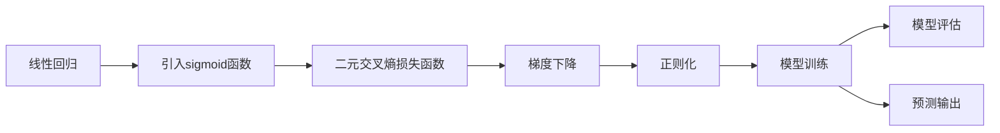

                 

## 1. 背景介绍

### 1.1 问题由来
逻辑回归（Logistic Regression, LR）是一种经典的机器学习算法，广泛用于分类和回归问题。它通过一个线性模型来建模输入变量与输出变量之间的关系，其输出通常是一个概率值，可以用于二分类或多分类任务。

在深度学习兴起之前，逻辑回归是处理分类任务的首选算法之一，在工业界和学术界都有广泛的应用。例如，在金融风险评估、医学诊断、垃圾邮件过滤等领域，逻辑回归都展示了其强大的预测能力。

### 1.2 问题核心关键点
逻辑回归的核心思想是将线性回归与概率模型结合，用于解决分类问题。它的优点在于模型简单、易于理解和解释，而且计算复杂度较低。

逻辑回归的数学表达式为：
$$ y = \frac{1}{1 + e^{-z}} $$
其中 $z = \theta^T x$，$\theta$ 为模型参数，$x$ 为输入特征，$y$ 为输出变量。在二分类问题中，$y$ 的值可以解释为样本属于正类的概率。

逻辑回归的预测过程如下：
1. 对每个样本 $x$，计算 $z = \theta^T x$。
2. 将 $z$ 值代入逻辑函数，得到样本属于正类的概率 $y$。
3. 根据 $y$ 值与预设阈值的大小关系，决定样本的分类。

### 1.3 问题研究意义
逻辑回归算法简单易懂，在处理分类问题时表现优异。它不仅在统计学领域有坚实的理论基础，而且广泛应用于各个行业。掌握逻辑回归的核心思想和实现细节，对于理解更复杂的机器学习算法以及解决实际问题具有重要意义。

## 2. 核心概念与联系

### 2.1 核心概念概述
逻辑回归的核心概念包括：

- **线性回归**：线性回归是逻辑回归的基础，用于预测连续的输出值。逻辑回归通过引入逻辑函数（sigmoid函数），将线性回归的输出值转化为概率值，从而用于分类问题。
- **损失函数**：逻辑回归使用二元交叉熵损失函数（Binary Cross-Entropy Loss）来衡量模型预测值与真实标签之间的差异。
- **梯度下降**：梯度下降是逻辑回归常用的优化算法，用于最小化损失函数。
- **正则化**：为了防止过拟合，逻辑回归通常在损失函数中引入正则化项（如L1、L2正则）。

这些概念构成了逻辑回归的核心框架，并在实际应用中不断演变，衍生出多种改进算法和变种。

### 2.2 核心概念原理和架构的 Mermaid 流程图



这个流程图展示了逻辑回归的核心流程：首先通过线性回归获取预测值，然后引入sigmoid函数将其转化为概率值，接着使用二元交叉熵损失函数计算预测值与真实标签的差异，并通过梯度下降算法最小化损失函数，最后进行模型训练和评估，输出预测结果。

## 3. 核心算法原理 & 具体操作步骤

### 3.1 算法原理概述
逻辑回归是一种基于线性模型的分类算法，其核心在于通过线性回归和sigmoid函数的结合，将输入特征映射为输出变量的概率。

假设输入特征为 $x = [x_1, x_2, ..., x_n]$，输出变量为 $y$，模型参数为 $\theta = [\theta_1, \theta_2, ..., \theta_n]$，则逻辑回归的数学表达式为：
$$ y = \frac{1}{1 + e^{-z}} $$
其中 $z = \theta^T x = \sum_{i=1}^n \theta_i x_i$。

逻辑回归的损失函数为二元交叉熵损失，其表达式为：
$$ L(y, \hat{y}) = -y \log \hat{y} - (1 - y) \log (1 - \hat{y}) $$
其中 $\hat{y}$ 为模型预测的输出概率。

### 3.2 算法步骤详解

#### 3.2.1 数据准备
1. 收集并预处理数据集，包括数据清洗、归一化、编码等操作。
2. 将数据集划分为训练集和测试集，并按照一定比例进行分割。

#### 3.2.2 模型训练
1. 初始化模型参数 $\theta$。
2. 对每个训练样本 $(x, y)$，计算 $z = \theta^T x$。
3. 将 $z$ 值代入sigmoid函数，得到模型预测的输出概率 $\hat{y}$。
4. 计算损失函数 $L(y, \hat{y})$。
5. 使用梯度下降算法更新模型参数 $\theta$，最小化损失函数。
6. 重复上述步骤，直到模型收敛。

#### 3.2.3 模型评估
1. 对测试集进行预测，并计算模型的准确率、精确率、召回率等评估指标。
2. 使用混淆矩阵等工具对模型性能进行可视化分析。

#### 3.2.4 模型应用
1. 对新数据进行预测，得到模型输出的概率值。
2. 根据预设阈值进行分类，判断新数据属于哪一类。

### 3.3 算法优缺点

#### 3.3.1 优点
- 模型简单、易于理解和解释，计算复杂度较低。
- 适用于线性可分问题，可解释性强。
- 可以处理多分类问题，且输出概率值可以直接用于后处理。

#### 3.3.2 缺点
- 对于非线性问题，表现不佳。
- 对于特征过多或特征之间存在高度相关性时，容易过拟合。
- 对异常值敏感，需要进行特征选择和预处理。

### 3.4 算法应用领域

逻辑回归在多个领域都有广泛应用，主要包括：

- 金融风控：用于评估客户信用风险，预测违约概率。
- 医疗诊断：用于预测疾病患病概率，如癌症、糖尿病等。
- 网络安全：用于检测网络入侵行为，如钓鱼邮件、恶意软件等。
- 市场营销：用于预测客户购买行为，如购买概率、流失概率等。
- 自然语言处理：用于文本分类、情感分析等任务。

## 4. 数学模型和公式 & 详细讲解

### 4.1 数学模型构建

逻辑回归的数学模型可以表示为：
$$ y = \sigma(\theta^T x) $$
其中 $\sigma(z)$ 为sigmoid函数，$\theta$ 为模型参数，$x$ 为输入特征，$y$ 为输出变量。

### 4.2 公式推导过程

首先，假设输入特征 $x$ 为 $n$ 维向量，模型参数 $\theta$ 为 $n$ 维向量，则线性回归的输出 $z$ 为：
$$ z = \theta^T x $$
接着，将 $z$ 代入sigmoid函数，得到输出概率 $\hat{y}$：
$$ \hat{y} = \sigma(z) = \frac{1}{1 + e^{-z}} $$
最后，计算损失函数 $L(y, \hat{y})$：
$$ L(y, \hat{y}) = -y \log \hat{y} - (1 - y) \log (1 - \hat{y}) $$

### 4.3 案例分析与讲解

假设我们有一个二分类问题，其中输入特征 $x = [x_1, x_2]$，输出变量 $y$ 为0或1。我们可以使用逻辑回归模型来预测 $y$ 的值。

**案例一：股票市场预测**
- 输入特征：历史股价、市场指数、公司财务报表等。
- 输出变量：股票价格是否会上涨。
- 模型训练：使用历史数据训练逻辑回归模型，预测未来股价是否会上涨。
- 模型评估：使用测试集评估模型预测的准确率和误差率。

**案例二：医学疾病预测**
- 输入特征：病人年龄、病史、体检结果等。
- 输出变量：病人是否患有某种疾病。
- 模型训练：使用历史病患数据训练逻辑回归模型，预测新病人是否患有该疾病。
- 模型评估：使用测试集评估模型预测的精确率和召回率。

## 5. 项目实践：代码实例和详细解释说明

### 5.1 开发环境搭建

逻辑回归模型的实现通常使用Python语言，并结合NumPy、Scikit-learn等工具库。以下是搭建Python开发环境的步骤：

1. 安装Python：从官网下载并安装Python 3.x版本。
2. 安装NumPy：使用pip安装NumPy库，用于数学计算。
3. 安装Scikit-learn：使用pip安装Scikit-learn库，用于机器学习模型的实现。
4. 安装Matplotlib：使用pip安装Matplotlib库，用于数据可视化。

### 5.2 源代码详细实现

以下是一个简单的逻辑回归模型实现示例：

```python
import numpy as np
from sklearn.linear_model import LogisticRegression
from sklearn.metrics import accuracy_score, confusion_matrix
import matplotlib.pyplot as plt

# 数据准备
X = np.array([[0, 1], [1, 0], [1, 1], [0, 0]])
y = np.array([0, 1, 1, 0])

# 模型训练
model = LogisticRegression()
model.fit(X, y)

# 模型评估
y_pred = model.predict(X)
accuracy = accuracy_score(y, y_pred)
confusion_mat = confusion_matrix(y, y_pred)

# 输出结果
print("Accuracy:", accuracy)
print("Confusion Matrix:\n", confusion_mat)

# 可视化
plt.scatter(X[:, 0], X[:, 1], c=y_pred, cmap='viridis')
plt.xlabel("X1")
plt.ylabel("X2")
plt.colorbar()
plt.title("Logistic Regression Prediction")
plt.show()
```

### 5.3 代码解读与分析

**代码解读：**

1. **数据准备**：使用NumPy生成一个简单的二分类数据集，其中输入特征为二维向量，输出变量为0或1。
2. **模型训练**：使用Scikit-learn库中的LogisticRegression模型进行训练，训练过程自动完成模型参数优化。
3. **模型评估**：使用Scikit-learn库中的accuracy_score和confusion_matrix函数计算模型的准确率和混淆矩阵。
4. **可视化**：使用Matplotlib库将模型预测结果可视化，展示模型的预测效果。

**代码分析：**

- 逻辑回归模型训练时，自动进行参数优化，适合新手快速上手。
- 模型评估时，使用Scikit-learn提供的函数，非常方便。
- 可视化时，使用Matplotlib库，可以直观展示模型的预测结果。

## 6. 实际应用场景

### 6.1 金融风控
逻辑回归在金融风控领域有广泛应用，可以用于评估客户的信用风险、预测违约概率等。例如，银行可以收集客户的信用记录、收入水平、还款历史等数据，使用逻辑回归模型预测客户是否会违约。

### 6.2 医学诊断
逻辑回归在医学诊断领域也有重要应用，可以用于预测疾病的患病概率、判断病人的病情严重程度等。例如，医院可以收集病人的年龄、病史、体检结果等数据，使用逻辑回归模型预测病人是否患有某种疾病。

### 6.3 网络安全
逻辑回归可以用于检测网络入侵行为，例如预测邮件是否为钓鱼邮件、网站是否被黑客攻击等。例如，网络安全公司可以收集用户的网络行为数据，使用逻辑回归模型预测用户是否为恶意用户。

### 6.4 市场营销
逻辑回归在市场营销领域也有应用，可以用于预测客户的购买行为、流失概率等。例如，电商平台可以收集用户的历史购买记录、浏览行为、评价信息等数据，使用逻辑回归模型预测用户是否会再次购买。

## 7. 工具和资源推荐

### 7.1 学习资源推荐

1. 《机器学习》（周志华）：详细讲解了机器学习的基本概念和算法，包括逻辑回归在内。
2. 《Python机器学习》（Sebastian Raschka）：介绍了Python在机器学习中的应用，包括逻辑回归模型的实现。
3. Coursera的《机器学习》课程（Andrew Ng）：由斯坦福大学Andrew Ng教授主讲，涵盖机器学习的基本概念和算法。
4. Scikit-learn官方文档：详细介绍了Scikit-learn库的使用方法，包括逻辑回归模型的实现。

### 7.2 开发工具推荐

1. PyCharm：一款功能强大的Python开发环境，支持代码高亮、自动补全、调试等功能。
2. Anaconda：一款数据科学开发环境，包含Python、NumPy、Scikit-learn等常用库，适合数据科学开发。
3. Jupyter Notebook：一款交互式Python开发环境，支持代码块、公式输入、可视化展示等。

### 7.3 相关论文推荐

1. 《Logistic Regression》（Pearson, 1934）：逻辑回归算法的经典论文，详细介绍了逻辑回归的基本概念和应用。
2. 《A Simplified Introduction to Logistic Regression》（John Moeller, 2006）：详细介绍了逻辑回归的基本原理和实现方法。
3. 《A Tutorial on Probabilistic Logistic Regression》（Ng, 1997）：详细介绍了逻辑回归的概率模型和优化算法。

## 8. 总结：未来发展趋势与挑战

### 8.1 研究成果总结
逻辑回归算法作为一种经典的机器学习算法，在多个领域都有广泛应用。它简单易懂、计算复杂度低、可解释性强，是处理分类问题的有效工具。

### 8.2 未来发展趋势
未来，逻辑回归算法将在以下几个方面发展：

1. 数据融合：逻辑回归可以与其他机器学习算法结合，形成更加复杂的模型，提高预测准确率。
2. 分布式计算：逻辑回归模型在大规模数据上训练时，需要分布式计算，以提高计算效率。
3. 实时预测：逻辑回归可以应用于实时预测场景，例如金融风控、股票预测等。
4. 深度学习融合：逻辑回归可以与深度学习模型结合，形成更加强大的预测系统。

### 8.3 面临的挑战
逻辑回归算法在实际应用中也面临一些挑战：

1. 特征选择：在特征过多或特征之间存在高度相关性时，逻辑回归容易过拟合。
2. 数据偏差：在数据集存在偏差时，逻辑回归模型可能会产生偏见。
3. 数据稀疏性：在数据稀疏性较高时，逻辑回归模型的表现不佳。
4. 高维数据：在数据维度较高时，逻辑回归模型的训练时间较长。

### 8.4 研究展望
未来，针对逻辑回归算法的挑战，需要进行以下研究：

1. 特征选择和降维：研究高效的特征选择和降维方法，提高逻辑回归模型的泛化能力。
2. 数据增强：研究数据增强技术，提高逻辑回归模型的鲁棒性。
3. 深度融合：研究逻辑回归与深度学习模型的融合方法，提升预测性能。
4. 实时预测：研究实时预测算法，提高逻辑回归模型的应用效率。

## 9. 附录：常见问题与解答

**Q1: 什么是逻辑回归？**
A: 逻辑回归是一种用于分类和回归的机器学习算法，通过线性回归和sigmoid函数的结合，将输入特征映射为输出变量的概率。

**Q2: 逻辑回归有哪些优点和缺点？**
A: 优点：模型简单、易于理解和解释，计算复杂度较低。缺点：对于非线性问题，表现不佳；对于特征过多或特征之间存在高度相关性时，容易过拟合。

**Q3: 逻辑回归在实际应用中有哪些挑战？**
A: 特征选择、数据偏差、数据稀疏性、高维数据等问题。

**Q4: 逻辑回归的未来发展趋势是什么？**
A: 数据融合、分布式计算、实时预测、深度学习融合等方面。

**Q5: 如何改进逻辑回归模型的预测能力？**
A: 使用特征选择和降维方法、数据增强技术、与深度学习模型结合等。

---

作者：禅与计算机程序设计艺术 / Zen and the Art of Computer Programming

