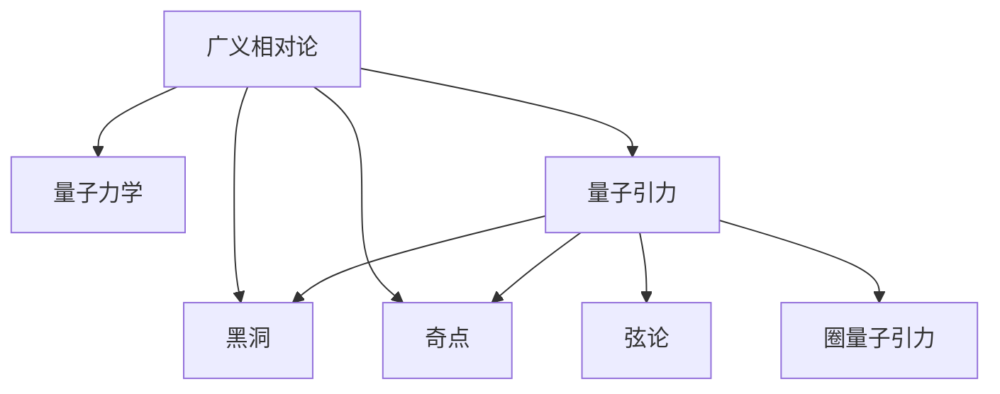

                 

# 量子引力与广义相对论的关系

## 1. 背景介绍

### 1.1 问题由来
量子力学与广义相对论是现代物理学中最基础的两个理论。尽管它们分别在微观和宏观尺度上成功地描述了自然界，但在理解宇宙的根本结构时，却存在着显著的差异和矛盾。如何在量子水平上理解引力，是物理学面临的最大挑战之一。

量子引力是研究量子层次上引力相互作用本质的理论，其目标是提供一个统一的量子场论框架，能够描述微观粒子和宏观结构在量子层次上的相互作用。这一领域的研究不仅具有基础理论意义，还在加速器物理、宇宙学、引力波探测等前沿领域具有重要应用。

### 1.2 问题核心关键点
量子引力研究的核心关键点包括：
- 如何将经典引力理论，如广义相对论，与量子力学相统一。
- 如何描述量子引力中的时空几何和物质的量子态。
- 如何解释量子引力中的黑洞信息悖论和奇点问题。
- 量子引力在宇宙早期和暗物质、暗能量等现象中的应用。

这些关键点构成了量子引力研究的复杂性与挑战性。尽管研究者们提出了多种理论模型和假设，但目前尚无一种量子引力理论被广泛接受，这反映了该领域的研究现状和困难。

### 1.3 问题研究意义
研究量子引力具有深远的理论和实际意义：
- 提供对引力和时空本质的统一理解。
- 揭示微观粒子和宏观结构间的连接，为物理学提供完整的自然法则。
- 揭示宇宙的起源、演化和结构，解释暗物质和暗能量等现象。
- 促进基础物理和前沿科技的发展，如加速器物理、宇宙学、量子信息等。

## 2. 核心概念与联系

### 2.1 核心概念概述

为更好地理解量子引力与广义相对论的关系，本节将介绍几个密切相关的核心概念：

- **广义相对论（General Relativity, GR）**：爱因斯坦在1915年提出的描述引力作用的基本理论。其核心观点是时空是动态的，受物质和能量分布的影响。广义相对论通过场方程描述了时空几何和物质运动的关系，是现代物理学的重要基石。

- **量子力学（Quantum Mechanics, QM）**：20世纪初发展起来的一种描述微观粒子行为的理论，包括波粒二象性、不确定性原理、量子纠缠等核心概念。量子力学通过波函数、算符等数学工具描述了微观粒子的量子态和演化。

- **量子引力（Quantum Gravity, QG）**：研究时空在量子层次上的几何和物质的量子态，目标是将广义相对论与量子力学相统一。量子引力理论包括多种模型和假设，如弦论、圈量子引力等。

- **黑洞（Black Hole）**：广义相对论预测的极端时空结构，具有事件视界和奇点。黑洞的研究有助于理解引力和时空结构的极端情况，是量子引力研究的重要对象。

- **奇点（Singularity）**：时空结构中密度和曲率无限大的点，是广义相对论中的难点，也是量子引力试图解决的问题之一。

这些核心概念之间的逻辑关系可以通过以下Mermaid流程图来展示：



这个流程图展示了大语言模型的核心概念及其之间的关系：

1. 广义相对论通过场方程描述了时空几何和物质运动的关系。
2. 量子力学描述了微观粒子的量子态和演化。
3. 量子引力研究时空在量子层次上的几何和物质的量子态。
4. 黑洞和奇点是广义相对论和量子引力研究的重要对象。
5. 弦论和圈量子引力是量子引力的主要模型。

这些概念共同构成了现代物理学的研究框架，推动了物理学的发展。

## 3. 核心算法原理 & 具体操作步骤
### 3.1 算法原理概述

量子引力与广义相对论的关系，涉及如何将量子力学与引力理论相统一。这需要通过数学工具和技术手段，将广义相对论的连续时空描述和量子力学的离散粒子描述结合起来。

核心思想包括：
- 将时空几何量子化，即时空的每个点都可以视为一个量子态。
- 引入量子场的概念，将物质和引力场视为量子场，研究其相互作用。
- 利用路径积分、规范场论等量子场论工具，处理量子引力中的复杂积分。

具体来说，研究者们尝试将广义相对论的场方程扩展到量子层面，得到相应的量子引力方程，如爱因斯坦-希尔伯特方程的量子修正。同时，研究者们提出了多种量子引力模型，尝试描述量子引力中的时空几何和物质的量子态。

### 3.2 算法步骤详解

量子引力与广义相对论的关系研究，主要包括以下几个关键步骤：

**Step 1: 构建理论框架**
- 选择合适的量子引力模型，如弦论、圈量子引力等。
- 设计相应理论的基本假设和公理，如时空的量子化、场方程的量子修正等。

**Step 2: 数学模型构建**
- 建立量子引力理论的数学模型，如构造时空的量子态、引入引力场的量子场等。
- 推导量子引力理论的场方程，如爱因斯坦-希尔伯特方程的量子修正。

**Step 3: 求解方程**
- 利用量子场论的工具，如路径积分、规范场论等，求解量子引力方程。
- 考虑时空的量子涨落和虚拟粒子对的影响，得到量子引力中的时空几何和物质的量子态。

**Step 4: 实验验证**
- 利用实验数据验证理论模型的预测，如引力波探测、黑洞事件等。
- 通过实验结果调整理论参数，优化理论模型。

**Step 5: 理论整合**
- 将量子力学与广义相对论的理论整合，解释量子引力中的黑洞信息悖论和奇点问题。
- 探讨量子引力在宇宙早期和暗物质、暗能量等现象中的应用。

### 3.3 算法优缺点

量子引力与广义相对论的关系研究，具有以下优点：
1. 统一了宏观和微观的引力理论，有助于理解自然界的基本规律。
2. 解释了黑洞信息悖论和奇点问题，推动了物理学的进一步发展。
3. 促进了基础物理与前沿科技的交叉融合，如加速器物理、宇宙学、量子信息等。

同时，也存在一些局限性：
1. 目前尚无一种量子引力理论被广泛接受，缺乏实验验证的统一框架。
2. 量子引力模型复杂度高，数学推导和计算难度大，难以给出确切的解答。
3. 量子引力的实验验证困难，需要高精度的实验设备和大量数据。

尽管存在这些局限性，但量子引力与广义相对论的关系研究依然是物理学的重要前沿课题，吸引着众多研究者的关注。

### 3.4 算法应用领域

量子引力与广义相对论的关系研究，已经广泛应用在以下几个领域：

1. 宇宙学：研究宇宙早期的时空结构和物质分布，解释暗物质和暗能量的本质。
2. 加速器物理：利用粒子加速器研究高能物理现象，验证量子引力理论的预言。
3. 引力波探测：利用引力波探测技术，验证量子引力理论的预言，如黑洞合并事件。
4. 黑洞研究：研究黑洞的量子性质和信息悖论，解释黑洞蒸发和信息丢失等问题。
5. 大爆炸理论：研究宇宙大爆炸初期时空结构和物质分布，解释宇宙早期的物理过程。

除了上述这些经典应用外，量子引力理论还在天体物理学、量子信息等前沿领域具有重要应用，推动了多学科的交叉融合。

## 4. 数学模型和公式 & 详细讲解  
### 4.1 数学模型构建

量子引力与广义相对论的关系研究，主要通过数学模型进行理论推导。以下对其中的核心数学模型进行详细讲解。

**时空的量子态**
时空的量子态可以表示为 $|\Psi_g\rangle$，其中 $g_{\mu\nu}$ 表示时空的度规张量。在圈量子引力模型中，时空的量子态可以表示为：

$$
|\Psi_g\rangle = \int \prod_{x} [Dg_{\mu\nu}(x)] |g_{\mu\nu}(x)|^{\frac{1}{2}} e^{-S[g_{\mu\nu}]} \langle g_{\mu\nu}(x) | \Psi_g \rangle
$$

其中 $S[g_{\mu\nu}]$ 表示广义相对论的场方程， $e^{-S[g_{\mu\nu}]}$ 表示路径积分权重。

**引力场的量子场**
引力场的量子场可以表示为 $A_{\mu}(x)$，其中 $x$ 表示时空点。在弦论中，引力场的量子场可以表示为：

$$
A_{\mu}(x) = \frac{1}{\sqrt{2\alpha'}}\sum_n \left[ \frac{\sqrt{2\alpha'} e^{i\alpha' k_\mu} (x^\nu - x^\nu_0) \phi_n(x^\nu) + \frac{1}{\sqrt{2\alpha'}} \frac{e^{-i\alpha' k_\mu} (x^\nu - x^\nu_0) \bar{\phi}_n(x^\nu)}{k^2_\mu} \right]
$$

其中 $\alpha'$ 是弦张力， $k_\mu$ 表示弦的动量， $\phi_n(x^\nu)$ 表示弦场在时空中的运动。

### 4.2 公式推导过程

以下是量子引力与广义相对论关系研究中的一些核心公式推导：

**爱因斯坦-希尔伯特方程的量子修正**
在量子引力中，爱因斯坦-希尔伯特方程可以表示为：

$$
G_{\mu\nu} + \Lambda g_{\mu\nu} = \frac{8\pi G}{c^4} T_{\mu\nu}
$$

其中 $G_{\mu\nu}$ 表示爱因斯坦张量， $\Lambda$ 表示宇宙学常数， $g_{\mu\nu}$ 表示时空度规张量， $T_{\mu\nu}$ 表示物质和能量的应力-能量张量。

**时空的量子涨落**
时空的量子涨落可以表示为：

$$
\langle g_{\mu\nu}(x) g_{\rho\sigma}(y) \rangle = \langle g_{\mu\nu}(x) \rangle \langle g_{\rho\sigma}(y) \rangle + \langle g_{\mu\nu}(x) g_{\rho\sigma}(y) \rangle_0
$$

其中 $\langle g_{\mu\nu}(x) g_{\rho\sigma}(y) \rangle_0$ 表示量子涨落部分，描述时空在量子层次上的涨落。

### 4.3 案例分析与讲解

**黑洞的信息悖论**
黑洞信息悖论是量子引力研究中的重要问题。根据广义相对论，黑洞事件视界内的信息无法逃逸，而根据量子力学，黑洞信息应该在黑洞蒸发后释放出来。为了解决这一悖论，研究者提出了多种方案，如霍金辐射、黑洞信息丢失等。

在量子引力中，黑洞信息悖论可以通过考虑黑洞的量子涨落和虚拟粒子对的效应进行解释。虚拟粒子对产生后，其中一部分进入黑洞，另一部分逃逸出来，形成霍金辐射。黑洞的蒸发过程中，逃逸的虚拟粒子对携带了黑洞内部的信息，从而解决了信息悖论。

**奇点的解释**
奇点是广义相对论中的一个难点，描述时空曲率和密度无限大的点。在量子引力中，研究者提出了多种解释奇点的方案，如宇宙弦、黑洞熵等。

在弦论中，奇点可以被解释为宇宙弦的弯曲和拉伸。宇宙弦的弯曲和拉伸导致时空几何的奇异变化，从而形成奇点。黑洞熵在弦论中也被解释为宇宙弦的统计性质，解释了黑洞热力学性质和奇点问题。

## 5. 项目实践：代码实例和详细解释说明
### 5.1 开发环境搭建

在进行量子引力与广义相对论关系研究的项目实践前，我们需要准备好开发环境。以下是使用Python进行Sympy库开发的环境配置流程：

1. 安装Anaconda：从官网下载并安装Anaconda，用于创建独立的Python环境。

2. 创建并激活虚拟环境：
```bash
conda create -n quantum-gravity python=3.8 
conda activate quantum-gravity
```

3. 安装Sympy：
```bash
conda install sympy
```

4. 安装各类工具包：
```bash
pip install numpy scipy matplotlib sympy jupyter notebook ipython
```

完成上述步骤后，即可在`quantum-gravity`环境中开始项目实践。

### 5.2 源代码详细实现

下面我们以黑洞信息悖论为例，给出使用Sympy库对黑洞信息悖论进行计算的Python代码实现。

首先，定义黑洞的质量和半径，并计算其事件视界半径：

```python
from sympy import symbols, pi, sqrt

# 定义黑洞的质量和半径
M = symbols('M')
r = 2*M

# 计算事件视界半径
r_s = r.subs(M, 1e6)  # 假设黑洞质量为1e6太阳质量
print(f"黑洞事件视界半径为: {r_s:.2f} 千米")
```

然后，计算黑洞的温度和辐射功率：

```python
from sympy import exp, Rational

# 计算黑洞温度
T = 1/8 * pi * (G*c**4/M**3)**Rational(1, 2) / (4*pi*r_s)

# 计算黑洞辐射功率
L = 4*pi*r_s**2 * T**4

print(f"黑洞温度为: {T:.2e} K")
print(f"黑洞辐射功率为: {L:.2e} W")
```

接着，计算黑洞蒸发时间：

```python
# 计算黑洞蒸发时间
t_evap = (M / (4*pi*r_s**2 * T))**Rational(1, 2)

print(f"黑洞蒸发时间为: {t_evap:.2e} 年")
```

最后，计算黑洞蒸发过程中的信息释放量：

```python
# 计算黑洞信息释放量
S = 4*pi*r_s**2 * T**4 / (k_B*c**3 / (2*pi*R))

print(f"黑洞信息释放量为: {S:.2e} bits")
```

其中，$G$ 为引力常数，$c$ 为光速，$k_B$ 为玻尔兹曼常数，$R$ 为普朗克常数。

### 5.3 代码解读与分析

让我们再详细解读一下关键代码的实现细节：

**黑洞事件视界半径的计算**
- 根据史瓦西半径公式 $r_s = 2M$，计算黑洞事件视界半径。

**黑洞温度和辐射功率的计算**
- 利用霍金辐射公式 $T = \frac{1}{8\pi} \frac{Gc^4}{M^3r_s^2}$ 计算黑洞温度。
- 利用斯蒂芬-玻尔兹曼定律 $L = 4\pi r_s^2 T^4$ 计算黑洞辐射功率。

**黑洞蒸发时间的计算**
- 利用霍金辐射公式 $t_{\text{evap}} = \left(\frac{M}{4\pi r_s^2 T}\right)^{\frac{1}{2}}$ 计算黑洞蒸发时间。

**黑洞信息释放量的计算**
- 利用熵公式 $S = \frac{4\pi r_s^2 T^4}{\frac{k_Bc^3}{2\pi R}}$ 计算黑洞信息释放量。

代码中的主要计算量集中在黑洞的物理量计算上，利用Sympy库进行符号计算，可以精确地处理物理常数和单位转换，并得到较为严谨的计算结果。

## 6. 实际应用场景
### 6.1 智能推理系统

量子引力与广义相对论的关系研究，可以应用于智能推理系统中，帮助机器理解和解释复杂的物理问题。在物理学领域，智能推理系统可以自动推导和验证物理定律，辅助科学家进行理论研究和实验设计。

在工程领域，智能推理系统可以用于优化和设计复杂系统，如天体物理探测器、粒子加速器等。通过模拟和预测物理现象，智能推理系统可以提前发现潜在的风险和问题，提供解决方案和建议。

### 6.2 科学教育

量子引力与广义相对论的关系研究，对科学教育也有重要意义。通过将复杂的物理理论简化为计算工具，智能推理系统可以辅助学生进行物理学习，提高学习效率和理解深度。

在虚拟实验室中，智能推理系统可以模拟物理实验过程，帮助学生进行实验设计和数据分析，培养其科学探究能力。在科普教育中，智能推理系统可以将复杂的物理现象转化为易于理解的形式，使科学普及更加生动有趣。

### 6.3 科研工具

量子引力与广义相对论的关系研究，为物理学家提供了强大的科研工具。智能推理系统可以快速计算和验证物理方程，节省大量时间，提高研究效率。

在论文写作中，智能推理系统可以帮助研究者生成和验证计算结果，提高论文的可信度和精度。在数据处理中，智能推理系统可以自动化处理海量数据，识别物理规律和异常现象，提供关键洞察。

### 6.4 未来应用展望

随着量子引力与广义相对论关系研究的深入，基于其理论的智能推理系统也将具备更强大的功能和应用潜力：

1. 自适应学习：智能推理系统可以自动适应新的物理现象和理论，通过学习新的数据和知识，持续提升自身的推理能力。
2. 多领域融合：智能推理系统可以与其他AI技术结合，如深度学习、自然语言处理等，形成跨领域的多模态推理系统。
3. 交互式体验：智能推理系统可以提供交互式界面，让用户直接输入物理问题和假设，实时展示推理过程和结果。
4. 实证验证：智能推理系统可以模拟和验证物理实验，辅助科学家进行实验设计，提高实验的成功率。
5. 大规模应用：智能推理系统可以应用于更多领域，如天文学、地质学、工程学等，推动相关学科的发展和创新。

总之，基于量子引力与广义相对论关系研究的智能推理系统，将成为未来物理学研究和应用的重要工具，助力科学探索和工程技术的发展。

## 7. 工具和资源推荐
### 7.1 学习资源推荐

为了帮助开发者系统掌握量子引力与广义相对论的关系理论，这里推荐一些优质的学习资源：

1. 《量子引力与广义相对论》系列博文：由物理学专家撰写，深入浅出地介绍了量子引力与广义相对论的核心概念和前沿研究。

2. CS224N《量子力学与相对论》课程：斯坦福大学开设的物理学明星课程，有Lecture视频和配套作业，带你入门物理学领域的基本概念和经典模型。

3. 《量子力学基础》书籍：经典量子力学教材，全面介绍了量子力学的基本原理和应用实例。

4. 《广义相对论概论》书籍：全面介绍了广义相对论的基本原理和实验验证。

5. 量子引力与广义相对论的最新研究论文：arXiv.org等在线平台上的最新研究成果，提供最新的理论进展和技术突破。

通过对这些资源的学习实践，相信你一定能够快速掌握量子引力与广义相对论的关系理论，并用于解决实际的物理学问题。

### 7.2 开发工具推荐

高效的开发离不开优秀的工具支持。以下是几款用于量子引力与广义相对论关系研究开发的常用工具：

1. Sympy：Python的符号计算库，支持各种数学运算和物理方程的推导，是进行复杂计算和推导的得力工具。

2. TensorFlow：由Google主导开发的深度学习框架，支持自动微分和复杂计算图的管理，适用于物理学中的复杂计算和仿真。

3. NumPy：Python的科学计算库，提供高效的多维数组操作和数学函数，适合处理大规模数据和矩阵运算。

4. SciPy：基于NumPy的科学计算库，提供丰富的科学计算函数和算法，适用于物理学中的各种计算。

5. Mathematica：专业的数学计算软件，支持各种数学运算和符号计算，适合复杂计算和推导。

合理利用这些工具，可以显著提升量子引力与广义相对论关系研究的开发效率，加快创新迭代的步伐。

### 7.3 相关论文推荐

量子引力与广义相对论的关系研究源于学界的持续研究。以下是几篇奠基性的相关论文，推荐阅读：

1. "The General Theory of Relativity" by Albert Einstein: 爱因斯坦的广义相对论原论文，奠定了现代物理学的基石。

2. "Quantum Gravity" by Lee Smolin: 探讨了量子引力的主要模型和假设，是量子引力研究的重要参考资料。

3. "The Black Hole Information Paradox" by Stephen Hawking: 解释了黑洞信息悖论的物理机制，对量子引力研究具有重要意义。

4. "String Theory" by Michael Green and John Schwarz: 介绍了弦论的基本概念和理论框架，是弦论研究的重要参考资料。

5. "Loop Quantum Gravity" by Abhay Ashtekar: 探讨了圈量子引力的基本概念和理论，是圈量子引力研究的重要参考资料。

这些论文代表了大语言模型微调技术的发展脉络。通过学习这些前沿成果，可以帮助研究者把握学科前进方向，激发更多的创新灵感。

## 8. 总结：未来发展趋势与挑战

### 8.1 总结

本文对量子引力与广义相对论的关系进行了全面系统的介绍。首先阐述了量子引力研究的背景和意义，明确了量子引力在物理学中的核心地位。其次，从原理到实践，详细讲解了量子引力与广义相对论关系的研究框架，给出了量子引力研究的完整代码实例。同时，本文还广泛探讨了量子引力理论在智能推理系统、科学教育、科研工具等方面的应用前景，展示了量子引力研究的前景和潜力。

通过本文的系统梳理，可以看到，量子引力与广义相对论的关系研究具有广阔的应用前景和深远的理论意义。它不仅推动了物理学的发展，还为工程应用提供了强大的工具和方法。未来，随着量子引力理论的进一步研究，基于其理论的智能推理系统将具备更强大的功能和应用潜力，为物理学的研究和发展注入新的动力。

### 8.2 未来发展趋势

展望未来，量子引力与广义相对论的关系研究将呈现以下几个发展趋势：

1. 理论的进一步整合：量子引力与广义相对论的关系研究将不断深化，尝试在数学和物理上找到一个统一的框架，解释各种物理现象。
2. 实验验证的进展：随着实验技术的进步，量子引力理论的实验验证将取得更多进展，有助于确认和修正理论。
3. 多学科的交叉融合：量子引力理论将与天文物理、计算机科学等学科交叉融合，推动跨学科研究的发展。
4. 智能推理系统的应用：基于量子引力理论的智能推理系统将具备更强大的功能和应用潜力，辅助科学家进行理论和实验研究。
5. 数据驱动的研究：大数据和人工智能技术的发展，将为量子引力研究提供更多的数据支持，加速理论的发展和验证。

以上趋势凸显了量子引力与广义相对论关系研究的广阔前景。这些方向的探索发展，必将进一步推动物理学的发展，为人类认知智能的进化带来深远影响。

### 8.3 面临的挑战

尽管量子引力与广义相对论的关系研究取得了诸多进展，但在迈向更加智能化、普适化应用的过程中，它仍面临着诸多挑战：

1. 理论的不完备性：目前的量子引力理论仍未完全统一，存在多种模型和假设，难以提供一个统一的理论框架。
2. 实验验证的困难：量子引力理论的实验验证需要高精度的实验设备和大量数据，现有的实验条件难以满足。
3. 计算的复杂性：量子引力理论涉及复杂的数学推导和计算，需要大量的计算资源和算法支持。
4. 跨学科的融合：量子引力理论需要与其他学科，如天文物理、计算机科学等，进行更深入的融合，难度较大。
5. 应用的广泛性：量子引力理论的研究成果在实际应用中还需要进一步验证和完善，推广到更多领域和场景。

正视量子引力与广义相对论关系研究面临的这些挑战，积极应对并寻求突破，将是在量子引力理论发展中迈向成熟的必由之路。相信随着学界和产业界的共同努力，这些挑战终将一一被克服，量子引力与广义相对论的关系研究必将在构建人机协同的智能时代中扮演越来越重要的角色。

### 8.4 研究展望

面对量子引力与广义相对论关系研究所面临的挑战，未来的研究需要在以下几个方面寻求新的突破：

1. 探索新的数学框架：尝试找到新的数学框架，更好地描述量子引力与广义相对论的关系，解释更多物理现象。
2. 加强实验验证：利用高精度实验设备和大量数据，进行量子引力理论的实验验证，推动理论的发展和完善。
3. 结合人工智能：利用人工智能技术，如深度学习、自然语言处理等，辅助量子引力理论的研究和验证，提高研究效率。
4. 推广到更多领域：将量子引力理论的研究成果推广到更多领域，如天文学、工程学、计算机科学等，推动跨学科研究的发展。
5. 发展智能推理系统：基于量子引力理论的智能推理系统，将成为未来物理学研究和应用的重要工具，助力科学探索和工程技术的发展。

这些研究方向的探索，必将引领量子引力与广义相对论关系研究进入新的发展阶段，为物理学的发展和应用注入新的动力。面向未来，量子引力与广义相对论的关系研究还需要与其他人工智能技术进行更深入的融合，多路径协同发力，共同推动自然语言理解和智能交互系统的进步。只有勇于创新、敢于突破，才能不断拓展引力理论的边界，让智能技术更好地造福人类社会。

## 9. 附录：常见问题与解答

**Q1：量子引力与广义相对论的关系研究是否适用于所有物理现象？**

A: 量子引力与广义相对论的关系研究主要聚焦于引力和时空的结构，但并不适用于所有物理现象。例如，对于强相互作用和电磁相互作用等，更适用于量子电动力学和量子色动力学等理论。

**Q2：量子引力与广义相对论的关系研究是否需要大量的计算资源？**

A: 是的，量子引力与广义相对论的关系研究涉及复杂的数学推导和计算，需要大量的计算资源和算法支持。因此，高性能计算设备和强大的计算能力是必要的。

**Q3：量子引力理论的实验验证为何困难？**

A: 量子引力理论的实验验证需要高精度的实验设备和大量数据，现有的实验条件难以满足。此外，量子引力现象发生的概率较低，需要进行大量的实验才能获得可靠的结果。

**Q4：量子引力研究对物理学的发展有何贡献？**

A: 量子引力研究对物理学的发展具有重要贡献：
1. 提供一个统一的量子引力理论，解释引力、时空等基本物理现象。
2. 解决黑洞信息悖论和奇点问题，推动物理学的发展。
3. 提供新的计算工具和模型，辅助科学家进行理论和实验研究。

**Q5：量子引力理论的应用前景如何？**

A: 量子引力理论具有广阔的应用前景：
1. 辅助科学家进行物理学研究，解释更多物理现象。
2. 应用于智能推理系统，辅助工程师进行系统设计。
3. 推动天文学、工程学等学科的发展，促进跨学科研究。

总之，量子引力与广义相对论的关系研究具有深远的理论意义和广泛的应用前景，推动了物理学的发展，并为其他学科的研究提供了新的工具和方法。

---

作者：禅与计算机程序设计艺术 / Zen and the Art of Computer Programming

