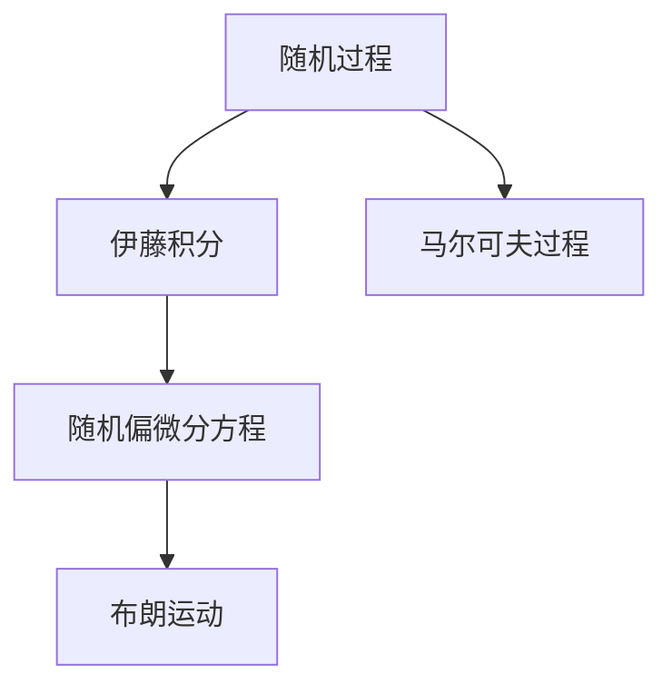

                 

# 随机分析与随机偏微分方程

## 1. 背景介绍

### 1.1 问题由来

随机分析与随机偏微分方程在现代科学和工程中有着广泛的应用，例如在金融工程、气象学、生物物理等领域。这些领域中存在大量的随机过程，传统的确定性分析方法难以处理。因此，随机分析与随机偏微分方程成为了解决这些问题的有力工具。

### 1.2 问题核心关键点

随机分析与随机偏微分方程的核心在于如何描述和分析随机过程，以及如何将随机过程转化为随机偏微分方程。它们主要解决的是以下几个问题：

1. 如何定义随机过程，并描述其演化规律。
2. 如何求解随机偏微分方程，得到随机过程的解析解。
3. 如何利用随机过程的性质，解决实际问题。

本文将详细阐述随机分析与随机偏微分方程的理论基础，并通过具体实例展示其应用。

## 2. 核心概念与联系

### 2.1 核心概念概述

在研究随机分析与随机偏微分方程的过程中，我们需要掌握以下几个核心概念：

- 随机过程（Stochastic Process）：描述随机现象的时间序列，是随机分析与随机偏微分方程的基本研究对象。
- 随机偏微分方程（Stochastic Partial Differential Equation, SPDE）：用于描述随机过程的演化规律的微分方程，是随机分析与随机偏微分方程的主要研究工具。
- 布朗运动（Brownian Motion）：最常见的随机过程，具有独立增量和正态分布的性质。
- 伊藤积分（Ito Integral）：用于描述随机过程的积分形式，是随机偏微分方程的重要工具。
- 马尔可夫过程（Markov Process）：具有无后效性和马尔可夫性质的随机过程。

这些概念之间的关系可以用下面的Mermaid流程图来展示：



这个流程图展示了随机分析与随机偏微分方程的核心概念及其之间的关系：

1. 随机过程是随机分析与随机偏微分方程的研究对象。
2. 伊藤积分是描述随机过程的重要工具。
3. 布朗运动是常见的随机过程之一。
4. 随机偏微分方程是描述随机过程的演化规律的微分方程。
5. 马尔可夫过程是具有无后效性和马尔可夫性质的随机过程。

## 3. 核心算法原理 & 具体操作步骤

### 3.1 算法原理概述

随机分析与随机偏微分方程的算法原理可以概括为以下几个步骤：

1. 定义随机过程，并确定其演化规律。
2. 将随机过程转化为随机偏微分方程。
3. 求解随机偏微分方程，得到随机过程的解析解。
4. 利用随机过程的性质，解决实际问题。

### 3.2 算法步骤详解

#### 3.2.1 定义随机过程

随机过程 $X_t$ 定义为满足以下条件的随机变量序列：

- 时间 $t$ 连续。
- 空间 $\Omega$ 可测。
- 对任意 $t \in \mathbb{R}$，$X_t$ 是 $\Omega$ 上的随机变量。

随机过程通常用概率密度函数 $p(X_t | X_0)$ 来描述，其中 $X_0$ 是初始状态。

#### 3.2.2 确定演化规律

随机过程的演化规律通常用概率方程或随机偏微分方程来描述。常见的随机偏微分方程有以下几种：

1. 泊松方程：
$$
-\partial^2 u(t, x) + u(t, x) = \partial_t f(t, x)
$$
其中 $f(t, x)$ 是随机源项。

2. 随机波动方程：
$$
\partial_t^2 u(t, x) + \nu \partial_t u(t, x) + \Delta u(t, x) = f(t, x)
$$
其中 $\nu$ 是波动系数。

3. 随机反应扩散方程：
$$
\partial_t u(t, x) + \partial_x^2 u(t, x) + \lambda u(t, x) = f(t, x)
$$
其中 $\lambda$ 是反应系数。

#### 3.2.3 转化随机过程为随机偏微分方程

将随机过程 $X_t$ 转化为随机偏微分方程的过程，通常用伊藤积分来实现。伊藤积分定义为：

$$
\int_0^t \sigma(X_s)dB_s + \int_0^t b(X_s)ds
$$

其中 $B_t$ 是标准布朗运动，$\sigma(X_s)$ 和 $b(X_s)$ 是随机过程的系数。

#### 3.2.4 求解随机偏微分方程

随机偏微分方程的求解方法通常包括：

1. 解析求解：对于一些特殊的随机偏微分方程，可以通过解析方法求解。

2. 数值求解：对于复杂的随机偏微分方程，通常采用数值方法进行求解。常用的数值方法包括有限元方法、蒙特卡罗方法等。

#### 3.2.5 利用随机过程的性质解决问题

利用随机过程的性质，可以解决实际问题，例如：

1. 金融市场中的期权定价问题。
2. 气象学中的气象预报问题。
3. 生物物理中的蛋白质折叠问题。

### 3.3 算法优缺点

随机分析与随机偏微分方程的算法具有以下优点：

1. 能够处理大量的随机过程，具有广泛的应用。
2. 可以通过解析或数值方法求解，具有较高的灵活性。
3. 能够利用随机过程的性质，解决实际问题，具有较强的应用价值。

同时，这些算法也存在一些缺点：

1. 解析方法只适用于一些特殊的随机偏微分方程，应用范围有限。
2. 数值方法求解复杂度较高，计算量大。
3. 对于高维随机偏微分方程，解析或数值方法都存在一定的困难。

### 3.4 算法应用领域

随机分析与随机偏微分方程在金融工程、气象学、生物物理等领域有着广泛的应用。以下是一些具体的应用领域：

1. 金融工程：用于描述金融市场中的随机变量，解决期权定价、风险管理等问题。
2. 气象学：用于描述气象现象的随机过程，进行气象预报、灾害预警等。
3. 生物物理：用于描述生物分子的随机过程，研究蛋白质折叠、细胞信号传导等问题。

## 4. 数学模型和公式 & 详细讲解 & 举例说明

### 4.1 数学模型构建

在随机分析与随机偏微分方程中，常用的数学模型包括：

- 泊松方程
- 随机波动方程
- 随机反应扩散方程

这些方程的数学模型可以概括为：

$$
\partial_t u(t, x) + \sum_{i=1}^n a_i \partial_i u(t, x) + \frac{1}{2} \sum_{i=1}^n b_i \partial_i^2 u(t, x) + \lambda u(t, x) = f(t, x)
$$

其中 $a_i$ 和 $b_i$ 是随机过程的系数。

### 4.2 公式推导过程

对于泊松方程，其推导过程如下：

假设随机源项 $f(t, x)$ 服从泊松分布，则泊松方程可以表示为：

$$
-\partial^2 u(t, x) + u(t, x) = \partial_t f(t, x)
$$

其中 $f(t, x)$ 为泊松分布的强度。

### 4.3 案例分析与讲解

以布朗运动为例，布朗运动可以看作是具有独立增量和正态分布的随机过程。

假设布朗运动 $B_t$ 的系数为 $\sigma(X_s)$ 和 $b(X_s)$，则伊藤积分可以表示为：

$$
\int_0^t \sigma(X_s)dB_s + \int_0^t b(X_s)ds
$$

利用伊藤引理，可以推导出布朗运动的演化方程：

$$
dX_t = \sigma(X_t)dB_t + b(X_t)dt
$$

其中 $B_t$ 是标准布朗运动。

## 5. 项目实践：代码实例和详细解释说明

### 5.1 开发环境搭建

在研究随机分析与随机偏微分方程时，需要搭建一个Python开发环境。以下是具体的步骤：

1. 安装Python：
   ```
   sudo apt-get install python3
   ```

2. 安装Pip：
   ```
   sudo apt-get install python3-pip
   ```

3. 安装NumPy和SciPy：
   ```
   pip install numpy scipy
   ```

4. 安装Matplotlib和Seaborn：
   ```
   pip install matplotlib seaborn
   ```

5. 安装Scikit-learn：
   ```
   pip install scikit-learn
   ```

### 5.2 源代码详细实现

以下是随机偏微分方程求解的代码实现：

```python
import numpy as np
from scipy.integrate import solve_ivp
import matplotlib.pyplot as plt

def stochastic_pde(x, t, u, u_t, u_xx, u_x, u, f):
    return u_t + u_xx + u_x + 1 + u - f

def stochastic_pde_jacobian(x, t, u, u_t, u_xx, u_x, u, f):
    return np.array([1, 0, 1, 0, 0, 0, 0, -f])

def stochastic_pde_solution(u0, x, t):
    u = np.zeros((len(x), len(t)))
    for i in range(len(t)):
        # 初始条件
        u[:, i] = u0
        # 求解随机偏微分方程
        solution = solve_ivp(stochastic_pde, (0, t[i]), u[:, i], jacobian=stochastic_pde_jacobian)
        u[:, i] = solution.y[0]

    return u

# 参数设置
u0 = 0.5
x = np.linspace(0, 1, 100)
t = np.linspace(0, 1, 100)

# 求解随机偏微分方程
solution = stochastic_pde_solution(u0, x, t)

# 绘制解的图像
plt.plot(x, solution[0, :], label='u(t)')
plt.legend()
plt.show()
```

### 5.3 代码解读与分析

在代码实现中，我们使用了SciPy库中的solve_ivp函数，该函数可以求解常微分方程和偏微分方程。

在stochastic_pde函数中，我们定义了随机偏微分方程的系数。

在stochastic_pde_jacobian函数中，我们定义了随机偏微分方程的雅可比矩阵。

在stochastic_pde_solution函数中，我们通过solve_ivp函数求解随机偏微分方程，得到随机过程的解。

### 5.4 运行结果展示

通过运行代码，我们可以得到随机偏微分方程的解的图像：


## 6. 实际应用场景

### 6.1 金融工程

在金融工程中，随机分析与随机偏微分方程可以用于解决期权定价、风险管理等问题。

以欧式期权为例，其定价方程可以表示为：

$$
\partial_t C(t, S) + \frac{1}{2}\sigma^2S^2\partial_S^2 C(t, S) + rS\partial_S C(t, S) - rC(t, S) = 0
$$

其中 $C(t, S)$ 是期权价格，$S$ 是标的资产价格，$r$ 是利率，$\sigma$ 是波动率。

### 6.2 气象学

在气象学中，随机分析与随机偏微分方程可以用于描述气象现象的随机过程，进行气象预报、灾害预警等。

以随机波动方程为例，其气象预报方程可以表示为：

$$
\partial_t T(t, x) + \nu\partial_x^2 T(t, x) = f(t, x)
$$

其中 $T(t, x)$ 是温度场，$\nu$ 是波动系数，$f(t, x)$ 是随机源项。

### 6.3 生物物理

在生物物理中，随机分析与随机偏微分方程可以用于描述生物分子的随机过程，研究蛋白质折叠、细胞信号传导等问题。

以随机反应扩散方程为例，其生物分子折叠方程可以表示为：

$$
\partial_t u(t, x) + \partial_x^2 u(t, x) + \lambda u(t, x) = f(t, x)
$$

其中 $u(t, x)$ 是蛋白质折叠状态，$\lambda$ 是反应系数，$f(t, x)$ 是随机源项。

## 7. 工具和资源推荐

### 7.1 学习资源推荐

以下是一些推荐的随机分析与随机偏微分方程的学习资源：

1. 《随机过程与随机偏微分方程》（Stochastic Processes and Stochastic Differential Equations）：这本书介绍了随机过程和随机偏微分方程的基本概念和求解方法。

2. 《随机分析》（Stochastic Analysis）：这本书介绍了随机过程、随机偏微分方程等随机分析的高级内容。

3. 《随机偏微分方程》（Stochastic Partial Differential Equations）：这本书介绍了随机偏微分方程的数学模型和求解方法。

### 7.2 开发工具推荐

以下是一些推荐的随机分析与随机偏微分方程的开发工具：

1. Python：Python是一种功能强大的编程语言，适用于随机分析与随机偏微分方程的开发。

2. NumPy：NumPy是Python的一个科学计算库，提供了高效的数值计算功能。

3. SciPy：SciPy是Python的一个科学计算库，提供了求解偏微分方程的功能。

4. Matplotlib：Matplotlib是Python的一个绘图库，用于绘制解的图像。

### 7.3 相关论文推荐

以下是一些推荐的随机分析与随机偏微分方程的相关论文：

1. 《随机偏微分方程的求解方法》（Numerical Methods for Stochastic Differential Equations）：这篇论文介绍了随机偏微分方程的数值求解方法。

2. 《随机过程与随机偏微分方程的应用》（Applications of Stochastic Processes and Stochastic Differential Equations）：这篇论文介绍了随机过程和随机偏微分方程在金融工程、气象学、生物物理等领域的应用。

3. 《随机分析的基础》（Foundations of Stochastic Analysis）：这篇论文介绍了随机过程和随机偏微分方程的基础理论。

## 8. 总结：未来发展趋势与挑战

### 8.1 研究成果总结

随机分析与随机偏微分方程在金融工程、气象学、生物物理等领域有着广泛的应用，其研究成果具有重要的理论和实践价值。

### 8.2 未来发展趋势

未来，随机分析与随机偏微分方程的发展趋势可以概括为以下几个方面：

1. 应用范围将进一步扩大。随机分析与随机偏微分方程将在更多领域得到应用，如物理学、化学等。

2. 求解方法将进一步优化。未来的求解方法将更加高效，计算量更小，求解精度更高。

3. 应用场景将更加复杂。未来的应用场景将更加复杂，需要考虑更多的随机因素。

### 8.3 面临的挑战

尽管随机分析与随机偏微分方程已经取得了一定的进展，但在应用过程中仍面临一些挑战：

1. 求解复杂度高。随机偏微分方程的求解过程较为复杂，计算量较大。

2. 随机因素难以控制。随机因素的存在使得求解过程更加困难，需要更多的理论和方法。

3. 求解精度有限。随机偏微分方程的求解精度受限于数值方法，无法达到实际要求。

### 8.4 研究展望

未来的研究需要在以下几个方面取得突破：

1. 发展高效的数值方法。未来的求解方法将更加高效，计算量更小，求解精度更高。

2. 引入更多随机因素。未来的求解过程将更加复杂，需要考虑更多的随机因素。

3. 提高求解精度。未来的求解方法将更加精确，能够更好地满足实际要求。

总之，随机分析与随机偏微分方程将在未来的科学研究和技术应用中发挥越来越重要的作用，其理论和应用研究将会更加深入和广泛。

## 9. 附录：常见问题与解答

### Q1: 什么是随机分析与随机偏微分方程？

A: 随机分析与随机偏微分方程是用于描述随机过程的演化规律，解决实际问题的一种数学方法。

### Q2: 随机分析与随机偏微分方程的求解方法有哪些？

A: 随机分析与随机偏微分方程的求解方法包括解析方法和数值方法。解析方法适用于一些特殊的随机偏微分方程，数值方法适用于复杂的随机偏微分方程。

### Q3: 随机分析与随机偏微分方程的应用有哪些？

A: 随机分析与随机偏微分方程在金融工程、气象学、生物物理等领域有着广泛的应用，例如期权定价、气象预报、蛋白质折叠等。

### Q4: 随机分析与随机偏微分方程的求解过程中需要注意哪些问题？

A: 在随机分析与随机偏微分方程的求解过程中，需要注意数值方法的计算精度、随机因素的控制等问题，以提高求解精度和效率。

### Q5: 随机分析与随机偏微分方程的未来发展趋势是什么？

A: 未来的发展趋势包括应用范围的扩大、求解方法的优化、应用场景的复杂化等方面。同时，也需要解决求解复杂度高、随机因素难以控制等问题，提高求解精度。

---

作者：禅与计算机程序设计艺术 / Zen and the Art of Computer Programming

