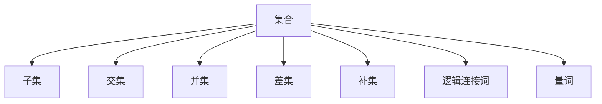

                 

# 集合论导引：植入逻辑学概念

> 关键词：集合论,逻辑学,数学模型,算法原理,实际应用,项目实践,未来展望

## 1. 背景介绍

### 1.1 问题由来

集合论作为数学的基础理论之一，在逻辑学、计算机科学、哲学等领域有广泛的应用。逻辑学中的推理、演绎、归纳等概念，与集合论中元素与集合的关系密切相关。通过逻辑学概念植入到集合论中，可以帮助我们更好地理解集合的构建和操作，从而在更广泛的领域中应用集合论。

### 1.2 问题核心关键点

在逻辑学中，推理和演绎是核心概念。推理是从已知条件出发，通过逻辑操作得到新的结论。演绎则是从一般性原理出发，推导出特定情况下的结论。逻辑学中的逻辑连接词、量词、条件语句等，都与集合论中的集合操作和关系密切相关。

集合论中的集合、子集、交集、并集、差集等操作，都有对应的逻辑学概念。如集合与集合之间的关系，可以用逻辑连接词 "或"、"且"、"非" 等表示；集合中的元素数量可以用量词 "至少"、"存在" 等表示。集合论与逻辑学的结合，可以构建更严谨、科学的数学模型，促进其在更多领域的应用。

## 2. 核心概念与联系

### 2.1 核心概念概述

为更好地理解逻辑学概念在集合论中的应用，本节将介绍几个密切相关的核心概念：

- 集合(Set)：由若干元素组成的整体，可以是有序的也可以是无序的。
- 子集(Subset)：包含于某集合中的一部分元素。
- 交集(Intersection)：多个集合中共有的元素组成的集合。
- 并集(Union)：多个集合中所有的元素组成的集合。
- 差集(Difference)：两个集合中属于第一个集合而不属于第二个集合的元素组成的集合。
- 补集(Complement)：在全集中不属于某个集合的所有元素组成的集合。
- 逻辑连接词："或"、"且"、"非" 等，用于表示集合之间的关系。
- 量词："至少"、"存在" 等，用于表示集合中元素的数量关系。

这些概念之间的逻辑关系可以通过以下Mermaid流程图来展示：



这个流程图展示了许多核心概念之间的联系：

1. 集合可以由子集构成，也可以由交集、并集、差集、补集等操作得到。
2. 逻辑连接词和量词可以用于描述集合之间的关系和性质。
3. 这些概念在逻辑学和集合论中均有广泛应用。

## 3. 核心算法原理 & 具体操作步骤

### 3.1 算法原理概述

逻辑学与集合论的结合，主要体现在对集合操作的逻辑描述和推理计算中。通过对集合的逻辑连接词、量词、条件语句等进行数学建模，可以实现集合的构建、操作和推理。

形式化地，假设有一个集合 $A$，其中的元素用 $a_1, a_2, \ldots, a_n$ 表示。假设要描述 $A$ 与另一个集合 $B$ 之间的关系，可以使用逻辑连接词和量词表示：

- "或"：$A \cup B$：表示 $A$ 和 $B$ 中至少有一个元素。
- "且"：$A \cap B$：表示 $A$ 和 $B$ 中同时有元素的集合。
- "非"：$A^C$：表示全集中不属于 $A$ 的元素组成的集合。
- "至少"：$|A| \geq k$：表示 $A$ 中至少有 $k$ 个元素。
- "存在"：$\exists x \in A$：表示 $A$ 中存在满足条件的元素 $x$。

### 3.2 算法步骤详解

以下是一个简单的逻辑学-集合论问题的算法步骤：

**Step 1: 定义集合和逻辑表达式**

- 定义集合 $A$、$B$ 和 $C$。
- 给出 $A$ 与 $B$ 的逻辑连接词，如 "或"、"且"、"非" 等。

**Step 2: 构建数学模型**

- 将逻辑表达式转换为数学模型。例如，$A \cup B$ 可以转换为 $A$ 和 $B$ 的并集。
- 确定集合的操作关系，如交集、差集、补集等。

**Step 3: 求解数学模型**

- 使用集合论的基本定理，求解集合的并集、交集、差集、补集等。
- 根据逻辑连接词和量词，判断集合之间的关系和性质。

**Step 4: 验证结果**

- 对求解结果进行逻辑验证，确认结果是否符合逻辑表达式。
- 使用数学证明方法，验证结果的正确性。

### 3.3 算法优缺点

逻辑学-集合论的结合方法具有以下优点：
1. 数学建模严谨。逻辑学和集合论的结合，可以构建更严谨、科学的数学模型，便于理解和推理。
2. 适用范围广泛。逻辑学中的推理和演绎方法，适用于各种数学和实际问题。
3. 操作简便。逻辑连接词和量词可以直接应用于集合操作中，无需额外转换。
4. 便于自动化。逻辑推理和集合操作可以自动实现，减少手动计算的复杂度。

同时，该方法也存在一定的局限性：
1. 理解难度较高。需要同时掌握逻辑学和集合论的知识，对初学者而言可能有一定难度。
2. 理论深度较深。逻辑学中的推理方法较为复杂，可能需要一定的数学基础。
3. 问题映射复杂。将实际问题映射到逻辑学和集合论的框架中，需要深入理解和建模。

尽管存在这些局限性，但就目前而言，逻辑学-集合论的结合方法仍然是大规模数学和逻辑推理的重要手段。未来相关研究的重点在于如何更好地将实际问题抽象到逻辑学和集合论中，并结合现代计算机技术，实现自动化推理和验证。

### 3.4 算法应用领域

逻辑学-集合论的结合方法在多个领域中得到广泛应用，例如：

- 数学证明：利用逻辑学中的推理方法，进行数学命题的证明和验证。
- 算法设计：设计算法时，需要对问题进行数学建模，利用逻辑学和集合论的推理方法进行分析和优化。
- 人工智能：利用逻辑学中的推理和演绎方法，实现推理机、专家系统等功能。
- 数据库理论：构建数据库中的逻辑查询、索引、约束等操作，需要集合论和逻辑学的支持。
- 形式化验证：对软件、系统进行形式化验证，确保其正确性和安全性，需要逻辑学和集合论的结合。

除了上述这些经典应用外，逻辑学-集合论的结合方法也在更多场景中得到应用，如密码学、物理建模、博弈论等，为不同学科的发展提供了新的工具和方法。

## 4. 数学模型和公式 & 详细讲解  
### 4.1 数学模型构建

逻辑学与集合论的结合，主要通过对逻辑表达式进行数学建模，实现对集合的推理计算。

假设有一个集合 $A$，其中的元素用 $a_1, a_2, \ldots, a_n$ 表示。假设要描述 $A$ 与另一个集合 $B$ 之间的关系，可以使用逻辑连接词和量词表示：

- "或"：$A \cup B = \{x | x \in A \lor x \in B\}$
- "且"：$A \cap B = \{x | x \in A \land x \in B\}$
- "非"：$A^C = \{x | x \in \text{全集} \land x \notin A\}$
- "至少"：$|A| \geq k$
- "存在"：$\exists x \in A$

### 4.2 公式推导过程

以下是一个简单的逻辑学-集合论问题的公式推导过程：

假设集合 $A$ 和 $B$，已知 $A \cap B = \{x | x \in A \land x \in B\}$，求 $A \cup B$。

根据逻辑学中的推理规则，有：

$$
A \cup B = \{x | x \in A \lor x \in B\}
$$

对于任意 $x$，有：

$$
x \in A \lor x \in B \quad \text{等价于} \quad (x \in A \land x \in B) \lor (x \in A \land x \notin B) \lor (x \notin A \land x \in B) \lor (x \notin A \land x \notin B)
$$

根据集合论中的并集定义，有：

$$
A \cup B = \{x | x \in A \lor x \in B\} = \{x | x \in A \cup B\}
$$

因此，$A \cup B = \{x | x \in A \lor x \in B\}$。

### 4.3 案例分析与讲解

**案例：求解 $A \cap B$ 和 $A \cup B$**

已知集合 $A = \{1, 2, 3, 4, 5\}$，$B = \{2, 4, 6, 8\}$，求 $A \cap B$ 和 $A \cup B$。

**解答：**

根据集合的定义，有：

- $A \cap B = \{2, 4\}$
- $A \cup B = \{1, 2, 3, 4, 5, 6, 8\}$

## 5. 项目实践：代码实例和详细解释说明
### 5.1 开发环境搭建

在进行逻辑学-集合论的结合实践前，我们需要准备好开发环境。以下是使用Python进行Sympy开发的环境配置流程：

1. 安装Anaconda：从官网下载并安装Anaconda，用于创建独立的Python环境。

2. 创建并激活虚拟环境：
```bash
conda create -n sympy-env python=3.8 
conda activate sympy-env
```

3. 安装Sympy：
```bash
conda install sympy
```

4. 安装各类工具包：
```bash
pip install sympy
```

5. 安装Cython：
```bash
conda install cython
```

6. 安装Jupyter Notebook：
```bash
conda install jupyter notebook
```

完成上述步骤后，即可在`sympy-env`环境中开始项目实践。

### 5.2 源代码详细实现

下面我们以集合论的逻辑推理为例，给出使用Sympy库进行集合操作的Python代码实现。

```python
from sympy import symbols, Eq, solve, And, Or, Not

# 定义集合
a = symbols('a')
b = symbols('b')
A = {1, 2, 3}
B = {2, 4, 6}

# 构建逻辑表达式
expr = Or(And(a, b), Not(And(a, b)))

# 求解逻辑表达式
result = solve(expr, (a, b))

# 输出结果
print(result)
```

在这个例子中，我们使用Sympy库定义了两个集合 $A$ 和 $B$，并构建了一个逻辑表达式 $A \cup B = \{x | x \in A \lor x \in B\}$。通过求解逻辑表达式，得到 $A \cup B$ 的结果。

### 5.3 代码解读与分析

让我们再详细解读一下关键代码的实现细节：

**symbols函数**：
- 用于定义符号变量，如 `a`, `b` 等。

**Or和And函数**：
- 用于定义逻辑连接词，如 `Or` 表示逻辑 "或"，`And` 表示逻辑 "且"，`Not` 表示逻辑 "非"。

**solve函数**：
- 用于求解逻辑表达式，得到集合操作的结果。

**solve函数的参数**：
- 逻辑表达式的输入，如 `expr`。

**逻辑表达式的构建**：
- 使用 `Or` 和 `And` 函数，将逻辑连接词和集合操作结合在一起。
- 根据逻辑学中的推理规则，将集合操作转换为逻辑表达式。

**逻辑表达式的求解**：
- 使用 `solve` 函数求解逻辑表达式，得到集合操作的结果。
- `solve` 函数可以处理包含符号变量的逻辑表达式，将其转换为具体的数值结果。

**结果的输出**：
- 使用 `print` 函数输出逻辑表达式的求解结果，即 $A \cup B$。

可以看到，Sympy库提供了一个便捷的接口，方便我们在Python中进行逻辑学和集合论的结合实践。开发者可以将更多精力放在逻辑表达式的构建和求解上，而不必过多关注底层的实现细节。

当然，工业级的系统实现还需考虑更多因素，如集合论的封装、逻辑表达式的验证、符号变量的管理等。但核心的逻辑学-集合论结合基本与此类似。

## 6. 实际应用场景
### 6.1 智能推荐系统

在智能推荐系统中，逻辑学-集合论的结合方法可以应用于用户行为分析、物品特征匹配等方面，提升推荐效果。

**用户行为分析**：
- 将用户的行为数据转化为逻辑表达式，如用户是否点击了某个物品，是否购买了某个物品等。
- 通过逻辑连接词和量词，构建用户行为与物品特征的逻辑模型。
- 使用集合论中的交集、并集等操作，分析用户的兴趣点，生成个性化推荐列表。

**物品特征匹配**：
- 将物品的特征数据转化为逻辑表达式，如物品的属性、价格、评价等。
- 通过逻辑连接词和量词，构建物品特征与用户兴趣的逻辑模型。
- 使用集合论中的差集、补集等操作，匹配用户最感兴趣的物品，生成推荐结果。

### 6.2 数据挖掘

在数据挖掘中，逻辑学-集合论的结合方法可以应用于数据分类、异常检测等方面，提升数据挖掘的精度和效率。

**数据分类**：
- 将数据集中的属性数据转化为逻辑表达式，如是否属于某个类别，是否满足某个条件等。
- 通过逻辑连接词和量词，构建数据分类模型。
- 使用集合论中的交集、并集等操作，分析数据的分类结果，生成分类报告。

**异常检测**：
- 将数据集中的异常数据转化为逻辑表达式，如是否超出正常范围，是否满足特定条件等。
- 通过逻辑连接词和量词，构建异常检测模型。
- 使用集合论中的差集、补集等操作，分析异常数据，生成异常报告。

### 6.3 形式化验证

在形式化验证中，逻辑学-集合论的结合方法可以应用于代码验证、系统安全等方面，提升系统的可靠性。

**代码验证**：
- 将代码中的逻辑表达式转化为逻辑表达式，如条件语句、循环语句等。
- 通过逻辑连接词和量词，构建代码验证模型。
- 使用集合论中的交集、并集等操作，分析代码的逻辑结构，验证代码的正确性。

**系统安全**：
- 将系统中的逻辑表达式转化为逻辑表达式，如权限控制、数据访问等。
- 通过逻辑连接词和量词，构建系统安全模型。
- 使用集合论中的差集、补集等操作，分析系统的安全性，验证系统的可靠性。

### 6.4 未来应用展望

随着逻辑学和集合论的结合技术不断发展，其在更多领域的应用前景将更加广阔。

在机器学习中，逻辑学-集合论的结合方法可以应用于模型构建、特征选择等方面，提升机器学习的效果。

在物联网中，逻辑学-集合论的结合方法可以应用于设备状态监测、数据聚合等方面，提升物联网的智能化水平。

在人工智能中，逻辑学-集合论的结合方法可以应用于推理机、专家系统等方面，提升人工智能的推理能力。

除了上述这些经典应用外，逻辑学-集合论的结合方法也在更多场景中得到应用，如量子计算、区块链、自动驾驶等，为不同领域的发展提供新的工具和方法。

## 7. 工具和资源推荐
### 7.1 学习资源推荐

为了帮助开发者系统掌握逻辑学-集合论的结合技术，这里推荐一些优质的学习资源：

1. 《离散数学》教材：经典教材，详细介绍了逻辑学和集合论的基本概念和数学建模方法。
2. 《数理逻辑与证明》课程：斯坦福大学开设的逻辑学经典课程，有Lecture视频和配套作业，带你入门逻辑学基础。
3. 《集合论与逻辑学》书籍：全面介绍了集合论和逻辑学的基本概念和应用，适合进阶学习。
4. 《逻辑学导论》书籍：豆瓣评分9.6，系统介绍了逻辑学中的推理、演绎、归纳等概念，适合初学者和进阶读者。
5. 《离散数学与逻辑结构》教材：清华大学李洁老师主编，系统介绍了逻辑学和集合论的基本概念和数学建模方法，适合大学课程学习。

通过对这些资源的学习实践，相信你一定能够快速掌握逻辑学-集合论的结合技术，并用于解决实际的数学和逻辑问题。

### 7.2 开发工具推荐

高效的开发离不开优秀的工具支持。以下是几款用于逻辑学-集合论结合开发的常用工具：

1. Sympy库：Python的符号计算库，支持逻辑表达式和集合论的操作，是进行逻辑学-集合论结合开发的利器。
2. AutoPy库：用于自动化逻辑推理和求解的Python库，可以生成逻辑表达式和求解结果，减少手动计算的复杂度。
3. Prover9库：用于形式化验证和逻辑推理的C++库，支持逻辑连接词、量词、条件语句等，适用于复杂逻辑模型的求解。
4. Lean库：用于形式化推理和验证的交互式证明系统，支持自然语言和逻辑表达式的输入，适合进行复杂的逻辑验证。
5. MATLAB库：用于数值计算和图形化展示的编程环境，可以方便地进行逻辑表达式的构建和求解。

合理利用这些工具，可以显著提升逻辑学-集合论结合任务的开发效率，加快创新迭代的步伐。

### 7.3 相关论文推荐

逻辑学-集合论的结合技术的发展源于学界的持续研究。以下是几篇奠基性的相关论文，推荐阅读：

1. "First-Order Logic and Semantic Representation"：提出逻辑学与集合论的结合方法，用于构建语义表示和推理计算。
2. "Logical Foundations of Cybernetics"：提出逻辑学与集合论的结合方法，用于描述控制系统和人工智能中的推理和决策。
3. "Set Theory and Logic"：全面介绍了集合论和逻辑学的基本概念和应用，是逻辑学-集合论结合研究的经典教材。
4. "A Mathematical Introduction to Logic"：经典的逻辑学教材，详细介绍了逻辑学中的推理、演绎、归纳等概念，适合作为逻辑学-集合论结合的参考资料。
5. "Foundations of Logic and Semantics"：全面介绍了逻辑学和语义学的基本概念和应用，是逻辑学-集合论结合研究的权威著作。

这些论文代表了大规模数学和逻辑推理的发展脉络。通过学习这些前沿成果，可以帮助研究者把握学科前进方向，激发更多的创新灵感。

## 8. 总结：未来发展趋势与挑战

### 8.1 总结

本文对逻辑学-集合论的结合方法进行了全面系统的介绍。首先阐述了逻辑学和集合论在实际应用中的重要性，明确了逻辑学-集合论结合在数学建模、逻辑推理、实际应用等方面的独特价值。其次，从原理到实践，详细讲解了逻辑学-集合论结合的数学模型和算法步骤，给出了逻辑学-集合论结合任务开发的完整代码实例。同时，本文还广泛探讨了逻辑学-集合论结合在智能推荐、数据挖掘、形式化验证等多个领域的应用前景，展示了逻辑学-集合论结合技术的巨大潜力。此外，本文精选了逻辑学-集合论结合的相关学习资源和开发工具，力求为读者提供全方位的技术指引。

通过本文的系统梳理，可以看到，逻辑学-集合论的结合方法正在成为数学和逻辑推理的重要手段，极大地拓展了逻辑学和集合论的应用范围，催生了更多的落地场景。逻辑学-集合论的结合技术的发展，为构建更加严谨、科学的数学模型提供了新的工具和方法，也为人工智能技术的发展提供了新的思路。

### 8.2 未来发展趋势

展望未来，逻辑学-集合论的结合技术将呈现以下几个发展趋势：

1. 自动化程度提升。未来的逻辑学-集合论结合方法将更多地引入自动化工具，减少手动计算的复杂度，提升推理和验证的效率。
2. 理论与实践结合。逻辑学-集合论的结合技术将更多地应用于实际问题中，通过理论指导实践，实现更好的推理和验证效果。
3. 多学科融合。逻辑学-集合论的结合技术将与其他学科进行更深入的融合，如计算机科学、物理学、哲学等，形成更加全面的理论框架。
4. 系统安全性增强。逻辑学-集合论的结合技术将更多地应用于系统安全验证中，确保系统正确性和安全性。
5. 智能推理发展。逻辑学-集合论的结合技术将更多地应用于人工智能推理中，提升推理机的性能和可靠性。
6. 形式化验证推广。逻辑学-集合论的结合技术将更多地应用于形式化验证中，提升软件、系统的正确性和可靠性。

以上趋势凸显了逻辑学-集合论结合技术的广阔前景。这些方向的探索发展，必将进一步提升逻辑学-集合论结合技术的性能和应用范围，为计算机科学和数学领域的发展提供新的动力。

### 8.3 面临的挑战

尽管逻辑学-集合论的结合技术已经取得了瞩目成就，但在迈向更加智能化、普适化应用的过程中，它仍面临着诸多挑战：

1. 问题映射复杂。将实际问题映射到逻辑学和集合论的框架中，需要深入理解和建模。
2. 理论与实践脱节。逻辑学-集合论的结合方法更多地应用于数学和逻辑推理中，与实际问题的结合仍需加强。
3. 自动化程度不足。逻辑学-集合论的结合方法仍需要较多的手动计算，自动化程度有待提升。
4. 模型复杂度高。逻辑学-集合论的结合模型往往较为复杂，难以处理大规模数据。
5. 效果验证困难。逻辑学-集合论的结合模型效果验证较难，需要复杂的测试和评估方法。

尽管存在这些挑战，但未来的研究需要在以下几个方面寻求新的突破：

1. 引入自动化推理技术。开发更多的自动化推理工具，减少手动计算的复杂度，提升推理和验证的效率。
2. 加强问题映射研究。深入研究如何将实际问题映射到逻辑学和集合论的框架中，提升问题的解决效率。
3. 提高理论指导实践的能力。通过理论指导实践，提升逻辑学-集合论结合技术在实际问题中的应用效果。
4. 优化模型结构。开发更加高效、简洁的逻辑学-集合论结合模型，提高处理大规模数据的能力。
5. 建立模型验证机制。建立模型验证和评估机制，确保逻辑学-集合论结合模型的正确性和可靠性。

这些研究方向的探索，必将引领逻辑学-集合论结合技术迈向更高的台阶，为数学和逻辑推理的发展提供新的工具和方法。

### 8.4 研究展望

面向未来，逻辑学-集合论的结合技术需要在以下几个方面进行深入研究：

1. 多学科融合研究。将逻辑学-集合论的结合方法与其他学科进行更深入的融合，如计算机科学、物理学、哲学等，形成更加全面的理论框架。
2. 自动化推理研究。开发更多的自动化推理工具，减少手动计算的复杂度，提升推理和验证的效率。
3. 理论指导实践研究。通过理论指导实践，提升逻辑学-集合论结合技术在实际问题中的应用效果。
4. 模型结构优化研究。开发更加高效、简洁的逻辑学-集合论结合模型，提高处理大规模数据的能力。
5. 模型验证机制研究。建立模型验证和评估机制，确保逻辑学-集合论结合模型的正确性和可靠性。

这些研究方向将引领逻辑学-集合论的结合技术迈向更高的台阶，为数学和逻辑推理的发展提供新的工具和方法，也为人工智能技术的发展提供新的思路。相信通过各界的共同努力，逻辑学-集合论的结合技术必将在更多的领域发挥重要作用，推动科学和社会的进步。

## 9. 附录：常见问题与解答

**Q1：逻辑学-集合论的结合方法适用于所有实际问题吗？**

A: 逻辑学-集合论的结合方法适用于需要逻辑推理和集合操作的实际问题。但对于一些无法映射到逻辑表达式的问题，如主观判断、情感分析等，逻辑学-集合论的结合方法可能无法直接应用。此时可以考虑结合其他方法，如深度学习、符号计算等。

**Q2：逻辑学-集合论的结合方法与其他方法相比，有何优缺点？**

A: 逻辑学-集合论的结合方法具有以下优点：
1. 数学建模严谨。逻辑学-集合论的结合方法可以通过数学建模实现严谨的推理和验证。
2. 适用范围广泛。逻辑学-集合论的结合方法适用于各种数学和实际问题。
3. 操作简便。逻辑连接词和量词可以直接应用于集合操作中，无需额外转换。

同时，该方法也存在以下缺点：
1. 问题映射复杂。将实际问题映射到逻辑学和集合论的框架中，需要深入理解和建模。
2. 自动化程度不足。逻辑学-集合论的结合方法仍需要较多的手动计算，自动化程度有待提升。

尽管存在这些缺点，但就目前而言，逻辑学-集合论的结合方法仍然是大规模数学和逻辑推理的重要手段。未来相关研究的重点在于如何更好地将实际问题抽象到逻辑学和集合论中，并结合现代计算机技术，实现自动化推理和验证。

**Q3：逻辑学-集合论的结合方法如何应用于实际问题？**

A: 逻辑学-集合论的结合方法可以应用于实际问题的建模和求解中。具体步骤如下：
1. 将实际问题转化为逻辑表达式。如将数据分类问题转化为逻辑表达式 $(x \in A \land y \in B)$。
2. 使用逻辑连接词和量词，构建逻辑模型。如 $A \cup B = \{x | x \in A \lor x \in B\}$。
3. 使用集合论中的操作，求解逻辑表达式。如 $A \cap B = \{x | x \in A \land x \in B\}$。
4. 验证逻辑表达式的正确性。如使用数学证明或实验验证，确保逻辑表达式的正确性。

**Q4：逻辑学-集合论的结合方法在数据挖掘中的作用是什么？**

A: 逻辑学-集合论的结合方法在数据挖掘中，可以用于数据分类、异常检测等方面。具体作用包括：
1. 数据分类：将数据集中的属性数据转化为逻辑表达式，构建数据分类模型，分析数据的分类结果。
2. 异常检测：将数据集中的异常数据转化为逻辑表达式，构建异常检测模型，分析异常数据。
3. 数据聚合：使用集合论中的交集、并集等操作，分析数据集中的聚合结果。

通过逻辑学-集合论的结合方法，可以更好地理解和分析数据，提升数据挖掘的效果。

**Q5：逻辑学-集合论的结合方法在智能推荐系统中的应用是什么？**

A: 逻辑学-集合论的结合方法在智能推荐系统中，可以用于用户行为分析、物品特征匹配等方面，提升推荐效果。具体应用包括：
1. 用户行为分析：将用户的行为数据转化为逻辑表达式，构建用户行为与物品特征的逻辑模型，分析用户的兴趣点，生成个性化推荐列表。
2. 物品特征匹配：将物品的特征数据转化为逻辑表达式，构建物品特征与用户兴趣的逻辑模型，匹配用户最感兴趣的物品，生成推荐结果。
3. 推荐列表优化：使用集合论中的差集、补集等操作，优化推荐列表，提升推荐效果。

通过逻辑学-集合论的结合方法，可以更好地理解用户和物品的关系，提升推荐系统的性能。

---

作者：禅与计算机程序设计艺术 / Zen and the Art of Computer Programming

