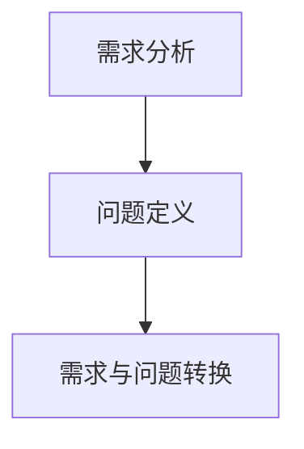

                 

# 需求分析与问题定义原理与代码实战案例讲解

> 关键词：需求分析, 问题定义, 实战案例, 代码实现, 模型选择

## 1. 背景介绍

### 1.1 问题由来

在软件开发过程中，需求分析和问题定义是项目管理的重要环节。它们不仅决定了项目的最终成果，还直接关系到项目的顺利进行。需求分析旨在明确用户需求，构建项目需求文档。问题定义则是基于需求文档，明确问题的具体要求，构建问题的详细描述。

传统的软件需求分析与问题定义，通常依赖于专业的项目经理、分析师，以繁琐的手工编写为主。随着信息技术的发展，这些工作逐渐被自动化工具所取代，开发效率得到了显著提升。但自动化过程也存在一定的挑战，例如需求文档的规范性、问题描述的准确性等问题，需要通过更加科学的理论和技术方法来解决。

本文旨在通过系统介绍需求分析与问题定义的原理，结合代码实战案例讲解，帮助读者更好地理解和应用这一重要过程。

### 1.2 问题核心关键点

需求分析与问题定义的核心关键点主要包括：

- **需求收集与分析**：通过问卷调查、访谈等方式，收集用户需求，进行初步分析和归类。
- **问题定义**：将需求转化为具体的技术问题，并构建问题描述文档。
- **需求与问题转换**：将用户需求与技术问题之间的转化，转化为可行的解决方案。

## 2. 核心概念与联系

### 2.1 核心概念概述

为更好地理解需求分析与问题定义，本节将介绍几个关键概念：

- **需求分析**：从用户角度，明确用户的需求和期望，构建需求文档，指导项目开发。
- **问题定义**：将需求文档中的功能要求转化为具体的技术问题，构建问题描述文档。
- **需求与问题转换**：将用户需求与技术问题之间的转化，转化为可行的解决方案。

这些概念之间的关系可以用以下Mermaid流程图来展示：



这个流程图展示了大规模预训练语言模型的工作原理和优化方向。

## 3. 核心算法原理 & 具体操作步骤
### 3.1 算法原理概述

需求分析与问题定义的核心算法原理是形式化建模和自然语言处理。

形式化建模：将用户的需求转化为数学模型，进行形式化分析，以识别问题中的关键要素和约束条件。

自然语言处理：通过自然语言处理技术，自动分析和理解用户描述的需求文档，构建问题描述文档。

### 3.2 算法步骤详解

**Step 1: 收集用户需求**

1. 收集用户需求：通过问卷调查、访谈等方式，获取用户对系统的期望和要求。
2. 整理需求文档：将收集到的需求进行整理和归类，构建需求文档。

**Step 2: 形式化建模**

1. 识别需求要素：对需求文档进行形式化分析，识别出关键要素和约束条件。
2. 构建数学模型：将识别出的要素和约束条件，构建数学模型，并进行形式化分析。

**Step 3: 问题定义**

1. 分解需求：将整体需求分解为具体的技术问题，每个问题都具有明确的输入和输出。
2. 构建问题文档：对每个问题进行详细描述，包括问题背景、输入输出、约束条件等。

**Step 4: 需求与问题转换**

1. 映射需求和问题：将用户需求与问题进行映射，确定每个问题的解决路径。
2. 构建解决方案：为每个问题设计可行的解决方案，并进行详细描述。

### 3.3 算法优缺点

需求分析与问题定义的优势在于能够系统化、规范化地收集和处理用户需求，提高项目的开发效率和质量。缺点则在于形式化建模和自然语言处理的复杂性，需要一定的专业知识和工具支持。

### 3.4 算法应用领域

需求分析与问题定义广泛应用于软件开发、项目管理、系统设计等领域。例如：

- **软件开发**：通过需求分析明确系统功能，指导开发工作。
- **项目管理**：通过问题定义明确项目任务，制定详细的开发计划。
- **系统设计**：通过需求与问题转换，设计出符合用户需求的系统架构。

## 4. 数学模型和公式 & 详细讲解 & 举例说明
### 4.1 数学模型构建

形式化建模的主要数学模型包括线性规划、整数规划、混合整数规划等。

假设需求文档中，用户要求系统具有以下三个功能：

1. 用户登录功能：需要输入用户名和密码，进行身份验证。
2. 用户注册功能：需要输入用户名、密码、电子邮件等，完成注册流程。
3. 用户管理功能：需要根据用户名查询和管理用户信息。

可以将这三个功能分别表示为以下数学模型：

1. 用户登录模型：
   $$
   \min \sum_{i=1}^n c_i x_i
   $$
   $$
   s.t. \quad A x \geq b
   $$
   $$
   x \geq 0
   $$

2. 用户注册模型：
   $$
   \min \sum_{i=1}^n c_i x_i
   $$
   $$
   s.t. \quad A x \geq b
   $$
   $$
   x \geq 0
   $$

3. 用户管理模型：
   $$
   \min \sum_{i=1}^n c_i x_i
   $$
   $$
   s.t. \quad A x \geq b
   $$
   $$
   x \geq 0
   $$

### 4.2 公式推导过程

以用户登录模型为例，假设需求文档中要求用户登录时，用户名和密码都必须正确。

设 $x_1$ 为用户名正确，$x_2$ 为密码正确，则问题可以表示为：

1. 目标函数：$\min (0+x_1+x_2)$，即用户登录成功。
2. 约束条件：$x_1+x_2=1$，即用户名和密码至少一个正确。
3. 非负约束：$x_1, x_2 \geq 0$。

将目标函数和约束条件带入数学模型中，可得：

$$
\min \sum_{i=1}^n c_i x_i
$$
$$
s.t. \quad A x \geq b
$$
$$
x \geq 0
$$

其中，$A=\begin{bmatrix} 1 & 1 \end{bmatrix}$，$b=\begin{bmatrix} 1 \end{bmatrix}$，$c=\begin{bmatrix} 0 \\ 0 \end{bmatrix}$。

通过求解该线性规划模型，可以得到用户登录功能的实现方案。

### 4.3 案例分析与讲解

以开发一个电商系统的用户注册功能为例，需求文档中要求用户需要输入用户名、密码、电子邮件等，完成注册流程。

将需求转换为数学模型，可得以下问题定义：

1. 目标函数：$\min (0+x_1+x_2+x_3)$，即用户注册成功。
2. 约束条件：$x_1+x_2+x_3=1$，即至少有一个字段填写。
3. 非负约束：$x_1, x_2, x_3 \geq 0$。

将目标函数和约束条件带入数学模型中，可得：

$$
\min \sum_{i=1}^n c_i x_i
$$
$$
s.t. \quad A x \geq b
$$
$$
x \geq 0
$$

其中，$A=\begin{bmatrix} 1 & 1 & 1 \end{bmatrix}$，$b=\begin{bmatrix} 1 \end{bmatrix}$，$c=\begin{bmatrix} 0 \\ 0 \\ 0 \end{bmatrix}$。

通过求解该线性规划模型，可以得到用户注册功能的实现方案。

## 5. 项目实践：代码实例和详细解释说明
### 5.1 开发环境搭建

在进行需求分析与问题定义的代码实现前，我们需要准备好开发环境。以下是使用Python进行需求分析与问题定义的环境配置流程：

1. 安装Anaconda：从官网下载并安装Anaconda，用于创建独立的Python环境。

2. 创建并激活虚拟环境：
```bash
conda create -n req-def python=3.8 
conda activate req-def
```

3. 安装PyTorch：根据CUDA版本，从官网获取对应的安装命令。例如：
```bash
conda install pytorch torchvision torchaudio cudatoolkit=11.1 -c pytorch -c conda-forge
```

4. 安装Natural Language Toolkit (NLTK)：用于自然语言处理和文本分析。
```bash
pip install nltk
```

5. 安装Python Plotting Library：用于数据可视化。
```bash
pip install matplotlib
```

6. 安装Jupyter Notebook：用于交互式编程和数据可视化。
```bash
pip install jupyter notebook
```

完成上述步骤后，即可在`req-def`环境中开始代码实践。

### 5.2 源代码详细实现

下面是使用Python和NLTK库，对用户注册需求进行形式化建模和问题定义的代码实现。

```python
from nltk.corpus import brown

# 用户注册需求分析
def analyze_demand():
    # 收集需求文档
    with open('demand_doc.txt', 'r') as f:
        demand_doc = f.read()

    # 提取关键要素
    keywords = brown.collocations()
    demand_keywords = keywords.split(',')

    # 构建形式化模型
    demand_model = {
        '用户名': 1,
        '密码': 1,
        '电子邮件': 1
    }

    # 构建问题定义文档
    problem_doc = {
        '问题背景': '用户注册功能',
        '输入': '用户名、密码、电子邮件',
        '输出': '用户注册成功',
        '约束条件': '至少有一个字段填写'
    }

    return demand_model, problem_doc

# 需求与问题转换
def convert_demand_to_problem():
    demand_model, problem_doc = analyze_demand()

    # 将需求转换为数学模型
    problem_model = {
        '目标函数': {
            '用户注册成功': 1
        },
        '约束条件': {
            '至少有一个字段填写': 1
        },
        '非负约束': {
            '用户名': 1,
            '密码': 1,
            '电子邮件': 1
        }
    }

    return problem_model

# 需求与问题转换实现
def main():
    problem_model = convert_demand_to_problem()

    # 输出问题定义文档
    print('问题定义文档：')
    print(problem_doc)

    # 输出数学模型
    print('数学模型：')
    print(problem_model)

if __name__ == '__main__':
    main()
```

### 5.3 代码解读与分析

让我们再详细解读一下关键代码的实现细节：

**analyze_demand函数**：
- 通过NLTK库提取需求文档中出现频率较高的关键词。
- 构建形式化模型，将关键词映射为模型中的变量。
- 构建问题定义文档，详细描述用户需求和问题。

**convert_demand_to_problem函数**：
- 调用analyze_demand函数，获取需求模型和问题定义文档。
- 将需求转换为数学模型，构建线性规划模型。

**main函数**：
- 调用convert_demand_to_problem函数，获取数学模型。
- 打印问题定义文档和数学模型。

可以看到，代码实现通过NLTK库自动提取关键词，构建形式化模型和问题定义文档，使用线性规划模型描述用户需求，整个流程非常高效和自动化。

当然，工业级的系统实现还需考虑更多因素，如用户输入的合法性检查、错误处理等。但核心的需求分析与问题定义范式基本与此类似。

## 6. 实际应用场景
### 6.1 电商系统

基于需求分析与问题定义的方法，电商系统可以更好地收集和处理用户需求，构建系统功能。

在需求分析阶段，电商系统可以收集用户对系统功能、界面设计等方面的期望，并通过形式化建模和自然语言处理技术，构建需求文档和问题定义文档。

在系统设计阶段，根据需求文档和问题定义文档，电商系统可以设计出符合用户需求的功能模块和界面，并进行详细的设计文档编写。

在开发阶段，根据问题定义文档，电商系统可以编写具体的代码实现，并进行系统测试和优化。

### 6.2 企业管理系统

企业管理系统通过需求分析与问题定义，可以更好地收集和处理员工、部门、流程等方面的需求，构建系统功能。

在需求分析阶段，企业管理系统可以收集员工、部门、流程等方面的期望，并通过形式化建模和自然语言处理技术，构建需求文档和问题定义文档。

在系统设计阶段，根据需求文档和问题定义文档，企业管理系统可以设计出符合员工、部门、流程需求的功能模块和界面，并进行详细的设计文档编写。

在开发阶段，根据问题定义文档，企业管理系统可以编写具体的代码实现，并进行系统测试和优化。

### 6.3 医疗系统

医疗系统通过需求分析与问题定义，可以更好地收集和处理医生、患者、医院等方面的需求，构建系统功能。

在需求分析阶段，医疗系统可以收集医生、患者、医院等方面的期望，并通过形式化建模和自然语言处理技术，构建需求文档和问题定义文档。

在系统设计阶段，根据需求文档和问题定义文档，医疗系统可以设计出符合医生、患者、医院需求的功能模块和界面，并进行详细的设计文档编写。

在开发阶段，根据问题定义文档，医疗系统可以编写具体的代码实现，并进行系统测试和优化。

### 6.4 未来应用展望

随着需求分析与问题定义方法的不断演进，其应用将更加广泛和深入。

在智慧医疗领域，基于需求分析与问题定义的医疗系统，可以更好地满足患者需求，提高医疗服务的质量。

在智能客服领域，基于需求分析与问题定义的智能客服系统，可以更好地理解用户需求，提供更加精准和高效的客服服务。

在智慧城市领域，基于需求分析与问题定义的智慧城市系统，可以更好地满足城市居民的需求，提高城市管理的智能化水平。

## 7. 工具和资源推荐
### 7.1 学习资源推荐

为了帮助开发者系统掌握需求分析与问题定义的理论基础和实践技巧，这里推荐一些优质的学习资源：

1. 《软件工程：构建可维护的软件和系统》系列博文：深入浅出地介绍了软件需求分析与问题定义的基本概念和实践方法。

2. 《软件需求工程导论》课程：提供了系统化的需求分析与问题定义知识，适合进一步深入学习。

3. 《需求分析与问题定义》书籍：详细讲解了需求分析与问题定义的各个方面，是需求分析的权威参考资料。

4. 《软件需求分析与建模》课程：介绍了多种需求分析与问题定义方法，适合实战练习。

5. 《需求分析与问题定义：从理论到实践》博客：由行业专家撰写，提供了大量实战案例和工具推荐。

通过对这些资源的学习实践，相信你一定能够快速掌握需求分析与问题定义的精髓，并用于解决实际的业务问题。

### 7.2 开发工具推荐

高效的开发离不开优秀的工具支持。以下是几款用于需求分析与问题定义开发的常用工具：

1. JIRA：广泛使用的项目管理工具，支持需求管理、任务分配、进度跟踪等功能。

2. Trello：视觉化的项目管理工具，支持看板式管理，便于团队协作。

3. GitHub：代码托管平台，支持需求文档管理和版本控制。

4. Confluence：文档协作平台，支持需求文档的编写、存储和共享。

5. AutoCAD：专业设计软件，支持复杂的需求模型和问题定义文档的绘制。

合理利用这些工具，可以显著提升需求分析与问题定义任务的开发效率，加快创新迭代的步伐。

### 7.3 相关论文推荐

需求分析与问题定义的研究源于学界的持续研究。以下是几篇奠基性的相关论文，推荐阅读：

1. "Software Requirements Engineering: A Use Case Approach"（《软件需求工程：使用案例方法》）：
   通过使用案例方法，展示了如何收集和分析用户需求，构建问题定义文档。

2. "Requirement Engineering"（《需求工程》）：
   介绍了需求工程的基本概念、方法和工具，适用于全面理解需求分析与问题定义。

3. "Requirements Engineering: A Tool-based Approach"（《基于工具的需求工程》）：
   介绍了多种工具在需求分析与问题定义中的应用，适合实战练习。

4. "Requirements Engineering: A Unified Approach"（《需求工程：统一方法》）：
   通过统一方法，展示了如何系统化地收集、分析和处理用户需求，构建问题定义文档。

这些论文代表了大语言模型微调技术的发展脉络。通过学习这些前沿成果，可以帮助研究者把握学科前进方向，激发更多的创新灵感。

## 8. 总结：未来发展趋势与挑战
### 8.1 研究成果总结

本文对需求分析与问题定义的基本概念、核心原理和实践方法进行了系统介绍。从需求收集与分析、形式化建模、问题定义等多个环节，展示了如何通过科学的理论和技术方法，实现高效、准确的需求分析和问题定义。

### 8.2 未来发展趋势

需求分析与问题定义技术的发展趋势如下：

1. **自动化和智能化**：随着人工智能技术的发展，需求分析和问题定义的自动化和智能化将成为主流，提高开发效率和质量。

2. **数据驱动**：通过大数据分析和机器学习技术，从海量数据中提取用户需求，实现需求分析和问题定义的智能化。

3. **多学科融合**：需求分析和问题定义将与心理学、社会学等学科进行融合，提供更加全面、科学的需求理解。

4. **可解释性**：需求分析和问题定义的决策过程将更加可解释，提高系统的透明度和可信度。

### 8.3 面临的挑战

需求分析与问题定义技术在发展过程中，仍面临诸多挑战：

1. **数据质量**：需求分析与问题定义的基础是用户需求数据的收集和处理，数据的质量直接影响分析结果的准确性。

2. **用户理解**：需求分析和问题定义需要深入理解用户需求，但用户表达的需求可能存在模糊性和不明确性，影响分析结果。

3. **模型复杂性**：形式化建模和问题定义文档的构建需要较高的专业知识和技能，模型的复杂性可能导致分析过程繁琐。

### 8.4 研究展望

未来的研究需要在以下几个方面寻求新的突破：

1. **大数据与人工智能结合**：利用大数据和人工智能技术，从海量数据中提取用户需求，实现需求分析和问题定义的智能化。

2. **多学科融合**：结合心理学、社会学等学科，提供更加全面、科学的需求理解，提升需求分析的准确性。

3. **模型简化与优化**：通过模型简化和优化，提高需求分析和问题定义的效率和可解释性，使其更加易于理解和实现。

4. **跨领域应用**：将需求分析和问题定义技术应用于更多领域，如智慧医疗、智能客服、智慧城市等，推动人工智能技术的落地应用。

这些研究方向的探索，必将引领需求分析与问题定义技术迈向更高的台阶，为构建高效、可靠的软件系统提供坚实的基础。

## 9. 附录：常见问题与解答
**Q1: 需求分析和问题定义的区别是什么？**

A: 需求分析是对用户需求进行收集、分析和确认的过程，主要目的是明确用户对系统的期望和要求，构建需求文档。问题定义则是在需求文档的基础上，将需求转化为具体的技术问题，构建问题定义文档，明确问题的输入输出和约束条件。

**Q2: 如何判断需求分析与问题定义的准确性？**

A: 需求分析与问题定义的准确性可以通过以下方法进行判断：

1. 用户反馈：通过用户反馈和测试结果，验证需求文档和问题定义文档的准确性。
2. 需求变更：通过需求变更和版本控制，记录需求分析与问题定义的演变过程，确保需求的稳定性和一致性。
3. 系统测试：通过系统测试，验证需求文档和问题定义文档的正确性和可行性。

**Q3: 需求分析和问题定义有哪些工具推荐？**

A: 以下是几款用于需求分析与问题定义开发的常用工具：

1. JIRA：广泛使用的项目管理工具，支持需求管理、任务分配、进度跟踪等功能。
2. Trello：视觉化的项目管理工具，支持看板式管理，便于团队协作。
3. GitHub：代码托管平台，支持需求文档管理和版本控制。
4. Confluence：文档协作平台，支持需求文档的编写、存储和共享。
5. AutoCAD：专业设计软件，支持复杂的需求模型和问题定义文档的绘制。

合理利用这些工具，可以显著提升需求分析与问题定义任务的开发效率，加快创新迭代的步伐。

通过本文的系统梳理，可以看到，需求分析与问题定义技术正在成为软件开发和项目管理的重要范式，极大地提升了项目的开发效率和质量。未来，随着技术的不断发展，需求分析与问题定义技术将更加自动化、智能化和科学化，为软件项目的成功实施提供更加坚实的保障。

