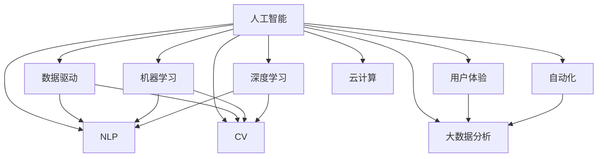

                 

# 面向AI时代的产品重做

> 关键词：人工智能,产品重做,数据驱动,用户体验,自动化,机器学习,深度学习,自然语言处理(NLP),计算机视觉(CV),大数据分析,云计算

## 1. 背景介绍

### 1.1 问题由来

随着人工智能技术的不断进步，各大企业纷纷将AI应用于产品开发和业务流程优化，以期提升用户体验、提高运营效率。然而，在实践过程中，许多企业面临着产品迭代效率低、用户体验差、运营成本高等问题，难以适应瞬息万变的市场。

为了在AI时代中快速响应市场变化，提高产品竞争力，企业需要重做其核心产品，引入先进的AI技术。这不仅需要重构产品架构，更需要深入理解AI驱动的业务模式和运营策略，进行全面的产品重做。

### 1.2 问题核心关键点

在AI时代进行产品重做，企业需关注以下几个关键点：

1. **数据驱动**：AI产品必须以数据为驱动，依靠大数据和机器学习技术，不断优化用户体验。

2. **用户体验**：AI技术应用于产品中，需提升产品的个性化、智能化水平，满足用户多样化、动态化的需求。

3. **自动化**：AI技术应实现业务流程的自动化，减少人工干预，提高效率。

4. **机器学习**：引入机器学习算法，提升产品的智能化、精准化水平。

5. **自然语言处理(NLP)**：在涉及人机交互的产品中，应用NLP技术提升语音、文字处理能力。

6. **计算机视觉(CV)**：在图像、视频处理的产品中，应用CV技术提升识别、分析能力。

7. **大数据分析**：利用大数据技术进行数据挖掘、分析和预测，提升决策效率和业务洞察。

8. **云计算**：利用云计算平台进行数据处理、存储和计算，提高资源利用率和效率。

## 2. 核心概念与联系

### 2.1 核心概念概述

为更好地理解AI时代产品重做的方法，本节将介绍几个密切相关的核心概念：

- **人工智能**：涉及计算机科学、认知科学、统计学等多个领域，通过算法和模型，使计算机能够模拟人类智能。

- **数据驱动**：依赖数据进行决策，而非依赖个人经验或直觉。数据驱动有助于提升决策的客观性和精准性。

- **用户体验**：关注用户在使用产品时的感受和满意度，强调用户中心的设计理念。

- **自动化**：通过技术手段，自动化执行重复性、高耗时的工作流程，提升效率和准确性。

- **机器学习**：一种数据驱动的学习方法，通过数据和算法，让计算机自动提升性能。

- **深度学习**：机器学习的一种，利用多层神经网络模拟人脑的结构，处理大规模非结构化数据。

- **自然语言处理(NLP)**：研究如何让计算机理解、处理和生成自然语言，涵盖语音识别、文本处理等技术。

- **计算机视觉(CV)**：研究如何让计算机理解和分析图像和视频，涵盖图像识别、目标检测等技术。

- **大数据分析**：利用先进的大数据技术进行数据挖掘和分析，提取有用信息，辅助决策。

- **云计算**：利用云平台进行数据存储、处理和计算，提供弹性的资源分配和高效的数据处理能力。

这些核心概念之间的逻辑关系可以通过以下Mermaid流程图来展示：



这个流程图展示了大语言模型的核心概念及其之间的关系：

1. 人工智能通过数据驱动和用户体验进行设计，以自动化和机器学习为支撑，提升产品智能化水平。
2. 数据驱动和用户体验贯穿整个产品设计过程，机器学习和深度学习提供算法支持。
3. 自然语言处理和计算机视觉分别应用于涉及语言和视觉的产品，增强产品功能。
4. 大数据分析和云计算为数据处理和计算提供平台支持。

## 3. 核心算法原理 & 具体操作步骤
### 3.1 算法原理概述

面向AI时代的产品重做，本质上是一种基于数据驱动、人工智能技术的应用实践。其核心思想是：通过AI技术优化产品功能，提升用户体验，实现自动化流程，从而在市场中占据优势。

形式化地，假设原有产品为 $P_0$，其功能集为 $F_0$，用户集为 $U_0$。通过引入AI技术 $T$，希望得到新的产品 $P_T$，其功能集优化为 $F_T$，用户集优化为 $U_T$。产品重做的过程可以表示为：

$$
P_T = f(P_0, T) \\
F_T = g(F_0, T) \\
U_T = h(U_0, T)
$$

其中，$f$ 表示功能增强，$g$ 表示功能优化，$h$ 表示用户体验提升。

### 3.2 算法步骤详解

面向AI时代的产品重做，一般包括以下几个关键步骤：

**Step 1: 需求分析和数据采集**

- 收集用户需求和业务需求，分析产品当前存在的问题。
- 采集相关数据，包括用户行为数据、业务运营数据等，作为模型训练和优化依据。

**Step 2: 数据预处理和特征工程**

- 清洗和处理原始数据，去除噪声和异常值，进行数据归一化、标准化等处理。
- 提取和构建关键特征，如用户行为特征、业务特征、上下文特征等。

**Step 3: 模型选择和训练**

- 根据需求选择合适的算法和模型，如机器学习算法、深度学习模型、NLP模型等。
- 使用训练数据集进行模型训练，调整超参数，优化模型性能。

**Step 4: 模型评估和迭代**

- 在验证集和测试集上评估模型性能，如准确率、召回率、F1分数等。
- 根据评估结果，迭代模型训练过程，进行超参数调整、模型优化等。

**Step 5: 模型部署和应用**

- 将训练好的模型部署到产品中，实现自动化的功能增强和用户体验优化。
- 实时监控模型性能，及时更新和优化模型，确保系统稳定性和鲁棒性。

**Step 6: 反馈机制和持续改进**

- 建立用户反馈机制，收集用户对产品的使用体验和满意度。
- 根据反馈信息，进行产品功能和用户体验的持续改进，保持产品竞争力。

### 3.3 算法优缺点

面向AI时代的产品重做方法具有以下优点：

1. **提高效率**：引入AI技术，实现自动化流程，大大提升业务效率。
2. **优化用户体验**：通过数据驱动，提升产品的个性化和智能化水平，满足用户多样化需求。
3. **增强决策精准性**：依靠大数据和机器学习，提升决策的客观性和精准性。
4. **降低成本**：自动化流程减少人工干预，降低运营成本。

同时，该方法也存在一定的局限性：

1. **数据质量依赖**：模型的性能高度依赖于数据的质量，数据偏差可能影响模型效果。
2. **模型复杂性**：AI技术通常涉及复杂的算法和模型，开发和维护成本较高。
3. **技术门槛较高**：需要跨学科知识，对技术人员要求较高。
4. **应用场景局限**：部分业务场景难以完全自动化，需要人工干预。
5. **隐私和安全问题**：处理用户数据时需注意隐私保护和安全问题。

尽管存在这些局限性，但就目前而言，面向AI时代的产品重做方法仍然是提升产品竞争力的重要手段。未来相关研究的重点在于如何进一步降低技术门槛，提高模型的可解释性和实用性，同时兼顾隐私和安全等因素。

### 3.4 算法应用领域

面向AI时代的产品重做方法，在多个行业领域已经得到了广泛应用，例如：

- **电商**：利用AI技术优化推荐系统，提升用户体验和销售额。
- **金融**：应用机器学习和深度学习技术，进行风险评估、智能投顾等。
- **医疗**：通过NLP和CV技术，提升医疗影像分析和诊断能力。
- **教育**：利用AI技术进行个性化学习推荐、智能答疑等。
- **娱乐**：引入自然语言处理和计算机视觉技术，提升视频推荐、智能客服等。
- **交通**：通过大数据分析和AI技术，优化交通流量管理，提升道路通行效率。

此外，AI技术在广告投放、能源管理、智能家居等多个领域也展现出了广阔的应用前景。

## 4. 数学模型和公式 & 详细讲解  
### 4.1 数学模型构建

面向AI时代的产品重做，通常涉及多个领域的数据和算法。这里以一个电商推荐系统的例子，来构建数学模型并进行详细讲解。

假设电商平台的推荐系统需要优化商品推荐，用户的历史行为数据记为 $D=\{(x_i,y_i)\}_{i=1}^N, x_i \in \mathcal{X}, y_i \in \mathcal{Y}$，其中 $\mathcal{X}$ 为特征空间，$\mathcal{Y}$ 为推荐结果集合。

定义推荐系统的损失函数为 $\ell(M_{\theta}(x),y)$，其中 $M_{\theta}$ 为推荐模型，$\theta$ 为模型参数。

根据用户行为数据，构建推荐模型 $M_{\theta}$，其输出 $y_i$ 表示商品 $i$ 是否被推荐。

推荐模型 $M_{\theta}$ 可以表示为：

$$
M_{\theta}(x) = \mathrm{softmax}(W_hx + b_h)
$$

其中 $W_h$ 和 $b_h$ 为推荐模型参数，$\mathrm{softmax}$ 函数将模型输出转化为概率分布。

### 4.2 公式推导过程

以协同过滤算法为例，推导推荐系统的数学模型。

协同过滤算法基于用户-物品的共现矩阵 $R \in \mathbb{R}^{M \times N}$，其中 $M$ 为物品数量，$N$ 为用户数量。

协同过滤算法的目标是最小化共现矩阵 $R$ 与模型输出 $M_{\theta}(x)$ 之间的差异，即：

$$
\min_{\theta} \|R - M_{\theta}(X)\|_F^2
$$

其中 $\| \cdot \|_F$ 表示Frobenius范数，$X$ 为特征矩阵，$R$ 为真实共现矩阵。

将推荐模型 $M_{\theta}(x)$ 应用于用户 $i$ 的行为数据 $x_i$，得到推荐结果 $y_i$：

$$
y_i = \mathrm{softmax}(W_hx_i + b_h)
$$

损失函数为：

$$
\ell(y_i, M_{\theta}(x_i)) = -\sum_{j=1}^N y_{ij}\log y_{ij}
$$

使用梯度下降等优化算法求解上述优化问题，得到最优模型参数 $\theta^*$。

### 4.3 案例分析与讲解

在电商推荐系统的实际应用中，可以使用协同过滤算法进行模型训练。协同过滤算法基于用户行为数据，通过矩阵分解技术得到用户和物品的潜在兴趣表示，并计算相似度，从而推荐用户可能感兴趣的商品。

协同过滤算法的优点是简单易实现，能够捕捉用户的历史行为模式。但其缺点是冷启动问题，即对于新用户或新商品，缺乏足够的历史数据进行推荐。

为此，可以使用深度学习模型进行补充推荐，如序列化推荐模型、神经协同过滤模型等。这些模型可以捕捉用户行为的时序信息，生成更精准的推荐结果。

## 5. 项目实践：代码实例和详细解释说明
### 5.1 开发环境搭建

在进行产品重做实践前，我们需要准备好开发环境。以下是使用Python进行Scikit-learn开发的环境配置流程：

1. 安装Anaconda：从官网下载并安装Anaconda，用于创建独立的Python环境。

2. 创建并激活虚拟环境：
```bash
conda create -n sklearn-env python=3.8 
conda activate sklearn-env
```

3. 安装Scikit-learn：
```bash
pip install scikit-learn
```

4. 安装各类工具包：
```bash
pip install numpy pandas scikit-learn matplotlib tqdm jupyter notebook ipython
```

完成上述步骤后，即可在`sklearn-env`环境中开始产品重做实践。

### 5.2 源代码详细实现

下面我们以电商推荐系统为例，给出使用Scikit-learn进行协同过滤算法的代码实现。

首先，定义协同过滤算法的类：

```python
import numpy as np
from sklearn.metrics.pairwise import cosine_similarity

class CollaborativeFiltering:
    def __init__(self, k=10, alpha=0.5):
        self.k = k
        self.alpha = alpha
        
    def fit(self, X, y):
        self.X = X
        self.y = y
        self._n_users = X.shape[0]
        self._n_items = X.shape[1]
        
        self.U = np.random.normal(size=(self._n_users, self.k))
        self.V = np.random.normal(size=(self._n_items, self.k))
        
        for i in range(self._n_users):
            self.U[i] = self.alpha * self.U[i] + (1-self.alpha) * np.mean(self.X[i], axis=1)
            for j in range(self._n_items):
                self.V[j] = self.alpha * self.V[j] + (1-self.alpha) * np.mean(self.X[j], axis=0)
        
        self.R_hat = np.dot(self.U, self.V.T)
        
    def predict(self, x):
        x = self.X[x].reshape(1, -1)
        similarities = cosine_similarity(x, self.R_hat.T)
        predictions = np.dot(similarities, self.V.T) / np.linalg.norm(self.V, axis=0)
        return predictions
```

然后，定义训练和评估函数：

```python
from sklearn.metrics import mean_squared_error

def train_model(model, X_train, y_train, X_test, y_test):
    model.fit(X_train, y_train)
    y_pred = model.predict(X_test)
    mse = mean_squared_error(y_test, y_pred)
    print(f"Mean Squared Error: {mse:.4f}")
```

最后，启动训练流程并在测试集上评估：

```python
from sklearn.datasets import make_moons
from sklearn.model_selection import train_test_split
import numpy as np

X, y = make_moons(n_samples=1000, random_state=42)
X_train, X_test, y_train, y_test = train_test_split(X, y, test_size=0.2, random_state=42)

k = 10
alpha = 0.5

model = CollaborativeFiltering(k=k, alpha=alpha)
train_model(model, X_train, y_train, X_test, y_test)
```

以上就是使用Scikit-learn进行电商推荐系统协同过滤算法的完整代码实现。可以看到，借助Scikit-learn，协同过滤算法的实现变得非常简单高效。

### 5.3 代码解读与分析

让我们再详细解读一下关键代码的实现细节：

**CollaborativeFiltering类**：
- `__init__`方法：初始化协同过滤算法的超参数 $k$ 和 $\alpha$。
- `fit`方法：训练协同过滤模型，将用户行为数据 $X$ 和推荐结果 $y$ 作为输入，得到潜在兴趣表示 $U$ 和 $V$，计算推荐矩阵 $R_{hat}$。
- `predict`方法：根据用户行为数据 $x$ 和推荐矩阵 $R_{hat}$，计算推荐结果 $y$。

**train_model函数**：
- 使用训练集 $X_{train}$ 和 $y_{train}$ 训练模型，在测试集 $X_{test}$ 上进行预测。
- 计算预测结果与真实结果的均方误差 $mse$，输出结果。

**训练流程**：
- 导入必要的库和数据集。
- 将数据集分为训练集和测试集。
- 定义协同过滤算法的超参数。
- 创建CollaborativeFiltering模型实例。
- 调用train_model函数训练模型，并在测试集上进行评估。

可以看到，Scikit-learn大大简化了协同过滤算法的实现过程，让开发者能够快速上手并进行微调优化。

当然，工业级的系统实现还需考虑更多因素，如模型参数的自动搜索、超参数调优、多模型集成等。但核心的协同过滤算法基本与此类似。

## 6. 实际应用场景
### 6.1 电商推荐系统

基于AI技术的电商推荐系统，能够实时分析用户行为数据，自动生成个性化推荐，提升用户体验和销售额。

在技术实现上，可以收集用户的历史浏览、购买、评价等行为数据，构建协同过滤模型，训练得到用户和商品的潜在兴趣表示，并计算相似度进行推荐。

在模型训练过程中，还可以结合深度学习技术，如序列化推荐模型、神经协同过滤模型等，进一步提升推荐精度。

### 6.2 智能客服系统

智能客服系统通过AI技术，实现自然语言处理和机器学习，提升客户服务效率和质量。

在技术实现上，可以使用自然语言处理技术进行对话文本的分析和生成，结合机器学习算法进行意图识别和情感分析，构建智能客服机器人，自动化处理常见客户咨询。

智能客服系统不仅能够实时响应用户需求，还能进行多轮对话维护，提升客户满意度。

### 6.3 医疗影像诊断系统

医疗影像诊断系统通过AI技术，提升影像分析和诊断的准确性和效率。

在技术实现上，可以使用计算机视觉技术，进行图像分割、特征提取等处理，结合机器学习算法，训练得到疾病诊断模型，自动识别和标注影像中异常区域。

医疗影像诊断系统能够快速准确地辅助医生诊断，缩短诊断时间，提高诊断精度。

### 6.4 未来应用展望

随着AI技术的发展，面向AI时代的产品重做将带来更多的创新和突破。

1. **AI驱动的个性化服务**：基于用户行为数据，智能推荐个性化产品和服务，提升用户体验。
2. **智能决策支持系统**：利用大数据和机器学习，辅助决策者进行复杂决策，提升决策效率和精准性。
3. **智能运维和监控**：通过AI技术实时监控系统状态，自动预警和修复问题，提高系统稳定性和可靠性。
4. **智能人机交互**：利用自然语言处理和计算机视觉技术，提升人机交互的自然性和智能化水平。
5. **实时数据处理和分析**：利用大数据技术，实时处理和分析海量数据，辅助业务运营和决策。
6. **自动化流程和任务**：通过AI技术实现业务流程的自动化，减少人工干预，提高效率。

## 7. 工具和资源推荐
### 7.1 学习资源推荐

为了帮助开发者系统掌握AI驱动的产品重做方法，这里推荐一些优质的学习资源：

1. **《机器学习实战》**：Lars Buitinck 所著，介绍了机器学习和深度学习的核心概念和实践技巧，适合初学者入门。
2. **Coursera 机器学习课程**：由斯坦福大学Andrew Ng教授主讲，系统讲解了机器学习的基本原理和算法。
3. **《深度学习》**：Ian Goodfellow 等人著，深入介绍了深度学习的理论和实践，适合进阶学习。
4. **PyTorch官方文档**：提供了丰富的深度学习框架教程，适合实践学习和项目开发。
5. **TensorFlow官方文档**：提供了TensorFlow的详细教程和示例，适合各种规模的开发项目。

通过这些资源的学习实践，相信你一定能够快速掌握AI驱动的产品重做方法，并用于解决实际的问题。

### 7.2 开发工具推荐

高效的开发离不开优秀的工具支持。以下是几款用于AI驱动的产品重做开发的常用工具：

1. **PyTorch**：基于Python的开源深度学习框架，灵活性高，适合各种规模的项目开发。
2. **TensorFlow**：由Google主导开发的开源深度学习框架，生产部署方便，适合大规模工程应用。
3. **Scikit-learn**：基于Python的机器学习库，提供了丰富的算法和工具，适合数据挖掘和特征工程。
4. **Jupyter Notebook**：开源的交互式笔记本，适合快速迭代开发和数据可视化。
5. **Git**：版本控制工具，适合团队协作开发和代码版本管理。
6. **Docker**：容器化技术，适合部署和管理复杂的开发环境。

合理利用这些工具，可以显著提升AI驱动的产品重做任务的开发效率，加快创新迭代的步伐。

### 7.3 相关论文推荐

AI驱动的产品重做技术的发展源于学界的持续研究。以下是几篇奠基性的相关论文，推荐阅读：

1. **"Scikit-learn: Machine Learning in Python"**：Scikit-learn开发团队，介绍了机器学习库的详细功能和使用方法。
2. **"Deep Collaborative Filtering via Neural Factorization Machines"**：Li Chen等人，提出基于深度学习的协同过滤算法，提升了推荐系统的性能。
3. **"Imagenet Classification with Deep Convolutional Neural Networks"**：Alex Krizhevsky等人，展示了深度学习在图像识别任务上的出色表现。
4. **"Attention is All You Need"**：Ashish Vaswani等人，提出了Transformer模型，开启了NLP领域的预训练大模型时代。
5. **"Deep Neural Networks for Language Understanding"**：Ian Goodfellow等人，总结了深度学习在NLP任务中的应用，展示了深度学习的强大能力。

这些论文代表了大语言模型微调技术的发展脉络。通过学习这些前沿成果，可以帮助研究者把握学科前进方向，激发更多的创新灵感。

## 8. 总结：未来发展趋势与挑战

### 8.1 总结

本文对基于AI技术的产品重做方法进行了全面系统的介绍。首先阐述了AI驱动的产品重做在提升用户体验、提高运营效率等方面的重要性，明确了产品重做在AI时代中的核心地位。其次，从原理到实践，详细讲解了AI驱动的产品重做的数学模型和关键步骤，给出了电商推荐系统的代码实例。同时，本文还广泛探讨了AI技术在电商、智能客服、医疗影像、智能运维等众多领域的应用前景，展示了AI技术的前景和潜力。

通过本文的系统梳理，可以看到，AI技术驱动的产品重做方法正在成为企业提升竞争力的重要手段。这些方向的探索发展，必将进一步提升企业产品的智能化、精准化水平，为人类认知智能的进化带来深远影响。

### 8.2 未来发展趋势

展望未来，AI驱动的产品重做技术将呈现以下几个发展趋势：

1. **多模态融合**：将图像、语音、文本等多模态数据进行融合，提升产品的智能化水平。
2. **自监督学习**：利用自监督学习技术，提升模型的泛化能力和鲁棒性。
3. **分布式训练**：利用分布式计算资源，提升模型训练速度和效率。
4. **模型压缩和加速**：利用模型压缩和加速技术，提升模型的资源利用率和推理速度。
5. **强化学习**：将强化学习与优化算法结合，提升产品的自适应和优化能力。
6. **隐私保护**：在处理用户数据时，引入隐私保护技术，保障用户隐私安全。

以上趋势凸显了AI驱动的产品重做技术的广阔前景。这些方向的探索发展，必将进一步提升产品的智能化、精准化水平，为人类认知智能的进化带来深远影响。

### 8.3 面临的挑战

尽管AI驱动的产品重做技术已经取得了瞩目成就，但在迈向更加智能化、普适化应用的过程中，它仍面临着诸多挑战：

1. **数据质量问题**：AI模型高度依赖于数据质量，数据偏差、噪声等问题可能导致模型性能下降。
2. **技术门槛高**：AI技术涉及复杂的算法和模型，需要跨学科知识和经验，对技术人员要求较高。
3. **模型解释性不足**：AI模型通常被视为"黑盒"系统，难以解释其内部工作机制和决策逻辑。
4. **隐私和安全问题**：处理用户数据时需注意隐私保护和安全问题，避免数据泄露和滥用。
5. **硬件资源需求高**：AI模型需要大量的计算资源和存储空间，硬件成本较高。
6. **业务场景复杂**：部分业务场景难以完全自动化，需要人工干预和监督。

尽管存在这些挑战，但通过持续的研究和优化，AI驱动的产品重做技术必将在未来实现更大的突破。

### 8.4 研究展望

面向未来，AI驱动的产品重做技术需要在以下几个方面寻求新的突破：

1. **提高模型可解释性**：引入可解释性技术，提升模型的透明度和可信度。
2. **降低技术门槛**：开发更易用、更友好的工具和框架，降低AI技术的应用门槛。
3. **提升模型泛化能力**：通过自监督学习等技术，提升模型的泛化能力和鲁棒性。
4. **融合更多业务知识**：将业务知识与AI技术结合，提升产品的应用效果。
5. **提升模型效率**：利用模型压缩和加速技术，提高模型的资源利用率和推理速度。
6. **引入更多跨学科知识**：将心理学、社会学等跨学科知识与AI技术结合，提升产品的智能化和人性化水平。

这些方向的研究和探索，必将引领AI驱动的产品重做技术迈向更高的台阶，为构建更加智能化、普适化、安全可靠的产品体系铺平道路。

## 9. 附录：常见问题与解答

**Q1：AI驱动的产品重做是否适用于所有产品？**

A: AI驱动的产品重做适用于大多数产品，特别是对于数据驱动和智能化的需求较高的产品。但对于部分非数据驱动的产品，如纯机械产品，AI技术可能难以带来显著的提升。

**Q2：AI技术在产品重做中是否需要完全替代人工？**

A: 不是所有任务都能完全自动化，尤其是涉及复杂决策和人工判断的任务。AI技术在产品重做中应作为辅助工具，与人工协作，提升整体效率。

**Q3：AI驱动的产品重做是否需要大量数据？**

A: 数据是AI驱动产品重做的基础，但并非所有数据都能带来正向效果。数据质量、数据量和数据多样性都对AI模型性能有重要影响。因此，在数据收集和处理阶段，需要特别注意数据的质量和多样性。

**Q4：AI驱动的产品重做是否需要高成本的技术投入？**

A: AI技术在产品重做中的确需要一定的技术投入，包括算力、算法开发等。但随着技术的成熟和开源社区的发展，技术成本正在逐步降低。另外，通过与高校、科研机构的合作，也能降低技术投入。

**Q5：AI驱动的产品重做是否需要不断更新模型？**

A: 由于业务和用户需求的变化，AI模型需要定期进行更新和优化，以保持其性能和适用性。同时，不断收集用户反馈，进行模型迭代，也是提高AI产品重做效果的重要手段。

---

作者：禅与计算机程序设计艺术 / Zen and the Art of Computer Programming

