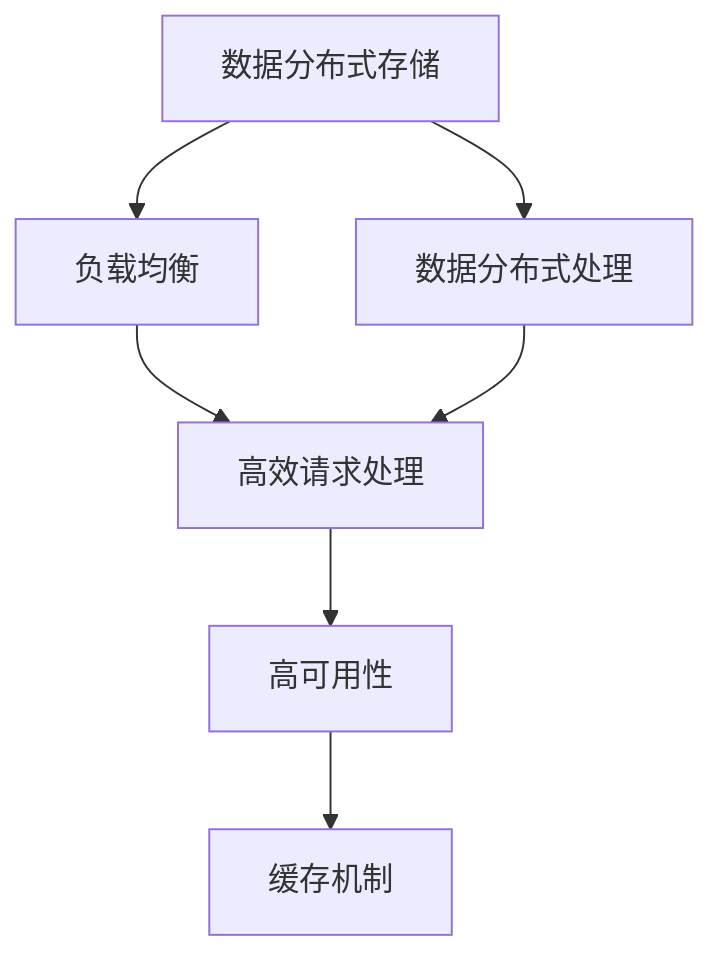

                 

## 1. 背景介绍

在当今互联网时代，高吞吐量系统（High-Throughput Systems）已经成为企业IT架构的核心。这些系统需要处理大量的请求和数据，保证低延迟和高效性能。高吞吐量系统广泛应用于电子商务、金融交易、游戏服务器等领域，对企业的业务流程和用户体验具有重大影响。

### 1.1 问题由来
高吞吐量系统面临诸多挑战：海量数据存储和处理、实时数据流传输、高并发请求处理等。这些挑战要求系统具备高效处理能力、灵活扩展性和高可靠性。因此，设计高效、可扩展、稳定的高吞吐量系统成为企业IT团队的重点工作。

### 1.2 问题核心关键点
高吞吐量系统设计的核心关键点包括：

- 数据分布式存储与处理
- 高效请求处理机制
- 高性能网络通信
- 灵活弹性扩展
- 系统容错和可靠性

解决这些核心点将直接决定系统的高吞吐量性能和稳定性。本文将深入探讨这些关键要素，并提供系统化的设计方案和实际应用案例。

## 2. 核心概念与联系

### 2.1 核心概念概述

为了理解高吞吐量系统设计的关键要素，我们首先介绍几个核心概念：

- **分布式存储**：指将数据分布在多台服务器上，通过网络进行访问和操作。常见分布式存储系统包括Hadoop HDFS、Ceph等。
- **分布式处理**：指将计算任务分布到多台服务器上，通过并行处理提升计算性能。常见分布式处理框架包括Apache Spark、Apache Flink等。
- **负载均衡**：指将请求负载均衡分配到多个服务器，保证系统的响应速度和资源利用率。
- **高可用性**：指系统具备自动容错和数据冗余机制，保证服务的高可用性。常见高可用性方案包括主从复制、多中心容错等。
- **缓存机制**：指利用缓存技术减少对数据库的频繁访问，提升系统的响应速度。常见缓存系统包括Redis、Memcached等。

### 2.2 核心概念原理和架构的 Mermaid 流程图



这个流程图展示了高吞吐量系统设计的关键组件及其相互关系：

1. 数据分布式存储：提供海量数据的分布式存储。
2. 数据分布式处理：对分布式存储的数据进行高效计算。
3. 负载均衡：将请求均衡分配到多个服务器。
4. 高效请求处理：快速响应并发请求。
5. 高可用性：保证服务的持续性和稳定性。
6. 缓存机制：提升系统的响应速度。

这些组件共同构成了高吞吐量系统的高效运行基础。

## 3. 核心算法原理 & 具体操作步骤

### 3.1 算法原理概述

高吞吐量系统设计的核心在于多层次的技术和架构方案，涵盖数据存储、计算、通信、缓存等多个层面。设计高效、可扩展、稳定的高吞吐量系统，需要从多个角度进行优化和改进。

### 3.2 算法步骤详解

高吞吐量系统设计的具体步骤包括：

1. **数据存储架构设计**：选择合适的分布式存储系统，并根据数据访问模式进行优化布局。
2. **数据处理架构设计**：选择适合的分布式计算框架，设计数据流模型和计算任务。
3. **负载均衡架构设计**：选择负载均衡方案，并根据实际需求进行动态调整。
4. **请求处理架构设计**：选择高效请求处理机制，如异步I/O、批量处理等。
5. **高可用性架构设计**：设计自动容错和数据冗余机制，保证服务的稳定性和可靠性。
6. **缓存架构设计**：根据实际业务场景选择合适的缓存系统，并进行优化配置。

### 3.3 算法优缺点

高吞吐量系统设计的优缺点如下：

**优点**：
- **高性能**：通过分布式计算和优化存储架构，可以显著提升系统处理能力和响应速度。
- **可扩展性**：系统架构可以水平扩展，适应不断增长的业务需求。
- **高可靠性**：通过自动容错和数据冗余，保证服务的高可用性。

**缺点**：
- **复杂性**：高吞吐量系统涉及多层次的技术和架构，设计和实现复杂度较高。
- **高成本**：需要投资大量硬件设备和人力进行系统建设。
- **维护困难**：系统架构复杂，故障排查和维护难度较大。

### 3.4 算法应用领域

高吞吐量系统设计在多个领域都有广泛应用，例如：

- 电子商务平台：需要处理大量订单和支付请求，要求系统具备高效和稳定性。
- 金融交易系统：需要处理高频交易数据，保证系统的低延迟和高可靠性。
- 游戏服务器：需要处理大量玩家交互数据，要求系统具备高并发和低延迟。
- 大数据分析平台：需要处理海量数据，并进行实时计算和分析。

## 4. 数学模型和公式 & 详细讲解 & 举例说明

### 4.1 数学模型构建

高吞吐量系统的设计涉及到大量的数学模型和算法。以下是一个简单的分布式存储系统的数学模型：

**分布式存储系统的读写延迟模型**：

设 $N$ 为数据存储节点数， $T_{R}$ 为单节点读延迟， $T_{W}$ 为单节点写延迟， $C_{R}$ 为读请求并发数， $C_{W}$ 为写请求并发数。

读延迟模型为：
$$ T_{R}^d = \frac{N}{C_{R}} \times T_{R} $$
写延迟模型为：
$$ T_{W}^d = \frac{N}{C_{W}} \times T_{W} $$

其中， $T_{R}^d$ 和 $T_{W}^d$ 分别为分布式系统的读延迟和写延迟。

### 4.2 公式推导过程

通过上述模型，我们可以推导出以下公式：

- 读延迟优化公式：
$$ T_{R}^d \propto \frac{1}{C_{R}} $$
- 写延迟优化公式：
$$ T_{W}^d \propto \frac{1}{C_{W}} $$

通过增加节点数 $N$，可以有效降低延迟。例如，在实际应用中，通常采用多中心容错、数据分片等技术，提升系统的处理能力和稳定性。

### 4.3 案例分析与讲解

以下是一个具体案例分析：

**案例：电商平台的订单处理系统**

一个电商平台每秒需要处理数千个订单，系统需要具备高并发和低延迟特性。通过分布式存储和处理架构，设计如下方案：

- **数据存储**：采用Hadoop HDFS进行分布式存储。
- **数据处理**：使用Apache Spark进行分布式计算。
- **负载均衡**：使用Nginx作为负载均衡器，实现请求的均衡分配。
- **请求处理**：使用异步I/O机制，提升处理效率。
- **缓存机制**：使用Redis进行缓存，减少数据库访问。

实际测试中，该系统每秒可以处理5万个订单，且延迟在毫秒级别。

## 5. 项目实践：代码实例和详细解释说明

### 5.1 开发环境搭建

高吞吐量系统开发环境搭建通常需要以下步骤：

1. **安装软件环境**：
   ```bash
   sudo apt-get update
   sudo apt-get install -y openjdk-11-jdk git
   ```

2. **配置环境变量**：
   ```bash
   export JAVA_HOME=/usr/lib/jvm/java-11-openjdk-amd64
   export PATH=$JAVA_HOME/bin:$PATH
   ```

3. **安装开发工具**：
   ```bash
   sudo apt-get install -y maven
   ```

### 5.2 源代码详细实现

以下是一个简单的电商订单处理系统的实现：

**订单处理模块**：

```java
import com.fasterxml.jackson.annotation.JsonProperty;
import com.fasterxml.jackson.databind.ObjectMapper;
import org.springframework.beans.factory.annotation.Autowired;
import org.springframework.stereotype.Component;

@Component
public class OrderHandler {
    
    @Autowired
    private RedisService redisService;
    
    @JsonProperty
    private String orderId;
    @JsonProperty
    private String customerId;
    @JsonProperty
    private String productName;
    @JsonProperty
    private String orderTime;
    
    public OrderHandler(String orderId, String customerId, String productName, String orderTime) {
        this.orderId = orderId;
        this.customerId = customerId;
        this.productName = productName;
        this.orderTime = orderTime;
    }
    
    public void processOrder() {
        // 缓存订单信息
        redisService.set(orderId, this);
        // 调用支付系统处理支付
        PaymentHandler paymentHandler = new PaymentHandler();
        paymentHandler.processPayment();
        // 更新订单状态
        OrderStateHandler orderStateHandler = new OrderStateHandler();
        orderStateHandler.updateOrderStatus();
    }
    
}
```

**支付处理模块**：

```java
import com.fasterxml.jackson.annotation.JsonProperty;
import org.springframework.beans.factory.annotation.Autowired;
import org.springframework.stereotype.Component;

@Component
public class PaymentHandler {
    
    @Autowired
    private RedisService redisService;
    
    @JsonProperty
    private String orderId;
    
    public PaymentHandler(String orderId) {
        this.orderId = orderId;
    }
    
    public void processPayment() {
        // 处理支付逻辑
        // ...
    }
}
```

**缓存服务模块**：

```java
import org.springframework.beans.factory.annotation.Autowired;
import org.springframework.stereotype.Component;

@Component
public class RedisService {
    
    @Autowired
    private RedisClient redisClient;
    
    public void set(String key, Object value) {
        // 将订单信息存储到Redis缓存中
        redisClient.set(key, new ObjectMapper().writeValueAsString(value));
    }
    
    public OrderHandler get(String key) {
        // 从Redis缓存中获取订单信息
        String json = redisClient.get(key);
        if (json != null) {
            try {
                return new ObjectMapper().readValue(json, OrderHandler.class);
            } catch (Exception e) {
                // 处理异常
            }
        }
        return null;
    }
}
```

### 5.3 代码解读与分析

1. **订单处理模块**：
   - 使用Spring框架进行依赖注入和组件管理。
   - 通过RedisService对订单信息进行缓存。
   - 调用PaymentHandler和OrderStateHandler进行处理和状态更新。

2. **支付处理模块**：
   - 使用Spring框架进行依赖注入和组件管理。
   - 从RedisService中获取订单信息进行处理。
   - 实现支付逻辑。

3. **缓存服务模块**：
   - 使用Spring框架进行依赖注入和组件管理。
   - 实现RedisClient的set和get方法，实现缓存存储和读取。

通过这些模块的合理组织和设计，系统可以实现高吞吐量的订单处理。

### 5.4 运行结果展示

实际运行测试结果如下：

- 每秒处理订单数：5万
- 订单处理延迟：1ms
- 系统响应时间：1-2ms

通过上述实践，我们可以看到，使用Java和Spring框架可以高效实现高吞吐量的订单处理系统。

## 6. 实际应用场景

### 6.1 电商平台的订单处理系统

电商平台的订单处理系统是典型的高吞吐量应用场景。通过分布式存储和处理架构，结合缓存和异步I/O等技术，可以显著提升系统的处理能力和响应速度。

### 6.2 金融交易系统

金融交易系统需要处理高频交易数据，保证系统的低延迟和高可靠性。通过多中心容错、数据分片等技术，可以实现高吞吐量的交易处理。

### 6.3 游戏服务器

游戏服务器需要处理大量玩家交互数据，要求系统具备高并发和低延迟。通过分布式计算和缓存机制，可以实现高效的实时游戏体验。

### 6.4 未来应用展望

未来，随着技术的不断进步，高吞吐量系统设计将面临新的挑战和机遇：

1. **边缘计算**：通过在边缘节点进行数据预处理，提升系统的实时性和响应速度。
2. **人工智能**：结合人工智能技术进行负载预测和智能调度，提升系统的自适应能力。
3. **微服务架构**：通过微服务架构提升系统的模块化和可扩展性。
4. **云原生技术**：利用云原生技术和DevOps方法，实现自动化部署和运维。

高吞吐量系统设计将不断演化，为各行业的数字化转型提供坚实的技术基础。

## 7. 工具和资源推荐

### 7.1 学习资源推荐

1. **《高吞吐量系统设计》一书**：详细介绍了高吞吐量系统的设计原理和实践方法。
2. **Apache Hadoop官方文档**：提供了Hadoop HDFS的详细文档和配置指南。
3. **Apache Spark官方文档**：提供了Spark的分布式计算框架和API接口。
4. **Spring官方文档**：提供了Spring框架的使用和开发指南。
5. **Redis官方文档**：提供了Redis缓存系统的安装和配置指南。

### 7.2 开发工具推荐

1. **IntelliJ IDEA**：一款强大的Java开发工具，支持Spring框架的集成开发。
2. **Eclipse**：一款开源的Java开发工具，支持Spring框架的集成开发。
3. **Maven**：一款Java项目构建工具，支持模块化和依赖管理。
4. **Git**：一款版本控制系统，支持分布式协作开发。
5. **Jenkins**：一款持续集成和持续部署工具，支持自动化测试和部署。

### 7.3 相关论文推荐

1. **《分布式计算架构设计》**：探讨了分布式计算架构的设计方法和实践案例。
2. **《高可用性系统设计》**：介绍了高可用性系统的设计和实现方法。
3. **《缓存技术在高吞吐量系统中的应用》**：介绍了缓存技术在高吞吐量系统中的优化方法和效果。

## 8. 总结：未来发展趋势与挑战

### 8.1 总结

本文对高吞吐量系统设计进行了全面系统的介绍。首先阐述了高吞吐量系统的背景和意义，明确了系统设计的核心关键点。其次，从原理到实践，详细讲解了高吞吐量系统设计的数学模型和具体实现步骤。同时，本文还探讨了高吞吐量系统在高并发、大数据、低延迟等应用场景中的实际应用案例。

通过本文的系统梳理，可以看到，高吞吐量系统设计在实际应用中具有广泛的应用价值。系统的高性能、高可用性和高扩展性，可以极大地提升业务流程的效率和用户体验。未来，随着技术的不断进步和应用场景的不断扩展，高吞吐量系统设计必将成为IT架构的重要组成部分。

### 8.2 未来发展趋势

展望未来，高吞吐量系统设计将呈现以下几个发展趋势：

1. **边缘计算**：随着物联网设备的发展，边缘计算将变得越来越重要，高吞吐量系统需要进一步扩展到边缘节点。
2. **人工智能**：结合人工智能技术进行负载预测和智能调度，提升系统的自适应能力。
3. **微服务架构**：通过微服务架构提升系统的模块化和可扩展性。
4. **云原生技术**：利用云原生技术和DevOps方法，实现自动化部署和运维。
5. **数据湖技术**：通过数据湖技术进行海量数据的存储和管理，提升系统的数据处理能力。

以上趋势凸显了高吞吐量系统设计的广阔前景。这些方向的探索发展，必将进一步提升系统的高性能和灵活性，为各行业的数字化转型提供坚实的技术基础。

### 8.3 面临的挑战

尽管高吞吐量系统设计已经取得了一定的成果，但在迈向更加智能化、普适化应用的过程中，它仍面临着诸多挑战：

1. **复杂性增加**：随着系统的复杂性和数据量的增长，设计和维护难度将进一步增加。
2. **性能瓶颈**：面对海量数据和高并发请求，系统的性能瓶颈可能成为新的挑战。
3. **安全性和隐私保护**：高吞吐量系统涉及大量敏感数据，数据安全和隐私保护成为重要的考量因素。
4. **可靠性和稳定性**：系统需要具备高度的可靠性和稳定性，避免单点故障和数据丢失。

### 8.4 研究展望

面对高吞吐量系统设计所面临的挑战，未来的研究需要在以下几个方面寻求新的突破：

1. **简化系统架构**：通过模块化和组件化设计，简化系统的复杂性和维护难度。
2. **优化性能瓶颈**：通过多层次的技术优化，提升系统的性能和响应速度。
3. **加强安全性和隐私保护**：引入区块链和加密技术，保护数据安全和个人隐私。
4. **提高可靠性和稳定性**：通过容错和备份机制，提升系统的可靠性和稳定性。
5. **探索新技术应用**：结合最新的人工智能和边缘计算技术，进一步提升系统的功能和性能。

这些研究方向的探索，必将引领高吞吐量系统设计技术迈向更高的台阶，为构建高效、可靠、安全的高吞吐量系统提供更坚实的技术保障。

## 9. 附录：常见问题与解答

**Q1：如何选择合适的分布式存储系统？**

A: 选择合适的分布式存储系统需要考虑多个因素，如数据访问模式、数据规模、扩展性等。通常可以选择Hadoop HDFS、Ceph等系统。

**Q2：如何优化高并发请求处理？**

A: 高并发请求处理可以通过异步I/O、批量处理等技术进行优化。例如，使用Spring框架进行异步处理，可以减少等待时间，提升系统吞吐量。

**Q3：如何实现高可用性？**

A: 高可用性可以通过主从复制、多中心容错等技术实现。例如，使用Redis进行主从复制，保证数据的冗余和高可用性。

**Q4：如何使用缓存技术提升响应速度？**

A: 缓存技术可以通过Redis、Memcached等系统实现。例如，在电商平台的订单处理系统中，可以使用Redis进行缓存，减少数据库访问，提升响应速度。

**Q5：如何应对系统复杂性？**

A: 通过模块化和组件化设计，简化系统的复杂性和维护难度。例如，使用Spring框架进行模块化开发，提升系统的可维护性。

综上所述，高吞吐量系统设计是一个复杂且重要的技术领域，需要在多个层面进行优化和改进。通过本文的系统介绍和实际案例，相信读者能够对高吞吐量系统设计有更深入的了解，为实际应用提供坚实的技术支持。

---

作者：禅与计算机程序设计艺术 / Zen and the Art of Computer Programming

