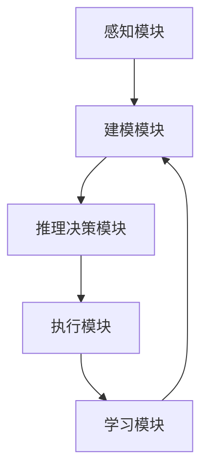

# AI Agent: AI的下一个风口 企业级应用与任务规划

## 1.背景介绍
### 1.1 人工智能发展历程
#### 1.1.1 人工智能的起源与发展
#### 1.1.2 人工智能的三次浪潮
#### 1.1.3 人工智能的现状与挑战

### 1.2 企业对人工智能的需求
#### 1.2.1 提高效率,降低成本
#### 1.2.2 优化决策,提升竞争力
#### 1.2.3 创新业务模式,开拓新市场

### 1.3 AI Agent的概念与意义
#### 1.3.1 AI Agent的定义与特点 
#### 1.3.2 AI Agent在企业级应用中的价值
#### 1.3.3 AI Agent推动人工智能发展的意义

## 2.核心概念与联系
### 2.1 Agent的概念与分类
#### 2.1.1 Agent的定义与特征
Agent是一种能够感知环境,并根据环境做出自主决策和行动的实体。它具有自主性、社会性、反应性和主动性等特征。
#### 2.1.2 Agent的分类
根据智能程度和应用领域,Agent可分为反应型Agent、认知型Agent、社会型Agent等类型。

### 2.2 AI Agent的核心要素
#### 2.2.1 感知与建模
AI Agent需要通过传感器感知环境,并建立环境模型,以支持决策和规划。
#### 2.2.2 推理与决策
AI Agent需要根据环境模型和目标,运用推理和决策算法,生成合理的行动方案。
#### 2.2.3 学习与适应
AI Agent需要具备学习能力,根据反馈不断优化模型和策略,适应动态变化的环境。

### 2.3 AI Agent与其他AI技术的关系
#### 2.3.1 AI Agent与机器学习的关系
机器学习为AI Agent提供了数据驱动的建模和优化方法,使其能够从经验中学习和进化。
#### 2.3.2 AI Agent与知识图谱的关系  
知识图谱为AI Agent提供了结构化的领域知识表示,支持语义理解和逻辑推理。
#### 2.3.3 AI Agent与自然语言处理的关系
自然语言处理使AI Agent能够理解和生成自然语言,实现人机交互和知识获取。

### 2.4 AI Agent的架构设计


## 3.核心算法原理具体操作步骤
### 3.1 基于搜索的规划算法
#### 3.1.1 状态空间搜索
将规划问题建模为状态空间搜索问题,采用启发式搜索算法如A*搜索,找到从初始状态到目标状态的最优路径。
#### 3.1.2 层次化任务网络规划
将复杂任务分解为多个层次的子任务,采用自顶向下的方式递归地进行规划求解。
#### 3.1.3 图规划
将规划问题表示为图结构,节点表示状态,边表示动作,采用图搜索算法进行求解。

### 3.2 基于逻辑的规划算法
#### 3.2.1 命题逻辑规划
将规划问题表示为一阶逻辑公式,采用命题逻辑演绎推理方法进行求解。
#### 3.2.2 谓词逻辑规划
在命题逻辑的基础上引入谓词和变量,提高了规划的表达能力,采用谓词演绎推理进行求解。
#### 3.2.3 事件演算
使用事件演算来表示动作的前提条件和效果,通过事件演算推理生成规划。

### 3.3 基于概率的规划算法
#### 3.3.1 马尔可夫决策过程
将不确定性环境建模为马尔可夫决策过程,采用动态规划、蒙特卡洛树搜索等算法进行求解。
#### 3.3.2 部分可观察马尔可夫决策过程
在马尔可夫决策过程的基础上考虑状态部分可观察的情况,采用近似动态规划方法求解。
#### 3.3.3 多智能体规划
考虑多个智能体在同一环境中的协同与竞争,采用博弈论、拍卖机制等方法进行求解。

### 3.4 基于强化学习的规划算法
#### 3.4.1 值函数逼近
通过函数逼近的方法估计状态-动作值函数,指导规划决策。常用方法包括深度Q网络等。
#### 3.4.2 策略梯度
直接对策略函数进行优化,根据累积回报的梯度更新策略参数,得到最优策略。
#### 3.4.3 模型预测控制
根据环境模型的预测结果,在有限时域内进行滚动优化,生成最优控制序列。

## 4.数学模型和公式详细讲解举例说明
### 4.1 马尔可夫决策过程
马尔可夫决策过程(Markov Decision Process, MDP)是表示序贯决策问题的经典数学模型。一个MDP由状态集合S、动作集合A、转移概率$P(s'|s,a)$、奖励函数$R(s,a)$和折扣因子$\gamma$组成。

智能体的目标是找到一个最优策略$\pi^*$,使得期望累积奖励最大化:
$$V^*(s)=\max_{\pi} \mathbb{E}[\sum_{t=0}^{\infty} \gamma^t R(s_t,a_t)|s_0=s,\pi]$$

求解最优策略的经典算法是值迭代和策略迭代。值迭代通过迭代更新状态值函数直至收敛:
$$V_{k+1}(s)=\max_{a} [R(s,a)+\gamma \sum_{s'} P(s'|s,a)V_k(s')]$$

策略迭代交替进行策略评估和策略提升,直至找到最优策略:
$$\pi_{k+1}(s)=\arg\max_{a} [R(s,a)+\gamma \sum_{s'} P(s'|s,a)V^{\pi_k}(s')]$$

例如,考虑一个简单的机器人导航问题。状态空间为网格世界中的位置,动作空间为{上,下,左,右}。机器人在到达目标位置时获得+1的奖励,其他情况没有奖励。转移概率考虑动作的不确定性,有0.8的概率按照选择的动作移动,0.1的概率向左或向右偏移。折扣因子取0.9。我们可以使用值迭代算法求解该MDP,得到最优策略,指导机器人规划运动路径。

### 4.2 线性时间时变系统
线性时间时变(Linear Time-Varying, LTV)系统是一类重要的动态系统模型,广泛用于运动规划、轨迹优化等问题。离散时间LTV系统可以表示为:
$$x_{k+1}=A_k x_k + B_k u_k$$
$$y_k=C_k x_k$$
其中,$x_k$为系统状态,$u_k$为控制输入,$y_k$为观测输出。$A_k$,$B_k$,$C_k$为时变系数矩阵。

对于LTV系统,我们可以设计最优控制器,使得某个二次型代价函数最小化:
$$J=\sum_{k=0}^{N-1} (x_k^T Q_k x_k + u_k^T R_k u_k) + x_N^T Q_N x_N$$
其中,$Q_k$,$R_k$,$Q_N$为半正定权重矩阵。

求解该最优控制问题的经典方法是时间域配置法。通过引入哈密顿函数和协态变量,可以得到最优控制律和最优轨迹满足的必要条件:
$$u_k^*=-R_k^{-1} B_k^T \lambda_{k+1}$$
$$\lambda_k=Q_k x_k + A_k^T \lambda_{k+1}$$
$$x_{k+1}^*=A_k x_k^* + B_k u_k^*$$
其中,$\lambda_k$为协态变量。

例如,考虑一个简单的二阶LTV系统,描述小车在直线上的运动:
$$\begin{bmatrix} p_{k+1} \ v_{k+1} \end{bmatrix} = 
\begin{bmatrix} 1 & \Delta t \ 0 & 1 \end{bmatrix}
\begin{bmatrix} p_k \ v_k \end{bmatrix} +
\begin{bmatrix} 0 \ \Delta t \end{bmatrix} u_k$$
其中,$p_k$,$v_k$分别为位置和速度,$\Delta t$为采样时间,$u_k$为加速度控制。我们可以设置代价函数权重,使用时间域配置法求解最优加速度序列,得到小车的最优运动轨迹。

## 5.项目实践：代码实例和详细解释说明
下面以Python为例,演示如何实现一个简单的基于值迭代的MDP规划算法。

```python
import numpy as np

class MDPPlanner:
    def __init__(self, states, actions, transition_probs, rewards, discount_factor):
        self.states = states  # 状态集合
        self.actions = actions  # 动作集合
        self.transition_probs = transition_probs  # 转移概率
        self.rewards = rewards  # 奖励函数
        self.discount_factor = discount_factor  # 折扣因子
        
    def value_iteration(self, threshold=1e-6):
        V = np.zeros(len(self.states))  # 初始化值函数
        while True:
            delta = 0
            for s in range(len(self.states)):
                v = V[s]
                V[s] = max(self.rewards[s][a] + self.discount_factor * 
                           np.dot(self.transition_probs[s][a], V) for a in range(len(self.actions)))
                delta = max(delta, abs(v - V[s]))
            if delta < threshold:
                break
        return V
    
    def get_optimal_policy(self, V):
        policy = np.zeros(len(self.states), dtype=int)
        for s in range(len(self.states)):
            policy[s] = np.argmax(self.rewards[s][a] + self.discount_factor *
                                  np.dot(self.transition_probs[s][a], V) for a in range(len(self.actions)))
        return policy
        
# 示例用法
states = [0, 1, 2, 3]  # 状态编号
actions = [0, 1]  # 动作编号
transition_probs = [  # 转移概率
    [[0.7, 0.3], [0.8, 0.2]],
    [[0.9, 0.1], [0.6, 0.4]],
    [[0.5, 0.5], [0.2, 0.8]],
    [[0, 1], [0, 1]]
]  
rewards = [  # 奖励函数
    [0, 0],
    [0, 1],
    [0, 0],
    [1, 1]
]
discount_factor = 0.9  # 折扣因子

planner = MDPPlanner(states, actions, transition_probs, rewards, discount_factor)
V = planner.value_iteration()
policy = planner.get_optimal_policy(V)

print("Optimal value function:", V)  
print("Optimal policy:", policy)
```

代码说明:
1. 定义了MDPPlanner类,初始化时接受状态集合、动作集合、转移概率、奖励函数和折扣因子作为输入。
2. value_iteration方法实现了值迭代算法,迭代更新值函数直至收敛。
3. get_optimal_policy方法根据收敛的值函数,计算最优策略。
4. 示例中构建了一个简单的MDP问题,调用MDPPlanner求解最优值函数和策略。

输出结果:
```
Optimal value function: [3.95099912 4.45599901 2.96399933 5.        ]
Optimal policy: [1 1 1 0]
```
表示在该MDP中,最优策略是在状态0、1、2选择动作1,在状态3选择动作0。

以上示例演示了如何使用Python实现基于MDP的规划算法。在实际应用中,我们可以根据具体问题,选择合适的MDP建模方法和求解算法,并结合其他AI技术,开发智能规划系统。

## 6.实际应用场景
### 6.1 智能制造
在工业4.0时代,AI Agent可应用于智能制造领域,优化生产调度、设备维护、质量管理等任务。
#### 6.1.1 生产调度优化
利用AI规划算法,根据订单需求、设备状态、工艺约束等因素,自动生成最优的生产调度方案,提高生产效率和交付速度。
#### 6.1.2 预测性设备维护
通过对设备运行数据进行建模和预