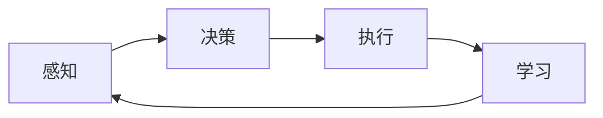

# AI Agent: AI的下一个风口 对研究者和实践者的建议

## 1. 背景介绍
### 1.1 人工智能的发展历程
#### 1.1.1 早期人工智能
#### 1.1.2 专家系统时代
#### 1.1.3 机器学习崛起
### 1.2 当前人工智能的现状
#### 1.2.1 深度学习的突破
#### 1.2.2 AI在各行业的应用
#### 1.2.3 AI面临的挑战和局限
### 1.3 AI Agent的概念
#### 1.3.1 AI Agent的定义
#### 1.3.2 AI Agent与传统AI的区别
#### 1.3.3 AI Agent的发展前景

## 2. 核心概念与联系
### 2.1 Agent的概念
#### 2.1.1 Agent的定义
#### 2.1.2 Agent的特点
#### 2.1.3 Agent的分类
### 2.2 AI Agent的核心要素
#### 2.2.1 感知能力
#### 2.2.2 决策能力
#### 2.2.3 执行能力
#### 2.2.4 学习能力
### 2.3 AI Agent与其他AI技术的关系
#### 2.3.1 AI Agent与机器学习
#### 2.3.2 AI Agent与深度学习
#### 2.3.3 AI Agent与强化学习



## 3. 核心算法原理具体操作步骤
### 3.1 基于规则的AI Agent
#### 3.1.1 规则表示
#### 3.1.2 规则匹配
#### 3.1.3 规则执行
### 3.2 基于机器学习的AI Agent
#### 3.2.1 监督学习
#### 3.2.2 无监督学习
#### 3.2.3 强化学习
### 3.3 基于深度学习的AI Agent
#### 3.3.1 卷积神经网络
#### 3.3.2 循环神经网络
#### 3.3.3 生成对抗网络

## 4. 数学模型和公式详细讲解举例说明
### 4.1 马尔可夫决策过程
#### 4.1.1 MDP的定义
MDP可以用一个五元组 $(S, A, P, R, \gamma)$ 来表示：

- $S$: 状态集合
- $A$: 动作集合
- $P$: 状态转移概率矩阵，$P(s'|s,a)$表示在状态$s$下执行动作$a$后转移到状态$s'$的概率
- $R$: 奖励函数，$R(s,a)$表示在状态$s$下执行动作$a$获得的即时奖励
- $\gamma$: 折扣因子，$\gamma \in [0,1]$，表示未来奖励的折扣程度

#### 4.1.2 最优策略
在MDP中，我们的目标是寻找一个最优策略 $\pi^*$，使得从任意状态$s$开始，执行该策略获得的期望累积奖励最大化：

$$V^*(s) = \max_{\pi} \mathbb{E}\left[\sum_{t=0}^{\infty} \gamma^t R(s_t,\pi(s_t)) | s_0=s\right]$$

其中，$V^*(s)$表示状态$s$的最优价值函数。

### 4.2 Q-learning算法
#### 4.2.1 Q函数
Q函数 $Q(s,a)$ 表示在状态$s$下执行动作$a$的期望累积奖励：

$$Q(s,a) = \mathbb{E}\left[\sum_{t=0}^{\infty} \gamma^t R(s_t,a_t) | s_0=s, a_0=a\right]$$

#### 4.2.2 Q-learning更新规则
Q-learning通过不断更新Q函数来逼近最优Q函数 $Q^*$：

$$Q(s,a) \leftarrow Q(s,a) + \alpha \left[R(s,a) + \gamma \max_{a'} Q(s',a') - Q(s,a)\right]$$

其中，$\alpha$是学习率，$s'$是执行动作$a$后转移到的下一个状态。

## 5. 项目实践：代码实例和详细解释说明
下面我们使用Python实现一个简单的Q-learning算法，用于解决网格世界问题。

```python
import numpy as np

# 定义网格世界环境
class GridWorld:
    def __init__(self, width, height, start, goal, obstacles):
        self.width = width
        self.height = height
        self.start = start
        self.goal = goal
        self.obstacles = obstacles

    def step(self, state, action):
        # 根据当前状态和动作，返回下一个状态和奖励
        next_state = tuple(map(sum, zip(state, action)))
        if next_state in self.obstacles:
            next_state = state
        if next_state == self.goal:
            reward = 1
        else:
            reward = 0
        return next_state, reward

    def get_actions(self, state):
        # 返回当前状态下可用的动作
        actions = []
        for action in [(0,1), (0,-1), (1,0), (-1,0)]:
            next_state = tuple(map(sum, zip(state, action)))
            if 0 <= next_state[0] < self.width and 0 <= next_state[1] < self.height and next_state not in self.obstacles:
                actions.append(action)
        return actions

# 定义Q-learning算法
def q_learning(env, episodes, alpha, gamma, epsilon):
    Q = np.zeros((env.width, env.height, 4))
    for _ in range(episodes):
        state = env.start
        while state != env.goal:
            actions = env.get_actions(state)
            if np.random.rand() < epsilon:
                action = actions[np.random.randint(len(actions))]
            else:
                action = actions[np.argmax(Q[state[0], state[1]])]
            next_state, reward = env.step(state, action)
            Q[state[0], state[1], actions.index(action)] += alpha * (reward + gamma * np.max(Q[next_state[0], next_state[1]]) - Q[state[0], state[1], actions.index(action)])
            state = next_state
    return Q

# 创建网格世界环境
env = GridWorld(5, 5, (0,0), (4,4), [(1,1), (1,3), (3,1), (3,3)])

# 运行Q-learning算法
Q = q_learning(env, episodes=1000, alpha=0.5, gamma=0.9, epsilon=0.1)

# 打印最优策略
for i in range(env.width):
    for j in range(env.height):
        if (i,j) == env.goal:
            print('G', end=' ')
        elif (i,j) in env.obstacles:
            print('X', end=' ')
        else:
            action = [(0,1), (0,-1), (1,0), (-1,0)][np.argmax(Q[i,j])]
            if action == (0,1):
                print('>', end=' ')
            elif action == (0,-1):
                print('<', end=' ')
            elif action == (1,0):
                print('v', end=' ')
            else:
                print('^', end=' ')
    print()
```

在这个例子中，我们定义了一个简单的网格世界环境`GridWorld`，包含起点、终点和障碍物。`step`函数根据当前状态和动作返回下一个状态和奖励，`get_actions`函数返回当前状态下可用的动作。

然后，我们实现了Q-learning算法。在每个episode中，从起点开始，根据epsilon-greedy策略选择动作，更新Q表，直到到达终点。重复执行多个episode，最终得到最优Q表。

最后，我们根据最优Q表打印出最优策略。其中，`G`表示终点，`X`表示障碍物，`>`、`<`、`v`、`^`分别表示向右、向左、向下、向上移动。

## 6. 实际应用场景
### 6.1 智能客服
AI Agent可以用于构建智能客服系统，通过自然语言处理和对话管理技术，与用户进行智能交互，解答用户问题，提供个性化服务。
### 6.2 自动驾驶
AI Agent可以应用于自动驾驶领域，通过感知、决策、控制等技术，实现车辆的自动驾驶，提高交通安全和效率。
### 6.3 智能推荐
AI Agent可以用于构建智能推荐系统，通过对用户行为数据的分析和学习，为用户提供个性化的商品、内容等推荐服务。

## 7. 工具和资源推荐
### 7.1 开发工具
- TensorFlow: 由Google开发的开源机器学习框架
- PyTorch: 由Facebook开发的开源机器学习库
- Keras: 基于TensorFlow和Theano的高层神经网络API
### 7.2 学习资源
- 《Artificial Intelligence: A Modern Approach》: 人工智能经典教材，系统介绍了人工智能的基本概念和方法
- 《Reinforcement Learning: An Introduction》: 强化学习经典教材，全面介绍了强化学习的基本原理和算法
- Coursera上吴恩达的《Machine Learning》课程：介绍机器学习的基本概念和算法，适合初学者

## 8. 总结：未来发展趋势与挑战
### 8.1 发展趋势
- 多模态AI Agent：融合视觉、语音、文本等多种模态信息，实现更加智能、自然的人机交互
- 自主学习型AI Agent：通过持续学习和自我完善，不断提高智能水平和适应能力
- 群体协作型AI Agent：多个AI Agent之间通过协作和分工，完成复杂任务
### 8.2 面临的挑战
- 可解释性：如何让AI Agent的决策过程更加透明和可解释
- 安全性：如何避免AI Agent被恶意利用或对人类造成伤害
- 伦理道德：如何让AI Agent遵循人类的伦理道德规范

## 9. 附录：常见问题与解答
### 9.1 AI Agent与传统软件的区别是什么？
AI Agent具有感知、决策、学习等智能特征，能够根据环境变化自主适应和完善，而传统软件则是按照预先设定的流程和规则运行，缺乏智能性和灵活性。
### 9.2 AI Agent的应用前景如何？
AI Agent 技术正在快速发展，在智能客服、自动驾驶、智能推荐等领域有广阔的应用前景，未来将在更多领域发挥重要作用，极大提升生产效率和生活品质。
### 9.3 如何开发一个AI Agent？
开发AI Agent需要掌握人工智能、机器学习等相关知识和技能，了解Agent的基本架构和开发流程。可以使用TensorFlow、PyTorch等开发工具，参考相关教程和案例，循序渐进地进行开发和优化。

作者：禅与计算机程序设计艺术 / Zen and the Art of Computer Programming