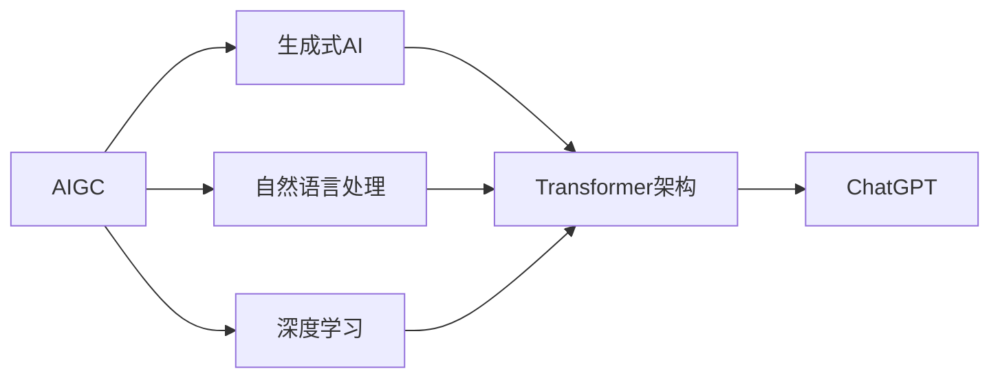

# AIGC从入门到实战：ChatGPT 提问表单

## 1. 背景介绍
### 1.1 AIGC的兴起
#### 1.1.1 人工智能的发展历程
#### 1.1.2 AIGC的概念与特点
#### 1.1.3 AIGC的应用前景

### 1.2 ChatGPT的诞生
#### 1.2.1 OpenAI的研究进展
#### 1.2.2 ChatGPT的技术原理
#### 1.2.3 ChatGPT的优势与局限性

### 1.3 AIGC时代的机遇与挑战
#### 1.3.1 AIGC对各行业的影响
#### 1.3.2 AIGC技术的伦理考量
#### 1.3.3 AIGC人才的培养与需求

## 2. 核心概念与联系
### 2.1 AIGC的核心概念
#### 2.1.1 生成式AI
#### 2.1.2 自然语言处理
#### 2.1.3 深度学习

### 2.2 ChatGPT的关键技术
#### 2.2.1 Transformer架构
#### 2.2.2 预训练与微调
#### 2.2.3 Few-shot学习

### 2.3 AIGC与其他AI技术的联系
#### 2.3.1 AIGC与计算机视觉
#### 2.3.2 AIGC与语音识别
#### 2.3.3 AIGC与知识图谱



## 3. 核心算法原理具体操作步骤
### 3.1 Transformer架构详解
#### 3.1.1 Self-Attention机制
#### 3.1.2 Multi-Head Attention
#### 3.1.3 位置编码

### 3.2 预训练与微调流程
#### 3.2.1 无监督预训练
#### 3.2.2 有监督微调
#### 3.2.3 任务适配

### 3.3 Few-shot学习实现
#### 3.3.1 提示工程
#### 3.3.2 上下文学习
#### 3.3.3 样本高效利用

## 4. 数学模型和公式详细讲解举例说明
### 4.1 Transformer的数学表示
#### 4.1.1 Self-Attention计算公式
$Attention(Q,K,V) = softmax(\frac{QK^T}{\sqrt{d_k}})V$

#### 4.1.2 Multi-Head Attention计算
$$MultiHead(Q,K,V) = Concat(head_1, ..., head_h)W^O$$

其中， $head_i = Attention(QW_i^Q, KW_i^K, VW_i^V)$

#### 4.1.3 前馈神经网络计算
$$FFN(x) = max(0, xW_1 + b_1)W_2 + b_2$$

### 4.2 损失函数与优化算法
#### 4.2.1 交叉熵损失函数
$$Loss(x, class) = -log\left(\frac{exp(x[class])}{\sum_j exp(x[j])}\right)$$

#### 4.2.2 Adam优化算法
$$\theta_{t+1} = \theta_t - \frac{\eta}{\sqrt{\hat{v}_t} + \epsilon} \hat{m}_t$$

其中，$\hat{m}_t$ 和 $\hat{v}_t$ 分别是梯度的一阶矩估计和二阶矩估计的偏差修正。

### 4.3 评估指标与方法
#### 4.3.1 BLEU评估指标
$$BLEU = BP \cdot exp\left(\sum_{n=1}^N w_n \log p_n\right)$$

其中，$BP$ 是句子长度惩罚项，$p_n$ 是n-gram的精确率。

#### 4.3.2 Perplexity评估指标
$$PPL = exp\left(-\frac{1}{N}\sum_{i=1}^N \log p(w_i|w_1, ..., w_{i-1})\right)$$

其中，$N$ 是语料库中的单词总数，$p(w_i|w_1, ..., w_{i-1})$ 是语言模型给定前 $i-1$ 个单词时第 $i$ 个单词的概率。

## 5. 项目实践：代码实例和详细解释说明
### 5.1 使用Hugging Face的Transformers库
#### 5.1.1 加载预训练模型
```python
from transformers import AutoTokenizer, AutoModelForCausalLM

tokenizer = AutoTokenizer.from_pretrained("gpt2")
model = AutoModelForCausalLM.from_pretrained("gpt2")
```

#### 5.1.2 文本生成
```python
prompt = "Once upon a time"
input_ids = tokenizer.encode(prompt, return_tensors='pt')

output = model.generate(input_ids, max_length=100, num_return_sequences=5, no_repeat_ngram_size=2, early_stopping=True)

for i in range(5):
    print(f"Generated text {i+1}: {tokenizer.decode(output[i], skip_special_tokens=True)}")
```

### 5.2 使用PyTorch实现Transformer
#### 5.2.1 定义Transformer模型类
```python
import torch
import torch.nn as nn

class TransformerModel(nn.Module):
    def __init__(self, ntoken, ninp, nhead, nhid, nlayers, dropout=0.5):
        super(TransformerModel, self).__init__()
        from torch.nn import TransformerEncoder, TransformerEncoderLayer
        self.model_type = 'Transformer'
        self.pos_encoder = PositionalEncoding(ninp, dropout)
        encoder_layers = TransformerEncoderLayer(ninp, nhead, nhid, dropout)
        self.transformer_encoder = TransformerEncoder(encoder_layers, nlayers)
        self.encoder = nn.Embedding(ntoken, ninp)
        self.ninp = ninp
        self.decoder = nn.Linear(ninp, ntoken)

        self.init_weights()

    def generate_square_subsequent_mask(self, sz):
        mask = (torch.triu(torch.ones(sz, sz)) == 1).transpose(0, 1)
        mask = mask.float().masked_fill(mask == 0, float('-inf')).masked_fill(mask == 1, float(0.0))
        return mask

    def init_weights(self):
        initrange = 0.1
        self.encoder.weight.data.uniform_(-initrange, initrange)
        self.decoder.bias.data.zero_()
        self.decoder.weight.data.uniform_(-initrange, initrange)

    def forward(self, src, src_mask):
        src = self.encoder(src) * math.sqrt(self.ninp)
        src = self.pos_encoder(src)
        output = self.transformer_encoder(src, src_mask)
        output = self.decoder(output)
        return output
```

#### 5.2.2 训练Transformer模型
```python
import time

criterion = nn.CrossEntropyLoss()
lr = 5.0
optimizer = torch.optim.SGD(model.parameters(), lr=lr)
scheduler = torch.optim.lr_scheduler.StepLR(optimizer, 1.0, gamma=0.95)

def train():
    model.train()
    total_loss = 0.
    start_time = time.time()
    src_mask = model.generate_square_subsequent_mask(bptt).to(device)
    for batch, i in enumerate(range(0, train_data.size(0) - 1, bptt)):
        data, targets = get_batch(train_data, i)
        optimizer.zero_grad()
        if data.size(0) != bptt:
            src_mask = model.generate_square_subsequent_mask(data.size(0)).to(device)
        output = model(data, src_mask)
        loss = criterion(output.view(-1, ntokens), targets)
        loss.backward()
        torch.nn.utils.clip_grad_norm_(model.parameters(), 0.5)
        optimizer.step()

        total_loss += loss.item()
        log_interval = 200
        if batch % log_interval == 0 and batch > 0:
            cur_loss = total_loss / log_interval
            elapsed = time.time() - start_time
            print('| epoch {:3d} | {:5d}/{:5d} batches | '
                  'lr {:02.2f} | ms/batch {:5.2f} | '
                  'loss {:5.2f} | ppl {:8.2f}'.format(
                    epoch, batch, len(train_data) // bptt, scheduler.get_last_lr()[0],
                    elapsed * 1000 / log_interval,
                    cur_loss, math.exp(cur_loss)))
            total_loss = 0
            start_time = time.time()

def evaluate(eval_model, data_source):
    eval_model.eval()
    total_loss = 0.
    src_mask = model.generate_square_subsequent_mask(bptt).to(device)
    with torch.no_grad():
        for i in range(0, data_source.size(0) - 1, bptt):
            data, targets = get_batch(data_source, i)
            if data.size(0) != bptt:
                src_mask = model.generate_square_subsequent_mask(data.size(0)).to(device)
            output = eval_model(data, src_mask)
            output_flat = output.view(-1, ntokens)
            total_loss += len(data) * criterion(output_flat, targets).item()
    return total_loss / (len(data_source) - 1)
```

## 6. 实际应用场景
### 6.1 智能客服
#### 6.1.1 客户问题自动应答
#### 6.1.2 个性化服务推荐
#### 6.1.3 情感分析与舆情监控

### 6.2 内容创作
#### 6.2.1 文案生成
#### 6.2.2 故事创作
#### 6.2.3 诗歌与歌词生成

### 6.3 教育与培训
#### 6.3.1 智能导师
#### 6.3.2 个性化学习路径推荐
#### 6.3.3 互动式教学内容生成

### 6.4 医疗健康
#### 6.4.1 医疗咨询与建议
#### 6.4.2 药物研发辅助
#### 6.4.3 医学报告自动生成

### 6.5 金融与法律
#### 6.5.1 金融风险评估
#### 6.5.2 合同审查与分析
#### 6.5.3 个性化投资建议

## 7. 工具和资源推荐
### 7.1 开源框架与库
#### 7.1.1 Hugging Face Transformers
#### 7.1.2 OpenAI GPT系列模型
#### 7.1.3 Google BERT

### 7.2 数据集与语料库
#### 7.2.1 Common Crawl
#### 7.2.2 Wikipedia
#### 7.2.3 BookCorpus

### 7.3 学习资源与社区
#### 7.3.1 机器学习课程
#### 7.3.2 自然语言处理教程
#### 7.3.3 AIGC相关论坛与博客

## 8. 总结：未来发展趋势与挑战
### 8.1 AIGC技术的发展方向
#### 8.1.1 多模态生成
#### 8.1.2 知识增强型生成
#### 8.1.3 可解释性与可控性

### 8.2 AIGC面临的挑战
#### 8.2.1 数据偏见与公平性
#### 8.2.2 隐私与安全
#### 8.2.3 创作版权与知识产权

### 8.3 AIGC的未来展望
#### 8.3.1 人机协作新范式
#### 8.3.2 个性化服务与体验
#### 8.3.3 创新驱动与产业变革

## 9. 附录：常见问题与解答
### 9.1 ChatGPT的使用技巧
#### 9.1.1 提问方式优化
#### 9.1.2 多轮对话策略
#### 9.1.3 结果评估与反馈

### 9.2 AIGC应用开发指南
#### 9.2.1 需求分析与场景选择
#### 9.2.2 数据准备与预处理
#### 9.2.3 模型选择与调优
#### 9.2.4 应用集成与部署

### 9.3 AIGC相关伦理与法律问题
#### 9.3.1 算法偏见与歧视
#### 9.3.2 隐私保护与数据安全
#### 9.3.3 知识产权归属与保护

作者：禅与计算机程序设计艺术 / Zen and the Art of Computer Programming