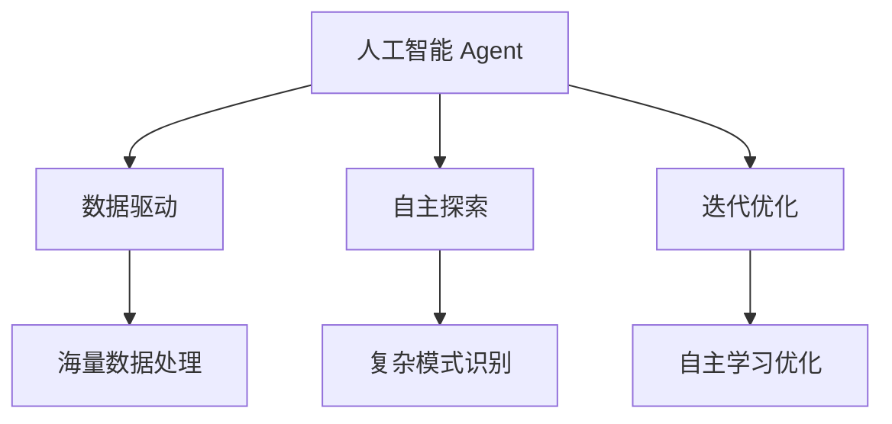

# AI人工智能 Agent：对科学研究方法的改变

## 1. 背景介绍
### 1.1 人工智能的发展历程
#### 1.1.1 早期人工智能的探索
#### 1.1.2 机器学习的崛起
#### 1.1.3 深度学习的突破

### 1.2 人工智能在科学研究中的应用
#### 1.2.1 计算机辅助科学研究
#### 1.2.2 人工智能驱动的科学发现
#### 1.2.3 人工智能改变科研范式

## 2. 核心概念与联系
### 2.1 人工智能 Agent 的定义
#### 2.1.1 Agent 的特征
#### 2.1.2 Agent 的分类
#### 2.1.3 Agent 的架构

### 2.2 人工智能 Agent 与传统科研方法的区别
#### 2.2.1 数据驱动 vs 假设驱动
#### 2.2.2 自主探索 vs 人工设计
#### 2.2.3 迭代优化 vs 线性研究

### 2.3 人工智能 Agent 在科研中的优势
#### 2.3.1 海量数据处理能力
#### 2.3.2 复杂模式识别能力
#### 2.3.3 自主学习和优化能力



## 3. 核心算法原理具体操作步骤
### 3.1 强化学习
#### 3.1.1 马尔可夫决策过程
#### 3.1.2 Q-Learning算法
#### 3.1.3 策略梯度算法

### 3.2 元学习
#### 3.2.1 元学习的概念
#### 3.2.2 MAML算法
#### 3.2.3 元学习在科研中的应用

### 3.3 因果推理
#### 3.3.1 因果模型
#### 3.3.2 因果发现算法
#### 3.3.3 因果推理在科研中的重要性

## 4. 数学模型和公式详细讲解举例说明
### 4.1 强化学习数学模型
#### 4.1.1 马尔可夫决策过程定义
马尔可夫决策过程可以用一个五元组 $(S, A, P, R, \gamma)$ 来表示：

- $S$：状态空间，表示Agent所处的环境状态集合。
- $A$：动作空间，表示Agent可以采取的动作集合。
- $P$：状态转移概率矩阵，$P(s'|s,a)$ 表示在状态 $s$ 下执行动作 $a$ 后转移到状态 $s'$ 的概率。
- $R$：奖励函数，$R(s,a)$ 表示在状态 $s$ 下执行动作 $a$ 后获得的即时奖励。
- $\gamma$：折扣因子，$\gamma \in [0,1]$，表示未来奖励的折扣比例。

Agent的目标是最大化累积期望奖励：

$$\mathbb{E}\left[\sum_{t=0}^{\infty} \gamma^t R(s_t,a_t)\right]$$

#### 4.1.2 Q-Learning 的更新公式

Q-Learning 是一种无模型的离线策略学习算法，其核心是价值函数的迭代更新。Q函数定义为在状态 $s$ 下采取动作 $a$ 的期望累积奖励：

$$Q(s,a) = \mathbb{E}\left[\sum_{k=0}^{\infty} \gamma^k R(s_{t+k},a_{t+k}) | s_t=s, a_t=a\right]$$

Q-Learning 的更新公式为：

$$Q(s,a) \leftarrow Q(s,a) + \alpha \left[R(s,a) + \gamma \max_{a'} Q(s',a') - Q(s,a)\right]$$

其中 $\alpha$ 是学习率，$s'$ 是在状态 $s$ 下执行动作 $a$ 后转移到的下一个状态。

### 4.2 元学习数学模型
#### 4.2.1 MAML 算法目标函数
MAML (Model-Agnostic Meta-Learning) 的目标是学习一个模型参数的初始化，使得经过少量步骤的梯度下降就能快速适应新任务。

假设我们有一个分布 $p(\mathcal{T})$ 的任务集合，每个任务 $\mathcal{T}_i$ 包含一个损失函数 $\mathcal{L}_{\mathcal{T}_i}$。MAML 的目标函数可以表示为：

$$\min_\theta \mathbb{E}_{\mathcal{T}_i \sim p(\mathcal{T})} \left[ \mathcal{L}_{\mathcal{T}_i}(f_{\theta_i'}) \right]$$

其中 $\theta$ 是模型的初始参数，$\theta_i'$ 是经过 $k$ 步梯度下降后的参数：

$$\theta_i' = \theta - \alpha \nabla_\theta \mathcal{L}_{\mathcal{T}_i}(f_\theta)$$

这里 $\alpha$ 是内循环的学习率。外循环的优化过程就是要找到一个最优的初始参数 $\theta$，使得经过内循环的少量梯度下降后，模型能够在新任务上取得最小的损失。

## 5. 项目实践：代码实例和详细解释说明
### 5.1 使用PyTorch实现Q-Learning
```python
import numpy as np
import torch

class QLearning:
    def __init__(self, state_dim, action_dim, lr, gamma, epsilon):
        self.state_dim = state_dim
        self.action_dim = action_dim
        self.lr = lr  # 学习率
        self.gamma = gamma  # 折扣因子
        self.epsilon = epsilon  # epsilon-greedy 策略
        self.Q = torch.zeros(state_dim, action_dim)  # Q表格

    def choose_action(self, state):
        if np.random.uniform() < self.epsilon:
            action = np.random.choice(self.action_dim)
        else:
            action = self.Q[state].argmax().item()
        return action

    def update(self, state, action, reward, next_state):
        td_error = reward + self.gamma * self.Q[next_state].max() - self.Q[state, action]
        self.Q[state, action] += self.lr * td_error
```

这段代码实现了一个简单的Q-Learning算法：

- 初始化时传入状态空间维度`state_dim`、动作空间维度`action_dim`、学习率`lr`、折扣因子`gamma`和探索率`epsilon`。
- `choose_action`方法根据epsilon-greedy策略选择动作，以 $\epsilon$ 的概率随机探索，否则选择Q值最大的动作。
- `update`方法根据 $(s,a,r,s')$ 的转移信息更新Q表格，使用的是Q-Learning的更新公式。

### 5.2 使用Pytorch实现MAML
```python
import torch
from torch import nn

def maml_inner_loop(model, loss_fn, X, y, alpha):
    """内循环"""
    model.zero_grad()
    y_pred = model(X)
    loss = loss_fn(y_pred, y)
    params = gradient_update(model, loss, alpha)
    return params

def gradient_update(model, loss, alpha):
    """梯度更新"""
    grads = torch.autograd.grad(loss, model.parameters())
    params = [param - alpha * grad for param, grad in zip(model.parameters(), grads)]
    return params

def maml(model, tasks, loss_fn, alpha, beta, num_iterations):
    """MAML算法主循环"""
    for _ in range(num_iterations):
        new_params = []
        for X, y in tasks:
            model.parameters = gradient_update(model, loss_fn(model(X), y), alpha)
            new_params.append(model.parameters)

        outgrads = []
        for new_param, (X, y) in zip(new_params, tasks):
            model.parameters = new_param
            loss = loss_fn(model(X), y)
            outgrads.append(torch.autograd.grad(loss, model.parameters()))

        for param, outgrad in zip(model.parameters(), outgrads):
            param.grad = torch.stack([grad for grad in outgrad]).mean(dim=0)

        for param in model.parameters():
            param.data -= beta * param.grad
```

这段代码实现了MAML算法的核心逻辑：

- `maml_inner_loop`函数对应MAML的内循环，对每个任务进行一次梯度下降更新，返回更新后的模型参数。
- `gradient_update`函数用于单次梯度更新，根据损失函数计算梯度，并更新模型参数。
- `maml`函数是算法的主循环，对每个任务进行内循环更新，然后计算每个任务的外梯度，最后将外梯度的平均值作为元模型的梯度，进行元模型的更新。

其中`alpha`是内循环学习率，`beta`是外循环学习率，`num_iterations`是迭代次数。

## 6. 实际应用场景
### 6.1 药物发现
#### 6.1.1 基于强化学习的药物分子生成
#### 6.1.2 元学习在药物虚拟筛选中的应用

### 6.2 材料设计
#### 6.2.1 机器学习辅助材料性能预测
#### 6.2.2 强化学习优化材料合成工艺

### 6.3 天文学研究
#### 6.3.1 基于深度学习的天体分类
#### 6.3.2 强化学习在天文观测任务规划中的应用

## 7. 工具和资源推荐
### 7.1 机器学习框架
- PyTorch
- TensorFlow
- Scikit-learn

### 7.2 强化学习库
- OpenAI Gym
- Stable Baselines
- RLlib

### 7.3 元学习资源
- Torchmeta
- learn2learn
- 相关论文和教程

## 8. 总结：未来发展趋势与挑战
### 8.1 人工智能 Agent 与科学研究的深度融合
### 8.2 自动化科学发现的前景与局限
### 8.3 人工智能伦理与安全问题

## 9. 附录：常见问题与解答
### 9.1 如何选择适合的人工智能算法？
### 9.2 人工智能 Agent 能否完全取代人类科研？
### 9.3 如何处理人工智能 Agent 产生的偏差和错误？

人工智能 Agent 正在深刻影响和改变传统的科学研究范式。通过机器学习、强化学习、元学习等算法，Agent 能够从海量数据中自主学习和优化，发现隐藏的模式和规律，推动科学研究的自动化和智能化。尽管目前还面临着算法局限、伦理风险等挑战，但人工智能 Agent 有望成为科研创新的重要助力，为人类认识世界、改造世界提供新的视角和方法。未来，人工智能与科学研究的深度融合将是大势所趋，科研工作者需要积极拥抱这一变革，利用人工智能的力量推动科技进步和社会发展。

作者：禅与计算机程序设计艺术 / Zen and the Art of Computer Programming