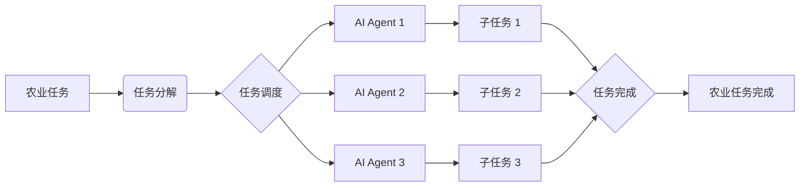

# AI人工智能代理工作流 AI Agent WorkFlow：在农业自动化中的应用

## 1. 背景介绍
### 1.1 农业自动化的重要性
#### 1.1.1 提高农业生产效率
#### 1.1.2 解决农业劳动力短缺问题
#### 1.1.3 实现农业的可持续发展

### 1.2 人工智能在农业自动化中的应用前景
#### 1.2.1 智能农业设备的发展
#### 1.2.2 农业大数据的应用
#### 1.2.3 AI算法在农业决策中的应用

### 1.3 AI Agent WorkFlow的概念
#### 1.3.1 AI Agent的定义
#### 1.3.2 WorkFlow的定义
#### 1.3.3 AI Agent WorkFlow的优势

## 2. 核心概念与联系
### 2.1 AI Agent的组成
#### 2.1.1 感知模块
#### 2.1.2 决策模块
#### 2.1.3 执行模块

### 2.2 WorkFlow的组成
#### 2.2.1 任务分解
#### 2.2.2 任务调度
#### 2.2.3 任务执行

### 2.3 AI Agent与WorkFlow的结合
#### 2.3.1 AI Agent作为WorkFlow的执行者
#### 2.3.2 WorkFlow对AI Agent行为的约束
#### 2.3.3 AI Agent WorkFlow的工作原理

## 3. 核心算法原理具体操作步骤
### 3.1 基于强化学习的AI Agent决策算法
#### 3.1.1 马尔可夫决策过程(MDP)
#### 3.1.2 Q-Learning算法
#### 3.1.3 Deep Q-Network(DQN)算法

### 3.2 基于工作流的任务调度算法
#### 3.2.1 DAG(有向无环图)工作流
#### 3.2.2 基于优先级的任务调度算法
#### 3.2.3 基于deadline的任务调度算法

### 3.3 AI Agent WorkFlow的具体操作步骤
#### 3.3.1 定义农业任务并分解为子任务
#### 3.3.2 构建任务之间的依赖关系形成DAG工作流
#### 3.3.3 AI Agent按照工作流调度执行任务

## 4. 数学模型和公式详细讲解举例说明
### 4.1 马尔可夫决策过程(MDP)
MDP是表示决策问题的数学框架,由状态集合$S$,行为集合$A$,状态转移概率$P$,奖励函数$R$和折扣因子$\gamma$组成。

Agent的目标是最大化累积期望奖励:

$$\mathbb{E}\left[\sum_{t=0}^{\infty} \gamma^{t} r_{t}\right]$$

其中$r_t$是在时间步$t$获得的奖励。

### 4.2 Q-Learning算法
Q-Learning是一种无模型的离线策略学习算法,通过不断更新状态-行为值函数$Q(s,a)$来学习最优策略。

Q-Learning的更新公式为:

$$Q(s, a) \leftarrow Q(s, a)+\alpha\left[r+\gamma \max _{a^{\prime}} Q\left(s^{\prime}, a^{\prime}\right)-Q(s, a)\right]$$

其中$\alpha$是学习率,$\gamma$是折扣因子,$s'$是执行行为$a$后转移到的新状态。

### 4.3 Deep Q-Network(DQN)算法
DQN算法使用深度神经网络来逼近状态-行为值函数$Q(s,a)$,其损失函数为:

$$L(\theta)=\mathbb{E}_{s, a, r, s^{\prime}}\left[\left(r+\gamma \max _{a^{\prime}} Q\left(s^{\prime}, a^{\prime} ; \theta^{-}\right)-Q(s, a ; \theta)\right)^{2}\right]$$

其中$\theta$是当前网络的参数,$\theta^-$是目标网络的参数。

## 5. 项目实践：代码实例和详细解释说明
下面是一个简单的基于PyTorch实现的DQN Agent代码示例:

```python
import torch
import torch.nn as nn
import torch.optim as optim
import numpy as np

class DQN(nn.Module):
    def __init__(self, state_dim, action_dim):
        super(DQN, self).__init__()
        self.fc1 = nn.Linear(state_dim, 64)
        self.fc2 = nn.Linear(64, 64)
        self.fc3 = nn.Linear(64, action_dim)

    def forward(self, x):
        x = torch.relu(self.fc1(x))
        x = torch.relu(self.fc2(x))
        x = self.fc3(x)
        return x

class DQNAgent:
    def __init__(self, state_dim, action_dim, lr, gamma, epsilon):
        self.state_dim = state_dim
        self.action_dim = action_dim
        self.gamma = gamma
        self.epsilon = epsilon

        self.dqn = DQN(state_dim, action_dim)
        self.optimizer = optim.Adam(self.dqn.parameters(), lr=lr)
        self.criterion = nn.MSELoss()

    def choose_action(self, state):
        if np.random.uniform() < self.epsilon:
            action = np.random.randint(self.action_dim)
        else:
            state = torch.tensor(state, dtype=torch.float32)
            q_value = self.dqn(state)
            action = q_value.argmax().item()
        return action

    def update(self, state, action, reward, next_state, done):
        state = torch.tensor(state, dtype=torch.float32)
        next_state = torch.tensor(next_state, dtype=torch.float32)
        action = torch.tensor(action, dtype=torch.int64)
        reward = torch.tensor(reward, dtype=torch.float32)

        if done:
            q_target = reward
        else:
            q_target = reward + self.gamma * self.dqn(next_state).max()

        q_value = self.dqn(state)[action]
        loss = self.criterion(q_value, q_target)

        self.optimizer.zero_grad()
        loss.backward()
        self.optimizer.step()
```

这个DQN Agent包含两个主要部分:

1. `DQN`类:定义了一个简单的三层全连接神经网络,用于逼近状态-行为值函数$Q(s,a)$。

2. `DQNAgent`类:实现了DQN算法的核心逻辑,包括使用$\epsilon$-贪婪策略选择行为,以及根据贝尔曼方程更新神经网络参数。

在`choose_action`方法中,Agent以$\epsilon$的概率随机选择行为,否则选择Q值最大的行为。在`update`方法中,Agent根据当前状态、行为、奖励和下一状态计算Q值目标,并使用均方误差损失函数更新神经网络参数。

## 6. 实际应用场景
AI Agent WorkFlow可以应用于农业自动化的各个环节,例如:

### 6.1 智能灌溉系统
AI Agent可以根据土壤湿度、天气预报等信息,自主决策何时、浇灌多少水,并控制执行灌溉任务,实现农田的精准灌溉。

### 6.2 农业机器人
农业机器人可以在农田中自主导航,完成播种、施肥、收割等任务。AI Agent WorkFlow可以对农业机器人的作业任务进行分解、调度和执行,实现农业生产的自动化。

### 6.3 农作物病虫害监测
AI Agent可以通过分析农作物图像,检测病虫害发生情况,并根据病虫害的严重程度,自主决策是否需要喷洒农药,并控制农业机器人执行喷药任务。

## 7. 工具和资源推荐
### 7.1 深度学习框架
- TensorFlow: https://www.tensorflow.org/
- PyTorch: https://pytorch.org/
- Keras: https://keras.io/

### 7.2 强化学习库
- OpenAI Gym: https://gym.openai.com/
- Stable Baselines: https://github.com/hill-a/stable-baselines

### 7.3 农业数据集
- AgriVision: https://www.agriculture-vision.com/
- PlantVillage Dataset: https://www.plantvillage.org/en/crops

## 8. 总结：未来发展趋势与挑战
### 8.1 未来发展趋势
#### 8.1.1 农业物联网与AI Agent WorkFlow的深度融合
#### 8.1.2 AI Agent WorkFlow在精准农业中的广泛应用
#### 8.1.3 农业机器人的智能化发展

### 8.2 面临的挑战
#### 8.2.1 农业环境的复杂性和不确定性
#### 8.2.2 农业大数据的标注和处理
#### 8.2.3 农业AI模型的可解释性和可信度

## 9. 附录：常见问题与解答
### 9.1 Q: AI Agent WorkFlow与传统的农业自动化系统有何区别?
A: AI Agent WorkFlow引入了人工智能技术,使农业系统具备自主决策和适应能力,可以根据环境变化动态调整执行策略,而传统的农业自动化系统通常只能执行预先设定好的流程,缺乏灵活性。

### 9.2 Q: 如何保证AI Agent做出的决策是安全可靠的?
A: 需要在AI Agent的训练过程中引入大量的农业领域知识和约束条件,并对AI Agent的决策过程进行可解释性分析,确保其决策符合农业生产的实际需求。同时,也需要在实际应用中对AI Agent的行为进行监督和干预。

### 9.3 Q: AI Agent WorkFlow对农业从业人员有何影响?
A: AI Agent WorkFlow可以解放农业从业人员的劳动力,使其从繁重的体力劳动中解放出来,转而从事更多的管理和决策工作。同时,农业从业人员也需要掌握一定的AI知识和技能,以便更好地使用和维护农业AI系统。



以上是一个简单的AI Agent WorkFlow的示意图。农业任务首先被分解为多个子任务,然后由任务调度模块分配给不同的AI Agent执行。每个AI Agent完成分配的子任务后,最终完成整个农业任务。

AI Agent WorkFlow将人工智能技术与农业生产流程进行了深度融合,为实现农业自动化提供了一种新的解决方案。未来,随着AI技术的不断发展和农业数据的不断积累,AI Agent WorkFlow必将在农业领域得到更加广泛的应用,为建设智慧农业、保障粮食安全做出重要贡献。

作者：禅与计算机程序设计艺术 / Zen and the Art of Computer Programming