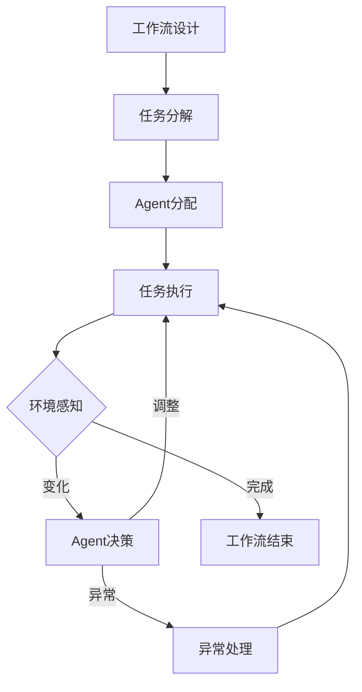
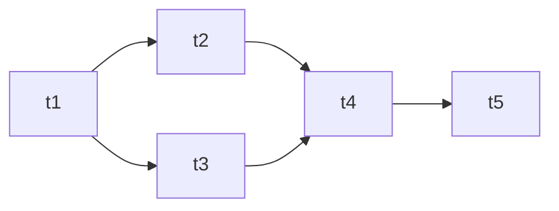

# AI人工智能代理工作流 AI Agent WorkFlow：在能源管理中的应用

## 1.背景介绍
### 1.1 能源管理的重要性
在当今世界,能源管理已成为一个至关重要的课题。随着全球人口的不断增长和工业化进程的加快,能源需求也在不断攀升。然而,化石燃料等传统能源的过度开采和使用,不仅加剧了环境污染和气候变化等问题,也使得能源供应面临巨大压力。因此,如何实现能源的高效利用和可持续发展,已成为各国政府和企业共同关注的焦点。
### 1.2 人工智能在能源管理中的应用前景
近年来,人工智能技术的飞速发展为能源管理带来了新的机遇。通过将人工智能算法与能源系统相结合,可以实现能源需求预测、能源调度优化、设备故障诊断等多个方面的智能化管理,从而大幅提升能源利用效率,降低能源成本。同时,人工智能还可以帮助实现分布式能源的优化配置和协同控制,促进可再生能源的大规模应用,为构建清洁低碳的能源体系提供有力支撑。
### 1.3 AI Agent工作流的概念
在人工智能领域,Agent指具备自主性、社会性、反应性、主动性等特征的智能实体,可以根据环境的变化做出相应决策和行为。而工作流则是对业务流程的抽象和建模,通过将复杂的业务过程分解为一系列可执行的任务,并明确任务之间的逻辑关系和数据流向,从而实现业务流程的自动化和优化。AI Agent工作流是将两者进行融合的产物,通过引入智能Agent对工作流进行优化决策和动态调整,使得工作流能够根据实时状态和环境变化做出自适应调整,从而提高系统的灵活性和鲁棒性。

## 2.核心概念与联系
### 2.1 Agent的概念与特征
- **自主性**：Agent具有自己的目标和决策能力,能够根据环境信息自主地采取行动。
- **社会性**：Agent之间可以通过通信和协作完成复杂任务。
- **反应性**：Agent能够感知环境的变化并及时做出反应。
- **主动性**：Agent不仅能被动地响应环境,还能主动地执行任务。
- **连续性**：Agent具有持续运行的能力,可以长时间执行任务而无需人工干预。
### 2.2 工作流的概念与特征
- **抽象性**：工作流是对业务流程的抽象,通过将复杂业务分解为一系列任务来简化描述。
- **结构化**：工作流中的任务之间存在明确的逻辑关系,如顺序、并行、选择等。
- **数据驱动**：工作流的执行依赖于数据在任务之间的流转。
- **自动化**：工作流可以自动执行,减少人工干预,提高效率。
### 2.3 AI Agent工作流
AI Agent工作流是将智能Agent技术引入工作流管理,通过Agent对工作流进行优化决策和动态调整,从而提高工作流的智能化水平。在AI Agent工作流中,Agent根据工作流执行过程中的实时状态和环境信息,利用智能算法对工作流进行分析和优化,动态调整任务的执行顺序、分配资源、处理异常等,使得工作流能够自适应地响应变化,提高系统的灵活性和鲁棒性。同时,多个Agent还可以协同工作,通过分工协作完成复杂的任务,进一步提升工作流的执行效率。



## 3.核心算法原理具体操作步骤
### 3.1 工作流建模
- 定义工作流的任务集合T={t1,t2,...,tn}
- 定义任务之间的依赖关系,构建有向无环图DAG
- 定义任务的属性,如执行时间、所需资源等
- 定义全局约束,如截止时间、预算等
### 3.2 任务调度优化
- 定义调度问题的决策变量,如任务开始时间、任务执行顺序等
- 定义优化目标,如最小化工期、最小化成本等
- 选择优化算法,如启发式算法、进化算法等
- 求解优化模型,得到最优调度方案
### 3.3 资源分配优化
- 定义系统资源R={r1,r2,...,rm}
- 定义资源的属性,如容量、可用时间等
- 定义任务对资源的需求矩阵Q
- 定义资源分配问题的约束条件,如资源容量限制等
- 选择优化算法,如匹配算法、启发式算法等
- 求解资源分配模型,得到最优资源分配方案
### 3.4 Agent协同优化
- 定义Agent集合A={a1,a2,...,ak}
- 定义Agent的行为策略集合S
- 定义Agent的效用函数U
- 构建Agent博弈模型,如纳什均衡、最优响应等
- 设计Agent的学习算法,如强化学习、对抗学习等
- 通过Agent间的博弈达到系统整体效用最大化

## 4.数学模型和公式详细讲解举例说明
### 4.1 工作流DAG模型
工作流可以用有向无环图DAG=(T,E)来表示,其中T为任务集合,E为任务之间的依赖关系集合。

假设某工作流包含5个任务,其DAG模型如下:



邻接矩阵表示为:
$$
M = \begin{bmatrix}
0 & 1 & 1 & 0 & 0\\
0 & 0 & 0 & 1 & 0\\
0 & 0 & 0 & 1 & 0\\
0 & 0 & 0 & 0 & 1\\
0 & 0 & 0 & 0 & 0
\end{bmatrix}
$$

### 4.2 任务调度优化模型
假设有n个任务,m台机器,令$x_{ij}$表示任务i是否在机器j上执行,$s_i$表示任务i的开始时间,目标是最小化总工期,则优化模型为:

$$
\begin{align}
\min \quad & \max_{1 \leq i \leq n} (s_i + \sum_{j=1}^m x_{ij} \cdot p_{ij}) \\
\text{s.t.} \quad & \sum_{j=1}^m x_{ij} = 1, \quad i=1,2,\ldots,n \\
& s_i + \sum_{j=1}^m x_{ij} \cdot p_{ij} \leq s_k, \quad \forall (i,k) \in E \\
& x_{ij} \in \{0,1\}, \quad s_i \geq 0
\end{align}
$$

其中,$p_{ij}$表示任务i在机器j上的执行时间。约束(2)确保每个任务只能在一台机器上执行,约束(3)确保任务之间的依赖关系。

### 4.3 资源分配优化模型
假设有n个任务,m种资源,令$y_{ir}$表示任务i对资源r的需求量,目标是最小化总成本,则优化模型为:

$$
\begin{align}
\min \quad & \sum_{r=1}^m c_r \cdot \max_{1 \leq i \leq n} y_{ir} \\
\text{s.t.} \quad & \sum_{i=1}^n y_{ir} \leq R_r, \quad r=1,2,\ldots,m \\
& y_{ir} \geq 0
\end{align}
$$

其中,$c_r$表示资源r的单位成本,$R_r$表示资源r的总量。约束(6)确保资源的使用量不超过总量。

## 5.项目实践：代码实例和详细解释说明
以下是使用Python实现工作流DAG模型和任务调度优化的示例代码:

```python
import networkx as nx
import matplotlib.pyplot as plt
from ortools.sat.python import cp_model

# 定义工作流DAG
G = nx.DiGraph()
G.add_nodes_from(['t1', 't2', 't3', 't4', 't5'])
G.add_edges_from([('t1', 't2'), ('t1', 't3'), ('t2', 't4'), ('t3', 't4'), ('t4', 't5')])

# 可视化DAG
pos = nx.spring_layout(G)
nx.draw(G, pos, with_labels=True, font_weight='bold', node_size=500, alpha=0.8)
labels = nx.get_edge_attributes(G, 'weight')
nx.draw_networkx_edge_labels(G, pos, edge_labels=labels)
plt.show()

# 定义任务执行时间
p = {'t1': [3, 2, 4], 't2': [2, 3, 3], 't3': [4, 2, 3], 't4': [3, 4, 2], 't5': [2, 3, 4]}

# 创建优化模型
model = cp_model.CpModel()

# 定义决策变量
n = len(G.nodes)
m = 3
x = {}
for i in range(n):
    for j in range(m):
        x[i, j] = model.NewBoolVar(f'x_{i}_{j}')
s = [model.NewIntVar(0, sum(max(p.values(), key=max)), f's_{i}') for i in range(n)]

# 添加约束
for i in range(n):
    model.AddExactlyOne(x[i, j] for j in range(m))
for edge in G.edges:
    i, k = list(G.nodes).index(edge[0]), list(G.nodes).index(edge[1])
    model.Add(s[i] + sum(x[i, j] * p[edge[0]][j] for j in range(m)) <= s[k])

# 定义目标函数
makespan = model.NewIntVar(0, sum(max(p.values(), key=max)), 'makespan')
model.AddMaxEquality(makespan, [s[i] + sum(x[i, j] * p[list(G.nodes)[i]][j] for j in range(m)) for i in range(n)])
model.Minimize(makespan)

# 求解模型
solver = cp_model.CpSolver()
status = solver.Solve(model)

# 输出结果
if status == cp_model.OPTIMAL:
    print(f'Optimal makespan: {solver.ObjectiveValue()}')
    for i in range(n):
        for j in range(m):
            if solver.BooleanValue(x[i, j]):
                print(f'Task {list(G.nodes)[i]} assigned to machine {j}')
    for i in range(n):
        print(f'Task {list(G.nodes)[i]} starts at time {solver.Value(s[i])}')
else:
    print('No optimal solution found.')
```

代码解释:

1. 首先使用NetworkX库定义工作流的DAG模型,并可视化DAG。
2. 定义每个任务在不同机器上的执行时间字典p。
3. 创建OR-Tools的CP-SAT优化模型。
4. 定义决策变量,包括任务分配变量x和任务开始时间变量s。
5. 添加约束,确保每个任务只分配到一台机器,并满足任务依赖关系。
6. 定义目标函数,即最小化总工期makespan。
7. 求解优化模型,并输出最优解。

## 6.实际应用场景
AI Agent工作流可以应用于能源管理的多个场景,例如:

- **智能电网调度**：通过AI Agent对电网中的发电、输电、配电等环节进行优化调度,平衡电力供需,提高电网运行效率和可靠性。
- **可再生能源预测与优化**：利用AI Agent对风电、光伏等可再生能源的出力进行智能预测,结合电力需求和储能设施优化能源配置,最大化可再生能源利用率。
- **建筑能耗优化**：使用AI Agent对建筑的暖通空调、照明等系统进行智能控制,根据环境条件和用户需求动态调节能源使用,实现建筑能效的提升。
- **工业能源管理**：在工业生产过程中,AI Agent可以优化生产计划和设备运行参数,降低能源消耗,提高生产效率。
- **电动汽车充电调度**：随着电动汽车的普及,AI Agent可以根据车辆电量、行驶计划、电网负荷等因素,对充电时间和地点进行智能调度,减少电网压力