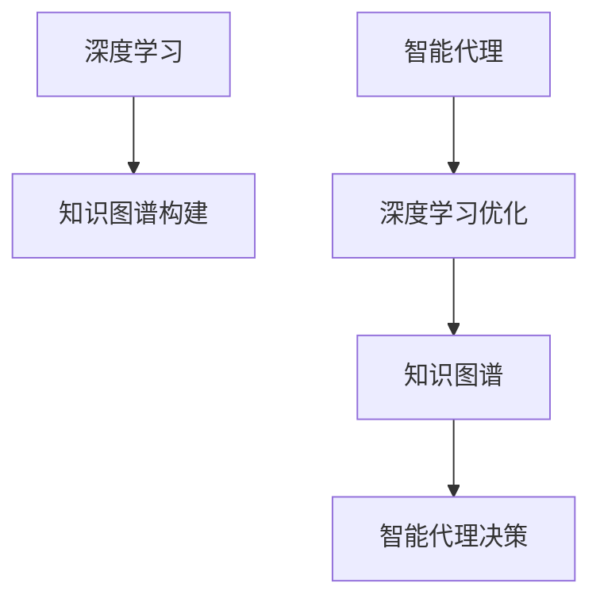

# AI人工智能深度学习算法：智能深度学习代理的知识图谱运用

## 1. 背景介绍
### 1.1 人工智能的发展历程
#### 1.1.1 早期人工智能
#### 1.1.2 专家系统时代
#### 1.1.3 机器学习与深度学习崛起

### 1.2 深度学习的兴起与应用
#### 1.2.1 深度学习的概念与特点
#### 1.2.2 深度学习在各领域的应用现状
#### 1.2.3 深度学习面临的挑战

### 1.3 知识图谱技术概述
#### 1.3.1 知识图谱的定义与结构
#### 1.3.2 知识图谱构建流程
#### 1.3.3 知识图谱在人工智能中的作用

## 2. 核心概念与联系
### 2.1 深度学习
#### 2.1.1 人工神经网络
#### 2.1.2 卷积神经网络（CNN）
#### 2.1.3 循环神经网络（RNN）

### 2.2 智能代理
#### 2.2.1 智能代理的定义
#### 2.2.2 智能代理的特点
#### 2.2.3 智能代理的应用场景

### 2.3 知识图谱
#### 2.3.1 本体与知识表示
#### 2.3.2 知识抽取与融合
#### 2.3.3 知识推理与应用

### 2.4 深度学习、智能代理与知识图谱的关系
#### 2.4.1 深度学习在知识图谱构建中的应用
#### 2.4.2 知识图谱增强智能代理的决策能力
#### 2.4.3 智能代理利用深度学习优化知识图谱



## 3. 核心算法原理具体操作步骤
### 3.1 知识图谱构建算法
#### 3.1.1 实体识别与链接
#### 3.1.2 关系抽取
#### 3.1.3 知识融合与消歧

### 3.2 基于知识图谱的智能代理决策算法
#### 3.2.1 知识表示学习
#### 3.2.2 基于图神经网络的推理
#### 3.2.3 强化学习与策略优化

### 3.3 智能代理优化知识图谱算法
#### 3.3.1 主动学习与知识补全
#### 3.3.2 知识演化与更新
#### 3.3.3 知识质量评估与修正

## 4. 数学模型和公式详细讲解举例说明
### 4.1 知识表示学习模型
#### 4.1.1 TransE模型
$$
f_r(h,t) = \|h+r-t\|
$$
其中，$h$、$r$、$t$分别表示头实体、关系和尾实体的嵌入向量。

#### 4.1.2 TransR模型
$$
f_r(h,t) = \|M_rh+r-M_rt\|
$$
其中，$M_r$是关系$r$对应的映射矩阵。

### 4.2 图神经网络模型
#### 4.2.1 图卷积网络（GCN）
$$
H^{(l+1)} = \sigma(\tilde{D}^{-\frac{1}{2}}\tilde{A}\tilde{D}^{-\frac{1}{2}}H^{(l)}W^{(l)})
$$
其中，$\tilde{A}=A+I$是加入自连接的邻接矩阵，$\tilde{D}$是$\tilde{A}$的度矩阵，$H^{(l)}$是第$l$层的节点特征矩阵，$W^{(l)}$是第$l$层的权重矩阵，$\sigma$是激活函数。

#### 4.2.2 图注意力网络（GAT）
$$
h_i^{(l+1)} = \sigma(\sum_{j\in\mathcal{N}_i}\alpha_{ij}^{(l)}W^{(l)}h_j^{(l)})
$$
其中，$h_i^{(l)}$是节点$i$在第$l$层的特征向量，$\mathcal{N}_i$是节点$i$的邻居节点集合，$\alpha_{ij}^{(l)}$是节点$i$与节点$j$之间的注意力权重。

### 4.3 强化学习模型
#### 4.3.1 Q-learning
$$
Q(s,a) \leftarrow Q(s,a) + \alpha[r + \gamma\max_{a'}Q(s',a') - Q(s,a)]
$$
其中，$Q(s,a)$是状态-动作值函数，$\alpha$是学习率，$\gamma$是折扣因子，$r$是奖励，$s'$是下一个状态。

#### 4.3.2 策略梯度（Policy Gradient）
$$
\theta \leftarrow \theta + \alpha\nabla_\theta\log\pi_\theta(a|s)v_t
$$
其中，$\theta$是策略网络的参数，$\pi_\theta(a|s)$是在状态$s$下选择动作$a$的概率，$v_t$是时间步$t$的回报。

## 5. 项目实践：代码实例和详细解释说明
### 5.1 知识图谱构建实例
```python
# 实体识别与链接
def entity_recognition_linking(text):
    # 使用命名实体识别模型识别文本中的实体
    entities = ner_model.recognize(text)
    # 使用实体链接模型将识别出的实体链接到知识库中的实体
    linked_entities = entity_linking_model.link(entities)
    return linked_entities

# 关系抽取
def relation_extraction(text, entities):
    # 使用关系抽取模型从文本中抽取实体之间的关系
    relations = relation_extraction_model.extract(text, entities)
    return relations

# 知识融合
def knowledge_fusion(entities, relations):
    # 将抽取出的实体和关系融合到现有知识图谱中
    fused_kg = knowledge_fusion_model.fuse(entities, relations)
    return fused_kg
```

### 5.2 基于知识图谱的智能代理决策实例
```python
# 知识表示学习
def knowledge_representation_learning(kg):
    # 使用TransE模型学习知识图谱中实体和关系的嵌入表示
    entity_embeddings, relation_embeddings = TransE.train(kg)
    return entity_embeddings, relation_embeddings

# 基于图神经网络的推理
def graph_neural_network_reasoning(kg, query):
    # 使用图卷积网络对知识图谱进行编码
    node_embeddings = GCN.encode(kg)
    # 使用注意力机制根据查询从知识图谱中推理出答案
    answer = attention_model.reason(query, node_embeddings)
    return answer

# 强化学习与策略优化
def reinforcement_learning_optimization(state, action_space):
    # 使用Q-learning算法学习最优策略
    q_values = Q_learning.train(state, action_space)
    # 根据学习到的Q值选择最优动作
    optimal_action = np.argmax(q_values)
    return optimal_action
```

### 5.3 智能代理优化知识图谱实例
```python
# 主动学习与知识补全
def active_learning_knowledge_completion(kg, unlabeled_data):
    # 使用主动学习策略选择最有价值的未标注数据
    selected_data = active_learning_model.select(unlabeled_data)
    # 对选择的数据进行标注，并将其补全到知识图谱中
    labeled_data = human_annotation(selected_data)
    completed_kg = knowledge_completion_model.complete(kg, labeled_data)
    return completed_kg

# 知识演化与更新
def knowledge_evolution_update(kg, new_data):
    # 使用知识演化模型检测知识图谱中的变化
    changes = knowledge_evolution_model.detect(kg, new_data)
    # 根据检测到的变化更新知识图谱
    updated_kg = knowledge_update_model.update(kg, changes)
    return updated_kg

# 知识质量评估与修正
def knowledge_quality_assessment_correction(kg):
    # 使用知识质量评估模型评估知识图谱的质量
    quality_scores = knowledge_quality_assessment_model.assess(kg)
    # 根据质量评估结果对知识图谱进行修正
    corrected_kg = knowledge_correction_model.correct(kg, quality_scores)
    return corrected_kg
```

## 6. 实际应用场景
### 6.1 智能问答系统
#### 6.1.1 基于知识图谱的问题理解与解析
#### 6.1.2 知识检索与推理
#### 6.1.3 自然语言生成与回复

### 6.2 个性化推荐系统
#### 6.2.1 用户画像构建
#### 6.2.2 基于知识图谱的推荐算法
#### 6.2.3 推荐结果解释与反馈

### 6.3 智能决策支持系统
#### 6.3.1 业务知识图谱构建
#### 6.3.2 决策规则挖掘与推理
#### 6.3.3 决策方案生成与优化

## 7. 工具和资源推荐
### 7.1 知识图谱构建工具
#### 7.1.1 Stanford CoreNLP
#### 7.1.2 OpenKE
#### 7.1.3 DeepDive

### 7.2 深度学习框架
#### 7.2.1 TensorFlow
#### 7.2.2 PyTorch
#### 7.2.3 Keras

### 7.3 开放知识图谱资源
#### 7.3.1 Wikidata
#### 7.3.2 Freebase
#### 7.3.3 ConceptNet

## 8. 总结：未来发展趋势与挑战
### 8.1 知识图谱与深度学习的进一步融合
#### 8.1.1 端到端的知识图谱构建与应用
#### 8.1.2 基于深度学习的知识表示与推理

### 8.2 智能代理的自主学习与进化
#### 8.2.1 持续学习与适应能力
#### 8.2.2 多智能体协作与知识共享

### 8.3 可解释性与可信性
#### 8.3.1 深度学习模型的可解释性
#### 8.3.2 知识图谱推理过程的可解释性
#### 8.3.3 智能代理决策的可信性与透明度

### 8.4 知识安全与隐私保护
#### 8.4.1 知识图谱的访问控制与权限管理
#### 8.4.2 隐私保护数据挖掘技术
#### 8.4.3 联邦学习与安全多方计算

## 9. 附录：常见问题与解答
### 9.1 知识图谱构建过程中的数据质量问题如何解决？
数据质量问题可以通过以下方法解决：
1. 数据清洗：对原始数据进行去重、去噪、格式转换等预处理操作，提高数据质量。
2. 数据融合：利用多源异构数据进行融合，互相补充和验证，提高知识的准确性和完整性。
3. 人工审核：对自动构建的知识图谱进行人工抽查和审核，发现并纠正错误。
4. 质量评估与修正：使用知识质量评估模型自动评估知识图谱的质量，并根据评估结果进行targeted修正。

### 9.2 如何解决深度学习模型的可解释性问题？
深度学习模型的可解释性问题可以通过以下方法解决：
1. 注意力机制：在模型中引入注意力机制，使模型能够关注输入数据的重要部分，提高模型的可解释性。
2. 知识蒸馏：使用知识蒸馏技术将复杂的深度学习模型转化为简单的、可解释的模型，同时保持原有的性能。
3. 可视化技术：使用可视化技术直观地展示深度学习模型的内部工作机制，如特征图、注意力权重等，帮助理解模型的决策过程。
4. 基于规则的解释：将深度学习模型的决策过程转化为一系列可解释的规则，提供决策依据和解释。

### 9.3 知识图谱如何应对知识的动态变化？
知识图谱可以通过以下方法应对知识的动态变化：
1. 增量更新：定期从外部数据源获取新的知识，并将其增量式地融合到现有知识图谱中，保持知识图谱与实际知识的同步。
2. 知识演化建模：使用知识演化模型刻画知识随时间的变化规律，预测知识图谱的未来状态，提前做好应对准备。
3. 版本管理：对知识图谱的不同版本进行管理，记录知识的变更历史，方便追溯和比较。
4. 实时更新：