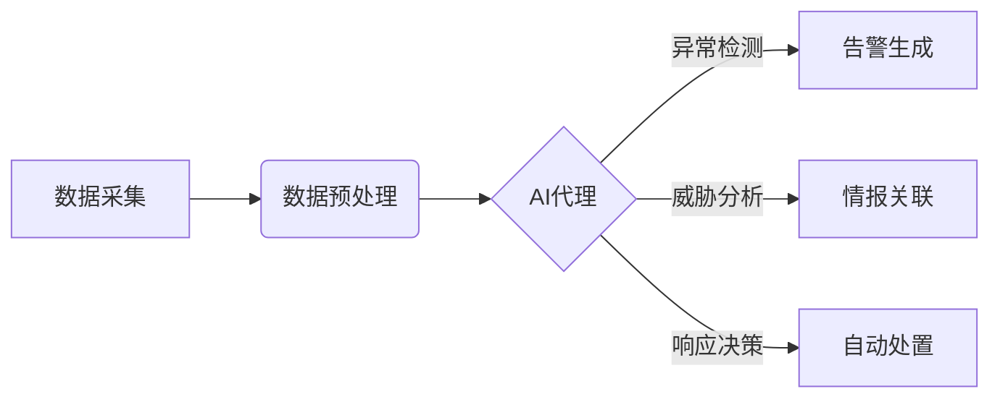
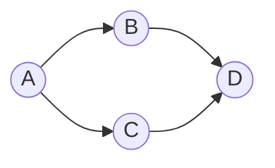

# AI代理在网络安全中的工作流及应用实践

## 1.背景介绍
### 1.1 网络安全面临的挑战
#### 1.1.1 网络攻击手段不断升级
#### 1.1.2 安全事件响应效率低下
#### 1.1.3 安全人才短缺
### 1.2 AI技术的发展现状
#### 1.2.1 机器学习算法不断突破
#### 1.2.2 深度学习模型性能优异
#### 1.2.3 AI芯片加速计算能力
### 1.3 AI赋能网络安全的必要性
#### 1.3.1 应对新型网络威胁
#### 1.3.2 提高安全分析效率
#### 1.3.3 弥补人力不足

## 2.核心概念与联系
### 2.1 AI代理的定义
AI代理是一种基于人工智能技术，能够自主执行特定任务的智能体。在网络安全领域，AI代理通过机器学习算法，持续学习网络环境和攻防对抗知识，从而自动化地执行威胁检测、事件分析、响应处置等安全任务。
### 2.2 AI代理与传统安全系统的区别
传统的网络安全系统主要依靠预先定义的规则和特征库来检测已知威胁。而AI代理具备持续学习能力，可以发现未知威胁，检测零日漏洞。此外，AI代理能够实时分析海量数据，及时响应安全事件，大幅提升处理效率。
### 2.3 AI代理在网络安全工作流中的位置

如上图所示，AI代理处于网络安全工作流的核心位置。首先从各类数据源采集原始数据，并进行清洗、特征提取等预处理。然后AI代理对数据进行异常检测、关联分析，生成告警事件和威胁情报。最后AI代理根据分析结果，选择最佳的响应策略，触发自动化处置动作。

## 3.核心算法原理具体操作步骤
### 3.1 异常检测算法
异常检测是AI代理的基础能力之一。常见的异常检测算法包括：
#### 3.1.1 统计学方法
- 步骤1：计算样本的统计特征，如均值、方差、分位数等
- 步骤2：设定异常阈值，超出阈值范围的视为异常
- 步骤3：在新数据上应用阈值规则，实现异常判别
#### 3.1.2 聚类方法
- 步骤1：使用聚类算法对样本数据进行聚类，如K-means、DBSCAN等
- 步骤2：计算每个数据点到其所属簇中心的距离
- 步骤3：设定距离阈值，超出阈值的点视为异常
#### 3.1.3 孤立森林方法
- 步骤1：从样本中随机选择特征子集，构建多棵孤立树
- 步骤2：在孤立树中递归地划分数据，直到每个叶子节点只有一个实例
- 步骤3：对新数据，计算其在每棵树上的平均深度，平均深度越小，异常程度越高
### 3.2 威胁情报关联算法
为了全面刻画网络威胁，需要将多源异构情报进行关联。常见的情报关联方法有：
#### 3.2.1 规则关联
- 步骤1：人工定义情报关联规则，如相同IP、相同域名等
- 步骤2：使用规则对情报进行匹配、过滤、合并，发现关联情报
#### 3.2.2 图关联
- 步骤1：将情报要素如IP、域名、文件哈希等抽象为图的节点
- 步骤2：根据情报间的内在联系构建节点间的边，形成情报关联图
- 步骤3：使用图算法如社区发现、最短路径等，挖掘复杂关联
#### 3.2.3 因果关联
- 步骤1：根据情报的时序关系，构建有向无环因果图
- 步骤2：使用因果推理算法，如贝叶斯网络、马尔可夫链等
- 步骤3：推断情报间的因果依赖，揭示攻击链各环节的关联
### 3.3 安全策略决策算法
面对复杂多变的安全态势，AI代理需要实时选择最优的防御策略。典型的策略决策算法包括：
#### 3.3.1 强化学习
- 步骤1：定义安全状态空间、行动空间和奖励函数
- 步骤2：使用Q-learning、SARSA等算法，通过不断试错来学习最优策略
- 步骤3：将学到的策略应用到实际的安全管控中
#### 3.3.2 博弈论
- 步骤1：将攻防对抗抽象为一个零和博弈问题
- 步骤2：使用纳什均衡、minimax等博弈算法，求解均衡策略
- 步骤3：根据环境变化动态调整策略，保持稳定的均衡状态
#### 3.3.3 启发式搜索
- 步骤1：定义策略的搜索空间和启发式评估函数
- 步骤2：使用A*搜索、遗传算法等启发式搜索算法，高效探索策略空间
- 步骤3：选取评估值最优的策略，指导实际的安全运维

## 4.数学模型和公式详细讲解举例说明
### 4.1 异常检测的统计学模型
假设样本数据服从高斯分布，其概率密度函数为：
$$
f(x)=\frac{1}{\sqrt{2\pi}\sigma}\exp\left(-\frac{(x-\mu)^2}{2\sigma^2}\right)
$$
其中，$\mu$ 为均值，$\sigma$ 为标准差。给定显著性水平 $\alpha$，可以计算异常阈值 $x_{\alpha}$：
$$
\int_{-\infty}^{x_{\alpha}} f(x) dx = 1-\alpha
$$
例如，设置 $\alpha=0.05$，对于标准正态分布，查表可知 $x_{0.05}=1.96$。因此，可得异常判别公式：
$$
|x-\mu| > 1.96\sigma \Rightarrow x \text{为异常值}
$$
### 4.2 聚类异常检测的数学模型
假设使用K-means聚类，其目标是最小化平方误差：
$$
J=\sum_{i=1}^k \sum_{x\in C_i} ||x-\mu_i||^2
$$
其中，$k$ 为簇的个数，$C_i$ 为第 $i$ 个簇，$\mu_i$ 为第 $i$ 个簇的中心。聚类结束后，可计算每个数据点 $x$ 到其所属簇中心 $\mu_i$ 的马氏距离：
$$
d(x,\mu_i) = \sqrt{(x-\mu_i)^T\Sigma^{-1}(x-\mu_i)}
$$
其中，$\Sigma$ 为协方差矩阵。设置距离阈值 $\epsilon$，则异常判别公式为：
$$
d(x,\mu_i) > \epsilon \Rightarrow x \text{为异常值}
$$
### 4.3 因果关联的贝叶斯网络模型
贝叶斯网络使用有向无环图表示变量间的因果依赖关系，每个节点表示一个随机变量，每条有向边表示一个条件概率。例如，下图表示一个简单的贝叶斯网络：

其联合概率分布可分解为：
$$
P(A,B,C,D) = P(A)P(B|A)P(C|A)P(D|B,C)
$$
假设已知变量 $A$ 发生，推断变量 $D$ 发生的概率：
$$
P(D|A) = \sum_{B,C} P(D|B,C)P(B|A)P(C|A)
$$
通过因果推理，可以量化分析情报事件之间的影响关系，发现关键的因果链路。

## 5.项目实践：代码实例和详细解释说明
下面以异常检测中的孤立森林算法为例，给出Python代码实现：
```python
from sklearn.ensemble import IsolationForest

# 训练孤立森林模型
model = IsolationForest(n_estimators=100, max_samples=256, contamination=0.03)
model.fit(train_data)

# 异常值检测
anomaly_scores = model.decision_function(test_data)
anomaly_labels = model.predict(test_data)
```
代码解释：
- 导入`IsolationForest`类，用于构建孤立森林模型
- 设置模型参数：`n_estimators`为树的数量，`max_samples`为每棵树的样本数，`contamination`为异常值比例
- 调用`fit`方法训练模型，传入训练数据`train_data`
- 调用`decision_function`方法计算异常分数，分数越小表示异常程度越高
- 调用`predict`方法预测异常标签，-1表示异常，1表示正常

在实际项目中，可以将孤立森林等异常检测算法封装为可复用的模块，与数据接入、存储、可视化等组件集成，形成完整的AI代理异常检测引擎。通过持续训练和优化模型，不断提升引擎的检测效果。

## 6.实际应用场景
AI代理技术可广泛应用于以下网络安全场景：
### 6.1 安全运维
- 智能化资产梳理与脆弱性管理
- 实时监控与异常行为检测
- 自动化安全配置核查与合规审计
### 6.2 威胁情报
- 多源异构情报的采集与融合
- 情报的关联分析与溯源
- 威胁知识图谱构建
### 6.3 安全对抗
- 对手模拟与攻防演练
- 蜜罐诱捕与威胁反制
- 动态防御决策与资源调度
### 6.4 应急响应
- 告警事件的自动化处置
- 根因分析与影响评估
- 应急预案智能编排与自适应执行

在这些场景中，AI代理作为人类安全专家的得力助手，7x24小时不间断工作，极大地提升了网络安全的智能化水平。当前，国内外众多安全企业、金融机构、政企单位等都在积极开展AI代理技术的研究与应用，推动网络安全进入智能化时代。

## 7.工具和资源推荐
为了方便读者学习和实践AI代理技术，推荐以下相关工具和资源：
### 7.1 机器学习平台
- TensorFlow：由Google开源的端到端机器学习平台
- PyTorch：由Facebook开源的深度学习框架
- Scikit-Learn：Python机器学习工具集
### 7.2 威胁情报平台
- MISP：开源威胁情报共享平台
- OpenCTI：网络威胁情报领域知识库
- OTX AlienVault：聚合多源威胁情报的开放平台
### 7.3 蜜罐系统
- Dionaea：模拟多种服务的低交互蜜罐
- Cowrie：模拟SSH和Telnet的中交互蜜罐
- MHN：现代蜜网管理系统
### 7.4 开源安全项目
- Wazuh：开源主机入侵检测系统HIDS
- Suricata：开源入侵检测系统IDS
- Zeek：网络安全监控平台
### 7.5 学习资源
- 《Web安全深度学习实战》
- 《人工智能安全》
- 《网络安全数据科学》

以上资源可供读者深入学习AI代理相关理论知识，并动手实践应用。

## 8.总结：未来发展趋势与挑战
### 8.1 算法模型的持续演进
未来AI代理所依赖的机器学习算法还将不断突破，从传统的浅层学习，到当前的深度学习，再到更高级的迁移学习、元学习、终身学习等。模型结构也将从MLP、CNN、RNN等发展到图神经网络、胶囊网络等。不断演进的算法模型将赋予AI代理更强大的学习能力。
### 8.2 知识的自动化积累与复用
AI系统的核心在于知识。未来AI代理将通过持续的学习