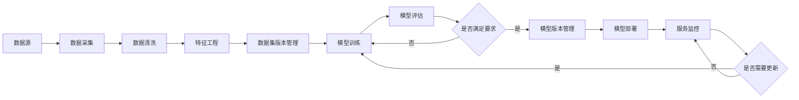

# AI系统DevOps原理与代码实战案例讲解

## 1. 背景介绍
### 1.1 AI系统开发运维的挑战
#### 1.1.1 模型开发与部署割裂
#### 1.1.2 缺乏标准化流程和工具
#### 1.1.3 系统维护和更新困难
### 1.2 DevOps在AI系统中的应用
#### 1.2.1 DevOps的核心理念
#### 1.2.2 DevOps在AI系统中的优势
#### 1.2.3 AI系统DevOps的发展现状

## 2. 核心概念与联系
### 2.1 AI系统的组成
#### 2.1.1 数据处理与特征工程
#### 2.1.2 模型训练与评估
#### 2.1.3 模型部署与服务
### 2.2 DevOps的关键实践
#### 2.2.1 持续集成(CI)
#### 2.2.2 持续交付(CD)
#### 2.2.3 基础设施即代码(IaC)
### 2.3 AI系统DevOps的核心要素
#### 2.3.1 数据版本控制
#### 2.3.2 模型版本控制
#### 2.3.3 自动化部署与监控

## 3. 核心算法原理具体操作步骤
### 3.1 数据处理流水线
#### 3.1.1 数据采集与存储
#### 3.1.2 数据清洗与转换
#### 3.1.3 特征工程与选择
### 3.2 模型训练流水线
#### 3.2.1 模型结构设计
#### 3.2.2 超参数调优
#### 3.2.3 模型评估与选择
### 3.3 模型部署流水线
#### 3.3.1 模型封装与优化
#### 3.3.2 服务编排与部署
#### 3.3.3 模型监控与更新

## 4. 数学模型和公式详细讲解举例说明
### 4.1 数据处理中的数学模型
#### 4.1.1 数据归一化与标准化
#### 4.1.2 PCA与特征降维
#### 4.1.3 采样与数据增强
### 4.2 模型训练中的数学模型
#### 4.2.1 损失函数与优化算法
#### 4.2.2 正则化与早停法
#### 4.2.3 交叉验证与模型集成
### 4.3 模型评估中的数学模型
#### 4.3.1 混淆矩阵与评估指标
#### 4.3.2 ROC曲线与AUC
#### 4.3.3 置信区间与假设检验

## 5. 项目实践：代码实例和详细解释说明
### 5.1 基于Docker的AI系统部署
#### 5.1.1 构建模型服务镜像
#### 5.1.2 编排多个服务容器
#### 5.1.3 部署与运维管理
### 5.2 基于Kubernetes的AI系统编排
#### 5.2.1 创建模型服务部署
#### 5.2.2 配置服务发现与负载均衡
#### 5.2.3 实现自动扩缩容与故障恢复
### 5.3 基于Jenkins的CI/CD流水线
#### 5.3.1 配置代码仓库与构建触发器
#### 5.3.2 定义构建与测试任务
#### 5.3.3 实现自动化部署与回滚

## 6. 实际应用场景
### 6.1 智能客服系统DevOps实践
#### 6.1.1 客服对话数据处理流水线
#### 6.1.2 意图识别与槽位填充模型训练
#### 6.1.3 对话管理与答案生成服务部署
### 6.2 智能推荐系统DevOps实践
#### 6.2.1 用户行为数据采集与处理
#### 6.2.2 协同过滤与深度学习推荐模型训练
#### 6.2.3 推荐服务部署与在线学习更新
### 6.3 工业质检系统DevOps实践
#### 6.3.1 缺陷图像数据采集与标注
#### 6.3.2 缺陷检测与分类模型训练
#### 6.3.3 质检服务部署与边缘计算优化

## 7. 工具和资源推荐
### 7.1 数据处理工具
#### 7.1.1 Pandas与Numpy
#### 7.1.2 Spark与Flink
#### 7.1.3 Kafka与Pulsar
### 7.2 模型开发工具
#### 7.2.1 TensorFlow与Keras
#### 7.2.2 PyTorch与FastAI
#### 7.2.3 AutoML工具
### 7.3 DevOps平台与工具
#### 7.3.1 Kubeflow与MLflow
#### 7.3.2 Jenkins与GitLab CI
#### 7.3.3 Ansible与Terraform

## 8. 总结：未来发展趋势与挑战
### 8.1 AIOps的兴起
#### 8.1.1 智能运维的需求
#### 8.1.2 AIOps的关键技术
#### 8.1.3 AIOps平台与架构
### 8.2 云原生AI平台发展
#### 8.2.1 Serverless模型开发
#### 8.2.2 AI即服务(AIaaS)
#### 8.2.3 联邦学习与隐私保护
### 8.3 AI系统DevOps面临的挑战
#### 8.3.1 AI模型的可解释性
#### 8.3.2 AI系统的安全与鲁棒性
#### 8.3.3 跨平台与框架的兼容性

## 9. 附录：常见问题与解答
### 9.1 如何实现AI系统的数据版本控制？
### 9.2 如何进行AI模型的自动化测试？
### 9.3 如何监控AI系统的性能与异常？
### 9.4 如何实现AI模型的增量更新与回滚？
### 9.5 如何保障AI系统的数据安全与隐私？

以上是AI系统DevOps的核心流程图，主要包括数据处理、模型训练、模型部署和监控等关键环节。通过引入数据和模型的版本管理，实现数据和模型的可追溯性和再现性。同时，通过持续集成和持续部署，实现模型开发和部署的自动化，提高AI系统的迭代效率和质量。

在数据处理阶段，我们需要从各种数据源采集原始数据，然后进行数据清洗和特征工程，生成适合模型训练的特征数据集。为了便于数据的管理和复用，我们通常会对不同版本的数据集进行版本控制和管理。

在模型训练阶段，我们基于特征数据集，使用合适的机器学习或深度学习算法，训练出性能优异的模型。模型训练通常需要进行多轮迭代和调优，不断评估模型性能，直到满足预定的要求为止。我们会对不同版本的模型进行管理，记录模型的超参数、训练数据集版本等元信息，确保模型的可复现性。

模型训练完成后，我们需要将模型部署到生产环境中，提供在线预测服务。通过容器化技术如Docker和Kubernetes，我们可以实现模型服务的快速部署、弹性伸缩和自动恢复等能力。同时，我们会对模型服务进行监控，收集预测请求、延迟、资源利用率等各种指标，实时评估模型的性能表现。

当监控发现模型性能下降或者需要迭代更新时，我们就会触发新一轮的模型训练和部署流程。通过这种持续不断的迭代优化，我们可以保持AI系统的高性能和高可用性，同时也能快速响应业务变化和用户需求。

接下来，我们将详细讲解AI系统DevOps中的一些关键技术和实践。

在数据处理阶段，我们经常需要对数据进行归一化或标准化，消除不同特征之间的量纲差异，提高模型的训练效率和性能。常用的归一化方法包括最大最小值归一化和均值方差归一化等。例如，对于特征 $x$，最大最小值归一化的公式为：

$$x' = \frac{x - min(x)}{max(x) - min(x)}$$

其中，$min(x)$ 和 $max(x)$ 分别表示特征 $x$ 的最小值和最大值。归一化后的特征 $x'$ 的取值范围为 $[0, 1]$。

除了归一化之外，我们还经常使用 PCA 等方法进行特征降维，从高维特征空间中提取出最重要的几个特征，减少模型的复杂度和训练时间。PCA 的核心思想是将原始特征空间通过线性变换映射到一个新的正交空间，使得新空间中的特征相互独立且方差最大。在 PCA 降维后，我们可以选取前 $k$ 个主成分作为新的特征，其累计方差贡献率通常要达到 80% 以上。

在模型训练阶段，损失函数和优化算法的选择至关重要。对于分类任务，我们通常使用交叉熵损失函数：

$$L = -\frac{1}{N}\sum_{i=1}^N\sum_{j=1}^C y_{ij} \log(p_{ij})$$

其中，$N$ 表示样本数量，$C$ 表示类别数量，$y_{ij}$ 表示第 $i$ 个样本是否属于第 $j$ 个类别，$p_{ij}$ 表示模型预测第 $i$ 个样本属于第 $j$ 个类别的概率。

在优化算法方面，梯度下降类算法如 SGD、Adam 等被广泛使用。以 SGD 为例，其参数更新公式为：

$$w_{t+1} = w_t - \eta \nabla_w L(w_t)$$

其中，$w_t$ 表示第 $t$ 次迭代的模型参数，$\eta$ 表示学习率，$\nabla_w L(w_t)$ 表示损失函数 $L$ 在 $w_t$ 处的梯度。

为了防止模型过拟合，我们通常会使用正则化技术，如 L1 正则化和 L2 正则化，在损失函数中加入参数的惩罚项，限制模型的复杂度。例如，L2 正则化的损失函数为：

$$L = L_0 + \lambda \sum_{i=1}^N w_i^2$$

其中，$L_0$ 表示原始的损失函数，$\lambda$ 表示正则化系数，$w_i$ 表示模型的第 $i$ 个参数。

除了正则化，早停法也是一种常用的防止过拟合的策略。早停法的基本思路是在每个 epoch 结束时评估模型在验证集上的性能，当验证集上的性能不再提升时，就停止训练，返回性能最优的模型。早停法可以有效地控制模型的训练时间，避免模型过度拟合训练数据。

在模型评估阶段，我们通常会使用留出法或交叉验证等方法，将数据集划分为训练集、验证集和测试集，分别用于模型训练、超参数调优和性能评估。对于分类任务，我们经常使用准确率、精确率、召回率和 F1 值等指标来评估模型性能。例如，精确率和召回率的计算公式为：

$$Precision = \frac{TP}{TP + FP}$$

$$Recall = \frac{TP}{TP + FN}$$

其中，$TP$ 表示真正例的数量，$FP$ 表示假正例的数量，$FN$ 表示假负例的数量。

除了这些常用指标，我们还可以绘制 ROC 曲线和 PR 曲线，直观地展示模型在不同阈值下的性能表现。ROC 曲线的横轴为假正例率(FPR)，纵轴为真正例率(TPR)；PR 曲线的横轴为召回率，纵轴为精确率。曲线下的面积 AUC 可以用来评估模型的整体性能，AUC 越大，表示模型的性能越好。

在模型部署阶段，我们通常会使用 Docker 等容器化技术，将模型服务封装成镜像，方便快速部署和迁移。例如，我们可以编写如下的 Dockerfile，构建