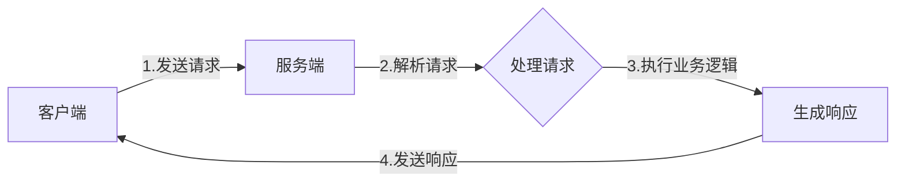

# AI系统gRPC原理与代码实战案例讲解

## 1. 背景介绍
### 1.1 gRPC的发展历程
### 1.2 gRPC在AI系统中的重要性
### 1.3 本文的主要内容与目标

## 2. 核心概念与联系
### 2.1 gRPC的定义与特点
#### 2.1.1 基于HTTP/2协议
#### 2.1.2 使用Protocol Buffers作为接口定义语言
#### 2.1.3 支持多种编程语言
### 2.2 gRPC与RESTful API的对比
#### 2.2.1 通信协议与数据格式
#### 2.2.2 性能与效率
#### 2.2.3 适用场景
### 2.3 gRPC在AI系统架构中的位置
#### 2.3.1 前后端通信
#### 2.3.2 微服务间通信
#### 2.3.3 与其他组件的交互

## 3. 核心算法原理具体操作步骤
### 3.1 gRPC的工作原理
#### 3.1.1 客户端与服务端的交互流程
#### 3.1.2 请求与响应的序列化与反序列化
#### 3.1.3 数据传输与流控制
### 3.2 Protocol Buffers的使用
#### 3.2.1 定义消息类型与服务接口
#### 3.2.2 编译生成不同语言的代码
#### 3.2.3 在客户端与服务端中使用生成的代码
### 3.3 gRPC的四种通信模式
#### 3.3.1 一元RPC（Unary RPC）
#### 3.3.2 服务端流式RPC（Server streaming RPC）
#### 3.3.3 客户端流式RPC（Client streaming RPC）
#### 3.3.4 双向流式RPC（Bidirectional streaming RPC）

## 4. 数学模型和公式详细讲解举例说明
### 4.1 gRPC的性能模型
#### 4.1.1 延迟与吞吐量的计算
#### 4.1.2 影响性能的因素分析
### 4.2 负载均衡算法
#### 4.2.1 Round Robin算法
#### 4.2.2 Least Connection算法
#### 4.2.3 Random算法
### 4.3 流控制算法
#### 4.3.1 滑动窗口算法
#### 4.3.2 令牌桶算法
#### 4.3.3 漏桶算法

## 5. 项目实践：代码实例和详细解释说明
### 5.1 环境准备与工具安装
#### 5.1.1 安装gRPC与Protocol Buffers
#### 5.1.2 选择合适的编程语言与IDE
### 5.2 实现一个简单的gRPC服务
#### 5.2.1 定义Protocol Buffers消息与服务
#### 5.2.2 生成客户端与服务端代码
#### 5.2.3 实现服务端业务逻辑
#### 5.2.4 编写客户端调用代码
#### 5.2.5 运行与测试
### 5.3 实现一个AI系统的gRPC服务
#### 5.3.1 设计AI系统的接口与数据结构
#### 5.3.2 定义Protocol Buffers消息与服务
#### 5.3.3 实现AI系统的服务端
#### 5.3.4 实现调用AI服务的客户端
#### 5.3.5 集成到完整的AI系统中
### 5.4 gRPC的安全与认证
#### 5.4.1 使用SSL/TLS加密通信
#### 5.4.2 基于证书的身份认证
#### 5.4.3 使用OAuth 2.0进行授权

## 6. 实际应用场景
### 6.1 微服务架构中的服务间通信
### 6.2 移动应用的后端API接口
### 6.3 分布式系统中的RPC调用
### 6.4 与机器学习平台的交互
### 6.5 物联网设备的通信协议

## 7. 工具和资源推荐
### 7.1 gRPC官方文档与示例代码
### 7.2 常用的gRPC开发框架与库
### 7.3 Protocol Buffers的编辑器与插件
### 7.4 gRPC的性能测试与调优工具
### 7.5 相关的社区与学习资源

## 8. 总结：未来发展趋势与挑战
### 8.1 gRPC在5G时代的应用前景
### 8.2 gRPC与服务网格的结合
### 8.3 gRPC在AI领域的发展机遇
### 8.4 gRPC面临的挑战与改进方向

## 9. 附录：常见问题与解答
### 9.1 gRPC的兼容性问题
### 9.2 gRPC的性能优化技巧
### 9.3 gRPC的错误处理与调试方法
### 9.4 gRPC在不同语言间的互操作性
### 9.5 gRPC的学习路线与资源推荐



gRPC是一种高性能、开源的通用RPC框架,由Google开发并于2015年开源。它基于HTTP/2协议,使用Protocol Buffers作为接口定义语言和序列化工具,支持多种编程语言,可以高效地实现服务间的通信。

在AI系统中,gRPC通常用于以下场景:

1. 前后端通信:将AI算法部署在服务端,通过gRPC接口提供给前端应用调用。
2. 微服务间通信:将AI系统拆分为多个微服务,通过gRPC进行服务间的高效通信。
3. 与其他组件交互:AI系统通过gRPC与其他系统组件(如数据库、消息队列等)进行交互。

相比传统的RESTful API,gRPC有以下优势:

1. 使用HTTP/2协议,支持双向流、头部压缩等特性,减少通信延迟。
2. 使用Protocol Buffers定义接口和数据结构,编解码效率高,数据包更小。
3. 支持多种语言,方便不同语言编写的服务互相调用。
4. 内置丰富的功能,如负载均衡、身份验证、流控制等。

下面通过一个简单的例子来说明gRPC的使用。首先定义一个服务接口和请求响应消息:

```protobuf
syntax = "proto3";

service Greeter {
  rpc SayHello (HelloRequest) returns (HelloReply) {}
}

message HelloRequest {
  string name = 1;
}

message HelloReply {
  string message = 1;
}
```

然后使用protoc工具生成不同语言的代码,例如生成Python代码:

```bash
python -m grpc_tools.protoc -I. --python_out=. --grpc_python_out=. hello.proto
```

接着实现服务端的业务逻辑:

```python
class Greeter(hello_pb2_grpc.GreeterServicer):
    def SayHello(self, request, context):
        return hello_pb2.HelloReply(message=f'Hello, {request.name}!')
```

最后编写客户端代码调用服务:

```python
with grpc.insecure_channel('localhost:50051') as channel:
    stub = hello_pb2_grpc.GreeterStub(channel)
    response = stub.SayHello(hello_pb2.HelloRequest(name='World'))
    print(response.message)
```

这个简单的例子展示了gRPC的基本用法,在实际的AI系统中,还需要考虑更多的因素,如:

1. 如何设计合理的接口,既满足功能需求,又易于使用和维护。
2. 如何处理大量数据的传输,例如传输模型参数、输入数据等。
3. 如何保证通信的安全性,防止敏感数据泄露和未授权访问。
4. 如何优化gRPC的性能,提高并发处理能力和响应速度。

gRPC的数学模型主要体现在以下几个方面:

1. 性能模型:根据延迟和吞吐量等指标,评估gRPC的性能表现。例如,单次请求的延迟可以用以下公式表示:

$latency = t_s + t_n + t_r$

其中,$t_s$是请求的序列化时间,$t_n$是网络传输时间,$t_r$是响应的反序列化时间。吞吐量则可以用以下公式估算:

$throughput = \frac{n}{t}$

其中,$n$是完成的请求数,$t$是总耗时。影响性能的因素包括网络状况、数据大小、并发请求数等。

2. 负载均衡算法:gRPC内置了多种负载均衡算法,用于将请求分发到多个服务实例。例如,Round Robin算法按照循环顺序依次选择实例:

$instance = i \bmod n$

其中,$i$是第$i$个请求,$n$是实例数。Least Connection算法选择当前连接数最少的实例,Random算法则随机选择一个实例。

3. 流控制算法:为了防止发送方速度过快导致接收方缓冲区溢出,gRPC使用流控制算法动态调整发送速率。常见的算法有:
   - 滑动窗口算法:根据接收方的确认情况,动态调整发送窗口的大小。
   - 令牌桶算法:以恒定速率生成令牌,根据令牌数量决定是否发送数据。
   - 漏桶算法:以恒定速率消耗令牌,超过令牌数量的数据被丢弃。

在实际项目中,可以基于gRPC构建AI系统的服务接口。以下是一个机器学习服务的示例:

```protobuf
service Predictor {
  rpc Predict (PredictRequest) returns (PredictResponse) {}
}

message PredictRequest {
  repeated float features = 1;
}

message PredictResponse {
  repeated float probabilities = 1;
}
```

服务端加载训练好的模型,实现预测逻辑:

```python
class Predictor(predictor_pb2_grpc.PredictorServicer):
    def __init__(self):
        self.model = load_model()

    def Predict(self, request, context):
        features = np.array(request.features)
        probabilities = self.model.predict_proba(features)
        return predictor_pb2.PredictResponse(probabilities=probabilities[0])
```

客户端调用预测服务:

```python
with grpc.insecure_channel('localhost:50051') as channel:
    stub = predictor_pb2_grpc.PredictorStub(channel)
    response = stub.Predict(predictor_pb2.PredictRequest(features=[5.1, 3.5, 1.4, 0.2]))
    print(response.probabilities)
```

在实际应用中,gRPC广泛用于构建微服务架构、开发移动应用后端、实现分布式系统等。它与机器学习平台的结合也越来越紧密,例如:

1. TensorFlow Serving:使用gRPC将训练好的模型部署为在线预测服务。
2. Seldon Core:使用gRPC实现机器学习模型的部署、管理和监控。
3. NVIDIA Triton Inference Server:使用gRPC提供GPU加速的模型推理服务。

未来,gRPC有望在以下方面取得更大的发展:

1. 与5G网络的结合,实现超低时延、高可靠的服务通信。
2. 与服务网格(如Istio)的集成,提供更智能的服务发现、流量管理等功能。
3. 在AI领域的进一步应用,实现模型的在线学习、联邦学习等新功能。

当然,gRPC的发展也面临一些挑战,例如:

1. 提高与传统RESTful API的兼容性,方便现有系统的迁移。
2. 优化序列化协议,在保证性能的同时支持更多数据类型。
3. 改进工具链,提供更完善的测试、调试、监控等功能。

总之,gRPC是一项成熟而又充满活力的技术,特别是在AI系统开发中大放异彩。掌握gRPC的原理和实践,对于软件工程师和数据科学家来说都是一项重要的技能。

作者：禅与计算机程序设计艺术 / Zen and the Art of Computer Programming