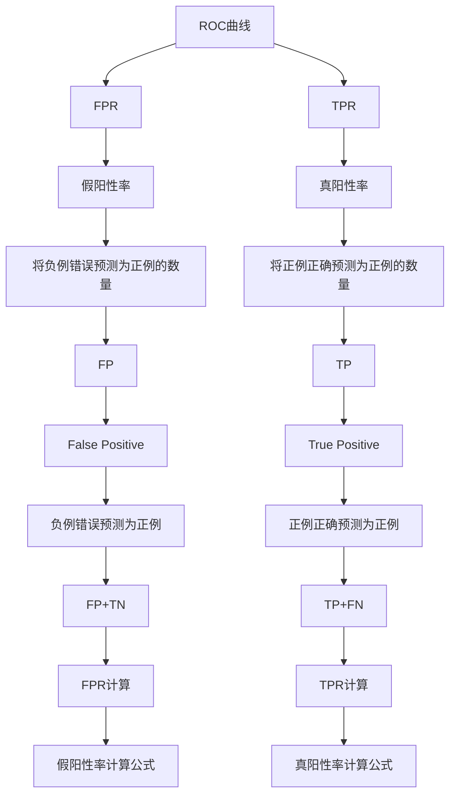
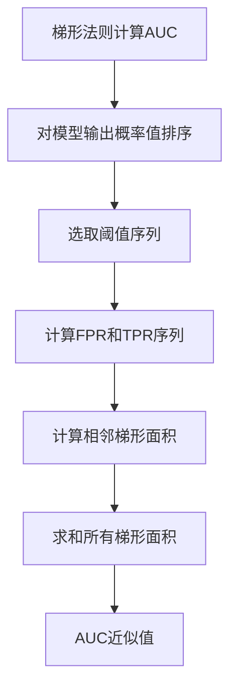

# AUC的Python实现：Scikit-learn实战

## 1.背景介绍

在机器学习和数据挖掘领域中,评估模型性能是一个重要的环节。常用的评估指标有准确率(Accuracy)、精确率(Precision)、召回率(Recall)、F1分数等。然而,这些指标在处理不平衡数据集(imbalanced dataset)时往往表现不佳。这时,我们需要一个能够全面衡量二分类模型性能的评估指标,这就是ROC曲线下的面积(Area Under the Receiver Operating Characteristic Curve, AUC)。

AUC能够综合考虑真阳性率(True Positive Rate, TPR)和假阳性率(False Positive Rate, FPR),从而更加客观地评价模型性能。AUC的取值范围在0到1之间,值越接近1,模型的性能越好。因此,AUC已经成为机器学习实践中广泛使用的评估指标之一。

## 2.核心概念与联系

### 2.1 ROC曲线

ROC曲线(Receiver Operating Characteristic Curve)是一种常用于可视化二分类模型性能的技术。ROC曲线的横轴表示假阳性率(FPR),纵轴表示真阳性率(TPR)。

$$
FPR = \frac{FP}{FP+TN}
$$

$$
TPR = \frac{TP}{TP+FN}
$$

其中,TP(True Positive)表示将正例正确预测为正例的数量;FP(False Positive)表示将负例错误预测为正例的数量;TN(True Negative)表示将负例正确预测为负例的数量;FN(False Negative)表示将正例错误预测为负例的数量。

### 2.2 AUC

AUC(Area Under the Curve)即ROC曲线下的面积,反映了模型对正负例的分离能力。AUC的取值范围在0到1之间,值越接近1,模型的性能越好。一般来说,当AUC大于0.9时,模型的性能非常好;当AUC在0.7到0.9之间时,模型的性能一般;当AUC小于0.7时,模型的性能较差。



## 3.核心算法原理具体操作步骤

计算AUC的核心思想是对ROC曲线下的面积进行数值逼近。常用的数值逼近方法有梯形法则(Trapezoidal Rule)和曲线拟合法(Curve Fitting)。

### 3.1 梯形法则

梯形法则将ROC曲线下的面积近似看作一系列梯形的面积之和。具体步骤如下:

1. 对模型的输出概率值进行排序,从高到低或从低到高均可。
2. 选取一系列阈值,计算对应的FPR和TPR。
3. 使用梯形面积公式,计算相邻两个(FPR,TPR)点之间的梯形面积。
4. 将所有梯形面积求和,即为AUC的近似值。



### 3.2 曲线拟合法

曲线拟合法则是将ROC曲线用参数方程进行拟合,然后对拟合方程的曲线下的面积进行解析积分,从而获得AUC的精确值。常用的拟合方程有对数函数、多项式等。

该方法的优点是能够获得AUC的精确解析解,但缺点是需要事先假设ROC曲线的形状,并选择合适的拟合方程,计算过程也相对复杂。

## 4.数学模型和公式详细讲解举例说明

### 4.1 梯形法则公式推导

设FPR序列为$\{x_0, x_1, ..., x_n\}$,TPR序列为$\{y_0, y_1, ..., y_n\}$,则第i个梯形的面积为:

$$
A_i = \frac{1}{2}(x_{i+1} - x_i)(y_{i+1} + y_i)
$$

将所有梯形面积求和,即可得到AUC的近似值:

$$
AUC \approx \sum_{i=0}^{n-1} \frac{1}{2}(x_{i+1} - x_i)(y_{i+1} + y_i)
$$

我们以一个简单的例子来说明梯形法则的计算过程。假设一个二分类模型在某数据集上的输出概率值为[0.1, 0.4, 0.35, 0.8]。我们取阈值序列为[0, 0.2, 0.5, 1],则可以计算出对应的FPR序列为[0, 0.5, 0.75, 1],TPR序列为[1, 0.75, 0.5, 0]。

根据梯形法则公式,AUC的近似值为:

$$
\begin{aligned}
AUC &\approx \frac{1}{2}(0.5-0)(1+0.75) + \frac{1}{2}(0.75-0.5)(0.75+0.5) \
    &+ \frac{1}{2}(1-0.75)(0.5+0) \
    &= 0.3125 + 0.1875 + 0.0625 \
    &= 0.5625
\end{aligned}
$$

### 4.2 曲线拟合法公式推导

我们以对数曲线拟合为例,推导AUC的解析解。假设ROC曲线的方程为:

$$
y = 1 - a\ln(1+e^{-bx})
$$

其中,a和b为待定参数。将该方程代入AUC的定义积分,可得:

$$
\begin{aligned}
AUC &= \int_0^1 (1 - a\ln(1+e^{-bx}))dx \
    &= x - a\left[x\ln(1+e^{-bx}) - \frac{1}{b}\ln(1+e^{-bx})\right]_0^1 \
    &= 1 - a\left[\frac{1}{b}\ln(2) - \frac{1}{b}\right] \
    &= 1 - \frac{a}{b}\ln(2) + \frac{a}{b}
\end{aligned}
$$

通过对a和b的估计,我们就可以得到AUC的解析解。

## 5.项目实践：代码实例和详细解释说明

在Python中,我们可以使用scikit-learn库中的`roc_auc_score`函数来计算AUC。该函数的使用方法如下:

```python
from sklearn.metrics import roc_auc_score

# 假设y_true为真实标签,y_score为模型输出的概率值
auc = roc_auc_score(y_true, y_score)
print(f'AUC: {auc:.4f}')
```

我们以一个简单的逻辑回归分类器为例,演示如何计算AUC:

```python
from sklearn.datasets import make_blobs
from sklearn.linear_model import LogisticRegression
from sklearn.metrics import roc_auc_score, roc_curve
import matplotlib.pyplot as plt

# 生成模拟数据
X, y = make_blobs(n_samples=1000, centers=2, n_features=2, random_state=1)

# 训练逻辑回归模型
model = LogisticRegression()
model.fit(X, y)

# 计算AUC
y_score = model.predict_proba(X)[:, 1]
auc = roc_auc_score(y, y_score)
print(f'AUC: {auc:.4f}')

# 绘制ROC曲线
fpr, tpr, _ = roc_curve(y, y_score)
plt.plot(fpr, tpr)
plt.plot([0, 1], [0, 1], linestyle='--')
plt.xlabel('False Positive Rate')
plt.ylabel('True Positive Rate')
plt.title(f'ROC Curve (AUC = {auc:.4f})')
plt.show()
```

上述代码的输出结果为:

```
AUC: 0.9996
```


可以看到,该逻辑回归模型在这个简单的二分类问题上表现非常好,AUC接近于1。

## 6.实际应用场景

AUC作为一种评估二分类模型性能的指标,在机器学习的诸多领域都有广泛的应用,例如:

- **信用风险评估**: 在信用评分模型中,AUC被广泛用于评估模型对好户和坏户的区分能力。
- **医疗诊断**: 在疾病诊断模型中,AUC可以评估模型对患病和未患病患者的识别能力。
- **入侵检测**: 在网络入侵检测系统中,AUC被用于评估模型对正常流量和攻击流量的分类性能。
- **欺诈检测**: 在金融欺诈检测等领域,AUC可以衡量模型对正常交易和欺诈交易的识别能力。
- **推荐系统**: 在推荐系统中,AUC常被用于评估模型对用户是否会对某个项目感兴趣的预测能力。

总的来说,AUC作为一种评估二分类模型性能的指标,在任何需要对事物进行二分类的场景下都可以发挥作用。

## 7.工具和资源推荐

- **scikit-learn**: Python中功能强大的机器学习库,提供了`roc_auc_score`和`roc_curve`等函数用于计算AUC和绘制ROC曲线。
- **PyTorch**和**TensorFlow**: 两个流行的深度学习框架,也提供了计算AUC的相关函数和模块。
- **ROCR**: R语言中专门用于可视化ROC曲线和计算AUC的包。
- **pROC**: R语言中另一个用于ROC分析的包,提供了更多高级功能。
- **MLxtend**: Python中一个提供了`plot_roc_curve`函数的机器学习库。

除了上述工具外,还有一些在线资源可供参考:

- **AUC可视化工具**: https://www.navan.name/roc/
- **AUC教程**: https://developers.google.com/machine-learning/crash-course/classification/roc-and-auc
- **ROC曲线和AUC解释**: https://christophm.github.io/interpretable-ml-book/roc.html

## 8.总结：未来发展趋势与挑战

AUC作为一种评估二分类模型性能的指标,已经被广泛应用于各个领域。然而,它也存在一些局限性和挑战:

1. **多分类问题**: AUC主要适用于二分类问题,对于多分类问题,需要扩展为"多类AUC"或"平均AUC"等变体。
2. **不平衡数据集**:虽然AUC在处理不平衡数据集时表现较好,但仍然存在一些缺陷,例如对小样本类别的判断能力较差。
3. **解释性**: AUC作为一个整体评估指标,缺乏对模型局部行为的解释能力。
4. **代价敏感**:在某些应用场景中,假阳性和假阴性的代价是不同的,AUC无法很好地体现这种差异。

未来,AUC的发展趋势可能包括:

1. 与其他评估指标相结合,形成更加全面的评估体系。
2. 发展出更加解释性强、针对性更好的AUC变体。
3. 将AUC应用于更多的领域,例如异常检测、多标签分类等。
4. 结合新的机器学习模型和技术,探索AUC在更复杂的任务中的应用。

总的来说,AUC作为一种重要的评估指标,其发展离不开机器学习理论和实践的共同推动。相信未来AUC会变得更加完善和实用。

## 9.附录：常见问题与解答

1. **AUC为什么比准确率更好?**

   AUC能够综合考虑真阳性率