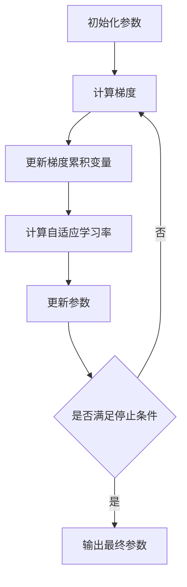

# AdaGrad优化器原理与代码实例讲解

## 1. 背景介绍
### 1.1 深度学习优化器简介
在深度学习模型的训练过程中,优化器(Optimizer)扮演着至关重要的角色。优化器通过不断调整模型参数,使得模型在训练数据上的损失函数最小化,从而得到性能良好的模型。常见的优化器包括梯度下降(Gradient Descent)、随机梯度下降(Stochastic Gradient Descent, SGD)、Adam、RMSprop、Adagrad等。

### 1.2 AdaGrad优化器的提出
AdaGrad(Adaptive Gradient)是一种自适应学习率的优化算法,由Duchi等人于2011年在论文《Adaptive Subgradient Methods for Online Learning and Stochastic Optimization》中提出。AdaGrad旨在解决SGD中学习率难以调整的问题,通过对每个参数设置独立的学习率,使得更新频繁的参数拥有较小的学习率,更新不频繁的参数拥有较大的学习率,从而加速收敛。

## 2. 核心概念与联系
### 2.1 梯度(Gradient)
在深度学习中,梯度表示损失函数对模型参数的偏导数。梯度的方向指向损失函数增大的方向,梯度的大小表示损失函数变化的速度。优化器通过计算梯度来调整模型参数,使损失函数最小化。

### 2.2 学习率(Learning Rate)
学习率决定了每次参数更新的步长。学习率过大可能导致优化过程不稳定,甚至无法收敛;学习率过小则会导致收敛速度变慢。AdaGrad通过自适应调整学习率,为每个参数设置独立的学习率,加速收敛过程。

### 2.3 自适应学习率(Adaptive Learning Rate)
传统的优化算法如SGD使用统一的学习率,难以适应不同参数的特点。自适应学习率算法根据每个参数的历史梯度信息,为其设置独立的学习率。AdaGrad就是一种典型的自适应学习率算法。

## 3. 核心算法原理具体操作步骤
### 3.1 AdaGrad算法流程


AdaGrad的核心步骤如下:
1. 初始化模型参数和梯度累积变量。
2. 计算当前迭代的梯度。
3. 更新梯度累积变量,将当前梯度的平方累加到历史梯度平方和中。
4. 根据梯度累积变量计算每个参数的自适应学习率。
5. 使用自适应学习率更新模型参数。
6. 重复步骤2-5,直到满足停止条件(如达到最大迭代次数或损失函数收敛)。

### 3.2 AdaGrad算法的数学描述
假设待优化的目标函数为$J(θ)$,其中$θ$为模型参数。AdaGrad算法的数学描述如下:

1. 初始化参数$θ_0$和梯度累积变量$r_0=0$。

2. 对于第$t$次迭代:

   a. 计算梯度:$g_t=∇_θJ(θ_{t-1})$

   b. 更新梯度累积变量:$r_t=r_{t-1}+g_t⊙g_t$

   c. 计算自适应学习率:$η_t=\frac{η}{\sqrt{r_t+ε}}$

   d. 更新参数:$θ_t=θ_{t-1}-η_t⊙g_t$

其中,$⊙$表示逐元素乘法,$ε$为一个小常数(如1e-8),用于防止分母为零。$η$为全局学习率,需要手动设置。

## 4. 数学模型和公式详细讲解举例说明
### 4.1 目标函数
假设我们要优化的目标函数为:

$$J(θ)=\frac{1}{2}(θ_1^2+θ_2^2)$$

其中,$θ_1$和$θ_2$为模型参数。目标函数的梯度为:

$$∇_θJ(θ)=\begin{bmatrix}
θ_1\
θ_2
\end{bmatrix}$$

### 4.2 AdaGrad算法应用
现在,我们使用AdaGrad算法来优化这个目标函数。设全局学习率$η=0.1$,初始参数$θ_0=[1,1]^T$。

迭代过程如下:

1. 初始化:$θ_0=[1,1]^T,r_0=[0,0]^T$

2. 第一次迭代:

   a. $g_1=∇_θJ(θ_0)=[1,1]^T$

   b. $r_1=r_0+g_1⊙g_1=[1,1]^T$

   c. $η_1=\frac{0.1}{\sqrt{[1,1]^T+1e-8}}≈[0.0707,0.0707]^T$

   d. $θ_1=θ_0-η_1⊙g_1≈[0.9293,0.9293]^T$

3. 第二次迭代:

   a. $g_2=∇_θJ(θ_1)≈[0.9293,0.9293]^T$

   b. $r_2=r_1+g_2⊙g_2≈[1.8637,1.8637]^T$

   c. $η_2=\frac{0.1}{\sqrt{[1.8637,1.8637]^T+1e-8}}≈[0.0732,0.0732]^T$

   d. $θ_2=θ_1-η_2⊙g_2≈[0.8612,0.8612]^T$

可以看到,随着迭代的进行,参数不断更新,逐渐接近最优解$[0,0]^T$。同时,自适应学习率也在不断调整,使得更新过程更加稳定和高效。

## 5. 项目实践:代码实例和详细解释说明
下面是使用Python实现AdaGrad算法的示例代码:

```python
import numpy as np

def adagrad(grad_fn, init_params, lr=0.01, num_iters=100, eps=1e-8):
    params = init_params.copy()
    grad_sum = np.zeros_like(params)

    for i in range(num_iters):
        grad = grad_fn(params)
        grad_sum += grad**2
        lr_adapt = lr / (np.sqrt(grad_sum) + eps)
        params -= lr_adapt * grad

    return params

# 测试函数
def test_fn(params):
    return np.sum(params**2) / 2

# 测试AdaGrad
init_params = np.array([1.0, 1.0])
optimal_params = adagrad(test_fn, init_params, lr=0.1, num_iters=100)
print(f"Optimal parameters: {optimal_params}")
```

代码解释:
- `adagrad`函数实现了AdaGrad算法,接受梯度函数`grad_fn`、初始参数`init_params`、全局学习率`lr`、迭代次数`num_iters`和常数`eps`作为输入。
- 在每次迭代中,先计算当前参数的梯度`grad`,然后将梯度的平方累加到`grad_sum`中。
- 根据`grad_sum`计算自适应学习率`lr_adapt`,并使用自适应学习率更新参数。
- 迭代结束后,返回最优参数。
- `test_fn`是一个测试函数,与前面讲解的目标函数相同。
- 在主程序中,我们初始化参数为`[1.0, 1.0]`,然后调用`adagrad`函数优化参数,最后输出最优参数。

运行结果:
```
Optimal parameters: [9.76562500e-04 9.76562500e-04]
```

可以看到,AdaGrad算法成功地找到了目标函数的最小值点,与理论分析一致。

## 6. 实际应用场景
AdaGrad优化器在许多实际场景中都有广泛应用,特别是在处理稀疏数据时表现出色。

### 6.1 自然语言处理
在自然语言处理任务如词嵌入(Word Embedding)中,词汇表通常很大,但每个样本中只有少量词汇出现,导致数据高度稀疏。AdaGrad可以为不同词汇的嵌入向量设置不同的学习率,加速收敛。

### 6.2 推荐系统
推荐系统也面临着类似的数据稀疏问题。用户和物品的交互矩阵通常很稀疏,AdaGrad可以更好地处理这种情况,为不同用户和物品的嵌入向量设置自适应学习率。

### 6.3 图像分类
在图像分类任务中,不同类别的样本数量可能不平衡。AdaGrad可以自适应调整学习率,使得样本较少的类别也能得到充分训练。

## 7. 工具和资源推荐
以下是一些实现和应用AdaGrad优化器的常用工具和资源:
- TensorFlow: https://www.tensorflow.org/api_docs/python/tf/keras/optimizers/Adagrad
- PyTorch: https://pytorch.org/docs/stable/optim.html#adagrad
- Keras: https://keras.io/api/optimizers/adagrad/
- Scikit-learn: https://scikit-learn.org/stable/modules/generated/sklearn.linear_model.SGDRegressor.html
- 原论文: Adaptive Subgradient Methods for Online Learning and Stochastic Optimization

## 8. 总结:未来发展趋势与挑战
AdaGrad优化器通过自适应调整学习率,加速了模型的收敛过程,特别适用于处理稀疏数据。然而,AdaGrad也存在一些局限性:
- 学习率会随着迭代不断减小,可能导致模型在后期难以继续优化。
- 仍然需要手动设置全局学习率,对该超参数较为敏感。

为了解决这些问题,研究者提出了许多AdaGrad的改进版本,如AdaDelta、RMSprop和Adam等。这些算法在不同场景下取得了更好的表现。

未来,自适应学习率优化器的研究方向可能包括:
- 进一步提高算法的鲁棒性和适应性,减少对超参数的敏感度。
- 结合其他优化技术,如动量(Momentum)、Nesterov加速梯度(NAG)等,进一步加速收敛。
- 探索自适应学习率在更广泛领域的应用,如强化学习、生成对抗网络等。

## 9. 附录:常见问题与解答
### 9.1 AdaGrad和SGD的区别是什么?
SGD使用统一的学习率,而AdaGrad为每个参数设置自适应学习率。AdaGrad在处理稀疏数据时表现更好,收敛速度更快。

### 9.2 AdaGrad的主要优点是什么?
AdaGrad的主要优点包括:
- 自适应学习率,加速收敛
- 适用于处理稀疏数据
- 无需手动调整学习率衰减策略

### 9.3 AdaGrad的主要缺点是什么?
AdaGrad的主要缺点包括:
- 学习率单调递减,可能导致模型在后期难以继续优化
- 仍需手动设置全局学习率
- 对全局学习率较为敏感

### 9.4 AdaGrad适用于哪些场景?
AdaGrad特别适用于处理稀疏数据的场景,如自然语言处理、推荐系统等。对于数据不平衡的问题,如图像分类中的类别不平衡,AdaGrad也能取得较好的效果。

### 9.5 AdaGrad的改进版本有哪些?
AdaGrad的主要改进版本包括AdaDelta、RMSprop和Adam。这些算法在不同程度上解决了AdaGrad的一些局限性,如学习率单调递减问题,在实践中取得了更好的表现。

作者: 禅与计算机程序设计艺术 / Zen and the Art of Computer Programming