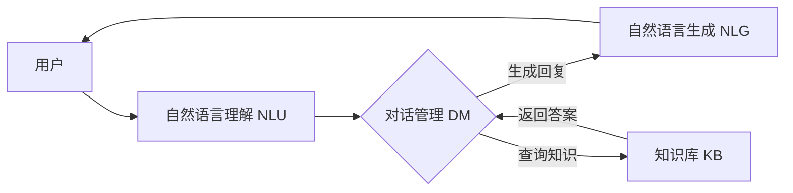

# Chatbots原理与代码实例讲解

## 1.背景介绍
### 1.1 人工智能与自然语言处理的发展历程
#### 1.1.1 人工智能的起源与发展
#### 1.1.2 自然语言处理技术的演进
#### 1.1.3 Chatbots的出现与应用现状

### 1.2 Chatbots的定义与分类
#### 1.2.1 Chatbots的定义
#### 1.2.2 基于规则的Chatbots
#### 1.2.3 基于机器学习的Chatbots
#### 1.2.4 基于深度学习的Chatbots

### 1.3 Chatbots的应用领域
#### 1.3.1 客户服务
#### 1.3.2 个人助理
#### 1.3.3 教育与培训
#### 1.3.4 医疗健康
#### 1.3.5 金融服务

## 2.核心概念与联系
### 2.1 自然语言理解(NLU)
#### 2.1.1 语言模型
#### 2.1.2 意图识别
#### 2.1.3 实体抽取
#### 2.1.4 上下文理解

### 2.2 对话管理(Dialogue Management) 
#### 2.2.1 对话状态跟踪
#### 2.2.2 对话策略学习
#### 2.2.3 对话流程控制

### 2.3 自然语言生成(NLG)
#### 2.3.1 模板生成
#### 2.3.2 基于检索的生成
#### 2.3.3 基于深度学习的生成

### 2.4 知识库(Knowledge Base)
#### 2.4.1 结构化知识库
#### 2.4.2 非结构化知识库
#### 2.4.3 知识库问答

### 2.5 Chatbots架构图


## 3.核心算法原理具体操作步骤
### 3.1 意图识别算法
#### 3.1.1 基于关键词匹配的意图识别
#### 3.1.2 基于机器学习的意图识别
##### 3.1.2.1 特征提取
##### 3.1.2.2 分类模型训练
##### 3.1.2.3 意图预测
#### 3.1.3 基于深度学习的意图识别
##### 3.1.3.1 CNN用于意图识别
##### 3.1.3.2 RNN用于意图识别
##### 3.1.3.3 Transformer用于意图识别

### 3.2 槽位填充算法
#### 3.2.1 条件随机场(CRF)用于槽位填充
#### 3.2.2 BiLSTM-CRF用于槽位填充 
#### 3.2.3 Transformer用于槽位填充

### 3.3 对话管理算法
#### 3.3.1 有限状态机(FSM)
#### 3.3.2 基于框架的对话管理
#### 3.3.3 深度强化学习用于对话管理
##### 3.3.3.1 Deep Q Network(DQN)
##### 3.3.3.2 Policy Gradient(PG) 
##### 3.3.3.3 Actor-Critic

### 3.4 自然语言生成算法
#### 3.4.1 基于模板的NLG
#### 3.4.2 基于检索的NLG
#### 3.4.3 基于Seq2Seq的NLG
#### 3.4.4 基于Transformer的NLG
##### 3.4.4.1 GPT
##### 3.4.4.2 BERT
##### 3.4.4.3 T5

## 4.数学模型和公式详细讲解举例说明
### 4.1 CNN在意图识别中的应用
#### 4.1.1 一维卷积运算
$$ h_i = \sum_{j=1}^{k} w_j \cdot x_{i+j-1} $$
其中$h_i$为第$i$个卷积输出，$w_j$为卷积核参数，$x_{i+j-1}$为第$i+j-1$个输入。
#### 4.1.2 池化运算
$$ y_i = \max_{j=1}^{k} h_{i+j-1} $$
其中$y_i$为第$i$个池化输出，$h_{i+j-1}$为第$i+j-1$个卷积输出。

### 4.2 Transformer在NLG中的应用
#### 4.2.1 Self-Attention
$$
\mathrm{Attention}(Q, K, V) = \mathrm{softmax}(\frac{QK^T}{\sqrt{d_k}})V
$$
其中$Q$、$K$、$V$分别为查询向量、键向量和值向量，$d_k$为向量维度。
#### 4.2.2 Multi-Head Attention
$$
\mathrm{MultiHead}(Q, K, V) = \mathrm{Concat}(\mathrm{head_1}, ..., \mathrm{head_h})W^O \
\mathrm{head_i} = \mathrm{Attention}(QW_i^Q, KW_i^K, VW_i^V)
$$
其中$W_i^Q$、$W_i^K$、$W_i^V$为线性变换矩阵，$W^O$为输出线性变换矩阵。

### 4.3 强化学习在对话管理中的应用
#### 4.3.1 Q-Learning
$$
Q(s_t, a_t) \leftarrow Q(s_t, a_t) + \alpha [r_{t+1} + \gamma \max_{a} Q(s_{t+1}, a) - Q(s_t, a_t)]
$$
其中$Q(s_t, a_t)$为状态-动作值函数，$\alpha$为学习率，$\gamma$为折扣因子，$r_{t+1}$为奖励。
#### 4.3.2 Policy Gradient
$$
\nabla_\theta J(\theta) = \mathbb{E}_{\tau \sim \pi_\theta}[\sum_{t=0}^T \nabla_\theta \log \pi_\theta(a_t|s_t) Q^{\pi_\theta}(s_t, a_t)]
$$
其中$J(\theta)$为策略期望回报，$\pi_\theta$为参数化策略，$Q^{\pi_\theta}(s_t, a_t)$为状态-动作值函数。

## 5.项目实践：代码实例和详细解释说明
### 5.1 基于Rasa框架构建Chatbot
#### 5.1.1 安装Rasa
```bash
pip install rasa
```
#### 5.1.2 创建Rasa项目
```bash
rasa init
```
#### 5.1.3 定义意图和实体
```yaml
# data/nlu.yml
nlu:
- intent: greet
  examples: |
    - 你好
    - 嗨
    - 您好
- intent: goodbye
  examples: |
    - 再见
    - 拜拜
    - 下次见
- intent: affirm
  examples: |
    - 是的
    - 好的
    - 确实
- intent: deny
  examples: |
    - 不
    - 不是
    - 没有
- intent: mood_great
  examples: |
    - 非常好
    - 我感觉很棒
    - 太棒了
- intent: mood_unhappy
  examples: |
    - 我的心情不好
    - 我感到难过
    - 糟透了
```
#### 5.1.4 定义对话流程
```yaml
# data/stories.yml
stories:
- story: greet path
  steps:
  - intent: greet
  - action: utter_greet
- story: happy path
  steps:
  - intent: greet
  - action: utter_greet
  - intent: mood_great
  - action: utter_happy
- story: sad path
  steps:
  - intent: greet
  - action: utter_greet
  - intent: mood_unhappy
  - action: utter_cheer_up
  - action: utter_did_that_help
  - intent: affirm
  - action: utter_happy
- story: sad path 2
  steps:
  - intent: greet
  - action: utter_greet
  - intent: mood_unhappy
  - action: utter_cheer_up
  - action: utter_did_that_help
  - intent: deny
  - action: utter_goodbye
```
#### 5.1.5 定义响应模板
```yaml
# domain.yml
responses:
  utter_greet:
  - text: "你好！有什么我可以帮助你的吗？"
  utter_cheer_up:
  - text: "别难过，事情会好起来的！"
  - text: "保持积极乐观的心态很重要。"
  utter_did_that_help:
  - text: "这对你有帮助吗？"
  utter_happy:
  - text: "太好了，很高兴听到这个消息！"
  utter_goodbye:
  - text: "再见！祝你今天愉快！"
  - text: "下次再聊，拜拜！"
```
#### 5.1.6 训练模型
```bash
rasa train
```
#### 5.1.7 与Chatbot交互
```bash
rasa shell
```

### 5.2 基于PyTorch实现Seq2Seq生成模型
#### 5.2.1 定义编码器
```python
class Encoder(nn.Module):
    def __init__(self, input_size, hidden_size):
        super(Encoder, self).__init__()
        self.hidden_size = hidden_size
        self.embedding = nn.Embedding(input_size, hidden_size)
        self.gru = nn.GRU(hidden_size, hidden_size)
        
    def forward(self, input, hidden):
        embedded = self.embedding(input).view(1, 1, -1)
        output, hidden = self.gru(embedded, hidden)
        return output, hidden
```
#### 5.2.2 定义解码器
```python
class Decoder(nn.Module):
    def __init__(self, hidden_size, output_size):
        super(Decoder, self).__init__()
        self.hidden_size = hidden_size
        self.embedding = nn.Embedding(output_size, hidden_size)
        self.gru = nn.GRU(hidden_size, hidden_size)
        self.out = nn.Linear(hidden_size, output_size)
        self.softmax = nn.LogSoftmax(dim=1)
        
    def forward(self, input, hidden):
        embedded = self.embedding(input).view(1, 1, -1)
        output, hidden = self.gru(embedded, hidden)
        output = self.softmax(self.out(output[0]))
        return output, hidden
```
#### 5.2.3 训练模型
```python
def train(input_tensor, target_tensor, encoder, decoder, encoder_optimizer, decoder_optimizer, criterion, max_length=MAX_LENGTH):
    encoder_hidden = encoder.initHidden()
    encoder_optimizer.zero_grad()
    decoder_optimizer.zero_grad()
    
    input_length = input_tensor.size(0)
    target_length = target_tensor.size(0)
    
    encoder_outputs = torch.zeros(max_length, encoder.hidden_size)
    
    loss = 0
    
    for ei in range(input_length):
        encoder_output, encoder_hidden = encoder(input_tensor[ei], encoder_hidden)
        encoder_outputs[ei] = encoder_output[0, 0]
        
    decoder_input = torch.tensor([[SOS_token]])
    decoder_hidden = encoder_hidden
    
    for di in range(target_length):
        decoder_output, decoder_hidden = decoder(decoder_input, decoder_hidden)
        topv, topi = decoder_output.topk(1)
        decoder_input = topi.squeeze().detach()
        
        loss += criterion(decoder_output, target_tensor[di])
        if decoder_input.item() == EOS_token:
            break
            
    loss.backward()
    
    encoder_optimizer.step()
    decoder_optimizer.step()
    
    return loss.item() / target_length
```

## 6.实际应用场景
### 6.1 客服聊天机器人
- 处理常见问题咨询
- 提供产品信息查询
- 协助订单跟踪与售后服务

### 6.2 个人助理
- 日程管理与提醒
- 信息检索与问答
- 任务规划与执行

### 6.3 教育培训助手
- 课程内容解答
- 学习进度跟踪
- 互动式教学

### 6.4 医疗健康助理
- 症状初步判断
- 就医指导与建议  
- 健康知识普及

### 6.5 金融服务助手
- 账户信息查询
- 投资理财建议
- 信用卡申请指导

## 7.工具和资源推荐
### 7.1 开源框架
- Rasa: 开源对话式AI框架
- DeepPavlov: 基于深度学习的对话系统框架
- ChatterBot: 基于机器学习的对话引擎
- Botkit: 聊天机器人开发框架

### 7.2 自然语言处理工具包
- NLTK: 自然语言处理工具包
- spaCy: 工业级自然语言处理库
- Stanford CoreNLP: 斯坦福大学开发的NLP工具包
- HanLP: 中文自然语言处理工具包

### 7.3 知识库与语料库
- ConceptNet: 常识知识图谱
- WordNet: 英语词汇语义网络
- HowNet: 中文概念词典
- DuConv: 开放领域对话数据