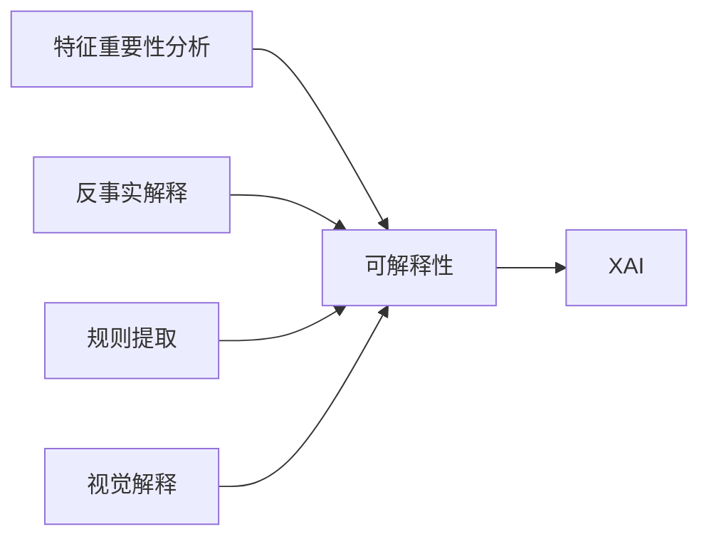

# Explainable AI (XAI)原理与代码实例讲解

## 1. 背景介绍

人工智能(Artificial Intelligence, AI)技术的快速发展和广泛应用,给人们的生活带来了巨大的便利。然而,传统的AI模型往往被视为"黑盒",其内部决策过程难以被人类所理解和信任。为了克服这一挑战,可解释人工智能(Explainable Artificial Intelligence, XAI)应运而生。XAI旨在开发能够解释其预测和决策的AI系统,增强人工智能的透明度、可解释性和可信赖性。

### 1.1 人工智能可解释性的重要意义

#### 1.1.1 提高人工智能系统的可信赖性
#### 1.1.2 促进人机协作
#### 1.1.3 推动人工智能在关键领域的应用

### 1.2 XAI的研究现状

#### 1.2.1 XAI的研究热点
#### 1.2.2 XAI的主要方法
#### 1.2.3 XAI面临的挑战

## 2. 核心概念与联系

### 2.1 可解释性的定义与分类

#### 2.1.1 可解释性的定义
#### 2.1.2 可解释性的分类

### 2.2 XAI与传统AI的区别

#### 2.2.1 传统AI的局限性
#### 2.2.2 XAI的优势

### 2.3 XAI的关键技术

#### 2.3.1 特征重要性分析
#### 2.3.2 反事实解释
#### 2.3.3 规则提取
#### 2.3.4 视觉解释

### 2.4 XAI核心概念之间的关系



## 3. 核心算法原理具体操作步骤

### 3.1 SHAP(SHapley Additive exPlanations)

#### 3.1.1 Shapley值的定义与性质
#### 3.1.2 SHAP的计算过程
#### 3.1.3 SHAP的优缺点分析

### 3.2 LIME(Local Interpretable Model-agnostic Explanations)

#### 3.2.1 LIME的基本思想
#### 3.2.2 LIME的具体实现步骤
#### 3.2.3 LIME的优缺点分析

### 3.3 DeepLIFT(Deep Learning Important FeaTures)

#### 3.3.1 DeepLIFT的核心原理
#### 3.3.2 DeepLIFT的前向传播与反向传播
#### 3.3.3 DeepLIFT的优缺点分析

### 3.4 Grad-CAM(Gradient-weighted Class Activation Mapping)

#### 3.4.1 Grad-CAM的基本思路
#### 3.4.2 Grad-CAM的计算过程
#### 3.4.3 Grad-CAM的优缺点分析

## 4. 数学模型和公式详细讲解举例说明

### 4.1 SHAP的数学模型

#### 4.1.1 Shapley值的数学定义
#### 4.1.2 SHAP值的计算公式
#### 4.1.3 SHAP模型的数学推导

### 4.2 LIME的数学模型

#### 4.2.1 局部可解释模型的数学表示
#### 4.2.2 LIME目标函数的数学形式
#### 4.2.3 LIME模型的优化求解

### 4.3 DeepLIFT的数学模型

#### 4.3.1 DeepLIFT中的链式法则
#### 4.3.2 DeepLIFT的梯度计算公式
#### 4.3.3 DeepLIFT与Shapley值的关系

### 4.4 Grad-CAM的数学模型

#### 4.4.1 Grad-CAM中的梯度计算
#### 4.4.2 Grad-CAM热力图的生成公式
#### 4.4.3 Grad-CAM++的改进

举例说明:以SHAP为例,假设有一个简单的线性模型$f(x)=2x_1+3x_2+5$,其中$x_1,x_2$为输入特征。根据Shapley值的定义,特征$x_1$的Shapley值$\phi_1$可以通过以下公式计算:

$$\phi_1=\frac{1}{2!}[f(x_1,0)-f(0,0)]+\frac{1}{2!}[f(x_1,x_2)-f(0,x_2)]$$

将$f(x)$的表达式代入,可得:

$$\phi_1=\frac{1}{2}[(2x_1+5)-(5)]+\frac{1}{2}[(2x_1+3x_2+5)-(3x_2+5)]=x_1$$

同理可得$\phi_2=\frac{3}{2}x_2$。这表明,在该线性模型中,特征$x_1$和$x_2$对预测结果的贡献分别为其本身的1倍和1.5倍。

## 5. 项目实践:代码实例和详细解释说明

### 5.1 基于SHAP的特征重要性分析

```python
import shap
from sklearn.datasets import load_boston
from sklearn.ensemble import RandomForestRegressor

# 加载Boston房价数据集
boston = load_boston()
X, y = boston.data, boston.target

# 训练随机森林回归模型
model = RandomForestRegressor()
model.fit(X, y)

# 使用SHAP计算特征重要性
explainer = shap.TreeExplainer(model)
shap_values = explainer.shap_values(X)

# 可视化特征重要性
shap.summary_plot(shap_values, X, plot_type="bar")
```

代码解释:
- 首先加载Boston房价数据集,并使用随机森林回归模型进行训练。
- 然后使用SHAP的`TreeExplainer`计算特征的Shapley值,得到`shap_values`。
- 最后调用`summary_plot`函数以柱状图的形式可视化各个特征的重要性。

### 5.2 基于LIME的局部可解释性分析

```python
import lime
import lime.lime_tabular
from sklearn.datasets import load_iris
from sklearn.ensemble import RandomForestClassifier

# 加载Iris数据集
iris = load_iris()
X, y = iris.data, iris.target

# 训练随机森林分类模型
model = RandomForestClassifier()
model.fit(X, y)

# 使用LIME解释单个样本的预测结果
explainer = lime.lime_tabular.LimeTabularExplainer(X, feature_names=iris.feature_names, class_names=iris.target_names)
exp = explainer.explain_instance(X[0], model.predict_proba, num_features=4)

# 可视化解释结果
exp.show_in_notebook(show_table=True)
```

代码解释:
- 首先加载Iris数据集,并使用随机森林分类模型进行训练。
- 然后使用LIME的`LimeTabularExplainer`对单个样本的预测结果进行解释。通过指定`num_features`参数,可以控制解释中包含的特征数量。
- 最后调用`show_in_notebook`函数在Notebook中可视化解释结果,通过`show_table`参数可以选择是否显示特征权重表格。

### 5.3 基于Grad-CAM的卷积神经网络可视化

```python
import numpy as np
import tensorflow as tf
from tensorflow.keras.applications.resnet50 import ResNet50, preprocess_input, decode_predictions
from tensorflow.keras.preprocessing.image import load_img, img_to_array

# 加载预训练的ResNet50模型
model = ResNet50(weights='imagenet')

# 加载并预处理输入图像
img_path = 'cat.jpg'
img = load_img(img_path, target_size=(224, 224))
x = img_to_array(img)
x = np.expand_dims(x, axis=0)
x = preprocess_input(x)

# 使用Grad-CAM可视化卷积神经网络的注意力区域
last_conv_layer = model.get_layer('conv5_block3_out')
heatmap = tf.keras.models.Model([model.inputs], [last_conv_layer.output, model.output])

with tf.GradientTape() as gtape:
    conv_output, predictions = heatmap(x)
    pred_index = np.argmax(predictions[0])
    class_channel = predictions[:, pred_index]

grads = gtape.gradient(class_channel, conv_output)[0]
pooled_grads = tf.reduce_mean(grads, axis=(0, 1, 2))

heatmap = tf.reduce_mean(tf.multiply(pooled_grads, conv_output), axis=-1)
heatmap = np.maximum(heatmap, 0) / np.max(heatmap)
heatmap = heatmap.reshape((7, 7))

# 叠加热力图与原始图像
import matplotlib.pyplot as plt
img = load_img(img_path, target_size=(224, 224))
heatmap = np.uint8(255 * heatmap)
heatmap = cv2.resize(heatmap, (img.width, img.height))
heatmap = cv2.applyColorMap(heatmap, cv2.COLORMAP_JET)
superimposed_img = heatmap * 0.4 + img
plt.imshow(superimposed_img)
```

代码解释:
- 首先加载预训练的ResNet50模型,并对输入图像进行预处理。
- 然后使用Grad-CAM算法计算卷积神经网络最后一个卷积层的梯度和输出特征图。
- 根据梯度和特征图计算热力图,并进行归一化处理。
- 最后将热力图叠加到原始图像上,并使用matplotlib进行可视化展示。

## 6. 实际应用场景

### 6.1 医疗诊断中的XAI应用

#### 6.1.1 医学影像分析
#### 6.1.2 疾病风险预测
#### 6.1.3 辅助临床决策

### 6.2 金融领域中的XAI应用

#### 6.2.1 信用评分与风险评估
#### 6.2.2 金融欺诈检测
#### 6.2.3 投资决策支持

### 6.3 自动驾驶中的XAI应用

#### 6.3.1 场景理解与目标检测
#### 6.3.2 路径规划与决策
#### 6.3.3 提高自动驾驶的可信赖性

### 6.4 自然语言处理中的XAI应用

#### 6.4.1 文本分类与情感分析
#### 6.4.2 机器翻译可解释性
#### 6.4.3 对话系统中的可解释性

## 7. 工具和资源推荐

### 7.1 XAI工具包

#### 7.1.1 SHAP (SHapley Additive exPlanations)
#### 7.1.2 LIME (Local Interpretable Model-agnostic Explanations)
#### 7.1.3 AIX360 (AI Explainability 360)
#### 7.1.4 InterpretML

### 7.2 XAI相关数据集

#### 7.2.1 FICO Explainable Machine Learning Challenge Dataset
#### 7.2.2 CheXpert Dataset
#### 7.2.3 BoolQ Dataset

### 7.3 XAI学习资源

#### 7.3.1 《Explainable AI: Interpreting, Explaining and Visualizing Deep Learning》
#### 7.3.2 《Interpretable Machine Learning》
#### 7.3.3 CS294-194: Fairness, Accountability, and Transparency in Machine Learning

## 8. 总结:未来发展趋势与挑战

### 8.1 XAI的研究趋势

#### 8.1.1 多模态解释
#### 8.1.2 因果推理
#### 8.1.3 人机交互

### 8.2 XAI面临的挑战

#### 8.2.1 可解释性与性能的权衡
#### 8.2.2 评估标准的建立
#### 8.2.3 跨领域应用的适应性

### 8.3 XAI的未来展望

#### 8.3.1 促进人工智能的民主化
#### 8.3.2 推动负责任的人工智能发展
#### 8.3.3 开启人机协作的新时代

## 9. 附录:常见问题与解答

### 9.1 可解释性与可解释人工智能的区别是什么?

可解释性是一个更广泛的概念,不仅局限于人工智能领域。它指的是一个系统或模型能够被人类理解和信任的程度。而可解释人工智能则特指旨在开发能够解释其预测和决策的人工智能系统的研究方向。

### 9.2 XAI 与传统的机器学习解释方法有何不同?

传统的机器学习解释方法,如特征重要性分析和部分依赖图,主要关注模型的整体行为。而XAI则更加关注局部可解释性,旨在解释个体样本的预测结果。此外,XAI还涉及反事实解释、规则提取等新颖的解释方法。

### 9.3 XAI 是否会影响模型的预测性能