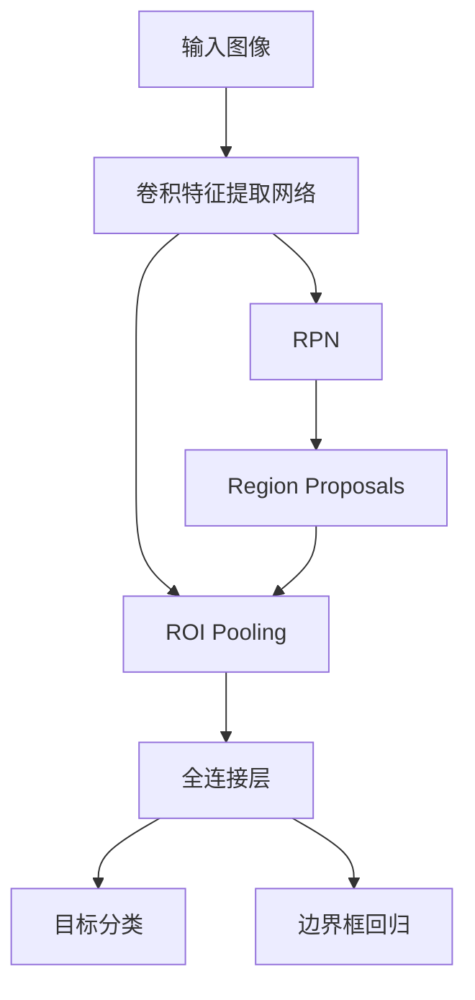

# Faster R-CNN原理与代码实例讲解

## 1.背景介绍

在计算机视觉领域,目标检测是一项极具挑战的任务,旨在定位图像中的目标对象并识别它们的类别。随着深度学习技术的快速发展,基于深度卷积神经网络(CNN)的目标检测算法取得了巨大进展,其中Faster R-CNN是一种广为人知且性能卓越的目标检测模型。

Faster R-CNN是R-CNN系列算法的最新进化版本,它将目标检测任务划分为两个子任务:候选区域提议和目标分类与边界框回归。与先前版本相比,Faster R-CNN引入了区域候选网络(RPN),可以高效地生成高质量的候选边界框,从而大大加快了目标检测的速度。

## 2.核心概念与联系

Faster R-CNN由两个主要模块组成:

1. **区域候选网络(RPN)**:负责生成候选目标边界框(Region Proposals)。
2. **目标检测网络**:基于RPN生成的候选框,执行目标分类和边界框回归。

这两个模块共享大部分卷积层,因此可以高效地进行端到端的训练。RPN和目标检测网络之间的联系如下所示:



## 3.核心算法原理具体操作步骤

### 3.1 区域候选网络(RPN)

RPN的主要作用是从输入图像中生成高质量的候选目标边界框。它的工作流程如下:

1. 在卷积特征图上滑动一个小型网络(3x3卷积层),生成两个输出:
   - 二值类别层(objectness score):用于判断该区域是否包含目标对象。
   - 边界框回归层(bounding box regression):对于每个锚框,对真实边界框的位置进行编码。

2. 通过软最大化(Soft-max)和边界框回归,生成候选目标边界框。

3. 应用非最大值抑制(NMS)去除重叠的冗余边界框。

### 3.2 目标检测网络

目标检测网络基于RPN生成的候选框,进行目标分类和精细边界框回归:

1. 对每个候选框,通过ROI Pooling层提取对应的特征图。
2. 将提取的特征输入全连接层,生成两个输出:
   - 目标分类概率
   - 精细边界框回归

3. 使用非最大值抑制(NMS)去除重叠的冗余检测结果。

## 4.数学模型和公式详细讲解举例说明

### 4.1 边界框回归

边界框回归是Faster R-CNN中的一个关键步骤,用于精确定位目标对象的边界框。它通过学习一个映射函数,将候选框映射到与真实边界框的偏移量。

给定一个候选框$P = (P_x, P_y, P_w, P_h)$和一个真实边界框$G = (G_x, G_y, G_w, G_h)$,我们定义如下四个坐标偏移量:

$$
\begin{aligned}
t_x &= (G_x - P_x) / P_w \
t_y &= (G_y - P_y) / P_h \
t_w &= \log(G_w / P_w) \
t_h &= \log(G_h / P_h)
\end{aligned}
$$

其中$t_x$和$t_y$表示中心坐标的偏移量,$t_w$和$t_h$表示宽度和高度的缩放因子。

在训练过程中,我们使用平滑$L_1$损失函数最小化这些偏移量的预测误差:

$$
\text{loss}_\text{reg}(t, t^*) = \sum_i \text{smooth}_{L_1}(t_i - t_i^*)
$$

其中$t$是预测的偏移量,$t^*$是真实的偏移量,平滑$L_1$损失函数定义如下:

$$
\text{smooth}_{L_1}(x) = \begin{cases}
0.5x^2 & \text{if } |x| < 1 \
|x| - 0.5 & \text{otherwise}
\end{cases}
$$

### 4.2 非最大值抑制(NMS)

非最大值抑制是一种常用的后处理技术,用于去除重叠的冗余检测结果。NMS的工作原理如下:

1. 对所有检测结果按照置信度降序排列。
2. 选择置信度最高的检测结果,将其添加到输出列表中。
3. 计算其余检测结果与当前选择结果的重叠程度(IoU)。
4. 移除与当前选择结果重叠程度较高(大于阈值)的检测结果。
5. 重复步骤2-4,直到所有检测结果都被处理。

## 5.项目实践:代码实例和详细解释说明

以下是使用PyTorch实现Faster R-CNN的简化版本代码:

```python
import torch
import torch.nn as nn
import torchvision

# 定义RPN模块
class RPN(nn.Module):
    def __init__(self, in_channels, out_channels):
        super(RPN, self).__init__()
        self.conv = nn.Conv2d(in_channels, out_channels, kernel_size=3, padding=1)
        self.objectness = nn.Conv2d(out_channels, 2, kernel_size=1)
        self.bbox_reg = nn.Conv2d(out_channels, 4, kernel_size=1)

    def forward(self, x):
        x = self.conv(x)
        objectness = self.objectness(x)
        bbox_reg = self.bbox_reg(x)
        return objectness, bbox_reg

# 定义ROI Pooling层
class ROIPooling(nn.Module):
    def __init__(self, output_size):
        super(ROIPooling, self).__init__()
        self.output_size = output_size

    def forward(self, features, rois):
        pooled_features = torchvision.ops.roi_pool(features, rois, self.output_size)
        return pooled_features

# 定义Faster R-CNN模型
class FasterRCNN(nn.Module):
    def __init__(self, backbone, rpn, roi_pooling, classifier, bbox_reg):
        super(FasterRCNN, self).__init__()
        self.backbone = backbone
        self.rpn = rpn
        self.roi_pooling = roi_pooling
        self.classifier = classifier
        self.bbox_reg = bbox_reg

    def forward(self, x, rois):
        features = self.backbone(x)
        objectness, bbox_reg = self.rpn(features)
        rois = self.generate_proposals(objectness, bbox_reg)
        pooled_features = self.roi_pooling(features, rois)
        classes = self.classifier(pooled_features)
        bbox_reg = self.bbox_reg(pooled_features)
        return classes, bbox_reg
```

上述代码定义了三个主要模块:

1. **RPN模块**:实现区域候选网络,生成目标对象的候选边界框。
2. **ROI Pooling层**:根据候选边界框从特征图中提取对应的特征。
3. **Faster R-CNN模型**:整合backbone网络(如VGG或ResNet)、RPN模块、ROI Pooling层、分类器和边界框回归器,实现端到端的目标检测。

在`forward`函数中,模型首先通过backbone网络提取输入图像的特征,然后使用RPN模块生成候选边界框。接下来,ROI Pooling层根据候选框从特征图中提取对应的特征,这些特征被输入到分类器和边界框回归器中,得到最终的目标检测结果。

## 6.实际应用场景

Faster R-CNN在各种计算机视觉任务中发挥着重要作用,包括但不限于:

- **目标检测**:在自动驾驶、安防监控、人脸识别等领域,准确检测图像中的目标对象是一项关键任务。
- **实例分割**:将目标检测和语义分割结合,可以实现对图像中每个实例对象的精确分割。
- **视频分析**:在视频流中跟踪和检测运动目标,用于行为分析、异常检测等应用。
- **医疗影像分析**:在医学影像中检测和定位病灶、肿瘤等异常区域,辅助医生诊断。

## 7.工具和资源推荐

- **PyTorch**:一个流行的深度学习框架,提供了Faster R-CNN的官方实现。
- **TensorFlow Object Detection API**:Google开源的目标检测API,包含了Faster R-CNN等多种模型。
- **OpenCV**:一个强大的计算机视觉库,可用于图像预处理和后处理。
- **COCO数据集**:一个广泛使用的目标检测和实例分割数据集,可用于训练和评估Faster R-CNN模型。

## 8.总结:未来发展趋势与挑战

虽然Faster R-CNN取得了卓越的性能,但它仍然存在一些局限性和挑战:

- **速度**:尽管比之前的R-CNN算法更快,但Faster R-CNN的推理速度仍然较慢,难以满足实时应用的需求。
- **小目标检测**:对于小目标的检测精度仍有提升空间。
- **计算资源**:训练Faster R-CNN模型需要大量的计算资源,对硬件要求较高。

未来,研究人员可能会集中在以下几个方向进行改进:

1. **模型压缩和加速**:通过模型剪枝、量化等技术,减小模型大小,提高推理速度。
2. **注意力机制**:引入注意力机制,提高对小目标和密集场景的检测能力。
3. **端到端训练**:探索更加端到端的训练方式,避免多阶段训练带来的误差累积。
4. **弱监督学习**:减少对大量标注数据的依赖,利用弱监督信号进行训练。

## 9.附录:常见问题与解答

1. **什么是RPN?**
   RPN(区域候选网络)是Faster R-CNN中的一个关键模块,用于高效地生成高质量的候选目标边界框。它共享大部分卷积层,因此可以与目标检测网络一起进行端到端的训练。

2. **Faster R-CNN与Fast R-CNN有什么区别?**
   Fast R-CNN使用选择性搜索算法生成候选框,而Faster R-CNN引入了RPN模块,可以更高效地生成候选框。此外,Faster R-CNN可以进行端到端的训练,而Fast R-CNN需要多阶段训练。

3. **为什么需要边界框回归?**
   边界框回归是一种精细调整边界框位置的技术,它通过学习一个映射函数,将候选框映射到与真实边界框的偏移量。这种方式可以提高目标定位的精度。

4. **非最大值抑制(NMS)是如何工作的?**
   NMS是一种后处理技术,用于去除重叠的冗余检测结果。它首先按照置信度降序排列所有检测结果,然后逐一选择置信度最高的结果,移除与之重叠程度较高的其他结果。

5. **Faster R-CNN的主要局限性是什么?**
   Faster R-CNN的主要局限性包括:推理速度较慢、对小目标的检测精度有待提高,以及训练过程对计算资源的需求较高。

作者:禅与计算机程序设计艺术 / Zen and the Art of Computer Programming