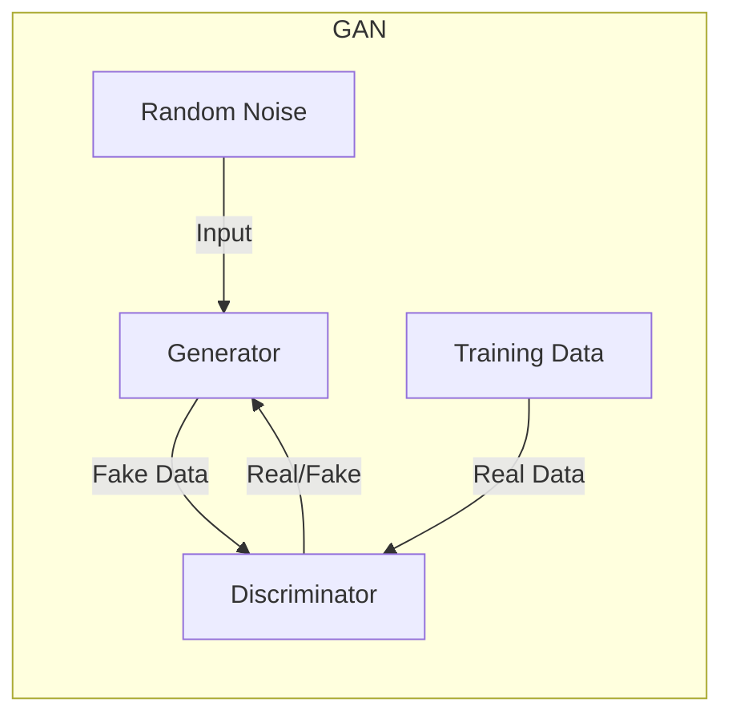
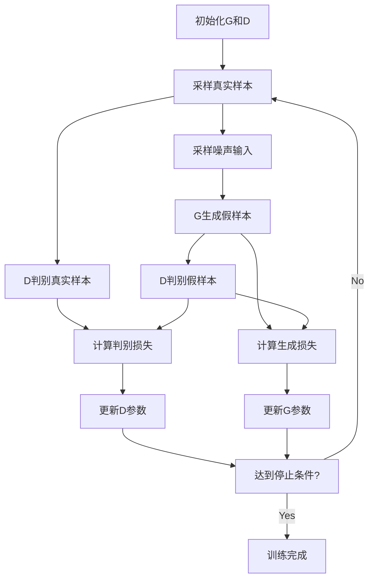

# Generative Adversarial Networks (GAN) 原理与代码实战案例讲解

## 1.背景介绍

### 1.1 生成模型的兴起

在深度学习领域中,生成模型近年来受到了极大的关注和重视。传统的判别模型(discriminative model)主要用于解决分类和回归等问题,而生成模型(generative model)则旨在学习数据的潜在分布,从而能够生成新的、未见过的数据样本。生成模型在计算机视觉、自然语言处理、音频合成等领域都有广泛的应用前景。

### 1.2 生成对抗网络(GAN)的提出

2014年,来自蒙特利尔大学的Ian Goodfellow等人在著名的论文"Generative Adversarial Networks"中首次提出了GAN的概念,开创性地将生成模型问题转化为一个由生成网络和判别网络相互对抗的minimax游戏,这种全新的思路为生成模型的发展带来了新的契机。

### 1.3 GAN的独特之处

相较于其他生成模型如VAE(Variational Auto-Encoder)、PixelRNN等,GAN最大的特点在于:

1. 直接在数据空间上学习生成,无需显式建模数据分布
2. 生成网络和判别网络相互对抗,相互促进,达到极大似然估计
3. 生成的样本质量高,细节丰富,接近真实数据分布

这些独特之处使得GAN在图像、语音、文本生成等领域展现出了巨大的潜力。

## 2.核心概念与联系

### 2.1 生成对抗网络的基本框架

GAN的核心思想是构建两个神经网络相互对抗:生成器(Generator)和判别器(Discriminator)。

- 生成器: 从随机噪声输入开始,尝试生成逼真的数据样本,希望能够欺骗判别器
- 判别器: 接收真实数据和生成器产生的数据,并对其真实性进行判别

两个网络相互对抗、相互博弈,生成器希望生成更逼真的样本去欺骗判别器,判别器则努力提高判别能力以更好地区分真伪样本。这种对抗性的训练过程会逐步提升生成器的生成质量。



### 2.2 生成器和判别器的目标函数

生成器G和判别器D的目标函数可以表示为:

$$\min_G \max_D V(D,G) = \mathbb{E}_{x\sim p_\text{data}(x)}[\log D(x)] + \mathbb{E}_{z\sim p_z(z)}[\log(1-D(G(z)))]$$

其中:
- $p_\text{data}$是真实数据的分布
- $p_z$是随机噪声$z$的分布,通常为高斯或均匀分布
- $G(z)$表示生成器根据噪声$z$生成的样本
- $D(x)$表示判别器对样本$x$为真实数据的置信度

生成器G希望最小化$\log(1-D(G(z)))$,即最大化$D(G(z))$,使生成的假样本能够欺骗判别器;而判别器D则希望最大化$\log D(x)$和$\log(1-D(G(z)))$,即正确识别真实样本和生成样本。

### 2.3 GAN训练的挑战

虽然GAN的思想十分优雅简洁,但实际训练过程中存在一些挑战:

1. **训练不稳定**: 由于生成器和判别器的对抗性质,训练过程中两者很容易陷入梯度消失或梯度爆炸的困境,导致训练不稳定。
2. **模式丢失(Mode Collapse)**: 生成器倾向于只生成有限种类的样本,而无法覆盖整个数据分布,这种现象被称为模式丢失。
3. **评估指标缺乏**: 缺乏通用的评估指标来衡量生成样本的质量和多样性。

研究人员提出了诸多改进方法来缓解这些问题,例如改进的损失函数、正则化方法、架构改进等,使得GAN的训练更加稳定和高效。

## 3.核心算法原理具体操作步骤

### 3.1 GAN的训练流程

GAN的训练过程可以概括为以下步骤:

1. 初始化生成器G和判别器D的参数
2. 从真实数据集采样一批真实样本
3. 从噪声先验分布(如高斯分布)采样一批噪声输入
4. 生成器G根据噪声输入生成一批假样本
5. 判别器D分别对真实样本和假样本进行判别,得到判别损失
6. 生成器G根据判别器D的判别结果,计算生成损失
7. 分别对判别器D和生成器G进行参数更新,最小化各自的损失
8. 重复上述步骤,直至达到停止条件(如训练轮次或损失阈值)



### 3.2 算法优化策略

为了提高GAN的训练稳定性和生成质量,研究人员提出了多种优化策略:

1. **改进的损失函数**:
   - Wasserstein GAN(WGAN)使用更稳定的Wasserstein距离作为损失函数
   - Least Squares GAN(LSGAN)使用最小二乘损失函数
2. **正则化方法**:
   - 梯度剪裁(Gradient Clipping)防止梯度爆炸
   - 梯度惩罚(Gradient Penalty)平滑判别器
3. **架构改进**:
   - 深度卷积网络结构提高生成质量
   - 条件GAN(Conditional GAN)引入条件信息控制生成过程
4. **训练技巧**:
   - 标签平滑(Label Smoothing)
   - 历史平均(Historical Averaging)
   - 两阶段训练(Two Time-Scale Update)

通过这些改进策略,GAN的训练更加稳定,生成质量也得到显著提升。

## 4.数学模型和公式详细讲解举例说明

### 4.1 原始GAN的数学模型

在原始GAN模型中,生成器G和判别器D的目标函数可表示为:

$$\min_G \max_D V(D,G) = \mathbb{E}_{x\sim p_\text{data}(x)}[\log D(x)] + \mathbb{E}_{z\sim p_z(z)}[\log(1-D(G(z)))]$$

其中:
- $p_\text{data}$是真实数据的分布
- $p_z$是随机噪声$z$的分布,通常为高斯或均匀分布
- $G(z)$表示生成器根据噪声$z$生成的样本
- $D(x)$表示判别器对样本$x$为真实数据的置信度

判别器D的目标是最大化对数似然,即最大化$\log D(x)$和$\log(1-D(G(z)))$,以正确识别真实样本和生成样本。而生成器G的目标是最小化$\log(1-D(G(z)))$,即最大化$D(G(z))$,使生成的假样本能够欺骗判别器。

在实践中,通常使用交叉熵损失函数来近似上述目标函数:

$$\ell_D = -\mathbb{E}_{x\sim p_\text{data}(x)}[\log D(x)] - \mathbb{E}_{z\sim p_z(z)}[\log(1-D(G(z)))]$$
$$\ell_G = -\mathbb{E}_{z\sim p_z(z)}[\log D(G(z))]$$

训练过程中,我们交替优化判别器D和生成器G,使得$\ell_D$最小化(即D能够很好地区分真伪样本),$\ell_G$最小化(即G能够生成足够逼真的样本欺骗D)。

### 4.2 Wasserstein GAN

虽然原始GAN的思想优雅简洁,但在实际训练过程中存在不稳定和模式丢失等问题。为了解决这些问题,Arjovsky等人在2017年提出了Wasserstein GAN(WGAN)。

WGAN的核心思想是使用更稳定的Wasserstein距离(也称为Earth Mover's Distance)作为生成器和真实数据分布之间的距离度量,取代原始GAN中的JS散度。Wasserstein距离可以定义为:

$$W(p_r, p_g) = \inf_{\gamma \in \Pi(p_r, p_g)} \mathbb{E}_{(x,y) \sim \gamma}[\|x-y\|]$$

其中$\Pi(p_r, p_g)$是两个分布$p_r$和$p_g$之间的耦合分布(coupling)的集合。

在WGAN中,判别器D被称为critic,其目标是估计出两个分布之间的Wasserstein距离:

$$\min_G \max_{D \in \mathcal{D}} \mathbb{E}_{x \sim p_r}[D(x)] - \mathbb{E}_{z \sim p_z}[D(G(z))]$$

其中$\mathcal{D}$是满足1-Lipschitz条件的函数集合,用于约束critic函数。

WGAN通过引入Wasserstein距离和Lipschitz约束,使得训练过程更加稳定,并在一定程度上缓解了模式丢失问题。但是,WGAN仍然存在一些缺陷,如权重膨胀和critic训练不足等。

### 4.3 Least Squares GAN

Least Squares GAN(LSGAN)是另一种改进的GAN变体,它使用最小二乘损失函数取代原始GAN中的交叉熵损失函数。LSGAN的目标函数可表示为:

$$\min_D \mathbb{E}_{x \sim p_r}[(D(x) - b)^2] + \mathbb{E}_{z \sim p_z}[(D(G(z)) - a)^2]$$
$$\min_G \mathbb{E}_{z \sim p_z}[(D(G(z)) - c)^2]$$

其中$a$、$b$和$c$是标量常数,通常设置为$a=0$、$b=1$和$c=1$。

使用最小二乘损失函数可以获得更平滑的梯度,从而提高训练稳定性。同时,LSGAN还具有一些其他优点,如更快的收敛速度和更好的生成质量。

### 4.4 条件生成对抗网络

在许多实际应用场景中,我们希望能够控制生成过程,使生成的样本满足特定的条件或属性。为此,Mirza和Osindero在2014年提出了条件生成对抗网络(Conditional GAN,简称CGAN)。

在CGAN中,生成器G和判别器D都会接收一个额外的条件信息$y$作为输入,其目标函数可表示为:

$$\min_G \max_D V(D,G) = \mathbb{E}_{x\sim p_\text{data}(x)}[\log D(x|y)] + \mathbb{E}_{z\sim p_z(z)}[\log(1-D(G(z|y)))]$$

其中$D(x|y)$表示判别器对于给定条件$y$下样本$x$为真实数据的置信度,$G(z|y)$表示生成器根据噪声$z$和条件$y$生成的样本。

通过引入条件信息$y$,CGAN能够控制生成过程,使生成的样本满足特定的属性或类别。条件信息可以是类别标签、文本描述、图像等,具有广泛的应用前景。

## 5.项目实践:代码实例和详细解释说明

在本节中,我们将通过一个实际的代码示例,演示如何使用PyTorch构建并训练一个基本的GAN模型,用于生成手写数字图像。

### 5.1 导入所需库

```python
import torch
import torch.nn as nn
import torchvision
import torchvision.transforms as transforms
import matplotlib.pyplot as plt
import numpy as np
```

### 5.2 加载MNIST数据集

```python
# 下载MNIST数据集
dataset = torchvision.datasets.MNIST(root='./data', download=True, transform=transforms.Compose([