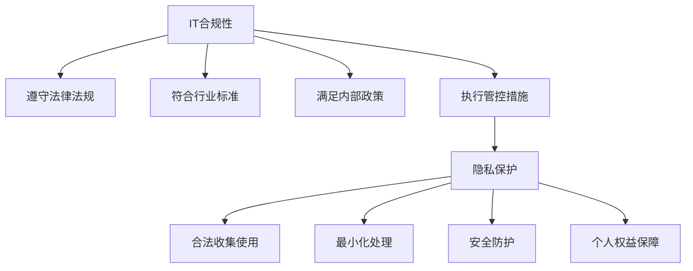

# IT合规性与隐私保护:确保组织合规运营

## 1. 背景介绍
### 1.1 IT合规性与隐私保护的重要性
在当今数字化时代,信息技术已深入各行各业,成为组织运营的关键支柱。然而,随着技术的发展,IT合规性和隐私保护面临着前所未有的挑战。数据泄露、网络攻击、违规操作等问题层出不穷,给组织带来巨大的经济损失和声誉损害。因此,确保IT合规性与隐私保护已成为组织生存发展的必要条件。

### 1.2 IT合规性与隐私保护面临的挑战
IT合规性与隐私保护面临诸多挑战:
1. 法律法规复杂多变,跨地域差异大,组织难以全面把控
2. 数据量爆炸式增长,传统安全措施难以应对
3. 新技术新应用不断涌现,合规风险点难以识别
4. 员工安全意识薄弱,内部威胁日益凸显
5. 供应链管理不善,第三方风险难以控制

### 1.3 IT合规性与隐私保护的目标
IT合规性与隐私保护的核心目标是最大限度降低组织的合规风险,保护关键数据资产,维护品牌声誉,促进业务可持续发展。这需要组织在战略、制度、流程、技术、人员等方面系统规划,全面提升合规管理能力。

## 2. 核心概念与联系
### 2.1 IT合规性的内涵
IT合规性是指组织在开展IT相关活动时,严格遵守法律法规、行业标准、内部政策等规范性要求,并建立必要的管理机制,有效控制IT风险。其内涵主要包括:
- 遵守外部法律法规要求,如GDPR、CCPA等隐私保护法案
- 满足行业监管要求,如PCI-DSS、HIPAA、SOX等
- 符合内部政策制度规定,如信息安全策略、数据分类分级制度等
- 执行必要的管控措施,如访问控制、数据加密、日志审计等

### 2.2 隐私保护的内涵
隐私保护是指组织在收集、存储、使用、共享个人信息时,采取必要措施,保障个人隐私权益不受侵犯。其内涵主要包括:
- 合法收集使用个人信息,告知并征得个人同意
- 最小化收集使用个人信息,去标识化脱敏处理
- 采取有效的安全防护措施,防止个人信息泄露
- 赋予个人对其信息的知情权、访问权、更正权、删除权等

### 2.3 IT合规性与隐私保护的关系
IT合规性和隐私保护密切相关,相辅相成:
- 隐私保护是IT合规的重要组成部分,诸多法律法规明确要求保护个人隐私
- IT合规为隐私保护提供制度保障,将隐私保护要求嵌入IT管理全过程
- 隐私保护促进IT合规能力提升,倒逼组织优化完善IT管理机制

下图展示了IT合规性与隐私保护的关系:



## 3. 核心算法原理具体操作步骤
### 3.1 隐私保护核心算法-数据脱敏
数据脱敏是隐私保护的关键技术,其核心是在保留数据分析价值的同时,去除数据中的隐私敏感信息,防止隐私泄露。常见的数据脱敏算法包括:
#### 3.1.1 数据加密
对敏感数据进行加密存储传输,只有授权的用户才能解密访问。加密算法有:
- 对称加密:加解密使用同一密钥,如AES、3DES等
- 非对称加密:加解密使用不同密钥,如RSA、ECC等
- 单向加密:只能加密不能解密,如MD5、SHA等哈希算法

#### 3.1.2 数据替换
用等价的假名、化名替换敏感信息,如:
- 用户ID替换姓名
- 街道替换具体地址
- 年龄段替换具体年龄

#### 3.1.3 数据扰动
在保留数据分布特征的前提下,对敏感数据添加随机噪声,如:
- 对位置坐标施加随机偏移
- 对交易金额施加随机浮动
- 对电话号码置换部分数字

#### 3.1.4 数据聚合
将多个记录汇总到更高层次,去除个体识别特征,如:
- 按地理区域而非具体地址统计
- 按收入水平而非具体工资统计
- 按年龄段而非具体年龄统计

### 3.2 隐私保护核心算法-差分隐私
差分隐私是隐私保护领域的重要理论,其核心思想是在数据发布时引入随机噪声,使得攻击者无法从发布数据中准确推断出个人隐私信息。差分隐私的数学定义为:

$Pr[A(D_1) \in S] \leq e^{\epsilon} \cdot Pr[A(D_2) \in S] + \delta$

其中,$A$为随机算法,$D_1$和$D_2$为相邻数据集,仅一条记录不同,$\epsilon$为隐私预算,$\delta$为置信度。差分隐私通过调节$\epsilon$和$\delta$在隐私保护和数据效用间取得平衡。

差分隐私的实现机制主要有:
#### 3.2.1 Laplace机制
对查询结果施加服从Laplace分布的噪声:

$\hat{f}(x) = f(x) + Lap(\frac{\Delta f}{\epsilon})$

其中,$f(x)$为原始查询结果,$\Delta f$为$f$的敏感度,$\epsilon$为隐私预算。

#### 3.2.2 指数机制
对候选结果集进行指数加权采样:

$Pr[R=r] = \frac{exp(\frac{\epsilon \cdot u(r)}{2\Delta u})}{\sum_{r' \in \mathcal{R}} exp(\frac{\epsilon \cdot u(r')}{2\Delta u})}$

其中,$u$为效用函数,$\Delta u$为$u$的敏感度,$\mathcal{R}$为候选结果集。

## 4. 数学模型和公式详细讲解举例说明
本节以差分隐私中的Laplace机制为例,详细讲解其数学模型和公式。

### 4.1 Laplace分布
Laplace机制的核心是利用Laplace分布生成随机噪声。Laplace分布的概率密度函数为:

$$f(x|\mu,b) = \frac{1}{2b} exp(-\frac{|x-\mu|}{b})$$

其中,$\mu$为位置参数,$b$为尺度参数。当$\mu=0$时,称为中心Laplace分布:

$$Lap(x|b) = \frac{1}{2b} exp(-\frac{|x|}{b})$$

### 4.2 敏感度
Laplace机制施加噪声的大小取决于查询函数$f$的敏感度$\Delta f$,其定义为:

$$\Delta f = \max_{D_1,D_2} ||f(D_1)-f(D_2)||_1$$

即$f$在任意两个相邻数据集上的最大$L_1$距离。直观地说,敏感度刻画了单个记录对查询结果的最大影响。

### 4.3 Laplace机制公式推导
给定查询函数$f$,其敏感度为$\Delta f$,隐私预算为$\epsilon$。为实现$\epsilon$-差分隐私,Laplace机制对$f$的真实输出施加噪声:

$$\hat{f}(x) = f(x) + Y$$

其中,$Y \sim Lap(\frac{\Delta f}{\epsilon})$。为什么选择Laplace分布,且尺度参数为$\frac{\Delta f}{\epsilon}$呢?这是因为:

$$\begin{aligned}
Pr[\hat{f}(D_1) = z] &= \frac{\epsilon}{2\Delta f} exp(-\frac{\epsilon |z-f(D_1)|}{\Delta f}) \
&\leq exp(\epsilon) \cdot \frac{\epsilon}{2\Delta f} exp(-\frac{\epsilon |z-f(D_2)|}{\Delta f}) \
&= exp(\epsilon) \cdot Pr[\hat{f}(D_2) = z]
\end{aligned}$$

即Laplace机制满足$\epsilon$-差分隐私的数学定义。

### 4.4 Laplace机制使用示例
假设需要发布一组用户的年龄分布,真实年龄分别为{25,32,27,29,35}。为保护隐私,使用Laplace机制处理:

1. 计算年龄分布直方图,每个年龄段人数为查询结果:
   - 20-30岁: 3人
   - 30-40岁: 2人

2. 敏感度$\Delta f=1$,因为单个用户年龄变化最多影响一个年龄段的人数

3. 设隐私预算$\epsilon=1$,则Laplace噪声参数$b=\frac{\Delta f}{\epsilon}=1$

4. 对每个年龄段人数施加Laplace噪声,得到差分隐私版年龄分布:
   - 20-30岁: $3+Lap(1)=2.2$
   - 30-40岁: $2+Lap(1)=2.8$

这样,在保留原始年龄分布形态的同时,有效保护了个人年龄隐私。

## 5. 项目实践:代码实例和详细解释说明
本节以Python为例,演示如何使用差分隐私库实现Laplace机制。

### 5.1 环境准备
首先安装差分隐私库PyDP:

```bash
pip install python-dp
```

### 5.2 导入依赖
导入所需的库:

```python
import numpy as np
from pydp.algorithms.laplacian import BoundedMean
```

### 5.3 生成示例数据
生成一组用户年龄数据:

```python
ages = np.random.randint(20, 60, size=1000)
```

### 5.4 计算真实均值
计算用户年龄的真实均值:

```python
true_mean = np.mean(ages)
print(f"True mean age: {true_mean:.2f}")
```

### 5.5 应用Laplace机制
使用PyDP的BoundedMean类应用Laplace机制:

```python
epsilon = 1.0
lower_bound = 0
upper_bound = 100

dp_mean = BoundedMean(epsilon, lower_bound, upper_bound)
dp_ages = dp_mean.quick_result(ages)

print(f"DP mean age: {dp_ages:.2f}")
```

其中,`epsilon`为隐私预算,`lower_bound`和`upper_bound`为年龄的上下界。

### 5.6 结果分析
比较真实均值和差分隐私均值:

```python
print(f"Difference: {abs(true_mean - dp_ages):.2f}")
```

可以看到,差分隐私均值与真实均值存在一定偏差,这是加入Laplace噪声导致的。调节`epsilon`可以控制隐私保护强度和数据效用之间的平衡。

## 6. 实际应用场景
IT合规性与隐私保护在各行业广泛应用,典型场景包括:

### 6.1 金融行业
- 合规要求:PCI DSS、SOX、GLBA等
- 隐私保护:客户个人信息、交易记录、财务数据等

### 6.2 医疗行业
- 合规要求:HIPAA、GDPR等
- 隐私保护:患者健康信息、诊疗记录、基因数据等

### 6.3 政府机构
- 合规要求:FISMA、CJIS等
- 隐私保护:公民身份信息、税务记录、司法数据等

### 6.4 教育行业
- 合规要求:FERPA、COPPA等
- 隐私保护:学生学籍信息、成绩记录、行为数据等

### 6.5 电商行业
- 合规要求:CCPA、PIPEDA等
- 隐私保护:用户账户信息、浏览记录、购物数据等

## 7. 工具和资源推荐
以下是一些有助于IT合规性与隐私保护实践的工具和资源:

### 7.1 合规管理工具
- RSA Archer:集成化IT风险合规管理平台
- MetricStream:全面的GRC(治理、风险、合规)解决方案
-