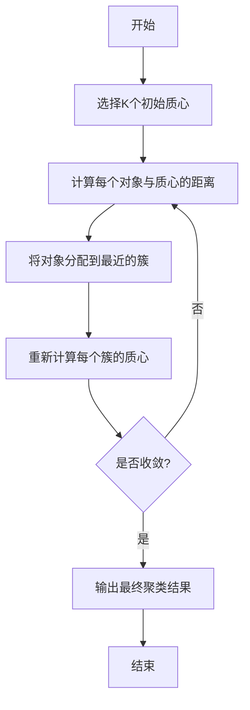

非常感谢您的任务委托。以下是关于"K-Means 聚类"的技术博客文章正文内容:

# K-Means 聚类 (K-Means Clustering)

## 1. 背景介绍

### 1.1 什么是聚类

聚类是一种无监督学习技术,旨在根据数据之间的相似性对数据进行分组。聚类的目标是将数据集中的对象分成多个簇(clusters),使得同一簇内的对象相似度较高,而不同簇之间的对象相似度较低。

聚类分析在许多领域都有广泛应用,例如:

- 市场细分
- 社交网络分析
- 计算机视觉与图像分割
- 基因组学数据分析
- 网页挖掘与推荐系统
- 异常检测等

### 1.2 聚类算法分类

常见的聚类算法可分为以下几类:

- **原型聚类**: K-Means, K-Medoids, EM算法
- **密度聚类**: DBSCAN, OPTICS, MeanShift
- **层次聚类**: AGNES, DIANA
- **基于网格的聚类**: STING, WaveCluster
- **基于模型的聚类**: EM聚类
- **约简聚类**: BIRCH, CURE

其中,K-Means是最经典且应用最广泛的原型聚类算法之一。

## 2. 核心概念与联系

### 2.1 K-Means 聚类概述

K-Means聚类算法的核心思想是通过迭代最小化数据对象与其所属簇质心的距离平方和,从而达到最佳聚类效果。算法会随机选取K个初始质心,然后将每个数据对象分配到与其最近的质心所对应的簇,重新计算每个簇的质心,重复上述过程直至收敛。

K-Means算法具有以下优点:

- 简单高效,容易实现
- 可以解决大规模数据集的聚类问题
- 对初始值不太敏感,收敛速度快

但也存在一些缺陷:

- 需要预先指定聚类数K
- 对噪声和异常值敏感
- 无法处理非凸形状的簇
- 簇大小差异较大时,效果不佳

### 2.2 核心要素

K-Means算法的核心要素包括:

1. **距离度量**
   常用的距离度量有欧氏距离、曼哈顿距离、余弦相似度等。
2. **质心计算**
   质心是簇内所有对象的中心点,可由簇内对象的均值计算得到。
3. **簇分配规则**
   每个对象被分配到与其最近的质心所对应的簇。
4. **收敛条件**
   当簇分配不再发生变化时,算法终止并收敛。

### 2.3 算法流程

K-Means算法的基本流程如下所示:



## 3. 核心算法原理具体操作步骤

K-Means算法的主要步骤如下:

1. **初始化K个质心**
   通常随机选取K个数据对象作为初始质心。
2. **计算每个数据对象与质心的距离**
   常用欧氏距离或其他距离度量。
3. **将每个对象分配到最近的簇**
   对于每个对象,计算其与所有质心的距离,将其分配到距离最近的簇。
4. **更新每个簇的质心**
   对于每个簇,重新计算其所有对象的均值作为新的质心。
5. **检查收敛条件**
   如果簇分配发生变化,则返回步骤2,否则算法终止。

算法伪代码如下:

```python
输入: 数据集D, 簇数K
输出: 数据对象的簇分配

1. 随机选取K个对象作为初始质心
2. repeat
3.     for each 对象x in D:
4.         计算x与每个质心的距离
5.         将x分配到最近的簇
6.     for each 簇C:
7.         更新C的质心为C内所有对象的均值
8. until 簇分配不再发生变化
9. return 最终的簇分配
```

## 4. 数学模型和公式详细讲解举例说明

### 4.1 距离度量

K-Means算法中常用的距离度量包括:

1. **欧氏距离(Euclidean Distance)**

对于两个n维向量$\vec{x}=(x_1, x_2, \dots, x_n)$和$\vec{y}=(y_1, y_2, \dots, y_n)$, 欧氏距离定义为:

$$d(\vec{x}, \vec{y})=\sqrt{\sum_{i=1}^{n}(x_i-y_i)^2}$$

例如, 对于$\vec{x}=(1, 3)$和$\vec{y}=(4, 5)$, 欧氏距离为:

$$d(\vec{x}, \vec{y})=\sqrt{(1-4)^2+(3-5)^2}=\sqrt{9+4}=\sqrt{13}$$

2. **曼哈顿距离(Manhattan Distance)**

曼哈顿距离是各维度上的绝对差值之和:

$$d(\vec{x}, \vec{y})=\sum_{i=1}^{n}|x_i-y_i|$$

对于同样的例子$\vec{x}=(1, 3)$和$\vec{y}=(4, 5)$, 曼哈顿距离为:

$$d(\vec{x}, \vec{y})=|1-4|+|3-5|=3+2=5$$

3. **余弦相似度(Cosine Similarity)**

余弦相似度测量两个向量的夹角余弦值, 范围在[-1, 1]之间。两个向量越接近, 夹角越小, 余弦值越接近1。

$$\text{sim}(\vec{x}, \vec{y})=\cos(\theta)=\frac{\vec{x}\cdot\vec{y}}{\|\vec{x}\|\|\vec{y}\|}=\frac{\sum_{i=1}^{n}x_iy_i}{\sqrt{\sum_{i=1}^{n}x_i^2}\sqrt{\sum_{i=1}^{n}y_i^2}}$$

余弦相似度通常用于文本挖掘、推荐系统等领域。

### 4.2 簇内平方和

K-Means算法的目标是最小化所有簇的簇内平方和:

$$J=\sum_{j=1}^{K}\sum_{\vec{x}\in C_j}\|\vec{x}-\vec{\mu}_j\|^2$$

其中:
- $K$是簇的个数
- $C_j$是第$j$个簇
- $\vec{\mu}_j$是第$j$个簇的质心
- $\|\vec{x}-\vec{\mu}_j\|^2$是数据对象$\vec{x}$与其所属簇质心$\vec{\mu}_j$的欧氏距离的平方

最小化簇内平方和等价于最大化簇间平方和, 从而达到较好的簇间分离效果。

### 4.3 质心计算

对于第$j$个簇$C_j$, 其质心$\vec{\mu}_j$的计算公式为:

$$\vec{\mu}_j=\frac{1}{|C_j|}\sum_{\vec{x}\in C_j}\vec{x}$$

即簇内所有对象的均值向量。

## 5. 项目实践: 代码实例和详细解释说明

以下是使用Python和Scikit-Learn库实现K-Means聚类的示例代码:

```python
from sklearn.cluster import KMeans
import numpy as np

# 生成示例数据
X = np.array([[1, 2], [1, 4], [1, 0],
              [10, 2], [9, 3], [10, 5]])

# 初始化KMeans对象
kmeans = KMeans(n_clusters=2, random_state=0)

# 执行聚类
labels = kmeans.fit_predict(X)

# 输出聚类结果
print("Cluster labels:")
print(labels)

print("\nCluster centers:")
print(kmeans.cluster_centers_)
```

代码解释:

1. 首先导入KMeans类和NumPy库。
2. 生成一个包含6个二维数据点的示例数据集X。
3. 初始化KMeans对象,设置簇数为2,并设置随机种子以获得可重复的结果。
4. 调用fit_predict()方法执行聚类,将数据集X输入,得到每个数据点的簇标签labels。
5. 输出每个数据点的簇标签。
6. 输出每个簇的质心坐标。

运行结果:

```
Cluster labels:
[1 1 1 0 0 0]

Cluster centers:
[[ 9.66666667  3.33333333]
[ 1.          2.        ]]
```

可以看到,数据点被划分为两个簇,第一个簇包含前三个点,质心在(1, 2)附近;第二个簇包含后三个点,质心在(9.67, 3.33)附近。

## 6. 实际应用场景

K-Means聚类在以下场景中有广泛应用:

1. **客户细分与营销**
   根据客户的购买行为、人口统计特征等对客户进行细分,从而制定有针对性的营销策略。

2. **图像分割**
   将图像像素根据颜色或纹理特征聚类,实现图像分割、对象检测等任务。

3. **文本挖掘**
   将文档按主题聚类,用于文档浏览、搜索引擎等。

4. **基因表达数据分析**
   将基因表达数据聚类,分析不同基因在不同条件下的表达模式。

5. **异常检测**
   将正常数据聚类,将离群点视为异常值进行检测。

6. **推荐系统**
   根据用户的浏览记录、购买习惯等对用户进行聚类,为不同用户群提供个性化推荐。

## 7. 工具和资源推荐

以下是一些流行的K-Means聚类工具和资源:

- **Scikit-Learn**
  Python机器学习库,提供了KMeans类的实现。
- **Apache Spark MLlib**
  Spark的机器学习库,支持分布式K-Means聚类。
- **Weka**
  著名的Java机器学习工具,包含K-Means聚类算法。
- **R语言**
  统计分析语言,有多个聚类算法包可用,如cluster。
- **Elki**
  Java数据挖掘软件,提供多种聚类算法的高效实现。
- **Coursera机器学习课程**
  Andrew Ng的经典机器学习课程,有K-Means聚类部分。
- **Pattern Classification (第二版)作者: Richard O. Duda等**
  经典的模式识别教材,对聚类算法有深入探讨。

## 8. 总结: 未来发展趋势与挑战

### 8.1 发展趋势

K-Means聚类算法仍在持续改进和发展,未来可能的发展趋势包括:

1. **大规模数据集的并行化实现**
   通过分布式计算框架(如Spark)实现K-Means的并行化,提高大规模数据集的聚类效率。

2. **集成多种启发式方法**
   结合其他启发式算法(如遗传算法、模拟退火等)选择合适的初始质心,提高聚类效果。

3. **增量式K-Means**
   支持动态数据集,在新数据到来时能够增量式地更新聚类结果。

4. **软聚类与概率模型**
   融合概率模型,实现软聚类,估计每个数据对象属于各个簇的概率。

5. **约束聚类**
   在聚类过程中加入must-link、cannot-link等先验知识约束,指导聚类过程。

### 8.2 挑战

K-Means聚类仍面临一些挑战:

1. **确定最佳簇数K**
   目前缺乏通用的自动确定最佳K值的方法,需要依赖经验或启发式方法。

2. **处理非凸形状簇**
   K-Means难以很好地处理非凸形状的簇,可能需要结合密度聚类等其他算法。

3. **高维数据的"维数灾难"**
   在高维空间中,数据趋向于均匀分布,距离计算也会失去意义,需特殊处理。

4. **数据规模扩展**
   对于大规模数据集,传统的K-Means算法会遇到效率和内存瓶颈,需要并行化等优化。

5. **噪声和异常