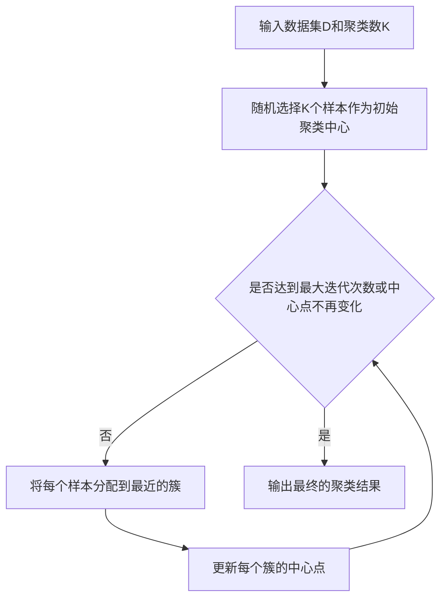

# K-Means算法调优：寻找最佳聚类方案

## 1. 背景介绍
### 1.1 聚类分析概述
#### 1.1.1 聚类的定义与目的
聚类分析是一种无监督学习方法,其目的是将相似的对象归到同一个簇中,不相似的对象归到不同的簇中。通过聚类,我们可以发现数据内在的分布结构和规律,从而更好地理解和利用数据。

#### 1.1.2 聚类在实际中的应用
聚类分析在实际中有广泛的应用,例如:
- 客户细分:根据客户的属性、行为等将其分为不同的群体,制定针对性的营销策略
- 图像分割:将图像划分为不同的区域,如前景和背景
- 异常检测:通过聚类识别出异常的数据点
- 推荐系统:根据用户的兴趣爱好将其聚类,实现个性化推荐

### 1.2 K-Means算法简介
#### 1.2.1 K-Means的基本原理
K-Means是一种典型的基于划分的聚类算法。它通过迭代的方式,不断更新簇的中心点和每个样本的簇标记,最终收敛得到聚类结果。其基本步骤如下:
1. 随机选择K个初始聚类中心点
2. 计算每个样本到各个中心点的距离,将其分配到距离最近的簇
3. 更新每个簇的中心点为该簇内所有样本的均值
4. 重复步骤2-3,直到簇的中心点不再变化或达到最大迭代次数

#### 1.2.2 K-Means的优缺点分析
K-Means算法的主要优点有:
- 原理简单,易于实现
- 计算复杂度较低,适合处理大规模数据
- 当簇是凸形、大小差不多时效果较好

同时K-Means也存在一些缺点:
- 需要预先指定聚类数K
- 对噪声和异常点敏感
- 容易陷入局部最优
- 对非凸形的簇效果不佳

## 2. 核心概念与联系
### 2.1 距离度量
#### 2.1.1 欧氏距离
欧氏距离是最常用的距离度量,表示两点之间的直线距离。对于n维空间中的两个点 $x=(x_1,x_2,...,x_n)$ 和 $y=(y_1,y_2,...,y_n)$,其欧氏距离为:

$$d(x,y)=\sqrt{\sum_{i=1}^n (x_i-y_i)^2}$$

#### 2.1.2 曼哈顿距离
曼哈顿距离,也称为城市街区距离或L1距离,表示在网格中从一个点到另一个点的最短路径距离。其计算公式为:

$$d(x,y)=\sum_{i=1}^n |x_i-y_i|$$

#### 2.1.3 余弦相似度
余弦相似度通过计算两个向量夹角的余弦值来衡量它们的相似程度。余弦值越接近1,表示两个向量方向越接近,也就是相似度越高。其计算公式为:

$$\cos(\theta)=\frac{x \cdot y}{||x|| \cdot ||y||}=\frac{\sum_{i=1}^n x_iy_i}{\sqrt{\sum_{i=1}^n x_i^2} \sqrt{\sum_{i=1}^n y_i^2}}$$

### 2.2 聚类评估指标
#### 2.2.1 SSE(Sum of Squared Error)
SSE表示各个簇内样本与簇中心点距离的平方和,反映了簇内的紧凑程度。SSE越小,说明簇内样本越紧凑,聚类效果越好。其计算公式为:

$$SSE=\sum_{i=1}^k \sum_{x \in C_i} ||x-\mu_i||^2$$

其中,$k$为簇的个数,$C_i$为第$i$个簇,$\mu_i$为第$i$个簇的中心点。

#### 2.2.2 轮廓系数(Silhouette Coefficient)
轮廓系数综合考虑了簇内的紧凑度和簇间的分离度。对于样本$i$,设$a(i)$为$i$到同簇其他样本的平均距离,$b(i)$为$i$到其他簇所有样本的最小平均距离,则其轮廓系数为:

$$s(i)=\frac{b(i)-a(i)}{max\{a(i),b(i)\}}$$

轮廓系数的取值范围为[-1,1],值越大表示聚类效果越好。将所有样本的轮廓系数取平均,即可得到整个聚类结果的轮廓系数。

### 2.3 K值选择方法
#### 2.3.1 手肘法(Elbow Method)
手肘法的思路是随着$k$的增大,SSE会不断减小。但是当$k$增大到一定程度后,SSE的下降速度会明显放缓,形成一个肘部。肘部对应的$k$值通常就是较为合适的聚类数。

#### 2.3.2 轮廓系数法
计算不同$k$值下的平均轮廓系数,选择轮廓系数最大的$k$值作为最佳聚类数。

## 3. 核心算法原理具体操作步骤
### 3.1 K-Means算法流程


### 3.2 K-Means++初始化
为了改进K-Means容易受初始中心点影响的问题,K-Means++提出了一种更加合理的初始化策略:
1. 随机选择一个样本作为第一个中心点
2. 对于每个样本$x$,计算其与已选中心点的最短距离$D(x)$
3. 以概率$\frac{D(x)^2}{\sum_{x \in D} D(x)^2}$选择下一个中心点
4. 重复2-3步,直到选出K个中心点

### 3.3 二分K-Means
二分K-Means是一种层次聚类方法,通过递归地进行2-Means聚类来得到最终的K个簇:
1. 将所有样本视为一个簇
2. 对当前的每个簇:
   a. 使用K-Means++初始化2个中心点
   b. 进行2-Means聚类
   c. 计算划分后的SSE,选择SSE最低的划分方案
3. 重复步骤2,直到得到K个簇

## 4. 数学模型和公式详细讲解举例说明
### 4.1 目标函数
K-Means的目标是最小化所有样本与其所属簇中心点的距离平方和,即SSE。设样本集 $D=\{x_1,x_2,...,x_n\}$,簇的中心点集合 $C=\{\mu_1,\mu_2,...,\mu_k\}$,样本 $x_i$ 的簇标记为 $\lambda_i \in \{1,2,...,k\}$,则K-Means的目标函数为:

$$J(C)=\sum_{i=1}^n ||x_i-\mu_{\lambda_i}||^2$$

### 4.2 样本分配
在每一轮迭代中,K-Means根据当前的中心点集合$C$,将每个样本分配到距离最近的簇。对于样本$x_i$,其簇标记为:

$$\lambda_i=\arg\min_{j \in \{1,2,...,k\}} ||x_i-\mu_j||^2$$

### 4.3 中心点更新
在重新分配样本后,K-Means通过计算每个簇内样本的均值来更新簇的中心点。设第$j$个簇 $C_j=\{x|λ_x=j\}$,则其新的中心点为:

$$\mu_j=\frac{1}{|C_j|} \sum_{x \in C_j} x$$

### 4.4 算法收敛性分析
可以证明,K-Means每一轮迭代都会使得目标函数$J(C)$单调递减。因为样本分配步骤保证了每个样本到其所属簇中心点的距离最小,而中心点更新步骤则使得每个簇内样本到中心点的距离平方和最小。因此,K-Means最终一定会收敛到一个稳定状态。

## 5. 项目实践：代码实例和详细解释说明
下面是使用Python实现K-Means算法的示例代码:

```python
import numpy as np

class KMeans:
    def __init__(self, n_clusters, max_iter=300):
        self.n_clusters = n_clusters
        self.max_iter = max_iter
        self.centroids = None
        self.labels = None

    def fit(self, X):
        # 随机选择初始中心点
        idx = np.random.choice(X.shape[0], self.n_clusters, replace=False)
        self.centroids = X[idx]

        for _ in range(self.max_iter):
            # 样本分配
            distances = self._calc_distances(X)
            self.labels = np.argmin(distances, axis=1)

            # 中心点更新
            for i in range(self.n_clusters):
                self.centroids[i] = X[self.labels == i].mean(axis=0)

    def _calc_distances(self, X):
        distances = np.zeros((X.shape[0], self.n_clusters))
        for i in range(self.n_clusters):
            distances[:, i] = np.linalg.norm(X - self.centroids[i], axis=1)
        return distances

    def predict(self, X):
        distances = self._calc_distances(X)
        return np.argmin(distances, axis=1)
```

主要步骤说明:
1. 在`__init__`方法中初始化聚类数`n_clusters`和最大迭代次数`max_iter`
2. `fit`方法传入训练数据`X`,随机选择`n_clusters`个样本作为初始中心点
3. 在每一轮迭代中:
   - 调用`_calc_distances`计算每个样本到各个中心点的距离
   - 将每个样本分配到距离最近的簇,更新`labels`
   - 对于每个簇,计算簇内样本的均值,更新对应的中心点
4. `predict`方法传入新的数据`X`,计算每个样本到各个中心点的距离,返回距离最近的簇标记

使用示例:
```python
from sklearn.datasets import make_blobs

# 生成示例数据
X, _ = make_blobs(n_samples=1000, centers=4, random_state=42)

# 构建K-Means模型
kmeans = KMeans(n_clusters=4)
kmeans.fit(X)

# 预测新样本的簇标记
new_X, _ = make_blobs(n_samples=10, centers=4, random_state=42)
labels = kmeans.predict(new_X)
```

## 6. 实际应用场景
### 6.1 客户细分
某电商平台希望对用户进行分群,以便开展针对性的营销活动。可以收集用户的属性特征(如年龄、性别、地域等)和行为特征(如购买频率、购买金额、浏览商品类别等),然后使用K-Means进行聚类分析。通过观察不同簇的特点,可以发现不同用户群体的共性,从而制定差异化的营销策略。

### 6.2 图像分割
在图像处理中,K-Means可以用于对图像进行分割。将图像的像素点看作样本,像素的颜色值(如RGB)看作特征,然后进行K-Means聚类。聚类后得到的每个簇对应图像中的一个区域,从而实现图像分割的目的。通过调整聚类数K,可以控制分割的粒度。

### 6.3 文本主题发现
K-Means还可以用于文本数据的主题发现。首先需要对文本进行预处理和特征提取,得到文档-词频矩阵。然后将每篇文档看作一个样本,词频向量看作特征,进行K-Means聚类。聚类后的每个簇对应一个主题,通过观察每个簇内的高频词,可以推测主题的含义。这种方法可以帮助快速了解文本数据的主要内容。

## 7. 工具和资源推荐
### 7.1 scikit-learn
scikit-learn是Python机器学习领域的著名库,提供了K-Means等多种聚类算法的高效实现。其API设计简洁明了,适合快速上手和实践。同时还内置了多种聚类评估指标,如