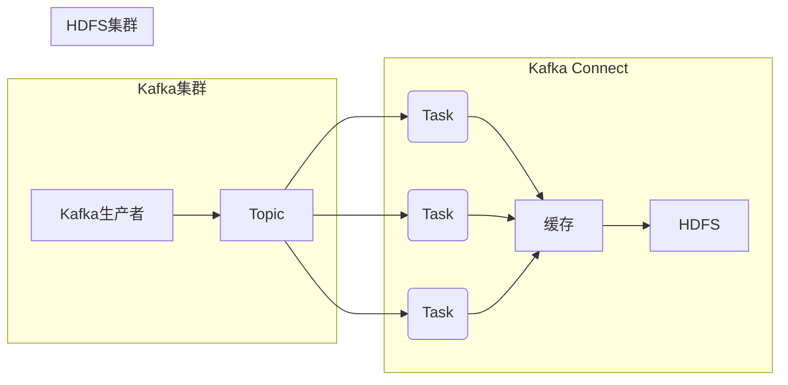

# KafkaConnect：对接HadoopHDFS的实践

## 1.背景介绍

在当今大数据时代，数据的采集、传输和存储是至关重要的。Apache Kafka作为一个分布式流处理平台,已经广泛应用于各种场景。而Hadoop分布式文件系统HDFS则是大数据存储的核心组件之一。将Kafka与HDFS对接,可以实现将Kafka中的数据持久化存储到HDFS,为后续的数据分析和处理奠定基础。

Kafka Connect是Kafka提供的一个组件,用于构建可重用的生产者或消费者,将Topics与外部系统进行集成。通过Kafka Connect,我们可以轻松地将Kafka与HDFS对接,实现数据的无缝流动。

## 2.核心概念与联系

### 2.1 Kafka Connect概念

Kafka Connect由以下几个核心概念组成:

- **Connect Cluster**: 运行Connect的一个或多个机器的集群。
- **Worker**: Connect Cluster中的单个进程实例,负责执行实际的连接器逻辑。
- **Connector**: 实现将数据从特定系统拉取或推送到特定系统的可重用组件。
- **Task**: Connector的工作单元,实际执行数据拷贝工作。

### 2.2 HDFS概念

HDFS是Hadoop分布式文件系统的核心,具有以下主要特点:

- 高容错性:通过数据块的复制实现故障恢复。
- 适合批量数据处理:一次写入,多次读取模式。
- 可构建在廉价的机器上:通过软件解决数据冗余与故障恢复问题。

### 2.3 Kafka与HDFS集成

将Kafka与HDFS集成,可以充分利用两者的优势:

- 使用Kafka进行实时数据采集和处理。
- 利用HDFS的高容错性和可扩展性进行数据持久化存储。
- 为后续的批量数据分析处理提供数据源。

## 3.核心算法原理具体操作步骤

### 3.1 Kafka Connect工作原理

Kafka Connect的工作原理可以概括为以下几个步骤:

1. **配置Connector**: 首先需要配置要使用的Connector,包括Connector类型、目标系统信息等。
2. **创建Task**: Connect Worker根据Connector配置创建Task实例。
3. **执行Task**: Task实例执行具体的数据拷贝工作,例如从Kafka消费数据或向Kafka生产数据。
4. **记录Offset**: Task会定期记录数据处理的Offset,以便故障恢复时继续执行。

### 3.2 HDFS Connector配置

要将Kafka数据导入HDFS,我们需要配置HDFS Sink Connector。主要配置项包括:

- `connector.class`: 指定使用的Connector实现类。
- `tasks.max`: 用于执行Connector的最大Task数量。
- `topics`: 需要从Kafka消费的Topic列表。
- `hdfs.url`: HDFS的URL地址。
- `flush.size`: 写入HDFS前缓存的记录数。
- `rotate.interval.ms`: 周期性地将数据刷新到HDFS的时间间隔。

### 3.3 HDFS Sink Connector工作流程

HDFS Sink Connector的工作流程如下:

1. **从Kafka消费数据**: Task从配置的Topic中消费数据。
2. **缓存数据**: 消费的数据会先缓存在内存中。
3. **周期性刷新**: 当缓存数据达到`flush.size`或超过`rotate.interval.ms`时,将数据刷新到HDFS。
4. **HDFS存储策略**: 可以配置数据在HDFS上的存储路径、文件名格式等。
5. **记录Offset**: 将已处理数据的Offset持久化,以便故障恢复。

## 4.数学模型和公式详细讲解举例说明

在Kafka Connect与HDFS集成过程中,并没有直接涉及复杂的数学模型和公式。但是,我们可以从数据吞吐量的角度,对Kafka Connect的性能进行简单建模和分析。

假设Kafka集群中有N个Broker,每个Broker可以支持的最大吞吐量为B(MB/s)。那么整个Kafka集群的最大吞吐量可以表示为:

$$
T_{max} = N \times B
$$

对于Kafka Connect,我们可以配置M个Task同时从Kafka消费数据,每个Task的消费速率为R(MB/s)。那么Kafka Connect的最大消费能力为:

$$
C_{max} = M \times R
$$

为了避免数据积压,我们需要保证:

$$
C_{max} \geq T_{max}
$$

也就是:

$$
M \times R \geq N \times B
$$

在实际场景中,我们还需要考虑其他因素,如网络带宽、HDFS写入速度等,来合理设置Kafka Connect的并发度M和Task消费速率R,以达到最佳的数据传输效率。

## 5.项目实践:代码实例和详细解释说明

### 5.1 安装部署Kafka Connect

首先,我们需要安装并启动Kafka Connect集群。可以在Kafka安装包的`bin`目录下执行以下命令:

```bash
# 启动Connect Worker
bin/connect-distributed.sh config/connect-distributed.properties
```

### 5.2 配置HDFS Sink Connector

接下来,我们需要配置HDFS Sink Connector。创建一个JSON配置文件`hdfs-sink.properties`,内容如下:

```json
{
  "name": "hdfs-sink-connector",
  "config": {
    "connector.class": "io.confluent.connect.hdfs.HdfsSinkConnector",
    "tasks.max": "3",
    "topics": "test-topic",
    "hdfs.url": "hdfs://namenode:8020",
    "flush.size": "3",
    "rotate.interval.ms": "60000",
    "partitioner.class": "io.confluent.connect.storage.partitioner.DefaultPartitioner",
    "format.class": "io.confluent.connect.hdfs.parquet.ParquetFormat",
    "schema.compatibility": "BACKWARD"
  }
}
```

上面的配置指定了要消费的Topic为`test-topic`,数据将以Parquet格式存储在HDFS上。`flush.size`和`rotate.interval.ms`分别控制缓存数据的大小和时间间隔。

### 5.3 启动HDFS Sink Connector

使用以下命令启动HDFS Sink Connector:

```bash
curl -X POST -H "Content-Type: application/json" --data @hdfs-sink.properties http://localhost:8083/connectors
```

此时,Kafka Connect就会开始从`test-topic`消费数据,并将其存储到HDFS上。

### 5.4 数据流向示意图

整个数据流向可以用下面的Mermaid流程图来表示:



## 6.实际应用场景

将Kafka与HDFS对接,可以应用于多种实际场景:

- **日志数据收集**: 将各种应用程序的日志数据实时收集到Kafka,再持久化存储到HDFS,为后续的日志分析提供数据源。
- **物联网数据处理**: 物联网设备产生的海量数据可以先在Kafka进行缓存,再导入HDFS进行离线分析和建模。
- **电商用户行为数据**: 电商网站的用户行为数据可以先在Kafka进行实时处理,再存储到HDFS,为精准营销等场景提供数据支持。

## 7.工具和资源推荐

- **Kafka Tool**: 一款开源的Kafka Web UI管理工具,可以方便地查看Topic、消费者组、Broker等信息。
- **HDFS Web UI**: HDFS自带的Web UI,可以直观地查看HDFS的文件系统结构和存储情况。
- **Apache Kafka官网**: https://kafka.apache.org/
- **Confluent Hub**: https://www.confluent.io/hub/ 提供了丰富的Kafka Connect Connector。

## 8.总结:未来发展趋势与挑战

### 8.1 发展趋势

Kafka Connect作为Kafka与外部系统集成的重要组件,未来将会有以下发展趋势:

- **更多Connector支持**: 将支持与更多系统集成,如云存储、消息队列等。
- **简化配置**: Connector配置将变得更加简单和智能化。
- **性能优化**: 提高Connector的吞吐量和稳定性。
- **云原生支持**: 更好地支持在云环境中部署和运行。

### 8.2 挑战

在实际应用中,Kafka Connect与HDFS集成也面临一些挑战:

- **数据一致性**: 如何保证Kafka和HDFS中数据的一致性。
- **故障恢复**: 在发生故障时,如何保证数据不丢失、不重复。
- **性能瓶颈**: 随着数据量的增长,如何解决性能瓶颈问题。
- **运维复杂度**: 管理和监控分布式系统带来的运维复杂度。

## 9.附录:常见问题与解答

### 9.1 为什么要将Kafka数据存储到HDFS?

将Kafka数据存储到HDFS,主要有以下几个原因:

1. **数据持久化**: Kafka是一个分布式流处理平台,数据存储是暂时的。将数据存储到HDFS,可以实现长期的持久化存储。
2. **离线分析**: HDFS适合存储大量的历史数据,为后续的离线分析和批量处理提供数据源。
3. **容错能力**: HDFS具有良好的容错能力,能够防止数据丢失。

### 9.2 如何选择合适的Flush策略?

在配置HDFS Sink Connector时,需要设置`flush.size`和`rotate.interval.ms`两个参数,用于控制数据刷新到HDFS的策略。具体的选择取决于以下几个因素:

1. **数据量**: 如果数据量较大,可以适当增加`flush.size`和`rotate.interval.ms`的值,减少刷新操作的频率。
2. **时效性要求**: 如果对数据的时效性有较高要求,可以减小`rotate.interval.ms`的值,更频繁地刷新数据。
3. **资源情况**: 频繁的刷新操作会消耗更多的资源,需要根据集群的资源情况进行权衡。

通常可以先设置一些默认值,在实际运行过程中根据监控数据进行调整。

### 9.3 如何监控Kafka Connect的运行状态?

可以通过以下几种方式监控Kafka Connect的运行状态:

1. **Kafka Connect REST API**: Connect提供了REST API,可以查询Connector、Task的状态和指标信息。
2. **Kafka Tool**: 使用开源的Kafka Web UI管理工具,可以直观地查看Connect集群的运行情况。
3. **日志监控**:监控Connect Worker的日志,了解任务执行情况和错误信息。
4. **指标监控**:收集Connect Worker的指标数据,如吞吐量、延迟等,并进行持续监控。

作者:禅与计算机程序设计艺术 / Zen and the Art of Computer Programming