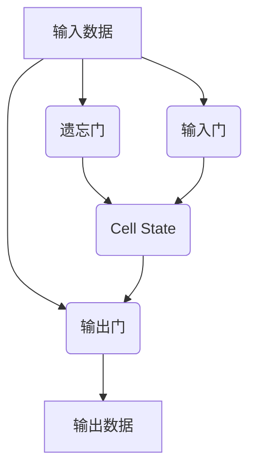

# LSTM的常见问题解答：解决你的疑惑

## 1.背景介绍

### 1.1 什么是LSTM?

LSTM(Long Short-Term Memory)是一种特殊的递归神经网络,由Hochreiter和Schmidhuber于1997年提出。它不仅能够学习长期依赖关系,而且在很大程度上解决了传统递归神经网络存在的梯度消失和爆炸问题。LSTM在自然语言处理、语音识别、机器翻译等领域有着广泛的应用。

### 1.2 LSTM的应用场景

LSTM在处理序列数据时表现出色,因此被广泛应用于:

- 自然语言处理(NLP):语言模型、机器翻译、文本生成等
- 语音识别: 将音频序列转录为文本序列
- 时间序列预测: 基于历史数据预测未来趋势
- 手写识别: 将手写体的笔迹序列转换为文本
- 视频数据分析: 对视频帧序列进行分类或描述

## 2.核心概念与联系

### 2.1 LSTM网络结构

LSTM网络由多个LSTM单元(Cell)组成,每个单元包含一个状态单元(Cell State)和三个控制门(Gates):遗忘门(Forget Gate)、输入门(Input Gate)和输出门(Output Gate)。



### 2.2 LSTM单元内部机制

1. **遗忘门(Forget Gate)**: 决定从上一时刻的细胞状态中丢弃什么信息。
2. **输入门(Input Gate)**: 决定从当前输入和上一时刻的细胞状态中获取什么信息。
3. **细胞状态(Cell State)**: 像一条传送带,只有少量线性相互作用,能够很好地保留信息状态。
4. **输出门(Output Gate)**: 决定输出什么值到最终状态。

## 3.核心算法原理具体操作步骤

LSTM单元的计算过程可分为以下几个步骤:

1. **遗忘门计算**

$$
f_t = \sigma(W_f \cdot [h_{t-1}, x_t] + b_f)
$$

其中:
- $f_t$是遗忘门的输出向量
- $W_f$是遗忘门的权重矩阵
- $h_{t-1}$是上一时刻的隐藏状态
- $x_t$是当前时刻的输入
- $b_f$是遗忘门的偏置项
- $\sigma$是sigmoid激活函数

2. **输入门计算**

$$
i_t = \sigma(W_i \cdot [h_{t-1}, x_t] + b_i)
$$

$$
\tilde{C}_t = \tanh(W_C \cdot [h_{t-1}, x_t] + b_C)
$$

其中:
- $i_t$是输入门的输出向量
- $\tilde{C}_t$是当前细胞状态的候选值向量
- $W_i$、$W_C$分别是输入门和候选值的权重矩阵
- $b_i$、$b_C$分别是输入门和候选值的偏置项

3. **细胞状态更新**

$$
C_t = f_t * C_{t-1} + i_t * \tilde{C}_t
$$

其中:
- $C_t$是当前时刻的细胞状态
- $C_{t-1}$是上一时刻的细胞状态

4. **输出门计算**

$$
o_t = \sigma(W_o \cdot [h_{t-1}, x_t] + b_o)
$$

$$
h_t = o_t * \tanh(C_t)
$$

其中:
- $o_t$是输出门的输出向量
- $h_t$是当前时刻的隐藏状态输出
- $W_o$是输出门的权重矩阵
- $b_o$是输出门的偏置项

通过上述步骤,LSTM能够选择性地保留和丢弃信息,从而解决长期依赖问题。

## 4.数学模型和公式详细讲解举例说明

### 4.1 LSTM中的门控机制

LSTM中的三个门控机制(遗忘门、输入门和输出门)是通过sigmoid函数和点积操作来实现的。以遗忘门为例:

$$
f_t = \sigma(W_f \cdot [h_{t-1}, x_t] + b_f)
$$

其中:

- $W_f$是遗忘门的权重矩阵,用于将输入($[h_{t-1}, x_t]$)映射到合适的维度空间。
- $[h_{t-1}, x_t]$是将上一时刻的隐藏状态$h_{t-1}$和当前时刻的输入$x_t$拼接而成的向量。
- $b_f$是遗忘门的偏置项,用于对结果进行平移。
- $\sigma$是sigmoid激活函数,将输出值映射到(0,1)范围内,作为控制信号。

通过点积操作,LSTM能够根据当前输入和上一时刻的隐藏状态,自适应地调节遗忘门的控制信号。当遗忘门输出接近0时,表示遗忘上一时刻的细胞状态;当输出接近1时,表示保留上一时刻的细胞状态。

### 4.2 细胞状态更新公式解析

细胞状态的更新公式为:

$$
C_t = f_t * C_{t-1} + i_t * \tilde{C}_t
$$

其中:

- $f_t$是遗忘门的输出,决定保留上一时刻细胞状态$C_{t-1}$的哪些信息。
- $i_t$是输入门的输出,决定获取当前细胞状态候选值$\tilde{C}_t$的哪些信息。
- $\tilde{C}_t$是当前细胞状态的候选值向量,通过tanh激活函数计算得到,值域在(-1,1)之间。

通过对$C_{t-1}$和$\tilde{C}_t$分别与$f_t$和$i_t$相乘,LSTM能够控制细胞状态的"记忆"和"遗忘"。具体来说:

- 对于$C_{t-1}$中的每个元素,如果对应的$f_t$接近0,则会遗忘该元素的值;如果$f_t$接近1,则会保留该元素的值。
- 对于$\tilde{C}_t$中的每个元素,如果对应的$i_t$接近0,则不会获取该元素的值;如果$i_t$接近1,则会获取该元素的值。

通过上述机制,LSTM能够灵活地控制信息的流动,解决长期依赖问题。

### 4.3 实例说明

假设我们有一个LSTM模型,用于预测基于前4个数字的序列模式。设当前时刻$t$的输入为$x_t=3$,上一时刻的隐藏状态为$h_{t-1}=[0.1,0.3]$,细胞状态为$C_{t-1}=[0.5,0.9]$。

1. 遗忘门计算

令$W_f=\begin{bmatrix}0.2&0.4\-0.3&0.1\end{bmatrix}$, $b_f=\begin{bmatrix}0.6\0.2\end{bmatrix}$

$$
f_t = \sigma(W_f \cdot [h_{t-1}, x_t] + b_f) = \sigma\left(\begin{bmatrix}0.2&0.4\-0.3&0.1\end{bmatrix}\cdot\begin{bmatrix}0.1\0.3\3\end{bmatrix} + \begin{bmatrix}0.6\0.2\end{bmatrix}\right) = \begin{bmatrix}0.82\0.39\end{bmatrix}
$$

2. 输入门和细胞状态候选值计算

令$W_i=\begin{bmatrix}0.5&-0.3\0.1&0.2\end{bmatrix}$, $b_i=\begin{bmatrix}-0.1\0.4\end{bmatrix}$, $W_C=\begin{bmatrix}-0.2&0.1\-0.3&0.2\end{bmatrix}$, $b_C=\begin{bmatrix}0.2\0.1\end{bmatrix}$

$$
i_t = \sigma(W_i \cdot [h_{t-1}, x_t] + b_i) = \begin{bmatrix}0.45\0.63\end{bmatrix}
$$

$$
\tilde{C}_t = \tanh(W_C \cdot [h_{t-1}, x_t] + b_C) = \begin{bmatrix}0.81\-0.66\end{bmatrix}
$$

3. 细胞状态更新

$$
C_t = f_t * C_{t-1} + i_t * \tilde{C}_t = \begin{bmatrix}0.82&0.39\end{bmatrix}*\begin{bmatrix}0.5\0.9\end{bmatrix} + \begin{bmatrix}0.45\0.63\end{bmatrix}*\begin{bmatrix}0.81\-0.66\end{bmatrix} = \begin{bmatrix}0.78\-0.03\end{bmatrix}
$$

4. 输出门计算

令$W_o=\begin{bmatrix}-0.1&0.2\0.3&-0.4\end{bmatrix}$, $b_o=\begin{bmatrix}0.3\-0.2\end{bmatrix}$

$$
o_t = \sigma(W_o \cdot [h_{t-1}, x_t] + b_o) = \begin{bmatrix}0.68\0.34\end{bmatrix}
$$

$$
h_t = o_t * \tanh(C_t) = \begin{bmatrix}0.68&0.34\end{bmatrix}*\begin{bmatrix}0.64\-0.03\end{bmatrix}=\begin{bmatrix}0.43\-0.01\end{bmatrix}
$$

通过上述计算步骤,我们得到了当前时刻$t$的细胞状态$C_t$和隐藏状态输出$h_t$。这些状态将被传递到下一时刻,用于预测序列的下一个值。

## 5.项目实践:代码实例和详细解释说明

以下是使用PyTorch实现LSTM的代码示例,用于对IMDB电影评论数据进行情感分类(二分类问题):

```python
import torch
import torch.nn as nn

# 定义LSTM模型
class LSTMClassifier(nn.Module):
    def __init__(self, embedding_dim, hidden_dim, vocab_size, label_size, num_layers):
        super(LSTMClassifier, self).__init__()
        self.hidden_dim = hidden_dim
        self.num_layers = num_layers

        self.embedding = nn.Embedding(vocab_size, embedding_dim)
        self.lstm = nn.LSTM(embedding_dim, hidden_dim, num_layers, batch_first=True)
        self.fc = nn.Linear(hidden_dim, label_size)

    def forward(self, x, hidden):
        batch_size = x.size(0)

        embeds = self.embedding(x)
        lstm_out, hidden = self.lstm(embeds, hidden)

        lstm_out = lstm_out[:,-1,:]

        out = self.fc(lstm_out)
        return out, hidden

    def init_hidden(self, batch_size):
        weight = next(self.parameters()).data
        hidden = (weight.new(self.num_layers, batch_size, self.hidden_dim).zero_(),
                  weight.new(self.num_layers, batch_size, self.hidden_dim).zero_())
        return hidden

# 设置参数
vocab_size = 5000
embedding_dim = 100
hidden_dim = 256
num_layers = 2
label_size = 2

# 实例化模型
model = LSTMClassifier(embedding_dim, hidden_dim, vocab_size, label_size, num_layers)

# 训练模型
...
```

代码解释:

1. 定义`LSTMClassifier`模型,包含以下层:
   - `Embedding`层: 将单词映射到embedding向量
   - `LSTM`层: 处理序列数据
   - `Linear`层: 将LSTM的最后一个隐藏状态映射到标签空间

2. `forward`函数定义了模型的前向传播过程:
   - 通过`Embedding`层获取单词的embedding向量
   - 将embedding向量输入到`LSTM`层,获取最后一个时间步的隐藏状态
   - 将最后一个隐藏状态输入到`Linear`层,获取预测的标签概率

3. `init_hidden`函数用于初始化LSTM的隐藏状态和细胞状态

在实际应用中,我们需要准备好数据集,对单词进行编码(词典),并设置合适的超参数(如embedding维度、隐藏层维度、层数等)。然后,我们可以使用PyTorch提供的损失函数和优化器来训练模型。

## 6.实际应用场景

LSTM在以下场景中有着广泛的应用:

### 6.1 自然语言处理(NLP)

- **机器翻译**: 将一种