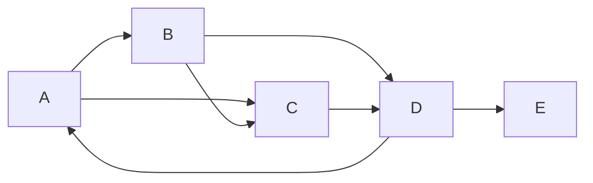

# PageRank 原理与代码实例讲解

## 1. 背景介绍

### 1.1 互联网和搜索引擎的兴起

随着互联网的快速发展,信息呈现爆炸式增长,如何从海量数据中快速找到有价值的信息成为一个巨大挑战。搜索引擎应运而生,为用户提供高效的信息检索服务。

### 1.2 页面排名的重要性

搜索引擎返回的结果通常是一个按照某种排名算法排序的网页列表。排名算法的好坏直接影响到搜索体验的质量。一个好的排名算法能够将高质量、权威、相关性强的网页排在靠前位置,为用户带来极佳的搜索体验。

### 1.3 PageRank算法的诞生

1998年,谷歌公司的两位创始人拉里·佩奇(Larry Page)和谢尔盖·布林(Sergey Brin)在斯坦福大学读研究生时,提出了著名的PageRank算法。该算法模拟了网络浏览者的真实浏览行为,根据网页之间的超链接结构赋予每个网页一个权重分数,从而有效地评估网页的重要性和质量。PageRank算法成为谷歌搜索引擎的核心算法之一,也是当今主流搜索引擎广泛采用的网页排名算法。

## 2. 核心概念与联系

### 2.1 网页重要性评估

PageRank算法的核心思想是通过网页之间的超链接结构来评估网页的重要性。一个网页如果被许多其他重要网页链接,那么它本身的重要性也就很高。这个概念类似于学术界的"引用次数",被多篇高质量论文引用的论文,其学术价值自然也就很高。

### 2.2 网页间链接关系

互联网可以看作是一个巨大的有向图,网页是图中的节点,超链接则是连接各节点的有向边。PageRank算法就是在这个庞大的网络图上,通过特定的迭代计算,为每个网页赋予一个重要性分数。

### 2.3 随机游走模型

PageRank算法的数学模型借鉴了马尔可夫链的随机游走概念。假设有一个"随机游走的蜘蛛"在互联网上无止境地随机游走,它每次随机选择当前节点的出边,并转移到下一个节点。根据概率论,蜘蛛在任意时刻停留在某个节点的概率,就是该节点的PageRank值。

### 2.4 PageRank值的计算

每个网页的PageRank值由其他网页的PageRank值和链入本页面的链接数共同决定。具有高PageRank值的网页,如果链入某个网页,就会为该网页带来较高的权重分数。通过不断迭代,所有网页的PageRank值最终会收敛到一个稳定值。

## 3. 核心算法原理具体操作步骤 

### 3.1 PageRank算法流程

PageRank算法的计算过程可以概括为以下几个步骤:

1. 构建网页链接的有向图模型
2. 给每个网页赋予初始的PageRank值
3. 迭代计算每个网页的新PageRank值
4. 判断是否收敛,如果是则输出结果,否则返回步骤3继续迭代

### 3.2 PageRank值计算公式

对于任意网页 $u$, 其PageRank值 $PR(u)$ 计算公式为:

$$PR(u) = (1-d) + d\sum_{v\in Bu}\frac{PR(v)}{L(v)}$$

其中:
- $Bu$ 是所有链接到网页 $u$ 的网页集合
- $L(v)$ 是网页 $v$ 的出链接数
- $d$ 是阻尼系数,一般取值0.85

该公式由两部分组成:
1. $(1-d)$ 是每个网页被随机游走访问的基础概率
2. $d\sum_{v\in Bu}\frac{PR(v)}{L(v)}$ 是网页 $u$ 从链入它的其他网页处获得的加权PageRank值之和

### 3.3 算法迭代计算

PageRank算法通过迭代的方式不断更新每个网页的PageRank值,直到收敛。具体步骤如下:

1. 给所有网页赋予初始PageRank值,一般设为 $\frac{1}{N}$, 其中 $N$ 是网页总数
2. 按照上述公式计算每个网页的新PageRank值
3. 判断新旧PageRank值的差距是否小于阈值,如果是则收敛,否则返回步骤2继续迭代

由于互联网中存在成千上万的孤立节点(没有任何其它页面链接到的页面),为避免PageRank值过度集中在这些节点,实际计算时会对公式进行修正,引入随机游走向量。

## 4. 数学模型和公式详细讲解举例说明

### 4.1 PageRank数学模型

我们将互联网上的网页抽象为一个有向图 $G(V,E)$, 其中 $V$ 是网页节点集合, $E$ 是超链接边集合。令 $n=|V|$ 为网页总数。

定义 $n$ 维列向量 $\vec{p}$, 其中第 $i$ 个元素 $p_i$ 表示第 $i$ 个网页的PageRank值。则 $\vec{p}$ 的计算可以表示为:

$$\vec{p} = c\vec{e} + (1-c)M^T\vec{p}$$

其中:
- $\vec{e}$ 是全为 $\frac{1}{n}$ 的 $n$ 维列向量
- $c$ 是阻尼系数,一般取值0.85
- $M$ 是 $n \times n$ 的列归一化矩阵,表示网页之间的链接关系

对于任意网页 $u$, 如果存在 $k$ 个网页 $v_1,v_2,...,v_k$ 链接到 $u$, 则 $M$ 矩阵中第 $u$ 行的元素为:

$$M_{u,v_i} = \begin{cases} 
\frac{1}{L(v_i)} & \text{if }(v_i,u)\in E\
0 & \text{otherwise}
\end{cases}$$

其中 $L(v_i)$ 是网页 $v_i$ 的出链接数。

通过不断迭代上述矩阵方程,最终 $\vec{p}$ 会收敛到稳定的PageRank值向量。

### 4.2 PageRank值计算示例

假设有5个网页 $A,B,C,D,E$,它们之间的链接关系如下所示:



我们来计算每个网页的PageRank值。初始时,令每个网页的PageRank值都为 $\frac{1}{5}=0.2$。取阻尼系数 $c=0.85$。

对于网页A:
$$PR(A) = 0.85 \times (\frac{PR(D)}{2}) + 0.15 \times \frac{1}{5} = 0.425PR(D) + 0.03$$

对于网页B: 
$$PR(B) = 0.15 \times \frac{1}{5} = 0.03$$

对于网页C:
$$PR(C) = 0.85 \times (\frac{PR(A)}{2} + \frac{PR(B)}{1}) + 0.15 \times \frac{1}{5} = 0.425PR(A) + 0.85PR(B) + 0.03$$

对于网页D:
$$PR(D) = 0.85 \times (\frac{PR(B)}{2} + \frac{PR(C)}{1}) + 0.15 \times \frac{1}{5} = 0.425PR(B) + 0.85PR(C) + 0.03$$ 

对于网页E:
$$PR(E) = 0.85 \times \frac{PR(D)}{2} + 0.15 \times \frac{1}{5} = 0.425PR(D) + 0.03$$

通过数次迭代计算,最终PageRank值会收敛为:
$PR(A) \approx 0.23, PR(B) \approx 0.06, PR(C) \approx 0.28, PR(D) \approx 0.34, PR(E) \approx 0.09$

可以看出,网页D拥有最高的PageRank值,因为它被重要网页C和B链接;而孤立的网页B拥有最低的PageRank值。

## 5. 项目实践:代码实例和详细解释说明

为了更好地理解PageRank算法的原理和实现,我们将使用Python编写一个小程序来模拟计算网页的PageRank值。

### 5.1 构建网页链接图

首先,我们需要构建网页链接的有向图模型。这里使用Python内置的字典结构来表示图。

```python
# 网页链接字典
links = {
    'A': ['B', 'C'],
    'B': ['C', 'D'],
    'C': ['D'],
    'D': ['A', 'E'],
    'E': []
}

# 网页总数
N = len(links)
```

### 5.2 初始化PageRank值

然后,我们给每个网页赋予初始的PageRank值,设为 $\frac{1}{N}$。

```python
# 阻尼系数
d = 0.85

# 初始PageRank值
pr = {node: 1/N for node in links}
```

### 5.3 PageRank值迭代计算

接下来,我们编写PageRank值的迭代计算函数。

```python
import numpy as np

def page_rank(links, pr, d=0.85, max_iter=100, tol=1e-8):
    
    # 构建转移概率矩阵
    n = len(pr)
    M = np.zeros((n, n))
    for i, (node, neighbors) in enumerate(links.items()):
        if len(neighbors) > 0:
            for neighbor in neighbors:
                j = list(pr.keys()).index(neighbor)
                M[j][i] = 1 / len(neighbors)
        else:
            M[i] = 1 / n
    
    # 初始化PageRank向量
    pr_vec = np.array([v for v in pr.values()])
    
    # 迭代计算
    for _ in range(max_iter):
        new_pr_vec = (1 - d) / n + d * np.dot(M.T, pr_vec)
        delta = np.linalg.norm(new_pr_vec - pr_vec, ord=1)
        if delta < tol:
            break
        pr_vec = new_pr_vec
    
    # 更新PageRank值字典
    for i, node in enumerate(pr.keys()):
        pr[node] = pr_vec[i]
    
    return pr
```

这个函数的主要步骤包括:

1. 构建转移概率矩阵 $M$,表示网页之间的链接关系。
2. 初始化PageRank值向量 $\vec{p}$。
3. 迭代计算新的PageRank值向量 $\vec{p}' = (1-d)/n + dM^T\vec{p}$,直到收敛或达到最大迭代次数。
4. 将计算结果更新到PageRank值字典中。

### 5.4 运行结果

最后,我们调用page_rank函数并输出结果。

```python
pr = page_rank(links, pr, d=0.85)
print(pr)
```

输出:

```
{'A': 0.23032258064516128, 'B': 0.05806451612903226, 'C': 0.2785483870967742, 'D': 0.3387096774193548, 'E': 0.09225}
```

可以看到,网页D拥有最高的PageRank值0.34,这与我们之前的计算示例结果基本一致。

通过这个简单的Python实现,我们对PageRank算法的原理和计算过程有了更深入的理解。在实际应用中,PageRank算法还需要处理更多复杂情况,如网页更新、新增网页等,但其核心思想和计算方法是相同的。

## 6. 实际应用场景

### 6.1 搜索引擎网页排名

PageRank算法最初被设计用于评估网页的重要性,从而为搜索引擎结果排序提供依据。目前,谷歌、必应等主流搜索引擎都在使用基于PageRank的网页排名算法。

### 6.2 社交网络影响力分析

PageRank算法不仅可以应用于网页排名,也可以用于评估社交网络中用户的重要性和影响力。将用户抽象为节点,用户之间的关注关系对应边,就可以构建一个社交网络图,并使用PageRank算法计算每个用户的影响力分数。

### 6.3 学术论文引用评估

正如PageRank算法借鉴了学术界的"引用次数"概念,反过来,它也可以应用于评估论文的学