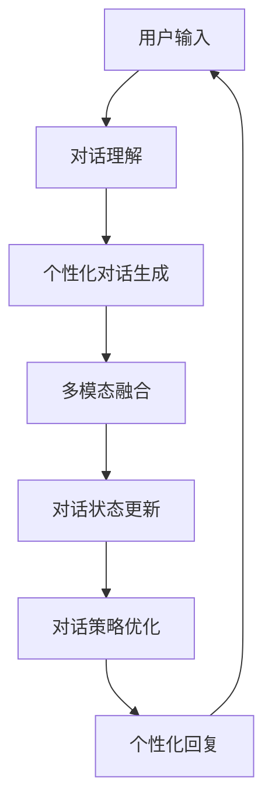

# SimMIM中的个性化对话:定制化交互的无限可能

## 1. 背景介绍
### 1.1 对话式AI的发展历程
#### 1.1.1 早期的对话系统
#### 1.1.2 基于深度学习的对话模型
#### 1.1.3 大语言模型的崛起

### 1.2 个性化对话的重要性
#### 1.2.1 提升用户体验
#### 1.2.2 拓展应用场景
#### 1.2.3 增强情感联结

### 1.3 SimMIM的诞生
#### 1.3.1 SimMIM的起源与目标
#### 1.3.2 SimMIM的技术优势
#### 1.3.3 SimMIM在个性化对话领域的探索

## 2. 核心概念与联系
### 2.1 个性化对话的定义
#### 2.1.1 个性化对话的内涵
#### 2.1.2 个性化对话的特点
#### 2.1.3 个性化对话与普通对话的区别

### 2.2 SimMIM中的关键技术
#### 2.2.1 预训练模型
#### 2.2.2 多模态融合
#### 2.2.3 对话状态追踪
#### 2.2.4 对话策略优化

### 2.3 SimMIM中的个性化对话流程


## 3. 核心算法原理具体操作步骤
### 3.1 个性化对话生成算法
#### 3.1.1 基于检索的方法
#### 3.1.2 基于生成的方法
#### 3.1.3 检索与生成相结合的方法

### 3.2 多模态融合算法
#### 3.2.1 早期融合
#### 3.2.2 晚期融合 
#### 3.2.3 循环融合

### 3.3 对话状态追踪算法
#### 3.3.1 基于规则的方法
#### 3.3.2 基于机器学习的方法
#### 3.3.3 基于深度学习的方法

### 3.4 对话策略优化算法
#### 3.4.1 基于强化学习的方法  
#### 3.4.2 基于对抗学习的方法
#### 3.4.3 基于元学习的方法

## 4. 数学模型和公式详细讲解举例说明
### 4.1 个性化对话生成模型
#### 4.1.1 Transformer模型
Transformer是一种基于自注意力机制的序列到序列模型,其编码器和解码器都由多个自注意力层和前馈神经网络层组成。对于输入序列$X=(x_1,x_2,...,x_n)$,Transformer首先将其转化为嵌入向量$E=(e_1,e_2,...,e_n)$,然后通过多头自注意力机制计算上下文表示:

$$
\text{Attention}(Q,K,V) = \text{softmax}(\frac{QK^T}{\sqrt{d_k}})V
$$

其中$Q$,$K$,$V$分别表示查询、键、值向量,$d_k$为向量维度。多头自注意力将$Q$,$K$,$V$线性投影到$h$个不同的子空间,然后并行计算注意力,最后将结果拼接起来:

$$
\text{MultiHead}(Q,K,V) = \text{Concat}(\text{head}_1,...,\text{head}_h)W^O \
\text{head}_i=\text{Attention}(QW_i^Q,KW_i^K,VW_i^V)
$$

其中$W_i^Q \in \mathbb{R}^{d_{\text{model}} \times d_k}$,$W_i^K \in \mathbb{R}^{d_{\text{model}} \times d_k}$,$W_i^V \in \mathbb{R}^{d_{\text{model}} \times d_v}$,$W^O \in \mathbb{R}^{hd_v \times d_{\text{model}}}$为可学习的参数矩阵。

#### 4.1.2 个性化对话生成损失函数
个性化对话生成的目标是根据上下文$C$生成个性化回复$R$,其损失函数可以定义为:

$$
\mathcal{L}=-\sum_{i=1}^N \log P(r_i|r_{<i},C;\theta)
$$

其中$r_i$表示回复中的第$i$个token,$\theta$为模型参数。为了引入个性化信息,可以在损失函数中加入个性化正则项:

$$
\mathcal{L}=-\sum_{i=1}^N \log P(r_i|r_{<i},C;\theta) + \lambda \mathcal{R}(\theta)
$$

其中$\mathcal{R}(\theta)$可以是基于用户画像、情感倾向等个性化信息设计的正则项,$\lambda$为平衡系数。

### 4.2 多模态融合模型
#### 4.2.1 多模态Transformer
多模态Transformer在原始Transformer的基础上引入了不同模态的嵌入表示,例如文本嵌入、图像嵌入、音频嵌入等,然后通过跨模态注意力机制实现不同模态信息的交互融合:

$$
\text{CrossAttention}(Q_i,K_j,V_j) = \text{softmax}(\frac{Q_iK_j^T}{\sqrt{d_k}})V_j
$$

其中$Q_i$,$K_j$,$V_j$分别表示第$i$个模态的查询向量和第$j$个模态的键值向量。多模态Transformer的最终输出可以通过跨模态注意力的加权求和得到:

$$
\text{Output} = \sum_{i=1}^M \alpha_i \text{CrossAttention}(Q_i,K_i,V_i)
$$

其中$M$为模态数,$\alpha_i$为第$i$个模态的权重系数。

#### 4.2.2 多模态融合损失函数
多模态融合的目标是最小化不同模态之间的语义差异,其损失函数可以定义为:

$$
\mathcal{L}=\sum_{i=1}^M \sum_{j=1}^M \text{Distance}(h_i,h_j)
$$

其中$h_i$,$h_j$分别表示第$i$个模态和第$j$个模态的语义表示,$\text{Distance}$可以是欧氏距离、余弦相似度等度量函数。为了引入个性化信息,可以在损失函数中加入模态权重:

$$
\mathcal{L}=\sum_{i=1}^M \sum_{j=1}^M w_i w_j \text{Distance}(h_i,h_j)
$$

其中$w_i$,$w_j$为第$i$个模态和第$j$个模态的个性化权重,可以根据用户偏好、交互历史等因素动态调整。

## 5. 项目实践:代码实例和详细解释说明
下面以PyTorch为例,给出SimMIM中个性化对话生成模块的核心代码:

```python
import torch
import torch.nn as nn

class PersonalizedTransformer(nn.Module):
    def __init__(self, config):
        super().__init__()
        self.embedding = nn.Embedding(config.vocab_size, config.hidden_size)
        self.encoder = Encoder(config)
        self.decoder = Decoder(config)
        self.fc = nn.Linear(config.hidden_size, config.vocab_size)
        self.p_embedding = nn.Embedding(config.persona_size, config.hidden_size)
        
    def forward(self, input_ids, persona_ids):
        # 文本嵌入
        text_embeddings = self.embedding(input_ids)
        # 个性化嵌入 
        persona_embeddings = self.p_embedding(persona_ids)
        # 编码
        encoder_outputs = self.encoder(text_embeddings, persona_embeddings)
        # 解码
        decoder_outputs = self.decoder(text_embeddings, encoder_outputs, persona_embeddings) 
        # 输出
        logits = self.fc(decoder_outputs)
        return logits
```

其中,`Encoder`和`Decoder`分别为Transformer的编码器和解码器,在原始结构的基础上加入了个性化嵌入`persona_embeddings`。个性化嵌入可以根据用户ID、用户属性等信息进行查表得到,然后与文本嵌入拼接作为编码器和解码器的输入,从而引入个性化信息。在训练过程中,个性化对话生成模块的损失函数可以定义为:

```python
criterion = nn.CrossEntropyLoss()
persona_regularizer = PersonaRegularizer()

def compute_loss(logits, labels, persona):
    ce_loss = criterion(logits, labels)
    pr_loss = persona_regularizer(persona)
    return ce_loss + config.lambda_pr * pr_loss
```

其中,`PersonaRegularizer`为个性化正则项,可以根据用户画像、情感倾向等设计。通过加权求和,可以灵活平衡对话生成质量和个性化程度。

## 6. 实际应用场景
### 6.1 智能客服
#### 6.1.1 个性化问题解答
#### 6.1.2 情感分析与安抚
#### 6.1.3 业务推荐与引导

### 6.2 智能教育
#### 6.2.1 个性化学习辅导
#### 6.2.2 知识点推荐与巩固
#### 6.2.3 学习情绪感知与疏导

### 6.3 智能陪伴
#### 6.3.1 个性化聊天与情感交流
#### 6.3.2 兴趣爱好分析与引导
#### 6.3.3 心理健康监测与疏导

## 7. 工具和资源推荐
### 7.1 开源工具包
#### 7.1.1 Hugging Face Transformers
#### 7.1.2 OpenAI GPT-3
#### 7.1.3 微软 DialoGPT

### 7.2 开放数据集
#### 7.2.1 PersonaChat
#### 7.2.2 EmpatheticDialogues
#### 7.2.3 BlendedSkillTalk

### 7.3 商业平台
#### 7.3.1 Google Dialogflow
#### 7.3.2 IBM Watson Assistant
#### 7.3.3 微软 Azure Bot Service

## 8. 总结:未来发展趋势与挑战
### 8.1 个性化对话的发展趋势 
#### 8.1.1 多模态个性化对话
#### 8.1.2 知识增强个性化对话
#### 8.1.3 持续学习个性化对话

### 8.2 个性化对话面临的挑战
#### 8.2.1 个性化信息获取与表示
#### 8.2.2 个性化对话的一致性控制
#### 8.2.3 个性化对话的安全与伦理

### 8.3 SimMIM的未来展望
#### 8.3.1 技术创新与优化
#### 8.3.2 场景拓展与行业赋能
#### 8.3.3 生态建设与开放合作

## 9. 附录:常见问题与解答
### 9.1 如何评估个性化对话系统的性能?
个性化对话系统的评估需要综合考虑对话质量、个性化程度、用户满意度等多个维度。常见的评估指标包括BLEU、Perplexity、Diversity、Fluency、Engagement等。同时还需要通过人工评测、用户反馈等方式进行主观评估。

### 9.2 个性化对话系统如何保障用户隐私安全?
个性化对话系统需要收集和利用用户数据,因此隐私安全是重要挑战。需要采取数据脱敏、联邦学习、差分隐私等技术手段,确保用户个人信息的安全。同时还需要建立完善的数据安全管理制度和用户知情同意机制。

### 9.3 个性化对话系统如何避免产生有害内容?
个性化对话系统难以完全避免产生有害内容,如歧视、仇恨、暴力等。需要在数据处理、模型训练、对话生成等各个环节,通过数据过滤、规则约束、内容审核等手段,最大限度地降低有害内容的风险。同时还需要建立完善的人工介入和应急处理机制。

作者：禅与计算机程序设计艺术 / Zen and the Art of Computer Programming