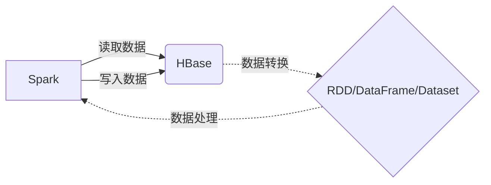

# Spark-HBase整合原理与代码实例讲解

## 1. 背景介绍

### 1.1 大数据处理的需求
在当今大数据时代,企业面临着海量数据的处理和分析挑战。传统的数据处理方式已经无法满足实时、高效地处理TB甚至PB级别数据的需求。因此,大数据技术应运而生,其中Apache Spark和Apache HBase就是两个广泛应用的大数据处理工具。

### 1.2 Spark与HBase简介
- Apache Spark是一个快速、通用的大规模数据处理引擎,用于构建大型的、低延迟的数据分析应用程序。
- Apache HBase是一个分布式的、面向列的开源数据库,它提供了对大规模结构化数据的随机、实时读/写访问。

### 1.3 Spark与HBase整合的意义
Spark和HBase都是大数据领域的重要工具,将它们进行整合可以发挥各自的优势,实现更加高效、灵活的大数据处理。
- Spark可以对HBase中的数据进行复杂的计算和处理
- HBase为Spark提供了高效的数据存储
- 整合后的Spark+HBase可以应对更加复杂的大数据应用场景

## 2. 核心概念与联系

### 2.1 Spark核心概念
- RDD(Resilient Distributed Dataset):Spark的基本数据结构,表示经过分区的只读数据集合,可以并行操作
- DataFrame:以RDD为基础的分布式数据集,带有Schema元信息
- Dataset:是DataFrame的扩展,提供了强类型支持
- Spark SQL:Spark用于结构化数据处理的编程模块

### 2.2 HBase核心概念
- RowKey:HBase表的主键,用于检索记录
- Column Family:列族,HBase表中的每个列都归属于某个列族
- Column Qualifier:列标识符,列族中的数据通过列标识符来定位
- Timestamp:时间戳,每个值都保存着同一份数据的多个版本
- Region:HBase中分布式存储和负载均衡的最小单元。

### 2.3 Spark与HBase的关系
- Spark可以从HBase中读取数据,并将数据转换为RDD、DataFrame等
- Spark处理后的结果可以写回HBase
- Spark与HBase整合后,可以实现数据的分布式存储和计算



## 3. 核心算法原理具体操作步骤

### 3.1 Spark读取HBase数据的步骤
1. 创建HBase连接
2. 扫描HBase表的数据
3. 将数据转化为RDD
4. 对RDD进行操作
5. 关闭HBase连接

### 3.2 Spark写入数据到HBase的步骤
1. 创建HBase连接
2. 将数据转化为RDD
3. 将RDD数据写入HBase
4. 提交数据修改
5. 关闭HBase连接

### 3.3 Bulk Load：批量写入HBase的步骤
1. 初始化作业配置
2. 设置输入数据路径
3. 配置HFileOutputFormat2输出格式
4. 运行MapReduce作业生成HFile
5. 将生成的HFile加载到HBase表中

## 4. 数学模型和公式详细讲解举例说明

### 4.1 Spark分区计算公式
Spark中,数据被分成多个分区进行并行计算。每个分区的数据量应尽量平均,可以根据以下公式计算分区数:
$$
numPartitions = max(\frac{totalSize}{targetSize}, minPartitions)
$$
其中:
- $numPartitions$表示分区数
- $totalSize$表示数据总大小
- $targetSize$表示目标分区大小
- $minPartitions$表示最小分区数

例如,如果数据总大小为100GB,目标分区大小为1GB,最小分区数为10,则分区数应为:
$$
numPartitions = max(\frac{100GB}{1GB}, 10) = 100
$$

### 4.2 HBase RowKey设计原则
HBase的RowKey设计直接影响查询性能,需要遵循以下原则:
- RowKey应该是唯一的
- RowKey长度应该尽量短
- RowKey应该均匀分布,避免热点问题

常用的RowKey设计模式有:
- 盐值前缀: $salt_prefix + key$
- 反转: $reverse(key)$
- 哈希: $hash(key)$

例如,对于用户ID作为RowKey,可以采用盐值前缀的方式,将用户ID哈希到不同的前缀:
$$
RowKey = hash(userId) % 10 + "_" + userId
$$
这样可以将不同用户的数据分散到不同的Region,避免热点问题。

## 5. 项目实践：代码实例和详细解释说明

### 5.1 Spark读取HBase数据示例

```scala
val conf = HBaseConfiguration.create()
conf.set("hbase.zookeeper.quorum", "localhost")
conf.set("hbase.zookeeper.property.clientPort", "2181")

val sc = new SparkContext("local", "HBaseTest", conf)
val hbaseContext = new HBaseContext(sc, conf)

val rdd = hbaseContext.hbaseRDD(
  tableName = "mytable",
  scan = new Scan()
).map(tuple => (Bytes.toString(tuple._1), tuple._2.getFamilyMap("cf".getBytes())))

rdd.collect().foreach(println)
```

代码解释:
1. 创建HBase配置对象,设置Zookeeper地址和端口
2. 创建SparkContext和HBaseContext
3. 调用`hbaseRDD`方法,传入表名和Scan对象,读取HBase数据
4. 使用`map`算子将每行数据转换为(RowKey, 列族Map)的元组
5. 收集RDD数据并打印

### 5.2 Spark写入数据到HBase示例

```scala
val conf = HBaseConfiguration.create()
conf.set(TableOutputFormat.OUTPUT_TABLE, "mytable")

val job = Job.getInstance(conf)
job.setOutputFormatClass(classOf[TableOutputFormat[ImmutableBytesWritable]])

val data = Array("row1" -> "value1", "row2" -> "value2")
sc.parallelize(data).map { case (k, v) =>
  val put = new Put(Bytes.toBytes(k))
  put.addColumn(Bytes.toBytes("cf"), Bytes.toBytes("col"), Bytes.toBytes(v))
  (new ImmutableBytesWritable, put)
}.saveAsNewAPIHadoopDataset(job.getConfiguration)
```

代码解释:
1. 创建HBase配置对象,设置输出表名
2. 创建Hadoop Job对象,设置输出格式为TableOutputFormat
3. 创建测试数据,并转换为RDD
4. 对每个元素,创建Put对象,添加列数据
5. 将RDD数据作为Hadoop数据集保存,写入HBase

### 5.3 Bulk Load批量写入HBase示例

```scala
val conf = HBaseConfiguration.create()
conf.set(TableOutputFormat.OUTPUT_TABLE, "mytable")

val job = Job.getInstance(conf)
job.setMapOutputKeyClass(classOf[ImmutableBytesWritable])
job.setMapOutputValueClass(classOf[KeyValue])

val data = Array("row1" -> "value1", "row2" -> "value2")
sc.parallelize(data).map { case (k, v) =>
  val rowKey = Bytes.toBytes(k)
  val kv = new KeyValue(rowKey, Bytes.toBytes("cf"), Bytes.toBytes("col"), Bytes.toBytes(v))
  (new ImmutableBytesWritable(rowKey), kv)
}.saveAsNewAPIHadoopFile(
  "/hfiles",
  classOf[ImmutableBytesWritable],
  classOf[KeyValue],
  classOf[HFileOutputFormat2],
  job.getConfiguration
)

val load = new LoadIncrementalHFiles(conf)
load.doBulkLoad(new Path("/hfiles"), conn.getAdmin, conn.getTable(TableName.valueOf("mytable")), conn.getRegionLocator(TableName.valueOf("mytable")))
```

代码解释:
1. 创建HBase配置对象,设置输出表名
2. 创建Hadoop Job对象,设置输出键值类型
3. 创建测试数据,并转换为RDD
4. 对每个元素,创建KeyValue对象,包含RowKey、列族、列名和值
5. 将RDD保存为HFile格式的Hadoop文件
6. 使用LoadIncrementalHFiles加载生成的HFile到HBase表中

## 6. 实际应用场景

### 6.1 日志分析
- 将海量的日志数据存储在HBase中
- 使用Spark对日志数据进行清洗、转换和分析
- 将分析结果写回HBase或其他数据库

### 6.2 推荐系统
- 将用户行为数据如浏览、点击、购买等存储在HBase中
- 使用Spark对用户行为数据进行特征提取和模型训练
- 将推荐结果写入HBase,实时提供推荐服务

### 6.3 风控系统
- 将交易数据存储在HBase中
- 使用Spark Streaming实时消费交易数据流
- 使用机器学习算法如决策树、神经网络等对交易进行风险判断
- 将风控结果写回HBase,并与其他系统联动

## 7. 工具和资源推荐

### 7.1 开发工具
- IntelliJ IDEA:功能强大的IDE,支持Scala和Spark开发
- Zeppelin:基于Web的交互式开发和可视化工具
- Hue:Hadoop生态系统的开源Web界面

### 7.2 学习资源
- 《Spark大数据处理技术》:系统介绍Spark原理和使用方法
- 《HBase权威指南》:HBase入门必读经典
- Cloudera官方文档:提供了详尽的Spark和HBase使用指南

### 7.3 社区资源
- Spark官方网站:http://spark.apache.org/
- HBase官方网站:http://hbase.apache.org/
- Stack Overflow:IT技术问答网站,可以搜索Spark和HBase相关问题

## 8. 总结：未来发展趋势与挑战

### 8.1 Spark和HBase的发展趋势
- Spark向AI方向发展,与TensorFlow等深度学习框架结合
- HBase向云化发展,如阿里云HBase、AWS EMR等
- Spark和HBase结合将成为大数据处理的主流架构

### 8.2 面临的挑战
- 数据安全和隐私保护
- 实时性和低延迟处理
- 数据质量和一致性
- 多源异构数据的整合

### 8.3 总结
Spark和HBase是大数据技术栈中的核心组件,将它们整合可以构建高效、灵活的大数据处理平台。未来,Spark和HBase将在越来越多的大数据场景中发挥重要作用,同时也面临诸多挑战。只有不断创新、完善,Spark和HBase才能更好地服务于大数据时代。

## 9. 附录：常见问题与解答

### 9.1 Spark和HBase的适用场景?
- Spark适用于大规模数据的批处理、流处理、机器学习等
- HBase适用于海量结构化数据的随机实时读写
- Spark+HBase适用于既需要大规模数据分析,又需要高效数据读写的场景

### 9.2 Spark操作HBase的性能如何优化?
- 设计合理的RowKey,避免热点问题
- 使用Bulk Load批量写入HBase
- 调整Scan的缓存大小和批次大小
- 使用预分区和预分区Region

### 9.3 Spark和HBase如何实现权限管理?
- 使用Kerberos进行身份认证
- 使用Sentry、Ranger等组件进行权限控制
- 对敏感数据进行脱敏或加密处理

作者：禅与计算机程序设计艺术 / Zen and the Art of Computer Programming