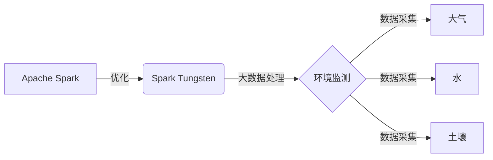

# SparkTungsten与环境保护：监测环境数据

## 1.背景介绍
### 1.1 环境保护的重要性
环境保护是当今社会面临的最紧迫的全球性问题之一。人类活动对自然环境造成了巨大的破坏,如全球变暖、空气污染、水污染、土壤退化等,严重威胁着人类自身的生存和发展。保护环境,实现人与自然的和谐共生,已成为全人类的共同责任。
### 1.2 大数据在环境监测中的作用
随着信息技术的飞速发展,大数据、云计算、物联网等新兴技术为环境保护提供了新的手段和途径。通过对环境监测数据的采集、存储、分析和可视化,可以更加全面、及时、准确地掌握环境质量状况,为环境保护决策提供科学依据。大数据技术在环境监测领域大有可为。
### 1.3 Spark Tungsten 的优势
Apache Spark 是当前最流行的大数据处理框架之一,其Tungsten引擎通过优化内存和CPU的使用,大幅提升了Spark的性能。将Spark Tungsten应用于环境监测大数据处理,可以高效地完成数据ETL、统计分析、机器学习等任务,为环保部门提供强大的数据处理和分析能力。

## 2.核心概念与联系
### 2.1 Apache Spark
- 基于内存的分布式计算框架
- 支持批处理、交互式查询、流处理、机器学习等
- 使用Scala、Java、Python、R等语言开发
### 2.2 Spark Tungsten
- Spark的第二代执行引擎
- 通过内存管理、代码生成、缓存感知等优化提升性能
- Databricks发布,Spark 1.4引入
### 2.3 环境监测
- 对大气、水、土壤等环境要素进行监测
- 获取环境质量状况数据
- 为环境管理和决策提供依据
### 2.4 概念之间的关系


## 3.核心算法原理与具体操作步骤
### 3.1 Spark Tungsten 的内存管理
- 二进制内存格式:直接对二进制数据进行操作,避免反序列化开销
- 内存对齐与填充:保证对象字段在内存中紧凑排列,加速内存访问
- 显式内存管理:直接操作系统内存,减少JVM GC
### 3.2 Spark Tungsten 的代码生成
- 动态字节码生成:针对查询生成优化的Java字节码,加速执行
- 循环展开:减少分支预测失败,提高CPU流水线效率
- 表达式代码生成:对DataFrame/Dataset操作生成遍历代码,减少虚函数调用
### 3.3 Spark Tungsten 在环境监测中的应用步骤
1. 数据采集:通过传感器等设备采集环境监测数据并传输到HDFS等
2. 数据预处理:使用Spark SQL进行数据清洗、转换,生成优化后的Parquet格式数据
3. 数据分析:使用Spark MLlib进行统计分析、异常检测、趋势预测等
4. 结果展示:使用Spark Streaming实时计算结果并通过Web前端展示

## 4.数学模型和公式详细讲解举例说明
### 4.1 环境空气质量指数(AQI)模型
- 定义:基于空气污染物浓度对空气质量的定量评价
- 计算公式:
$$
AQI = max(IAQI_1,IAQI_2,...,IAQI_n) \
IAQI_p = \frac{I_{high}-I_{low}}{C_{high}-C_{low}}(C_p-C_{low})+I_{low}
$$
其中,$IAQI_p$为污染物$p$的空气质量分指数,$C_p$为污染物$p$的实测浓度,$C_{low}$和$C_{high}$分别为污染物$p$对应的浓度限值。

- 举例:假设某地PM2.5日均浓度为80μg/m³,对应的$C_{low}$和$C_{high}$分别为75μg/m³和115μg/m³,$I_{low}$和$I_{high}$分别为100和150,代入公式得:
$$
IAQI_{PM2.5}=\frac{150-100}{115-75}(80-75)+100=108.3
$$
若其他污染物$IAQI$值均小于108.3,则当日$AQI=108$,为轻度污染。

### 4.2 水质污染指数(WQI)模型
- 定义:综合考虑多项水质参数对水质的影响
- 计算公式:
$$
WQI=\sum_{i=1}^n w_i \cdot q_i
$$
其中,$w_i$为第$i$项参数的权重,$q_i$为第$i$项参数的质量分值,可根据各参数的浓度值查表得到。

- 举例:某水体COD、BOD、NH3-N和TP的浓度值分别为20mg/L、4mg/L、1.5mg/L和0.3mg/L,查表得到对应的$q_i$值分别为60、40、30、20,假设四项参数权重相同,则:
$$
WQI=0.25 \times (60+40+30+20)=37.5
$$
表明该水体为轻度污染。

## 5.项目实践：代码实例和详细解释说明
下面以Spark Tungsten读取环境监测站点的PM2.5数据并计算AQI为例,给出Scala代码实现:
```scala
// 读取CSV格式的环境监测数据
val df = spark.read
  .option("header", "true")
  .option("inferSchema", "true")
  .csv("data/air_quality.csv")

// 进行必要的数据转换和过滤
val pm25 = df.select($"pm25".cast("double"))
  .where($"pm25".isNotNull)

// 定义AQI计算的自定义函数
def aqiFunc(pm25: Double): Int = {
  val C_low = 35.0
  val C_high = 75.0
  val I_low = 50
  val I_high = 100
  if (pm25 < C_low) {
    I_low
  } else if (pm25 > C_high) {
    I_high
  } else {
    math.round((I_high - I_low) / (C_high - C_low) * (pm25 - C_low) + I_low).toInt
  }
}

// 注册为Spark UDF
val aqi = udf(aqiFunc _)

// 调用UDF计算AQI
val result = pm25.select(aqi($"pm25").as("aqi"))

// 统计各空气质量等级的分布
result.groupBy($"aqi")
  .count()
  .orderBy($"aqi".desc)
  .show()
```

代码说明:
1. 使用`spark.read`从CSV文件读取环境监测数据。
2. 选取PM2.5浓度列并过滤掉空值。
3. 定义计算AQI的Scala函数`aqiFunc`,根据PM2.5浓度计算对应的AQI值。
4. 使用`udf`将`aqiFunc`注册为Spark UDF。
5. 调用UDF计算每个监测记录的AQI。
6. 按AQI值分组统计,得到各空气质量等级的分布情况。

Spark Tungsten会在执行过程中对代码进行优化,如使用代码生成、内存优化等手段提升性能。

## 6.实际应用场景
Spark Tungsten在环境监测领域有广泛的应用前景,主要场景包括:

- 环境质量评价:通过对环境监测数据的分析,评估区域环境质量状况,识别主要污染因子,为环境管理提供决策支持。

- 污染源解析:综合分析环境质量数据和排放源数据,识别对区域环境质量影响重大的污染源,为污染防治提供指导。

- 环境预警预报:通过对环境监测数据的趋势分析和预测,及时发现环境质量恶化趋势,实现环境预警和风险防范。

- 环境公众服务:将环境监测数据通过Web、移动App等方式向公众开放,提高环境信息透明度,引导公众参与环境保护。

- 环境科研支撑:为环境科学研究提供丰富的数据支持,如开展污染机理、生态环境效应等方面的研究。

## 7.工具和资源推荐
- Spark官网:http://spark.apache.org/,可下载Spark安装包和查阅文档。
- Databricks:https://databricks.com/,Spark商业化公司,提供基于Spark的云服务。
- 《Spark: The Definitive Guide》,Spark权威指南,系统讲解Spark各组件的原理和使用。
- 《High Performance Spark》,深入讲解Spark性能优化的工具书。
- Github:https://github.com/apache/spark,Spark源代码仓库。

## 8.总结：未来发展趋势与挑战
Spark Tungsten代表了大数据处理框架的发展方向,通过深入优化执行引擎,不断挖掘硬件能力,提升数据处理效率。未来在环境监测大数据分析中将扮演越来越重要的角色。

但也面临一些挑战:首先,环境监测数据具有多源异构、时空分布广、数据质量参差不齐等特点,数据治理难度大。其次,环境问题的复杂性,需要综合运用统计、数据挖掘、机器学习等多种分析方法,对分析人员的技术能力要求高。最后,环境管理需求多样化,需要不断开发新的数据分析模型和应用,对技术平台的扩展性和灵活性提出了挑战。

展望未来,Spark Tungsten有望与新兴的大数据技术如Flink、Kafka等进一步融合,在流批一体化处理、图计算、机器学习等方面取得更大突破,为环境监测乃至更广泛的领域提供更加高效、智能的大数据分析平台。让我们携手并进,用大数据的力量守护美丽家园!

## 9.附录：常见问题与解答
### Q1:Spark Tungsten主要优化了哪些方面?
A1:Spark Tungsten在内存管理、代码生成、缓存感知等多个方面进行了深度优化,例如采用二进制内存格式、动态字节码生成、表达式代码生成等手段,大幅提升了内存利用率和CPU执行效率。

### Q2:Spark Tungsten适合处理哪些类型的环境监测数据?
A2:Spark Tungsten对结构化数据(如传感器采集的环境参数监测数据)和半结构化数据(如环境监测站点元数据、设备日志等)都能高效处理。对于非结构化数据(如环境影像),可先提取结构化特征再进行处理。

### Q3:Spark Tungsten如何与机器学习算法结合应用?
A3:Spark MLlib提供了丰富的机器学习算法库,可以无缝整合到Spark Tungsten的数据处理流程中。用户可以用Spark SQL进行特征工程,再调用MLlib算法进行模型训练和预测,Tungsten可以优化整个流程的执行效率。

### Q4:如何平衡Spark Tungsten的优化和开发效率?
A4:一方面,应尽量使用Spark内置的算子和函数,它们都经过了Tungsten优化。另一方面,需要注意UDF的使用,虽然UDF能提供灵活性,但会引入性能开销,建议在性能瓶颈处再考虑UDF优化。还可以通过Spark性能监控(如Spark UI)来发现和优化性能问题。

作者：禅与计算机程序设计艺术 / Zen and the Art of Computer Programming