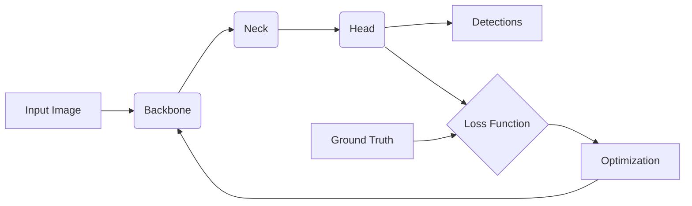

# YOLOv7原理与代码实例讲解

## 1. 背景介绍
### 1.1 目标检测概述
目标检测是计算机视觉领域的一个重要任务,旨在从图像或视频中检测出感兴趣的目标,并给出其类别和位置信息。目标检测在很多实际应用中发挥着重要作用,如自动驾驶、视频监控、机器人感知等。

### 1.2 YOLO系列算法的发展历程
YOLO (You Only Look Once)是一系列高效的单阶段目标检测算法。从2016年提出的YOLOv1到2022年的YOLOv7,YOLO系列算法在精度和速度上不断取得突破,成为业界广泛使用的目标检测算法之一。

### 1.3 YOLOv7的优势
YOLOv7是YOLO系列算法的最新进展,在继承了YOLO系列算法速度快、检测精度高的优点基础上,进一步在骨干网络、检测头、损失函数等方面进行了改进,使其性能达到了新的高度。

## 2. 核心概念与联系
### 2.1 Backbone 骨干网络
- 2.1.1 骨干网络的作用
- 2.1.2 YOLOv7骨干网络的特点
- 2.1.3 常用的骨干网络结构

### 2.2 Neck 特征融合模块
- 2.2.1 特征融合的必要性
- 2.2.2 YOLOv7中的ELAN和TAL模块
- 2.2.3 FPN、PAN等常见特征融合方法

### 2.3 Head 检测头
- 2.3.1 检测头的功能
- 2.3.2 YOLOv7的检测头设计
- 2.3.3 One-stage和Two-stage检测头的区别

### 2.4 损失函数
- 2.4.1 目标检测中的损失函数构成
- 2.4.2 YOLOv7的损失函数改进
- 2.4.3 常用的目标检测损失函数

### 2.5 训练策略
- 2.5.1 数据增强的重要性
- 2.5.2 YOLOv7的数据增强方法
- 2.5.3 学习率调度与优化器选择



## 3. 核心算法原理具体操作步骤
### 3.1 图像预处理
- 3.1.1 图像尺寸调整与填充
- 3.1.2 图像归一化
- 3.1.3 图像增强

### 3.2 Backbone特征提取
- 3.2.1 E-ELAN结构
- 3.2.2 MP-Conv卷积层
- 3.2.3 多尺度特征图生成

### 3.3 Neck特征融合
- 3.3.1 ELAN注意力模块
- 3.3.2 TAL变换层
- 3.3.3 特征金字塔的构建

### 3.4 Head目标检测
- 3.4.1 检测头结构
- 3.4.2 先验框的设计
- 3.4.3 分类与回归分支

### 3.5 损失函数计算
- 3.5.1 分类损失
- 3.5.2 回归损失
- 3.5.3 正负样本匹配

### 3.6 反向传播与参数更新
- 3.6.1 梯度计算
- 3.6.2 优化器更新参数
- 3.6.3 学习率调整策略

## 4. 数学模型和公式详细讲解举例说明
### 4.1 Focal Loss
Focal Loss是一种用于处理类别不平衡问题的损失函数。在目标检测中,背景与目标之间往往存在较大的类别不平衡。Focal Loss通过引入一个调制因子来降低易分类样本的权重,从而使模型更加关注难分类的样本。其数学公式为:

$FL(p_t) = -\alpha_t (1-p_t)^{\gamma}log(p_t)$

其中,$p_t$表示模型对于类别t的预测概率,$\alpha_t$为平衡因子,$\gamma$为聚焦参数。通过调节$\alpha_t$和$\gamma$,可以有效缓解类别不平衡问题。

### 4.2 CIOU Loss
CIOU Loss是一种用于回归目标框坐标的损失函数,相比传统的IOU Loss,它考虑了重叠面积、中心点距离以及长宽比三个因素,具有更好的收敛性和精度。CIOU Loss的数学公式为:

$$CIOU = IOU - \frac{\rho^2(b,b^{gt})}{c^2} - \alpha v$$

其中,IOU为预测框和真实框的交并比,$\rho$为两个框中心点之间的欧氏距离,c为能够同时覆盖两个框的最小闭包区域的对角线长度,$\alpha$为权衡因子,v为长宽比一致性度量。通过最小化CIOU Loss,可以使预测框与真实框在位置、尺度、长宽比上都更加接近。

### 4.3 学习率余弦退火
学习率对于模型的训练至关重要。YOLOv7采用了余弦退火的学习率调度策略,可以在训练后期使学习率平滑衰减,有助于模型收敛到更好的局部最优。余弦退火的学习率计算公式为:

$$lr = lr_{min} + \frac{1}{2}(lr_{max} - lr_{min})(1 + cos(\frac{T_{cur}}{T_{max}}\pi))$$

其中,$lr_{min}$和$lr_{max}$分别为最小和最大学习率,$T_{cur}$为当前迭代次数,$T_{max}$为总迭代次数。通过余弦退火,学习率呈现出先上升后下降的趋势,可以在训练初期快速收敛,后期微调。

## 5. 项目实践：代码实例和详细解释说明
下面我们通过一个YOLOv7的PyTorch实现代码片段,来说明如何使用YOLOv7进行目标检测:

```python
import torch
from models.experimental import attempt_load
from utils.datasets import LoadImages
from utils.general import non_max_suppression, scale_coords
from utils.plots import plot_one_box

# 加载YOLOv7模型
model = attempt_load('yolov7.pt', map_location=device)
model.eval()

# 加载待检测图像
dataset = LoadImages('images', img_size=640)

for path, img, im0s, vid_cap in dataset:
    # 图像预处理
    img = torch.from_numpy(img).to(device)
    img = img.float()
    img /= 255.0
    if img.ndimension() == 3:
        img = img.unsqueeze(0)

    # 模型推理
    pred = model(img)[0]

    # NMS去除重叠检测框
    pred = non_max_suppression(pred, conf_thres, iou_thres)

    # 结果后处理与可视化
    for i, det in enumerate(pred):
        im0 = im0s.copy()
        if len(det):
            det[:, :4] = scale_coords(img.shape[2:], det[:, :4], im0.shape).round()
            for *xyxy, conf, cls in reversed(det):
                label = f'{names[int(cls)]} {conf:.2f}'
                plot_one_box(xyxy, im0, label=label, color=colors[int(cls)], line_thickness=3)

        cv2.imshow(str(p), im0)
        cv2.waitKey(1)  # 1 millisecond
```

以上代码主要分为以下几个步骤:

1. 加载预训练的YOLOv7模型,设置为评估模式。
2. 加载待检测的图像数据集,对图像进行预处理,包括尺寸调整、归一化等。
3. 将预处理后的图像输入YOLOv7模型进行前向推理,得到检测结果。
4. 对检测结果进行非极大值抑制(NMS),去除重叠的检测框。
5. 对检测结果进行后处理,包括坐标映射、绘制检测框、显示类别和置信度等。
6. 可视化检测结果,将检测框绘制在原图上并显示。

通过以上步骤,我们就可以使用YOLOv7模型对图像进行目标检测,并得到可视化的检测结果。

## 6. 实际应用场景
YOLOv7作为一种高效、精确的目标检测算法,在多个领域都有广泛的应用,例如:

### 6.1 自动驾驶
YOLOv7可以用于检测道路上的车辆、行人、交通标志等,为自动驾驶提供环境感知能力,提高行车安全性。

### 6.2 安防监控
利用YOLOv7可以实时检测监控视频中的可疑人员、违禁物品等,及时预警,提升安防效率。

### 6.3 工业质检
YOLOv7可应用于工业生产线的产品缺陷检测,自动识别不合格品,提高质检效率和准确率。

### 6.4 无人机巡检
在电力、石化等行业,YOLOv7可用于无人机巡检,检测设备故障、安全隐患等,降低人力成本。

### 6.5 医学影像分析
YOLOv7可以辅助医生分析医学影像,检测病灶区域,提高诊断效率和准确性。

## 7. 工具和资源推荐
为了方便使用和部署YOLOv7模型,这里推荐一些常用的工具和资源:

### 7.1 官方代码仓库
YOLOv7的官方代码仓库包含了模型训练、测试、部署的完整代码,以及预训练模型和Benchmark结果。
Github地址: https://github.com/WongKinYiu/yolov7

### 7.2 Roboflow
Roboflow是一个数据管理和标注平台,提供了大量公开数据集和数据标注工具,可用于训练自己的YOLOv7模型。
网址: https://roboflow.com/

### 7.3 Colab
Google Colab是一个在线的Jupyter Notebook环境,提供免费的GPU资源,可以方便地进行YOLOv7的训练和推理。

### 7.4 ONNX
ONNX (Open Neural Network Exchange)是一种开放的模型交换格式,可以将PyTorch模型转换为ONNX格式,便于在不同平台上部署。

### 7.5 OpenVINO
OpenVINO是Intel推出的一套工具套件,可以优化模型在Intel CPU、GPU、FPGA等硬件上的推理性能。

## 8. 总结：未来发展趋势与挑战
YOLOv7的提出进一步提升了目标检测的精度和速度,展现了巨大的应用潜力。未来,YOLOv7还可以在以下方面进行改进和拓展:

### 8.1 模型轻量化
为了满足边缘设备的部署需求,可以探索模型压缩、剪枝、量化等技术,在保持精度的同时减小模型体积。

### 8.2 小目标检测
对于一些小尺寸、密集分布的目标,检测难度较大。需要设计更有效的特征融合和检测头机制,提升小目标检测性能。

### 8.3 域自适应
由于不同场景下数据分布差异较大,模型泛化能力有待提高。可以利用迁移学习、对抗训练等方法,提升模型的域自适应能力。

### 8.4 检测-跟踪一体化
在一些实时应用场景中,需要同时完成目标检测和跟踪。可以探索检测-跟踪一体化框架,实现更高效、鲁棒的视觉感知。

### 8.5 多模态融合
结合图像、雷达、激光雷达等多种传感器数据,充分利用不同模态的互补信息,有望进一步提升检测精度和鲁棒性。

尽管YOLOv7已经取得了瞩目的成绩,但仍然存在着挑战和改进空间。相信通过学术界和工业界的共同努力,目标检测技术必将迎来更加广阔的发展前景。

## 9. 附录：常见问题与解答
### 9.1 YOLOv7与之前版本相比有哪些改进？
YOLOv7在骨干网络、检测头、损失函数等方面进行了优化,引入了E-ELAN、TAL等新模块,提升了检测精度。同时也采用了更优的数据增强和训练策略,加快了训练速度。

###