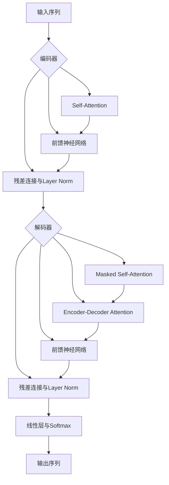

# 一切皆是映射：Transformer模型深度探索

## 1. 背景介绍
### 1.1 深度学习的发展历程
#### 1.1.1 早期神经网络模型
#### 1.1.2 卷积神经网络的崛起
#### 1.1.3 循环神经网络的应用
### 1.2 自然语言处理的挑战
#### 1.2.1 语言的复杂性和多样性
#### 1.2.2 传统方法的局限性
#### 1.2.3 深度学习在NLP中的应用
### 1.3 Transformer模型的诞生
#### 1.3.1 注意力机制的引入
#### 1.3.2 Transformer的核心思想
#### 1.3.3 Transformer的优势与影响

## 2. 核心概念与联系
### 2.1 注意力机制
#### 2.1.1 注意力机制的定义与原理
#### 2.1.2 注意力机制的类型
#### 2.1.3 注意力机制在NLP中的应用
### 2.2 Self-Attention
#### 2.2.1 Self-Attention的概念
#### 2.2.2 Self-Attention的计算过程
#### 2.2.3 Self-Attention的优势
### 2.3 位置编码
#### 2.3.1 位置编码的必要性
#### 2.3.2 位置编码的实现方式
#### 2.3.3 位置编码的作用
### 2.4 残差连接与Layer Normalization
#### 2.4.1 残差连接的概念与作用
#### 2.4.2 Layer Normalization的原理
#### 2.4.3 残差连接与Layer Normalization的结合

## 3. 核心算法原理具体操作步骤
### 3.1 Transformer的整体架构
#### 3.1.1 编码器(Encoder)
#### 3.1.2 解码器(Decoder)
#### 3.1.3 编码器-解码器结构
### 3.2 Multi-Head Attention
#### 3.2.1 Multi-Head Attention的概念
#### 3.2.2 Multi-Head Attention的计算过程
#### 3.2.3 Multi-Head Attention的优势
### 3.3 前馈神经网络(Feed-Forward Network)
#### 3.3.1 前馈神经网络的结构
#### 3.3.2 前馈神经网络的作用
#### 3.3.3 前馈神经网络的计算过程
### 3.4 Transformer的训练过程
#### 3.4.1 数据准备与预处理
#### 3.4.2 模型的训练与优化
#### 3.4.3 模型的评估与调优

## 4. 数学模型和公式详细讲解举例说明
### 4.1 注意力机制的数学表示
#### 4.1.1 Scaled Dot-Product Attention
$$
Attention(Q,K,V) = softmax(\frac{QK^T}{\sqrt{d_k}})V
$$
其中，$Q$, $K$, $V$ 分别表示查询(Query)、键(Key)、值(Value)矩阵，$d_k$表示键向量的维度。
#### 4.1.2 注意力机制的直观解释
#### 4.1.3 注意力权重的计算与归一化
### 4.2 Self-Attention的数学表示
#### 4.2.1 Self-Attention的矩阵计算
$$
SelfAttention(X) = Attention(XW^Q, XW^K, XW^V)
$$
其中，$X$表示输入序列矩阵，$W^Q$, $W^K$, $W^V$分别表示线性变换矩阵。
#### 4.2.2 Self-Attention的并行计算
#### 4.2.3 Self-Attention的多头机制
### 4.3 位置编码的数学表示
#### 4.3.1 正弦位置编码
$$
PE_{(pos,2i)} = sin(pos/10000^{2i/d_{model}})
$$
$$
PE_{(pos,2i+1)} = cos(pos/10000^{2i/d_{model}})
$$
其中，$pos$表示位置，$i$表示维度，$d_{model}$表示模型维度。
#### 4.3.2 位置编码的可视化分析
#### 4.3.3 位置编码的变体与扩展
### 4.4 残差连接与Layer Normalization的数学表示
#### 4.4.1 残差连接
$$
y = F(x) + x
$$
其中，$x$表示输入，$F(x)$表示残差函数，$y$表示输出。
#### 4.4.2 Layer Normalization
$$
\mu_B = \frac{1}{m}\sum_{i=1}^mx_i
$$
$$
\sigma_B^2 = \frac{1}{m}\sum_{i=1}^m(x_i - \mu_B)^2
$$
$$
\hat{x_i} = \frac{x_i - \mu_B}{\sqrt{\sigma_B^2 + \epsilon}}
$$
$$
y_i = \gamma\hat{x_i} + \beta
$$
其中，$\mu_B$和$\sigma_B^2$分别表示批次均值和方差，$\gamma$和$\beta$为可学习的缩放和偏移参数。
#### 4.4.3 残差连接与Layer Normalization的结合应用

## 5. 项目实践：代码实例和详细解释说明
### 5.1 数据准备与预处理
#### 5.1.1 数据集的选择与下载
#### 5.1.2 数据的清洗与标注
#### 5.1.3 数据的向量化表示
### 5.2 Transformer模型的实现
#### 5.2.1 编码器的实现
```python
class TransformerEncoder(nn.Module):
    def __init__(self, num_layers, d_model, num_heads, d_ff, dropout=0.1):
        super(TransformerEncoder, self).__init__()
        self.layers = nn.ModuleList([EncoderLayer(d_model, num_heads, d_ff, dropout) for _ in range(num_layers)])
        self.norm = nn.LayerNorm(d_model)

    def forward(self, x, mask=None):
        for layer in self.layers:
            x = layer(x, mask)
        return self.norm(x)
```
#### 5.2.2 解码器的实现
```python
class TransformerDecoder(nn.Module):
    def __init__(self, num_layers, d_model, num_heads, d_ff, dropout=0.1):
        super(TransformerDecoder, self).__init__()
        self.layers = nn.ModuleList([DecoderLayer(d_model, num_heads, d_ff, dropout) for _ in range(num_layers)])
        self.norm = nn.LayerNorm(d_model)

    def forward(self, x, memory, src_mask=None, tgt_mask=None):
        for layer in self.layers:
            x = layer(x, memory, src_mask, tgt_mask)
        return self.norm(x)
```
#### 5.2.3 Multi-Head Attention的实现
```python
class MultiHeadAttention(nn.Module):
    def __init__(self, d_model, num_heads, dropout=0.1):
        super(MultiHeadAttention, self).__init__()
        assert d_model % num_heads == 0
        self.d_k = d_model // num_heads
        self.num_heads = num_heads
        self.linears = clones(nn.Linear(d_model, d_model), 4)
        self.attn = None
        self.dropout = nn.Dropout(p=dropout)

    def forward(self, query, key, value, mask=None):
        if mask is not None:
            mask = mask.unsqueeze(1)
        nbatches = query.size(0)

        query, key, value = [l(x).view(nbatches, -1, self.num_heads, self.d_k).transpose(1, 2)
                             for l, x in zip(self.linears, (query, key, value))]

        x, self.attn = attention(query, key, value, mask=mask, dropout=self.dropout)

        x = x.transpose(1, 2).contiguous().view(nbatches, -1, self.num_heads * self.d_k)
        return self.linears[-1](x)
```
### 5.3 模型训练与评估
#### 5.3.1 定义损失函数与优化器
#### 5.3.2 模型的训练过程
#### 5.3.3 模型的评估与测试

## 6. 实际应用场景
### 6.1 机器翻译
#### 6.1.1 Transformer在机器翻译中的应用
#### 6.1.2 Transformer相比传统方法的优势
#### 6.1.3 Transformer在机器翻译中的性能表现
### 6.2 文本摘要
#### 6.2.1 Transformer在文本摘要中的应用
#### 6.2.2 Transformer生成摘要的过程与策略
#### 6.2.3 Transformer在文本摘要任务中的效果评估
### 6.3 情感分析
#### 6.3.1 Transformer在情感分析中的应用
#### 6.3.2 Transformer捕捉情感信息的机制
#### 6.3.3 Transformer在情感分析任务中的表现
### 6.4 问答系统
#### 6.4.1 Transformer在问答系统中的应用
#### 6.4.2 Transformer生成答案的过程
#### 6.4.3 Transformer在问答任务中的效果评估

## 7. 工具和资源推荐
### 7.1 开源框架与库
#### 7.1.1 Tensorflow
#### 7.1.2 PyTorch
#### 7.1.3 Hugging Face Transformers
### 7.2 预训练模型
#### 7.2.1 BERT
#### 7.2.2 GPT
#### 7.2.3 XLNet
### 7.3 数据集与评测基准
#### 7.3.1 WMT机器翻译数据集
#### 7.3.2 GLUE基准测试
#### 7.3.3 SQuAD问答数据集
### 7.4 学习资源
#### 7.4.1 论文与教程
#### 7.4.2 在线课程
#### 7.4.3 社区与讨论组

## 8. 总结：未来发展趋势与挑战
### 8.1 Transformer的优势与局限
#### 8.1.1 Transformer的优势总结
#### 8.1.2 Transformer面临的挑战与局限
#### 8.1.3 Transformer的改进方向
### 8.2 Transformer的扩展与变体
#### 8.2.1 基于Transformer的预训练语言模型
#### 8.2.2 Transformer在多模态任务中的应用
#### 8.2.3 Transformer的轻量化与压缩
### 8.3 未来研究方向
#### 8.3.1 长文本建模与生成
#### 8.3.2 知识融合与推理
#### 8.3.3 可解释性与鲁棒性

## 9. 附录：常见问题与解答
### 9.1 Transformer相比RNN/LSTM的优势是什么？
### 9.2 Self-Attention的计算复杂度如何？
### 9.3 如何处理Transformer中的OOV(Out-of-Vocabulary)问题？
### 9.4 Transformer能否应用于时间序列预测任务？
### 9.5 Transformer的并行训练策略有哪些？

---



Transformer作为一种强大的序列到序列模型，其核心思想在于利用Self-Attention机制来捕捉输入序列中不同位置之间的依赖关系，从而实现对整个序列的建模。与传统的RNN/LSTM模型相比，Transformer通过引入Multi-Head Attention和位置编码等技术，大大提高了模型的并行计算能力和长程依赖捕捉能力，在机器翻译、文本摘要、情感分析等自然语言处理任务中取得了显著的性能提升。

Transformer的核心组件包括编码器和解码器，其中编码器主要由Self-Attention和前馈神经网络组成，用于对输入序列进行特征提取和编码；解码器则在编码器的基础上，引入了Masked Self-Attention和Encoder-Decoder Attention，用于生成目标序列。通过堆叠多个编码器和解码器层，Transformer能够建模输入序列和输出序列之间的复杂映射关系。

在数学建模方面，Transformer巧妙地利用了矩阵运算和注意力机制，通过计算Query、Key、Value三个矩阵的相似度得分，生成注意力权重，并使用加权求和的方式聚合上下文信息。同时，为了捕捉序列中的位置信息，Transformer引入了基于正弦函数的位置编码，使得模型能够感知不同位置之间的相对关系。

尽管Transformer在许多任务上取得了巨大成功，但它仍然面临着一些挑战和局限性，