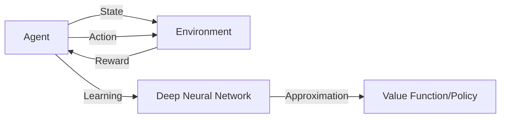

# 一切皆是映射：强化学习基础及其与深度学习的结合

## 1. 背景介绍

### 1.1 强化学习的起源与发展
#### 1.1.1 强化学习的起源
#### 1.1.2 强化学习的发展历程
#### 1.1.3 强化学习的重要里程碑

### 1.2 深度学习的崛起
#### 1.2.1 深度学习的概念
#### 1.2.2 深度学习的发展历程
#### 1.2.3 深度学习的重要突破

### 1.3 强化学习与深度学习的结合
#### 1.3.1 强化学习与深度学习结合的意义
#### 1.3.2 强化学习与深度学习结合的优势
#### 1.3.3 强化学习与深度学习结合的挑战

## 2. 核心概念与联系

### 2.1 强化学习的核心概念
#### 2.1.1 智能体(Agent)
#### 2.1.2 环境(Environment)
#### 2.1.3 状态(State)
#### 2.1.4 动作(Action)
#### 2.1.5 奖励(Reward)
#### 2.1.6 策略(Policy)
#### 2.1.7 价值函数(Value Function)

### 2.2 深度学习的核心概念
#### 2.2.1 人工神经网络(Artificial Neural Network)
#### 2.2.2 前馈神经网络(Feedforward Neural Network)
#### 2.2.3 卷积神经网络(Convolutional Neural Network)
#### 2.2.4 循环神经网络(Recurrent Neural Network)
#### 2.2.5 深度信念网络(Deep Belief Network)

### 2.3 强化学习与深度学习的关联
#### 2.3.1 深度强化学习(Deep Reinforcement Learning)
#### 2.3.2 深度Q网络(Deep Q-Network)
#### 2.3.3 策略梯度(Policy Gradient)
#### 2.3.4 Actor-Critic算法



## 3. 核心算法原理具体操作步骤

### 3.1 Q-Learning算法
#### 3.1.1 Q-Learning的基本思想
#### 3.1.2 Q-Learning的更新规则
#### 3.1.3 Q-Learning的算法流程

### 3.2 深度Q网络(DQN)算法
#### 3.2.1 DQN的基本思想
#### 3.2.2 DQN的网络结构
#### 3.2.3 DQN的损失函数
#### 3.2.4 DQN的算法流程

### 3.3 策略梯度(Policy Gradient)算法
#### 3.3.1 策略梯度的基本思想
#### 3.3.2 REINFORCE算法
#### 3.3.3 Actor-Critic算法

### 3.4 深度确定性策略梯度(DDPG)算法
#### 3.4.1 DDPG的基本思想
#### 3.4.2 DDPG的Actor网络
#### 3.4.3 DDPG的Critic网络
#### 3.4.4 DDPG的算法流程

## 4. 数学模型和公式详细讲解举例说明

### 4.1 马尔可夫决策过程(Markov Decision Process)
#### 4.1.1 马尔可夫性质
#### 4.1.2 马尔可夫决策过程的定义
#### 4.1.3 贝尔曼方程(Bellman Equation)

马尔可夫决策过程可以用一个五元组 $(S,A,P,R,\gamma)$ 来表示：

- $S$: 状态空间，表示智能体所有可能的状态集合。
- $A$: 动作空间，表示智能体在每个状态下可以采取的所有可能动作集合。
- $P$: 状态转移概率矩阵，$P(s'|s,a)$ 表示在状态 $s$ 下采取动作 $a$ 后转移到状态 $s'$ 的概率。
- $R$: 奖励函数，$R(s,a)$ 表示在状态 $s$ 下采取动作 $a$ 后获得的即时奖励。
- $\gamma$: 折扣因子，$\gamma \in [0,1]$，表示未来奖励的折扣比例。

贝尔曼方程描述了状态价值函数和动作价值函数之间的递归关系：

$$
V(s) = \max_{a \in A} \left[ R(s,a) + \gamma \sum_{s' \in S} P(s'|s,a) V(s') \right]
$$

$$
Q(s,a) = R(s,a) + \gamma \sum_{s' \in S} P(s'|s,a) \max_{a' \in A} Q(s',a')
$$

### 4.2 Q-Learning的数学模型
#### 4.2.1 Q-Learning的更新公式
#### 4.2.2 Q-Learning的收敛性证明

Q-Learning的更新公式如下：

$$
Q(s,a) \leftarrow Q(s,a) + \alpha \left[ r + \gamma \max_{a'} Q(s',a') - Q(s,a) \right]
$$

其中，$\alpha$ 是学习率，$r$ 是即时奖励，$s'$ 是采取动作 $a$ 后转移到的下一个状态。

### 4.3 策略梯度的数学模型
#### 4.3.1 策略梯度定理
#### 4.3.2 策略梯度的目标函数
#### 4.3.3 策略梯度的更新公式

策略梯度定理给出了期望回报关于策略参数的梯度：

$$
\nabla_\theta J(\theta) = \mathbb{E}_{\tau \sim p_\theta(\tau)} \left[ \sum_{t=0}^T \nabla_\theta \log \pi_\theta(a_t|s_t) Q^{\pi_\theta}(s_t,a_t) \right]
$$

其中，$\tau$ 表示一条轨迹 $(s_0,a_0,r_0,s_1,a_1,r_1,\dots,s_T,a_T,r_T)$，$p_\theta(\tau)$ 表示在策略 $\pi_\theta$ 下生成轨迹 $\tau$ 的概率。

策略梯度的目标函数是最大化期望回报：

$$
J(\theta) = \mathbb{E}_{\tau \sim p_\theta(\tau)} \left[ \sum_{t=0}^T r_t \right]
$$

策略梯度的更新公式为：

$$
\theta \leftarrow \theta + \alpha \nabla_\theta J(\theta)
$$

## 5. 项目实践：代码实例和详细解释说明

### 5.1 基于OpenAI Gym的强化学习环境
#### 5.1.1 OpenAI Gym简介
#### 5.1.2 经典控制问题：CartPole
#### 5.1.3 Atari游戏：Breakout

### 5.2 DQN算法实现
#### 5.2.1 DQN网络结构的构建
#### 5.2.2 经验回放(Experience Replay)
#### 5.2.3 ε-贪心策略(ε-Greedy Policy)
#### 5.2.4 目标网络(Target Network)
#### 5.2.5 DQN算法的训练过程

```python
import torch
import torch.nn as nn
import torch.optim as optim
import numpy as np
import gym

# 定义Q网络
class QNetwork(nn.Module):
    def __init__(self, state_dim, action_dim):
        super(QNetwork, self).__init__()
        self.fc1 = nn.Linear(state_dim, 64)
        self.fc2 = nn.Linear(64, 64)
        self.fc3 = nn.Linear(64, action_dim)

    def forward(self, x):
        x = torch.relu(self.fc1(x))
        x = torch.relu(self.fc2(x))
        x = self.fc3(x)
        return x

# 定义DQN智能体
class DQNAgent:
    def __init__(self, state_dim, action_dim, learning_rate, gamma, epsilon, target_update):
        self.state_dim = state_dim
        self.action_dim = action_dim
        self.learning_rate = learning_rate
        self.gamma = gamma
        self.epsilon = epsilon
        self.target_update = target_update

        self.q_network = QNetwork(state_dim, action_dim)
        self.target_network = QNetwork(state_dim, action_dim)
        self.optimizer = optim.Adam(self.q_network.parameters(), lr=learning_rate)
        self.loss_fn = nn.MSELoss()

        self.memory = []
        self.memory_size = 10000
        self.batch_size = 64

    def choose_action(self, state):
        if np.random.rand() < self.epsilon:
            return np.random.randint(self.action_dim)
        else:
            state = torch.tensor(state, dtype=torch.float32)
            q_values = self.q_network(state)
            return torch.argmax(q_values).item()

    def memorize(self, state, action, reward, next_state, done):
        self.memory.append((state, action, reward, next_state, done))
        if len(self.memory) > self.memory_size:
            self.memory.pop(0)

    def learn(self):
        if len(self.memory) < self.batch_size:
            return

        batch = np.random.choice(len(self.memory), self.batch_size, replace=False)
        states, actions, rewards, next_states, dones = zip(*[self.memory[i] for i in batch])

        states = torch.tensor(states, dtype=torch.float32)
        actions = torch.tensor(actions, dtype=torch.int64)
        rewards = torch.tensor(rewards, dtype=torch.float32)
        next_states = torch.tensor(next_states, dtype=torch.float32)
        dones = torch.tensor(dones, dtype=torch.float32)

        q_values = self.q_network(states).gather(1, actions.unsqueeze(1)).squeeze(1)
        next_q_values = self.target_network(next_states).max(1)[0]
        expected_q_values = rewards + (1 - dones) * self.gamma * next_q_values

        loss = self.loss_fn(q_values, expected_q_values.detach())

        self.optimizer.zero_grad()
        loss.backward()
        self.optimizer.step()

    def update_target_network(self):
        self.target_network.load_state_dict(self.q_network.state_dict())

# 训练DQN智能体
def train_dqn(env, agent, num_episodes, max_steps):
    rewards = []
    for episode in range(num_episodes):
        state = env.reset()
        episode_reward = 0
        for step in range(max_steps):
            action = agent.choose_action(state)
            next_state, reward, done, _ = env.step(action)
            agent.memorize(state, action, reward, next_state, done)
            agent.learn()
            state = next_state
            episode_reward += reward
            if done:
                break
        rewards.append(episode_reward)
        if episode % agent.target_update == 0:
            agent.update_target_network()
        print(f"Episode {episode+1}: Reward = {episode_reward}")
    return rewards

# 创建CartPole环境
env = gym.make('CartPole-v1')
state_dim = env.observation_space.shape[0]
action_dim = env.action_space.n

# 创建DQN智能体
agent = DQNAgent(state_dim, action_dim, learning_rate=0.001, gamma=0.99, epsilon=0.1, target_update=10)

# 训练DQN智能体
num_episodes = 500
max_steps = 500
rewards = train_dqn(env, agent, num_episodes, max_steps)

# 关闭环境
env.close()
```

### 5.3 REINFORCE算法实现
#### 5.3.1 策略网络的构建
#### 5.3.2 策略梯度的计算
#### 5.3.3 REINFORCE算法的训练过程

### 5.4 Actor-Critic算法实现
#### 5.4.1 Actor网络和Critic网络的构建
#### 5.4.2 Actor-Critic算法的训练过程

## 6. 实际应用场景

### 6.1 游戏AI
#### 6.1.1 Atari游戏
#### 6.1.2 围棋
#### 6.1.3 星际争霸

### 6.2 机器人控制
#### 6.2.1 机器人运动规划
#### 6.2.2 机器人操纵
#### 6.2.3 自动驾驶

### 6.3 推荐系统
#### 6.3.1 电商推荐
#### 6.3.2 新闻推荐
#### 6.3.3 视频推荐

### 6.4 自然语言处理
#### 6.4.1 对话系统
#### 6.4.2 文本生成
#### 6.4.3 机器翻译

## 7. 工具和资源推荐

### 7.1 强化学习框架
#### 7.1.1 OpenAI Gym
#### 7.1.2 DeepMind Control Suite
#### 7.1.3 MuJoCo

### 7.2 深度学习框架
#### 7.2.1 TensorFlow
#### 7.2.2 PyTorch
#### 7.2.3 Keras

### 7.3 学习资源
#### 7.3.1 书籍推荐
- 《Reinforcement Learning: An Introduction》by Richard S. Sutton and Andrew G. Barto
- 《