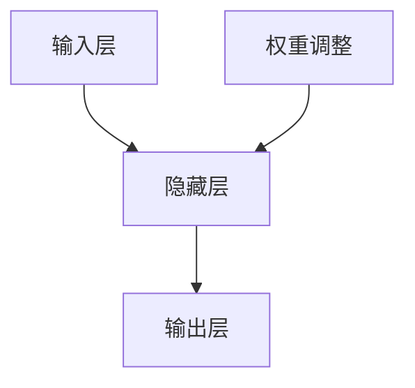
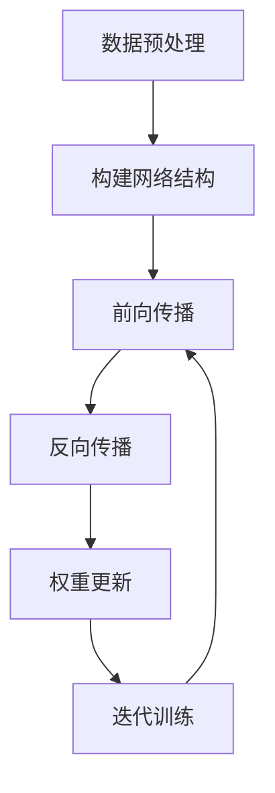

# 一切皆是映射：神经网络在生物信息学中的应用前景

## 1. 背景介绍

### 1.1 生物信息学的兴起

生物信息学是一门融合生物学与信息技术的新兴学科,旨在利用计算机科学的理论和方法来解决生物学问题。随着基因组测序技术的飞速发展,大量的生物数据被积累,这为生物信息学的发展提供了坚实的基础。生物信息学的主要研究内容包括基因组分析、蛋白质结构预测、生物大分子模拟等,对于揭示生命奥秘、开发新药物和疾病诊断具有重要意义。

### 1.2 人工智能在生物信息学中的作用

人工智能技术在生物信息学领域发挥着越来越重要的作用。其中,神经网络作为一种强大的机器学习模型,已被广泛应用于基因表达数据分析、蛋白质结构预测、药物设计等多个领域。神经网络能够从海量数据中自动学习特征模式,并进行智能预测和决策,为生物信息学研究提供了新的思路和方法。

## 2. 核心概念与联系

### 2.1 神经网络简介

神经网络是一种模拟生物神经系统的数学模型,由大量互连的人工神经元组成。每个神经元接收多个输入信号,经过加权求和和非线性激活函数处理后,产生输出信号。神经网络通过调整神经元之间的连接权重,从训练数据中自动学习特征模式,从而实现智能预测和决策。



### 2.2 生物信息学中的映射问题

在生物信息学中,许多问题都可以归结为从一种形式映射到另一种形式的问题。例如:

- 基因表达数据映射到疾病类型
- 蛋白质序列映射到三维结构
- 化合物结构映射到生物活性

神经网络擅长于学习复杂的非线性映射关系,因此非常适合解决生物信息学中的这些映射问题。

## 3. 核心算法原理具体操作步骤

### 3.1 神经网络的训练过程

神经网络的训练过程可分为以下几个步骤:

1. **数据预处理**: 对原始数据进行标准化、归一化等预处理,使其符合神经网络的输入要求。

2. **构建网络结构**: 确定神经网络的层数、每层神经元数量、激活函数等参数,构建初始网络结构。

3. **前向传播**: 输入数据传递至输入层,通过隐藏层层层传递,计算输出层的输出值。

4. **反向传播**: 计算输出值与真实值之间的误差,根据链式法则计算每个权重对误差的梯度。

5. **权重更新**: 使用优化算法(如梯度下降)根据梯度更新每个权重,使得误差最小化。

6. **迭代训练**: 重复执行步骤3-5,直至模型收敛或达到指定迭代次数。



### 3.2 常用的神经网络模型

生物信息学中常用的神经网络模型包括:

- **前馈神经网络(FNN)**: 最基本的神经网络模型,信号只在前向方向传播。适用于简单的映射问题。

- **卷积神经网络(CNN)**: 擅长处理图像和序列数据,在蛋白质结构预测中有广泛应用。

- **循环神经网络(RNN)**: 适用于处理序列数据,如基因序列分析。

- **长短期记忆网络(LSTM)**: 改进的RNN模型,能够更好地捕捉长期依赖关系。

- **生成对抗网络(GAN)**: 可用于生成新的分子结构或蛋白质结构。

## 4. 数学模型和公式详细讲解举例说明

### 4.1 神经网络的数学模型

假设一个神经网络有 $L$ 层,第 $l$ 层有 $n_l$ 个神经元。令 $a^{(l)}$ 表示第 $l$ 层的激活值向量,则有:

$$a^{(l)} = g(z^{(l)})$$

其中 $g$ 为激活函数, $z^{(l)}$ 为加权输入,定义为:

$$z^{(l)} = W^{(l)}a^{(l-1)} + b^{(l)}$$

$W^{(l)}$ 为第 $l$ 层的权重矩阵, $b^{(l)}$ 为偏置向量。

对于二分类问题,输出层的激活函数通常为 Sigmoid 函数:

$$a^{(L)} = \sigma(z^{(L)}) = \frac{1}{1+e^{-z^{(L)}}}$$

训练过程的目标是最小化代价函数 $J(W,b)$,常用的代价函数为交叉熵:

$$J(W,b) = -\frac{1}{m}\sum_{i=1}^m[y^{(i)}\log a^{(L)(i)} + (1-y^{(i)})\log(1-a^{(L)(i)})]$$

其中 $m$ 为训练样本数, $y$ 为真实标签。

### 4.2 基因表达数据分类示例

假设我们有一组基因表达数据 $X$,需要将其分类为健康或患病两类。我们可以构建一个三层神经网络来解决这个问题:

- 输入层: $n_0$ 个神经元,对应基因的数量
- 隐藏层: $n_1$ 个神经元,通过激活函数 $g_1$ 获得特征表示
- 输出层: 1个神经元,通过 Sigmoid 激活函数输出分类概率

令 $W^{(1)}$ 为 $(n_1 \times n_0)$ 的权重矩阵, $b^{(1)}$ 为 $(n_1 \times 1)$ 的偏置向量,则隐藏层的激活值为:

$$a^{(1)} = g_1(W^{(1)}X + b^{(1)})$$

同理,输出层的激活值为:

$$a^{(2)} = \sigma(W^{(2)}a^{(1)} + b^{(2)})$$

通过调整 $W^{(1)}$, $b^{(1)}$, $W^{(2)}$, $b^{(2)}$ 的值,使得代价函数 $J(W^{(1)},b^{(1)},W^{(2)},b^{(2)})$ 最小化,即可获得最优的分类模型。

## 5. 项目实践:代码实例和详细解释说明

以下是一个使用 Python 和 TensorFlow 库实现基因表达数据分类的示例代码:

```python
import tensorflow as tf

# 生成虚拟数据
X_data = np.random.randn(1000, 100) # 1000 个样本, 100 个基因
y_data = np.random.randint(2, size=1000) # 二分类标签

# 占位符
X = tf.placeholder(tf.float32, [None, 100])
y = tf.placeholder(tf.int32, [None])

# 神经网络参数
W1 = tf.Variable(tf.random_normal([100, 50]))
b1 = tf.Variable(tf.zeros([50]))
W2 = tf.Variable(tf.random_normal([50, 1]))
b2 = tf.Variable(tf.zeros([1]))

# 前向传播
a1 = tf.nn.relu(tf.matmul(X, W1) + b1)
y_pred = tf.nn.sigmoid(tf.matmul(a1, W2) + b2)

# 代价函数
loss = tf.reduce_mean(-tf.reduce_sum(y * tf.log(y_pred) + (1 - y) * tf.log(1 - y_pred), axis=1))

# 优化器
train_op = tf.train.GradientDescentOptimizer(0.01).minimize(loss)

# 训练
with tf.Session() as sess:
    sess.run(tf.global_variables_initializer())
    for epoch in range(1000):
        _, loss_val = sess.run([train_op, loss], feed_dict={X: X_data, y: y_data})
        if epoch % 100 == 0:
            print(f"Epoch: {epoch}, Loss: {loss_val}")
```

代码解释:

1. 首先生成虚拟的基因表达数据 `X_data` 和二分类标签 `y_data`。
2. 定义占位符 `X` 和 `y`,用于在训练时输入数据。
3. 初始化神经网络的权重矩阵 `W1`、`W2` 和偏置向量 `b1`、`b2`。
4. 实现前向传播过程,包括隐藏层的 ReLU 激活和输出层的 Sigmoid 激活。
5. 定义代价函数为交叉熵损失。
6. 使用梯度下降优化器最小化代价函数。
7. 在会话中执行训练过程,每 100 个epoch 打印当前损失值。

通过上述代码,我们可以训练一个简单的神经网络模型,对基因表达数据进行二分类。在实际应用中,我们可以根据具体问题调整网络结构、超参数等,以获得更好的性能。

## 6. 实际应用场景

神经网络在生物信息学领域有广泛的应用前景,包括但不限于:

### 6.1 基因表达数据分析

通过分析基因表达数据,可以发现与疾病相关的基因模式,从而实现早期诊断和个性化治疗。神经网络可以有效地从高维基因表达数据中提取特征,对疾病进行分类和预测。

### 6.2 蛋白质结构预测

蛋白质的三维结构与其功能密切相关。传统的实验方法耗时耗力,而神经网络可以基于蛋白质序列快速预测其三维结构,为新药研发提供重要线索。

### 6.3 分子设计

设计具有特定生物活性的新分子是药物研发的关键步骤。生成对抗网络等深度学习模型可以基于已知分子数据生成新的分子结构,加速新药物的发现过程。

### 6.4 医学影像分析

神经网络在医学影像分析领域也有广泛应用,如肿瘤检测、器官分割等。这为疾病诊断和治疗提供了有力支持。

## 7. 工具和资源推荐

### 7.1 深度学习框架

- TensorFlow: 谷歌开源的深度学习框架,支持多种语言接口。
- PyTorch: Facebook 开源的深度学习框架,具有动态计算图的特点。
- Keras: 高级神经网络 API,可在 TensorFlow 或 Theano 之上运行。

### 7.2 生物信息学工具包

- Biopython: 用于处理生物序列和结构数据的 Python 工具包。
- EMBOSS: 欧洲分子生物学实验室开发的分析软件套件。
- HMMER: 用于生物序列分析的隐马尔可夫模型软件套件。

### 7.3 数据资源

- GenBank: 由美国国家生物技术信息中心维护的基因序列数据库。
- PDB: 蛋白质数据库,收录了大量的蛋白质三维结构数据。
- PubChem: 由美国国立卫生研究院维护的化合物数据库。

## 8. 总结:未来发展趋势与挑战

### 8.1 发展趋势

- 模型集成: 将不同类型的神经网络模型集成,发挥各自的优势,提高预测精度。
- 注意力机制: 引入注意力机制,使模型能够关注数据的重要部分,提高性能。
- 迁移学习: 利用在大型数据集上预训练的模型,将知识迁移到生物信息学任务上。
- 解释性: 提高神经网络模型的解释性,使预测结果更可解释和可信。

### 8.2 挑战

- 数据质量: 生物数据的噪声、缺失和不一致性,给数据预处理带来挑战。
- 计算资源: 训练大型神经网络模型需要大量的计算资源,如 GPU 等。
- 领域知识: 生物信息学涉及复杂的生物学知识,需要专业人员参与模型设计和结果解释。
- 隐私和伦理: 如何在保护个人隐私的同时,利用患者数据进行研究和应用。

## 9.