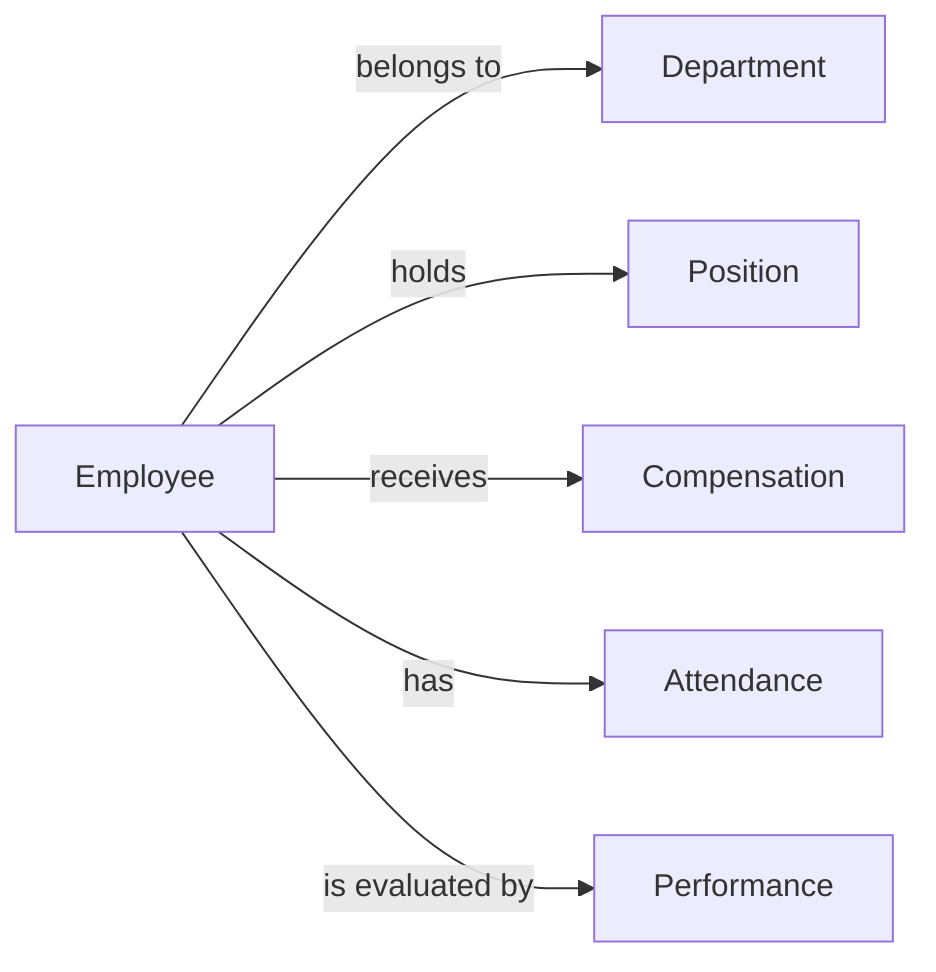

# 人事管理系统设计与实现

## 1. 背景介绍
### 1.1 人事管理系统的重要性
在现代企业管理中,人力资源是最宝贵的资产之一。高效的人事管理不仅可以提高员工的工作效率和满意度,还能为企业的长远发展提供坚实的基础。然而,传统的人工管理方式往往效率低下,容易出错,难以应对日益复杂的人事管理需求。因此,开发一套功能完善、易于使用的人事管理系统势在必行。

### 1.2 人事管理系统的主要功能
一个优秀的人事管理系统应该涵盖以下主要功能:

1. 员工信息管理:包括员工的基本信息、职位、薪酬、考勤等。
2. 招聘管理:包括职位发布、简历筛选、面试安排、录用等。
3. 绩效管理:包括绩效目标设置、绩效考核、绩效反馈等。
4. 培训管理:包括培训需求调查、培训计划制定、培训实施等。
5. 薪酬管理:包括薪酬结构设计、薪酬发放、社会保险管理等。

### 1.3 人事管理系统的开发技术选型
为了开发一个高质量的人事管理系统,我们需要选择合适的技术栈。以下是一些常用的技术选型:

- 前端:Vue.js、React、Angular等前端框架。
- 后端:Spring Boot、Node.js、Python等后端框架。
- 数据库:MySQL、PostgreSQL、Oracle等关系型数据库,或者MongoDB、Cassandra等NoSQL数据库。
- 部署:Docker容器化部署,Kubernetes集群管理。

## 2. 核心概念与联系
### 2.1 人事管理系统的核心概念
- 员工(Employee):公司的基本组成单位,具有各自的属性,如姓名、工号、职位等。
- 部门(Department):员工所属的组织单位,具有层级结构。
- 职位(Position):员工在公司中担任的角色,如经理、工程师等。
- 薪酬(Compensation):员工获得的报酬,包括基本工资、奖金、津贴等。
- 考勤(Attendance):员工的出勤情况,如上班打卡、请假等。
- 绩效(Performance):员工工作表现的评估结果。

### 2.2 核心概念之间的关系


## 3. 核心算法原理具体操作步骤
### 3.1 员工信息管理
1. 添加员工:输入员工基本信息,如姓名、性别、出生日期等,生成唯一的工号,将员工信息存入数据库。
2. 修改员工信息:根据员工工号查询员工信息,修改相应字段,更新数据库。
3. 删除员工:根据员工工号查询员工信息,标记员工状态为"离职",而非直接删除员工记录。
4. 查询员工:根据员工姓名、工号、部门等条件,查询符合条件的员工信息。

### 3.2 招聘管理
1. 发布职位:输入职位名称、职责、要求等信息,生成职位编号,将职位信息存入数据库。
2. 筛选简历:根据职位要求,对收到的简历进行初步筛选,标记合适的候选人。
3. 安排面试:根据候选人的情况,安排面试时间、地点,通知面试官和候选人。
4. 录用:根据面试结果,选择合适的候选人,生成员工信息,存入数据库。

### 3.3 绩效管理
1. 设置绩效目标:根据员工职位、部门制定绩效目标,存入数据库。
2. 绩效考核:定期对员工进行绩效考核,记录考核结果,存入数据库。
3. 绩效反馈:根据考核结果,对员工进行绩效反馈,制定改进计划。

## 4. 数学模型和公式详细讲解举例说明
在人事管理系统中,我们可以使用一些数学模型和公式来辅助决策。例如,在绩效考核中,我们可以使用加权平均数模型来计算员工的综合绩效得分。

假设某员工的绩效考核包括四个维度:业务能力、沟通能力、团队合作、工作态度,每个维度的权重分别为0.4、0.2、0.2、0.2,满分均为100分。该员工各维度的得分如下:

- 业务能力:85分
- 沟通能力:90分
- 团队合作:80分
- 工作态度:95分

我们可以使用加权平均数公式计算该员工的综合绩效得分:

$综合绩效得分 = \sum_{i=1}^{n} w_i \times s_i$

其中,$w_i$为第$i$个维度的权重,$s_i$为第$i$个维度的得分,n为维度数量。

代入数值,得到:

$$综合绩效得分 = 0.4 \times 85 + 0.2 \times 90 + 0.2 \times 80 + 0.2 \times 95 = 87$$

因此,该员工的综合绩效得分为87分。

## 5. 项目实践:代码实例和详细解释说明
下面是一个使用Spring Boot和MySQL实现的员工信息管理模块的代码示例:

```java
// Employee.java
@Entity
@Table(name = "employee")
public class Employee {
    @Id
    @GeneratedValue(strategy = GenerationType.IDENTITY)
    private Long id;

    @Column(nullable = false)
    private String name;

    @Column(nullable = false)
    private String gender;

    @Column(name = "birth_date", nullable = false)
    private Date birthDate;

    // 其他字段...

    // getter和setter方法...
}

// EmployeeRepository.java
@Repository
public interface EmployeeRepository extends JpaRepository<Employee, Long> {
    List<Employee> findByNameContaining(String name);
    List<Employee> findByDepartmentId(Long departmentId);
}

// EmployeeService.java
@Service
public class EmployeeService {
    @Autowired
    private EmployeeRepository employeeRepository;

    public Employee addEmployee(Employee employee) {
        return employeeRepository.save(employee);
    }

    public Employee updateEmployee(Employee employee) {
        return employeeRepository.save(employee);
    }

    public void deleteEmployee(Long id) {
        employeeRepository.deleteById(id);
    }

    public List<Employee> findAllEmployees() {
        return employeeRepository.findAll();
    }

    public List<Employee> findEmployeesByName(String name) {
        return employeeRepository.findByNameContaining(name);
    }

    public List<Employee> findEmployeesByDepartment(Long departmentId) {
        return employeeRepository.findByDepartmentId(departmentId);
    }
}
```

在上面的代码中:

- `Employee`是员工实体类,使用JPA注解映射到数据库表。
- `EmployeeRepository`是员工数据访问层,继承自`JpaRepository`,提供了基本的CRUD操作和一些自定义查询方法。
- `EmployeeService`是员工业务逻辑层,注入`EmployeeRepository`,提供了员工管理的各项功能,如添加、修改、删除、查询员工等。

## 6. 实际应用场景
人事管理系统可以应用于各种规模和行业的企业,如:

- IT企业:管理研发、测试、运维等技术人员。
- 制造业:管理生产、质检、仓储等一线员工。
- 零售业:管理销售、客服、物流等门店员工。
- 服务业:管理咨询、培训、财务等专业服务人员。

不同行业的人事管理系统在功能和流程上会有所差异,需要根据企业的实际情况进行定制开发。

## 7. 工具和资源推荐
以下是一些开发人事管理系统常用的工具和资源:

- 项目管理:Jira、Trello、Asana等。
- 界面设计:Sketch、Figma、Adobe XD等。
- 代码管理:Git、SVN等。
- 持续集成:Jenkins、Travis CI、GitLab CI等。
- 文档管理:Confluence、Google Docs、Microsoft Office等。

除了开发工具,还有一些学习资源可以帮助你提升人事管理系统开发的技能:

- Spring Boot官方文档:https://spring.io/projects/spring-boot
- Vue.js官方文档:https://vuejs.org/
- MySQL官方文档:https://dev.mysql.com/doc/
- 人力资源管理知识体系:https://www.hrci.org/hr-certifications/what-is-hrci-certification

## 8. 总结:未来发展趋势与挑战
随着人工智能、大数据等新兴技术的发展,人事管理系统也面临着新的机遇和挑战。未来的人事管理系统可能会呈现以下发展趋势:

- 智能化:利用人工智能技术,实现简历自动筛选、面试安排、绩效预测等功能。
- 移动化:支持移动端访问,方便员工随时随地查询和修改个人信息。
- 社交化:集成企业社交网络,促进员工之间的沟通和协作。
- 数据化:利用大数据分析技术,挖掘人力资源数据的价值,为决策提供支持。

同时,人事管理系统的开发也面临着一些挑战:

- 数据安全:如何保护员工的个人隐私数据,防止数据泄露。
- 系统集成:如何与企业内其他系统(如OA、ERP等)实现无缝集成。
- 用户体验:如何设计出简洁易用、功能强大的用户界面。

## 9. 附录:常见问题与解答
1. 问:人事管理系统与HR系统有什么区别?
   答:人事管理系统是HR系统的一个子集,侧重于员工信息管理、招聘、绩效等基础功能。HR系统的范围更广,还包括薪酬福利、人才发展等模块。

2. 问:人事管理系统需要哪些角色来使用?
   答:人事管理系统的主要用户角色包括:HR专员、招聘经理、员工、部门经理等。不同角色拥有不同的权限和功能。

3. 问:如何保证人事管理系统的数据安全?
   答:可以采取以下措施来保证数据安全:使用加密算法对敏感数据进行加密存储;严格控制数据访问权限;定期备份数据;使用安全的通信协议等。

4. 问:人事管理系统上线后,如何进行运维?
   答:人事管理系统上线后,需要进行以下运维工作:监控系统运行状态;定期进行数据备份;及时修复发现的Bug;根据用户反馈优化系统功能;定期进行安全漏洞扫描等。

作者:禅与计算机程序设计艺术 / Zen and the Art of Computer Programming