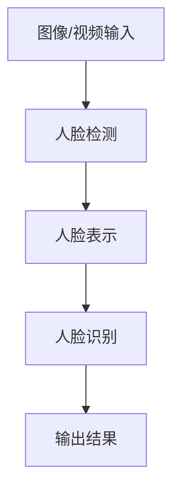

# 人脸识别的精度和可靠性

## 1.背景介绍

人脸识别技术近年来得到了飞速发展,已广泛应用于各个领域,如安全监控、刷脸支付、人员通行管理等。随着技术的不断进步,人脸识别的精度和可靠性也在不断提高。然而,由于面部特征的多样性和复杂环境等因素,实现高精度高可靠的人脸识别仍然是一个巨大挑战。

## 2.核心概念与联系

人脸识别技术的核心是从图像或视频中检测并识别人脸。它涉及以下几个关键概念:

1. **人脸检测(Face Detection)**:从图像或视频帧中定位并提取人脸区域。
2. **人脸表示(Face Representation)**:将检测到的人脸编码为易于比较和匹配的特征向量。
3. **人脸识别(Face Recognition)**:将提取的人脸特征与已知身份的人脸特征库进行比对,找到最匹配的身份。

这些概念相互关联,构成了完整的人脸识别流程。



## 3.核心算法原理具体操作步骤

### 3.1 人脸检测算法

人脸检测是人脸识别的第一步,常用的算法有:

1. **Viola-Jones算法**: 基于Haar特征和级联分类器,具有较高的检测速度。
2. **HOG(Histogram of Oriented Gradients)算法**: 利用图像梯度方向直方图特征,对人脸和非人脸区域进行分类。
3. **CNN(卷积神经网络)算法**: 利用深度学习模型自动学习图像特征,检测人脸区域。

这些算法的具体操作步骤如下:

1. 图像预处理(缩放、灰度化等)
2. 在图像上滑动窗口,提取窗口内特征
3. 利用分类器(如Adaboost、SVM或CNN)判断窗口内是否存在人脸
4. 使用非极大值抑制合并相邻的人脸检测框
5. 返回最终的人脸检测结果

### 3.2 人脸表示算法

常用的人脸表示算法有:

1. **基于统计模型的算法**: 如主成分分析(PCA)、线性判别分析(LDA)等,将人脸图像投影到低维空间,得到人脸特征向量。
2. **基于深度学习的算法**: 利用CNN等深度网络自动学习人脸图像的特征表示。

这些算法的具体步骤如下:

1. 对检测到的人脸区域进行预处理(对齐、裁剪等)
2. 将预处理后的人脸图像输入到特征提取模型(如PCA、LDA或CNN)
3. 模型输出人脸的特征向量表示
4. 将特征向量进行归一化或其他后处理

### 3.3 人脸识别算法

常用的人脸识别算法有:

1. **基于距离度量的算法**: 计算待识别人脸特征向量与已知身份人脸特征的距离(如欧氏距离、余弦相似度等),将距离最小的身份作为识别结果。
2. **基于分类模型的算法**: 将人脸识别问题建模为多分类问题,利用SVM、决策树等分类器进行身份识别。
3. **基于度量学习的算法**: 通过学习样本对的相似度,得到判别性更强的距离度量,提高识别精度。

这些算法的具体步骤如下:

1. 构建已知身份人脸特征库
2. 对待识别人脸特征与特征库中的每个人脸特征进行距离计算或分类
3. 根据距离或分类得分,确定最匹配的身份
4. 设置阈值,过滤掉低置信度的识别结果

## 4.数学模型和公式详细讲解举例说明

### 4.1 主成分分析(PCA)

PCA是一种常用的线性无监督特征降维方法,可用于人脸表示。设有$N$张人脸图像,每张图像大小为$M \times N$像素,可将其表示为$M \times N$维向量$\boldsymbol{x}_i$。PCA的目标是找到一组正交基$\boldsymbol{u}_1, \boldsymbol{u}_2, \ldots, \boldsymbol{u}_d$,使得投影到这组基上的数据方差最大,即:

$$
\max_{\boldsymbol{u}_1, \ldots, \boldsymbol{u}_d} \frac{1}{N} \sum_{i=1}^N \left\|\sum_{j=1}^d (\boldsymbol{x}_i \cdot \boldsymbol{u}_j) \boldsymbol{u}_j\right\|^2
$$

解可通过计算数据协方差矩阵的特征值和特征向量得到。将人脸图像投影到前$d$个主成分上,即可得到$d$维人脸特征向量。

### 4.2 欧氏距离

欧氏距离是最常用的距离度量,用于计算两个向量之间的相似性。对于两个$n$维向量$\boldsymbol{x}=\left(x_1, x_2, \ldots, x_n\right)$和$\boldsymbol{y}=\left(y_1, y_2, \ldots, y_n\right)$,它们之间的欧氏距离定义为:

$$
d(\boldsymbol{x}, \boldsymbol{y})=\sqrt{\sum_{i=1}^n\left(x_i-y_i\right)^2}
$$

在人脸识别中,可以计算待识别人脸特征向量与已知身份人脸特征向量之间的欧氏距离,将距离最小的作为识别结果。

### 4.3 余弦相似度

余弦相似度也常用于计算向量之间的相似性,定义为两个向量的点积与它们的模的乘积之比:

$$
\operatorname{sim}(\boldsymbol{x}, \boldsymbol{y})=\frac{\boldsymbol{x} \cdot \boldsymbol{y}}{\|\boldsymbol{x}\|\|\boldsymbol{y}\|}=\frac{\sum_{i=1}^n x_i y_i}{\sqrt{\sum_{i=1}^n x_i^2} \sqrt{\sum_{i=1}^n y_i^2}}
$$

余弦相似度的值域为$[-1,1]$,值越大表示两个向量越相似。在人脸识别中,可以计算待识别人脸特征向量与已知身份人脸特征向量的余弦相似度,选择相似度最大的作为识别结果。

## 5.项目实践:代码实例和详细解释说明

以下是使用Python和OpenCV库进行人脸检测和识别的示例代码:

```python
import cv2
import numpy as np

# 人脸检测
face_cascade = cv2.CascadeClassifier('haarcascade_frontalface_default.xml')

# 读取图像
img = cv2.imread('test.jpg')
gray = cv2.cvtColor(img, cv2.COLOR_BGR2GRAY)

# 检测人脸
faces = face_cascade.detectMultiScale(gray, 1.3, 5)

# 在图像上绘制人脸框
for (x, y, w, h) in faces:
    cv2.rectangle(img, (x, y), (x+w, y+h), (255, 0, 0), 2)

# 显示结果
cv2.imshow('img', img)
cv2.waitKey(0)
cv2.destroyAllWindows()
```

上述代码使用Haar级联分类器进行人脸检测,具体步骤如下:

1. 加载Haar级联分类器文件`haarcascade_frontalface_default.xml`。
2. 读取测试图像`test.jpg`并转换为灰度图像。
3. 调用`detectMultiScale`函数检测图像中的人脸,返回一个包含人脸位置(x,y,w,h)的列表。
4. 在原始图像上绘制矩形框,标记检测到的人脸位置。
5. 显示结果图像。

对于人脸识别,我们可以使用OpenCV的`FaceRecognizer`类,例如:

```python
import cv2
import numpy as np

# 创建LBPH人脸识别器
recognizer = cv2.face.LBPHFaceRecognizer_create()

# 从文件加载人脸数据和标签
faces, labels = load_faces_and_labels('faces_data.npz')

# 训练人脸识别器
recognizer.train(faces, np.array(labels))

# 读取测试图像
test_img = cv2.imread('test.jpg')

# 检测并识别人脸
face_cascade = cv2.CascadeClassifier('haarcascade_frontalface_default.xml')
gray = cv2.cvtColor(test_img, cv2.COLOR_BGR2GRAY)
faces = face_cascade.detectMultiScale(gray, 1.3, 5)

for (x, y, w, h) in faces:
    # 提取人脸区域
    roi_gray = gray[y:y+h, x:x+w]

    # 识别人脸
    label, confidence = recognizer.predict(roi_gray)
    print(f'Label = {label}, Confidence = {confidence}')

    # 绘制人脸框和标签
    cv2.rectangle(test_img, (x, y), (x+w, y+h), (255, 0, 0), 2)
    cv2.putText(test_img, str(label), (x, y-10), cv2.FONT_HERSHEY_SIMPLEX, 1, (36,255,12), 2)

# 显示结果
cv2.imshow('img', test_img)
cv2.waitKey(0)
cv2.destroyAllWindows()
```

上述代码使用LBPH(Local Binary Patterns Histograms)算法进行人脸识别,具体步骤如下:

1. 创建LBPH人脸识别器实例。
2. 从文件加载已知身份人脸数据和标签。
3. 使用加载的人脸数据和标签训练人脸识别器。
4. 读取测试图像。
5. 检测图像中的人脸,并对每个人脸进行识别:
    - 提取人脸区域
    - 调用`predict`函数识别人脸,返回标签和置信度
    - 在图像上绘制人脸框和标签
6. 显示结果图像。

上述示例代码展示了如何使用OpenCV进行人脸检测和识别的基本流程。在实际应用中,还需要考虑更多因素,如数据预处理、模型选择和优化等,以提高精度和可靠性。

## 6.实际应用场景

人脸识别技术在现实生活中有着广泛的应用,包括但不限于:

1. **安全监控**: 在机场、车站、商场等公共场所,利用人脸识别技术可以实时监控和识别可疑人员,提高安全防范能力。

2. **刷脸支付**: 在支付场景中,用户可以通过人脸识别完成身份验证,实现无卡无码支付,提高支付效率和便捷性。

3. **人员通行管理**: 在办公楼宇、小区等场所,可以利用人脸识别系统实现自动化的人员通行管理,提高安全性和管理效率。

4. **智能家居**: 在智能家居系统中,人脸识别可以实现个性化设置和控制,如根据识别到的用户自动调节温度、音乐等。

5. **犯罪侦查**: 通过与警方数据库对比,人脸识别技术可以帮助侦查犯罪嫌疑人,提高破案效率。

6. **社交媒体标记**: 在社交媒体应用中,人脸识别可以自动标记照片中的人物,方便用户管理和分享照片。

7. **人机交互**: 人脸识别技术可以应用于人机交互系统中,实现个性化的交互体验。

8. **考勤管理**: 在企业和学校等场所,人脸识别可以用于自动化的考勤管理,提高效率和准确性。

总的来说,人脸识别技术正在广泛应用于各个领域,为我们的生活带来了许多便利,但同时也引发了一些隐私和安全方面的争议和挑战。

## 7.工具和资源推荐

以下是一些常用的人脸识别工具和资源:

1. **OpenCV**: 一个开源的计算机视觉库,提供了人脸检测和识别等功能,支持多种编程语言。

2. **Dlib**: 一个跨平台的C++库,包含人脸检测、人脸关键点定位和人脸识别等算法。

3. **Face Recognition**: 一个基于Dlib的Python库,提供简单的人脸识别功能。

4. **Microsoft Cognitive Services Face API**: Microsoft提供的云端人脸识别API服务,支