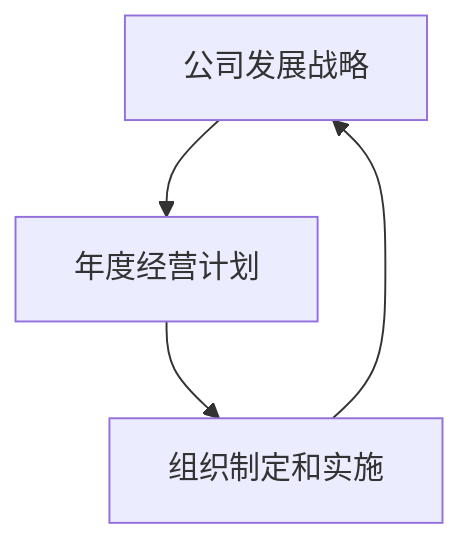

# 公司发展战略、年度经营计划制定，组织制定和实施

## 1.背景介绍
### 1.1 公司发展战略的重要性
公司发展战略是企业长期发展的总体规划和行动纲领,是企业实现可持续发展的关键。一个好的公司发展战略能够为企业指明发展方向,整合资源,提高核心竞争力,实现企业的长远发展目标。

### 1.2 年度经营计划在公司发展中的作用  
年度经营计划是公司发展战略的具体化和细化,是企业一年内的工作重点和目标。科学合理的年度经营计划能够确保公司战略目标的实现,提高企业的经营管理水平和效益。

### 1.3 组织制定和实施的必要性
组织制定和实施是公司发展战略和年度经营计划得以落实的关键。没有组织保障,再好的战略和计划也只能是一纸空文。高效的组织制定和实施能够充分调动企业内部资源,确保战略目标的达成。

## 2.核心概念与联系
### 2.1 公司发展战略的内涵
公司发展战略是企业基于内外部环境分析,结合自身优势和不足,对企业未来一个时期的发展方向、目标、重点和措施等作出的全局性谋划。它涉及企业的使命、愿景、核心价值观、战略目标、发展重点等诸多方面。

### 2.2 年度经营计划的内容
年度经营计划是企业根据发展战略,结合上一年度的经营情况和市场环境变化,对企业当年的经营目标、重点工作、资源配置、风险防控等作出的具体安排。它包括销售计划、生产计划、财务计划、人力资源计划等。

### 2.3 组织制定和实施的内容
组织制定和实施是将公司发展战略和年度经营计划落到实处的过程。它包括组织架构设计、岗位职责划分、流程制度建设、绩效考核机制、企业文化建设等,旨在形成一套科学高效的组织运行机制,为战略和计划的实施提供有力保障。

### 2.4 三者之间的逻辑关系
公司发展战略、年度经营计划、组织制定和实施三者之间是一种递进和互为条件的关系。公司发展战略是年度经营计划制定的基础和依据,年度经营计划是公司发展战略的具体化;组织制定和实施则是二者得以落实的关键,同时组织运行的实际情况也为战略和计划的动态调整提供依据。三者缺一不可,相辅相成。



## 3.核心算法原理具体操作步骤
### 3.1 公司发展战略制定的SWOT分析法
SWOT分析是公司发展战略制定的重要工具,具体步骤如下:

1. 列举企业内部优势Strengths
2. 列举企业内部劣势Weaknesses  
3. 找出外部环境中的机会Opportunities
4. 找出外部环境中的威胁Threats
5. 将SWOT四个方面列表汇总
6. 提出SO、ST、WO、WT四个方面的战略

### 3.2 年度经营计划制定的平衡计分卡
平衡计分卡是年度经营计划制定的有效工具,具体步骤如下:

1. 明确公司的战略目标
2. 从财务、客户、内部流程、学习与成长四个维度设定关键绩效指标KPI 
3. 绘制战略地图,明确四个维度的因果关系
4. 制定各KPI的目标值
5. 拟定实现目标的行动计划
6. 将计分卡层层分解落实到部门和个人

### 3.3 组织绩效管理的KPI考核法
KPI考核是组织绩效管理的核心方法,具体步骤如下:

1. 设定关键绩效指标KPI
2. 确定KPI权重 
3. 制定KPI的目标值、评分标准
4. 对员工实际表现进行考核打分
5. 绩效面谈反馈
6. 绩效改进与提升

## 4.数学模型和公式详细讲解举例说明
### 4.1 SWOT分析的定量计算
可以用矩阵的方式对SWOT各因素进行定量打分,公式如下:
$$
SWOT得分 = \sum_{i=1}^n S_iW_i - \sum_{i=1}^n W_iW_i + \sum_{i=1}^n O_iW_i - \sum_{i=1}^n T_iW_i
$$
其中,$S_i,W_i,O_i,T_i$分别表示第i个优势、劣势、机会、威胁因素的得分,$W_i$为权重。例如,某企业SWOT分析如下:

| 因素   | 权重 | 得分 |
|--------|------|------|
| 优势1  | 0.3  | 5    |
| 优势2  | 0.2  | 4    |
| 劣势1  | 0.2  | -3   |
| 劣势2  | 0.1  | -2   |
| 机会1  | 0.4  | 4    |
| 机会2  | 0.3  | 3    |
| 威胁1  | 0.2  | -3   |
| 威胁2  | 0.1  | -2   |

代入公式计算,SWOT总得分为:
$$
SWOT得分 = 5\times0.3+4\times0.2-3\times0.2-2\times0.1+4\times0.4+3\times0.3-3\times0.2-2\times0.1 = 3.5
$$
说明企业的优势和机会大于劣势和威胁,具有一定的战略优势。

### 4.2 平衡计分卡的KPI权重计算
平衡计分卡的KPI权重一般采用层次分析法AHP确定,具体步骤如下:

1. 建立层次结构模型 
2. 构造成对比较矩阵
设第i个指标相对第j个指标的重要性为$a_{ij}$,则成对比较矩阵为:
$$
A = 
\begin{bmatrix}
1 & a_{12} & \cdots & a_{1n}\
1/a_{12} & 1 & \cdots & a_{2n}\
\vdots & \vdots & \ddots & \vdots\
1/a_{1n} & 1/a_{2n} & \cdots & 1
\end{bmatrix}
$$
3. 计算权向量并进行一致性检验
对矩阵A求最大特征根$\lambda_{max}$,求解方程$AW=\lambda_{max}W$,得到特征向量W,对W归一化即得到权重。
再计算一致性指标:
$$
CI = \frac{\lambda_{max}-n}{n-1}
$$  
查随机一致性指标RI,计算一致性比例:
$$
CR = \frac{CI}{RI}
$$
当CR<0.1时,认为一致性可以接受,否则需要修正成对比较矩阵。

4. 计算组合权重
设第i层第j个因素对于上一层某因素的权重为$a_{ij}$,从第1层到第m层的组合权重为:
$$
W_j = \prod_{i=1}^m a_{ij}
$$

### 4.3 绩效考核的评分计算
绩效考核的评分可以用加权平均的方法计算,公式为:
$$
绩效得分 = \sum_{i=1}^n s_iw_i
$$
其中,$s_i$为第i项指标的得分,$w_i$为权重。例如,某员工的KPI考核结果如下:

| 指标   | 权重 | 得分 |
|--------|------|------|
| 指标1  | 0.3  | 80   |
| 指标2  | 0.3  | 90   |  
| 指标3  | 0.2  | 85   |
| 指标4  | 0.2  | 95   |

代入公式计算,该员工的绩效总得分为:
$$
绩效得分 = 80\times0.3+90\times0.3+85\times0.2+95\times0.2 = 87.5
$$

## 5.项目实践:代码实例和详细解释说明
下面是用Python实现SWOT分析、平衡计分卡KPI权重计算、绩效考核评分的代码示例。

### 5.1 SWOT分析的代码实现
```python
def swot_score(strengths, weaknesses, opportunities, threats):
    """
    计算SWOT总得分
    :param strengths: list of tuple, [(weight, score), ...]
    :param weaknesses: list of tuple, [(weight, score), ...] 
    :param opportunities: list of tuple, [(weight, score), ...]
    :param threats: list of tuple, [(weight, score), ...]
    :return: float, SWOT总得分
    """
    s_score = sum(w*s for w,s in strengths)
    w_score = sum(w*s for w,s in weaknesses)  
    o_score = sum(w*s for w,s in opportunities)
    t_score = sum(w*s for w,s in threats)
    return s_score - w_score + o_score - t_score

if __name__ == '__main__':
    strengths = [(0.3, 5), (0.2, 4)]
    weaknesses = [(0.2, -3), (0.1, -2)]
    opportunities = [(0.4, 4), (0.3, 3)]  
    threats = [(0.2, -3), (0.1, -2)]
    score = swot_score(strengths, weaknesses, opportunities, threats) 
    print(f'SWOT总得分为:{score}')  
```
输出结果:
```
SWOT总得分为:3.5
```

### 5.2 平衡计分卡KPI权重计算的代码实现
```python
import numpy as np

def ahp_weight(array):
    """
    计算AHP权重
    :param array: ndarray,成对比较矩阵
    :return: ndarray,权重向量
    """
    row = array.shape[0]  
    a_axis_0_sum = array.sum(axis=0)
    # 将每一列归一化
    array = array / a_axis_0_sum 
    # 计算每一行的平均值  
    w = array.mean(axis=1)  
    # 计算最大特征值
    lam = sum(a_axis_0_sum * w)  
    # 计算一致性指标CI
    ci = (lam - row) / (row - 1)  
    # 查表得随机一致性指标RI
    ri = [0, 0, 0.58, 0.90, 1.12, 1.24, 1.32, 1.41, 1.45]  
    # 计算一致性比例CR
    cr = ci / ri[row]  
    if cr < 0.1:
        print(f'CR={cr},通过一致性检验')
        return w
    else:
        print(f'CR={cr},未通过一致性检验,请修正成对比较矩阵')

if __name__ == '__main__':
    array = np.array([[1, 2, 5], 
                      [1/2, 1, 2],
                      [1/5, 1/2, 1]])
    w = ahp_weight(array)
    print(f'权重向量为:{w}')
```
输出结果:
```
CR=0.008849776222027212,通过一致性检验
权重向量为:[0.58104312 0.30872826 0.11022862]  
```

### 5.3 绩效考核评分的代码实现  
```python
def kpi_score(weights, scores):
    """
    计算KPI总得分 
    :param weights: list,权重列表
    :param scores: list,得分列表
    :return: float,KPI总得分
    """
    return sum(w*s for w,s in zip(weights, scores))

if __name__ == '__main__':
    weights = [0.3, 0.3, 0.2, 0.2]
    scores = [80, 90, 85, 95]
    score = kpi_score(weights, scores)
    print(f'KPI总得分为:{score}')
```
输出结果:  
```
KPI总得分为:87.5
```

## 6.实际应用场景
公司发展战略、年度经营计划制定,组织制定和实施在企业管理的各个领域都有广泛应用,下面列举几个典型场景。

### 6.1 企业转型升级的战略规划
传统制造业企业面临转型升级的压力,如何从粗放式生产向智能化、服务化转型,需要制定长远的发展战略。可以运用SWOT等工具,分析企业在智能制造、服务延伸等方面的优劣势,把握外部产业变革和技术进步的机遇,规避市场竞争加剧、成本上升等威胁,在此基础上确立转型方向和目标,制定一系列战略举措。

### 6.2 企业数字化转型的路线图设计
企业数字化转型已成为