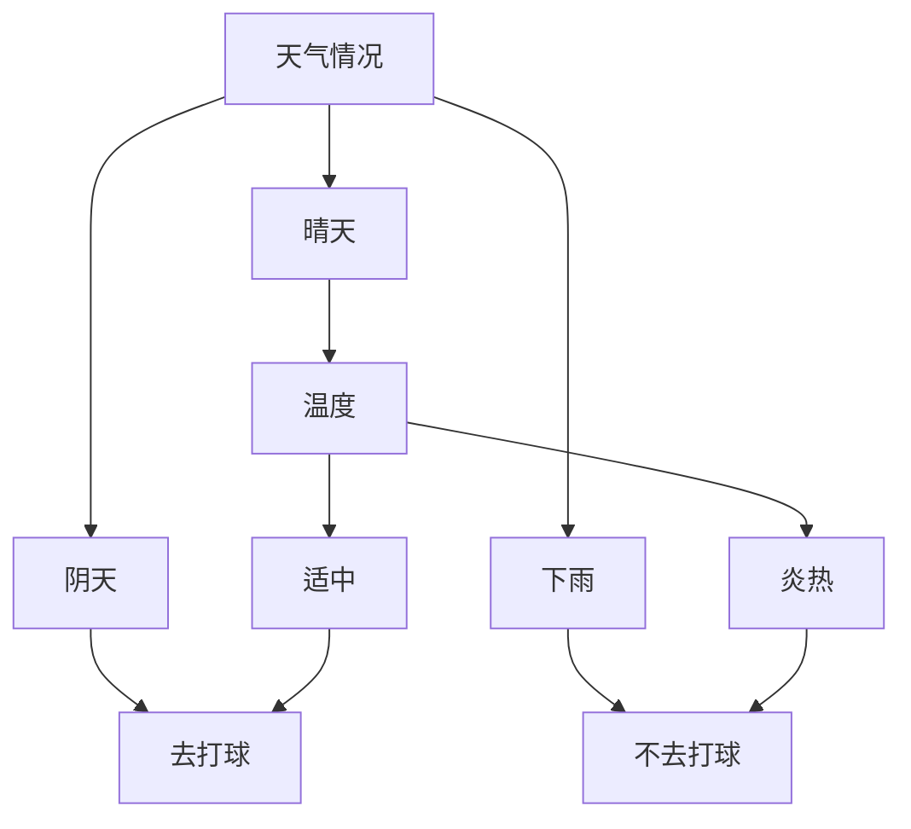

# 决策树(Decision Trees) - 原理与代码实例讲解

## 1. 背景介绍
### 1.1 决策树的起源与发展
#### 1.1.1 决策树的起源
#### 1.1.2 决策树的发展历程
#### 1.1.3 决策树在机器学习中的地位
### 1.2 决策树的应用领域
#### 1.2.1 金融风险评估
#### 1.2.2 医疗诊断
#### 1.2.3 营销策略制定
### 1.3 决策树的优缺点
#### 1.3.1 决策树的优点
#### 1.3.2 决策树的缺点
#### 1.3.3 如何克服决策树的缺点

## 2. 核心概念与联系
### 2.1 决策树的定义
#### 2.1.1 决策树的数学定义
#### 2.1.2 决策树的直观理解
#### 2.1.3 决策树与其他机器学习模型的区别
### 2.2 决策树的组成部分
#### 2.2.1 根节点、内部节点和叶节点
#### 2.2.2 分支和路径
#### 2.2.3 决策规则
### 2.3 决策树的分类
#### 2.3.1 分类决策树
#### 2.3.2 回归决策树
#### 2.3.3 其他类型的决策树

## 3. 核心算法原理具体操作步骤
### 3.1 决策树的构建过程
#### 3.1.1 特征选择
#### 3.1.2 树的生成
#### 3.1.3 树的剪枝
### 3.2 特征选择方法
#### 3.2.1 信息增益
#### 3.2.2 增益率
#### 3.2.3 基尼指数
### 3.3 决策树的剪枝技术
#### 3.3.1 预剪枝
#### 3.3.2 后剪枝
#### 3.3.3 最小描述长度原则

## 4. 数学模型和公式详细讲解举例说明
### 4.1 信息熵与条件熵
#### 4.1.1 信息熵的定义与计算
#### 4.1.2 条件熵的定义与计算
#### 4.1.3 信息熵与条件熵的关系
### 4.2 信息增益与增益率
#### 4.2.1 信息增益的定义与计算
#### 4.2.2 增益率的定义与计算
#### 4.2.3 信息增益与增益率的区别
### 4.3 基尼指数
#### 4.3.1 基尼指数的定义与计算
#### 4.3.2 基尼指数与信息熵的区别
#### 4.3.3 基尼指数在决策树中的应用

## 5. 项目实践：代码实例和详细解释说明
### 5.1 使用Python实现决策树
#### 5.1.1 数据预处理
#### 5.1.2 特征选择
#### 5.1.3 树的生成与剪枝
### 5.2 使用scikit-learn库实现决策树
#### 5.2.1 数据集的加载与划分
#### 5.2.2 模型的训练与评估
#### 5.2.3 模型的优化与调参
### 5.3 决策树的可视化
#### 5.3.1 使用Graphviz可视化决策树
#### 5.3.2 使用matplotlib可视化决策树
#### 5.3.3 可视化结果的解释

## 6. 实际应用场景
### 6.1 信用评分
#### 6.1.1 问题背景与数据集介绍
#### 6.1.2 决策树模型的构建与评估
#### 6.1.3 模型结果的解释与应用
### 6.2 客户流失预测
#### 6.2.1 问题背景与数据集介绍
#### 6.2.2 决策树模型的构建与评估
#### 6.2.3 模型结果的解释与应用
### 6.3 疾病诊断
#### 6.3.1 问题背景与数据集介绍
#### 6.3.2 决策树模型的构建与评估
#### 6.3.3 模型结果的解释与应用

## 7. 工具和资源推荐
### 7.1 Python库
#### 7.1.1 scikit-learn
#### 7.1.2 pydotplus
#### 7.1.3 graphviz
### 7.2 R语言包
#### 7.2.1 rpart
#### 7.2.2 party
#### 7.2.3 randomForest
### 7.3 其他工具与资源
#### 7.3.1 Weka
#### 7.3.2 KNIME
#### 7.3.3 在线学习资源

## 8. 总结：未来发展趋势与挑战
### 8.1 决策树的研究热点
#### 8.1.1 集成学习中的决策树
#### 8.1.2 深度决策树
#### 8.1.3 多标签决策树
### 8.2 决策树面临的挑战
#### 8.2.1 高维数据的处理
#### 8.2.2 不平衡数据的处理
#### 8.2.3 模型的可解释性
### 8.3 决策树的未来发展方向
#### 8.3.1 与深度学习的结合
#### 8.3.2 在线学习与增量学习
#### 8.3.3 隐私保护与安全性

## 9. 附录：常见问题与解答
### 9.1 决策树与随机森林的区别
### 9.2 如何处理缺失值和异常值
### 9.3 如何选择合适的特征选择方法
### 9.4 如何避免决策树的过拟合
### 9.5 决策树的时间复杂度和空间复杂度

决策树是一种常用的机器学习算法，它通过递归地构建一棵树来对数据进行分类或回归预测。决策树的每个内部节点表示一个特征，每个分支代表该特征的一个可能取值，而叶节点则代表最终的分类或预测结果。

决策树的核心思想是根据数据的特征，不断地对数据进行划分，直到每个子集都属于同一类别或达到预定的停止条件。在构建决策树的过程中，需要选择最优的特征来进行划分，常用的特征选择方法有信息增益、增益率和基尼指数等。

下面是一个简单的决策树示意图，用于判断一个人是否会去打球：



从上图可以看出，决策树通过天气情况和温度两个特征来判断一个人是否会去打球。首先根据天气情况进行划分，如果是晴天，则进一步根据温度来决定；如果是阴天，则直接判断去打球；如果是下雨，则直接判断不去打球。

决策树的构建过程可以分为以下几个步骤：

1. 特征选择：从数据的特征中选择最优的特征作为当前节点的划分依据。常用的特征选择方法有信息增益、增益率和基尼指数等。

2. 树的生成：根据选择的特征，将数据划分为若干个子集，并递归地对每个子集构建子树，直到满足停止条件。

3. 树的剪枝：为了避免过拟合，需要对生成的决策树进行剪枝。常用的剪枝方法有预剪枝和后剪枝。

下面以信息增益为例，详细讲解特征选择的数学原理。

假设数据集 $D$ 中有 $K$ 个类别，第 $k$ 类样本所占的比例为 $p_k$，则数据集 $D$ 的信息熵定义为：

$$
H(D) = -\sum_{k=1}^K p_k \log_2 p_k
$$

信息熵表示数据集的不确定性，信息熵越大，数据集的不确定性越高。

假设根据特征 $A$ 将数据集 $D$ 划分为 $V$ 个子集 $\{D_1, D_2, \ldots, D_V\}$，每个子集 $D_v$ 所占的比例为 $\frac{|D_v|}{|D|}$，则特征 $A$ 对数据集 $D$ 的条件熵定义为：

$$
H(D|A) = \sum_{v=1}^V \frac{|D_v|}{|D|} H(D_v)
$$

条件熵表示在特征 $A$ 的条件下，数据集的不确定性。

特征 $A$ 对数据集 $D$ 的信息增益定义为数据集的信息熵与条件熵之差：

$$
g(D,A) = H(D) - H(D|A)
$$

信息增益表示特征 $A$ 对数据集 $D$ 的不确定性的减少程度，信息增益越大，表示特征 $A$ 对数据集的划分效果越好。

在决策树的构建过程中，每次选择信息增益最大的特征作为划分依据，递归地构建子树，直到满足停止条件。

下面给出一个使用Python实现决策树的简单示例：

```python
from sklearn.datasets import load_iris
from sklearn.model_selection import train_test_split
from sklearn.tree import DecisionTreeClassifier
from sklearn.metrics import accuracy_score

# 加载鸢尾花数据集
iris = load_iris()
X = iris.data
y = iris.target

# 划分训练集和测试集
X_train, X_test, y_train, y_test = train_test_split(X, y, test_size=0.3, random_state=42)

# 创建决策树分类器
clf = DecisionTreeClassifier(criterion='entropy', max_depth=3, random_state=42)

# 训练模型
clf.fit(X_train, y_train)

# 预测测试集
y_pred = clf.predict(X_test)

# 计算准确率
accuracy = accuracy_score(y_test, y_pred)
print(f"Accuracy: {accuracy:.2f}")
```

上述代码使用scikit-learn库实现了一个简单的决策树分类器，用于对鸢尾花数据集进行分类。首先加载数据集，并划分为训练集和测试集；然后创建决策树分类器，设置特征选择方法为信息熵，最大深度为3；接着用训练集对模型进行训练，并在测试集上进行预测；最后计算模型的准确率。

决策树在实际应用中有着广泛的应用，如金融风险评估、医疗诊断、营销策略制定等。以信用评分为例，可以使用决策树根据客户的各种属性（如年龄、收入、信用记录等）来判断其信用风险的高低，从而为银行的贷款决策提供支持。

总的来说，决策树是一种简单而有效的机器学习算法，具有可解释性强、易于理解和实现等优点。但同时也存在一些局限性，如对连续属性的处理不够灵活、容易过拟合等。为了克服这些缺点，研究者提出了许多改进方法，如随机森林、梯度提升决策树等集成学习算法。

未来，决策树的研究热点可能集中在以下几个方面：与深度学习的结合、在线学习与增量学习、隐私保护与安全性等。此外，如何处理高维数据和不平衡数据，以及如何提高模型的可解释性，也是决策树面临的挑战。

相信通过研究者的不断努力，决策树会在更多领域得到应用，为人工智能的发展做出更大的贡献。

作者：禅与计算机程序设计艺术 / Zen and the Art of Computer Programming