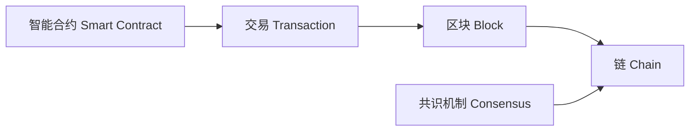

# 区块链 (Blockchain)

## 1.背景介绍
### 1.1 区块链的起源与发展
#### 1.1.1 区块链技术的诞生
#### 1.1.2 比特币的出现与区块链技术的发展
#### 1.1.3 区块链技术的演进与升级

### 1.2 区块链的定义与特点
#### 1.2.1 区块链的定义
#### 1.2.2 区块链的分布式特性
#### 1.2.3 区块链的不可篡改性
#### 1.2.4 区块链的透明性与匿名性

### 1.3 区块链的分类
#### 1.3.1 公有链
#### 1.3.2 私有链 
#### 1.3.3 联盟链

## 2.核心概念与联系
### 2.1 区块 (Block)
#### 2.1.1 区块的定义与结构
#### 2.1.2 区块头 (Block Header)
#### 2.1.3 区块体 (Block Body)

### 2.2 链 (Chain)
#### 2.2.1 链的定义
#### 2.2.2 链的形成与维护
#### 2.2.3 最长链原则

### 2.3 交易 (Transaction)
#### 2.3.1 交易的定义
#### 2.3.2 交易的数据结构
#### 2.3.3 交易的验证与确认

### 2.4 共识机制 (Consensus Mechanism)  
#### 2.4.1 共识机制的定义与作用
#### 2.4.2 工作量证明 (PoW)
#### 2.4.3 权益证明 (PoS)
#### 2.4.4 其他共识机制

### 2.5 智能合约 (Smart Contract)
#### 2.5.1 智能合约的定义
#### 2.5.2 智能合约的特点
#### 2.5.3 智能合约的执行原理



## 3.核心算法原理具体操作步骤
### 3.1 哈希算法 (Hash Algorithm)
#### 3.1.1 哈希函数的定义与特点  
#### 3.1.2 SHA-256算法原理
#### 3.1.3 哈希指针与区块链接

### 3.2 Merkle树 (Merkle Tree) 
#### 3.2.1 Merkle树的定义与结构
#### 3.2.2 Merkle树的构建过程
#### 3.2.3 Merkle树在区块链中的应用

### 3.3 非对称加密 (Asymmetric Encryption)
#### 3.3.1 非对称加密的定义
#### 3.3.2 公钥与私钥
#### 3.3.3 数字签名

### 3.4 Pow工作量证明算法
#### 3.4.1 工作量证明的定义
#### 3.4.2 算力与难度值
#### 3.4.3 挖矿过程与奖励机制

### 3.5 PoS权益证明算法
#### 3.5.1 权益证明的定义  
#### 3.5.2 股权与投票权
#### 3.5.3 验证过程与奖励机制

## 4.数学模型和公式详细讲解举例说明
### 4.1 哈希函数数学模型
- 定义：设有限集合 $X,Y$，$X$ 中元素个数远大于 $Y$。哈希函数 $H: X \rightarrow Y$ 满足:
  - 对任意 $x \in X$，$H(x)$ 易于计算；
  - 对任意 $y \in Y$，找到 $H(x)=y$ 的 $x$ 在计算上不可行。
- 性质：抗碰撞性、隐匿性、puzzle-friendly

### 4.2 椭圆曲线加密 (ECC) 数学基础
- 椭圆曲线方程：$y^2 = x^3 + ax + b \pmod p$
- 加法运算：设 $P(x_1,y_1), Q(x_2,y_2)$ 为椭圆曲线上的点，则 $P+Q=R(x_3,y_3)$，其中：
$$
\begin{aligned}
\lambda &= \frac{y_2-y_1}{x_2-x_1} \pmod p \
x_3 &= \lambda^2 - x_1 - x_2 \pmod p \  
y_3 &= \lambda(x_1-x_3) - y_1 \pmod p
\end{aligned}
$$

### 4.3 Pow工作量证明数学模型
- 定义：给定一个字符串 $x$，找到一个字符串 $y$，使得 $H(x||y)$ 的前 $n$ 位为0。其中 $H$ 为哈希函数，$||$ 为字符串连接符，$n$ 为难度值。
- 举例：设 $x=$"Hello World!", $H$ 为SHA-256, $n=20$，求解 $y$ 使得
$$H(\text{"Hello World!"}||y) = \underbrace{00\cdots00}_{20}\text{xxxxxxxx}\cdots$$

### 4.4 PoS权益证明数学模型
- 定义：根据节点持有的股权占比 $\alpha_i$ 分配记账权，$\alpha_i$ 越大被选中记账的概率越大。
- 举例：设有3个节点，股权占比分别为 $\alpha_1=0.5,\alpha_2=0.3,\alpha_3=0.2$。每个记账周期，从这3个节点中按权重 $\alpha_i$ 随机选择一个节点进行记账。

## 5.项目实践：代码实例和详细解释说明
### 5.1 创建区块链
```python
class Block:
    def __init__(self, index, timestamp, data, previous_hash):
        self.index = index
        self.timestamp = timestamp
        self.data = data
        self.previous_hash = previous_hash
        self.hash = self.calc_hash()
    
    def calc_hash(self):
        sha = hashlib.sha256()
        sha.update(str(self.index).encode('utf-8') + 
                   str(self.timestamp).encode('utf-8') + 
                   str(self.data).encode('utf-8') + 
                   str(self.previous_hash).encode('utf-8'))
        return sha.hexdigest()

class BlockChain:
    def __init__(self):
        self.chain = [self.create_genesis_block()]
    
    def create_genesis_block(self):
        return Block(0, datetime.datetime.now(), "Genesis Block", "0")
    
    def add_block(self, new_block):
        new_block.previous_hash = self.get_latest_block().hash
        new_block.hash = new_block.calc_hash()
        self.chain.append(new_block)
    
    def get_latest_block(self):
        return self.chain[-1]
```
- `Block` 类表示区块，包含区块高度、时间戳、数据、前一区块哈希、当前区块哈希等属性。
- `calc_hash` 方法根据区块数据计算当前区块哈希。
- `BlockChain` 类表示区块链，由创世区块开始，不断添加新区块。
- `add_block` 方法添加新区块到链上，将新区块的 `previous_hash` 设置为当前最新区块的哈希，并计算新区块自身的哈希。

### 5.2 实现Pow工作量证明
```python
class ProofOfWork:
    def __init__(self, block):
        self.block = block
        self.target = 1 << (256 - DIFFICULTY_BITS)
        
    def prepare_data(self, nonce):
        data = self.block.previous_hash + \
               self.block.data + \
               str(self.block.timestamp) + \
               str(DIFFICULTY_BITS) + \
               str(nonce)
        return data
        
    def run(self):
        nonce = 0
        while self.valid_proof(nonce) is False:
            nonce += 1
        return nonce
    
    def valid_proof(self, nonce):
        data = self.prepare_data(nonce)
        hash_result = hashlib.sha256(data.encode()).hexdigest()
        return int(hash_result, 16) < self.target
```
- `ProofOfWork` 类实现工作量证明，`DIFFICULTY_BITS` 为难度位数。
- `prepare_data` 方法准备区块数据，将区块各字段连接成字符串。
- `run` 方法暴力枚举 `nonce`，直到找到满足难度要求的合法哈希。
- `valid_proof` 方法验证 `nonce` 是否合法，计算区块数据哈希值，判断是否小于难度目标值。

## 6.实际应用场景
### 6.1 金融领域
- 跨境支付与结算
- 供应链金融
- 证券交易与清算
- 保险

### 6.2 供应链管理
- 商品溯源
- 防伪与验证
- 库存管理
- 物流追踪  

### 6.3 医疗健康
- 电子病历管理
- 药品供应链  
- 医疗保险理赔
- 基因组数据共享

### 6.4 数字版权
- 版权登记与确权
- 数字资产交易
- 知识产权保护
- 数字艺术品交易

### 6.5 电子政务
- 不动产登记
- 电子证照  
- 数字身份认证
- 电子投票

## 7.工具和资源推荐
### 7.1 开源区块链平台
- Bitcoin - 比特币，最早的区块链应用
- Ethereum - 以太坊，智能合约平台
- Hyperledger Fabric - 联盟链开源项目
- EOS - 高性能公有链平台

### 7.2 开发工具与框架 
- Truffle Suite - 以太坊开发套件
- Remix - 在线Solidity IDE
- OpenZeppelin - 安全的智能合约库
- Web3.js - 与以太坊交互的JavaScript API

### 7.3 学习资源
- 精通比特币 - 系统讲解比特币原理
- 以太坊白皮书 - 深入理解以太坊设计
- Solidity文档 - 智能合约编程语言
- 区块链技术指南 - 全面介绍区块链技术

## 8.总结：未来发展趋势与挑战
### 8.1 区块链的发展趋势
- 与人工智能、物联网等新兴技术融合发展
- 区块链即服务 (BaaS) 平台兴起
- 更加关注可扩展性、隐私保护、互操作性
- 监管科技 (RegTech) 成为新方向

### 8.2 区块链面临的挑战  
- 可扩展性问题有待解决
- 缺乏统一的行业标准  
- 法律监管问题
- 人才缺口较大

### 8.3 区块链的未来展望
- 推动价值互联网发展
- 重塑商业协作模式
- 实现数据价值确权与流通
- 服务实体经济转型升级

## 9.附录：常见问题与解答
### 9.1 区块链与分布式数据库的区别？
- 区块链是一种特殊的分布式数据库，强调不可篡改、分布式共识等特性。
- 传统分布式数据库更关注数据一致性、可用性、分区容错性等特性。

### 9.2 区块链的TPS如何提高？
- 采用更高效的共识算法，如DPoS、PBFT等。
- 使用分片、侧链、状态通道等扩容方案。
- 优化交易执行与传播效率。

### 9.3 区块链的安全隐患有哪些？
- 共识机制漏洞，如51%攻击。
- 智能合约代码漏洞。
- 私钥管理不当，资产被盗。
- 量子计算对加密算法的威胁。

### 9.4 区块链如何保护隐私？
- 使用零知识证明、环签名等密码学技术。
- 采用多方安全计算、同态加密等方案。
- 实现身份隐匿、交易混淆等隐私保护机制。

### 9.5 区块链与人工智能如何结合？
- 利用区块链解决AI系统的安全与信任问题。
- 使用区块链激励数据共享，为AI提供更多训练数据。
- 将AI应用于智能合约、共识算法优化等方面。

作者：禅与计算机程序设计艺术 / Zen and the Art of Computer Programming