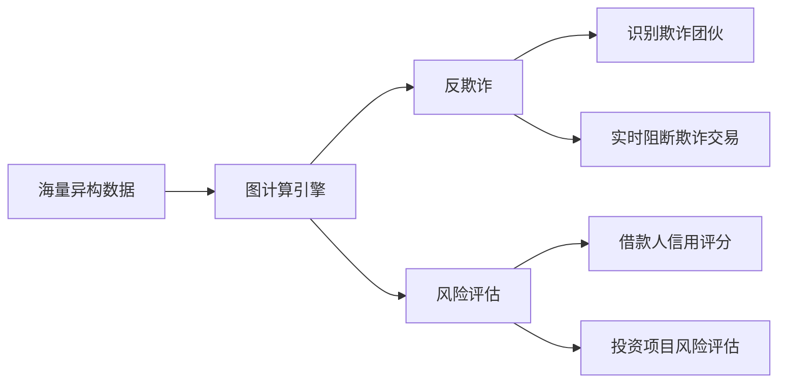
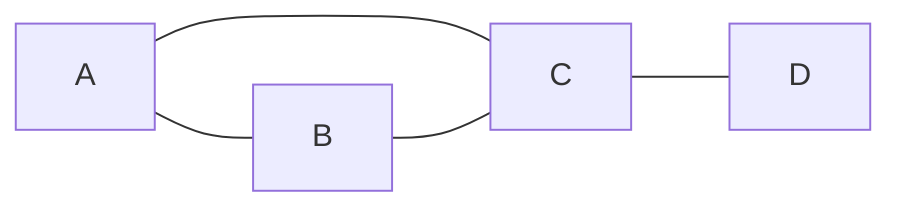

# 图计算引擎在金融领域的应用：反欺诈、风险评估

## 1. 背景介绍

### 1.1 金融领域面临的挑战
#### 1.1.1 日益严重的欺诈问题
#### 1.1.2 复杂的风险评估需求
#### 1.1.3 海量异构数据的处理

### 1.2 图计算引擎的优势
#### 1.2.1 高效处理复杂关系数据
#### 1.2.2 灵活的图模型表达能力
#### 1.2.3 强大的图算法库支持

### 1.3 图计算引擎在金融领域的应用前景
#### 1.3.1 反欺诈
#### 1.3.2 风险评估
#### 1.3.3 客户画像

## 2. 核心概念与联系

### 2.1 图计算引擎
#### 2.1.1 定义
图计算引擎是一种专门用于处理图数据结构的计算框架，能够高效地存储、查询和分析图数据。它利用图的特性来表达数据之间的复杂关系，并提供了一系列图算法来挖掘图中蕴含的价值。

#### 2.1.2 特点
- 天然适合处理高度关联的数据
- 灵活的图模型表达能力
- 高效的图存储和查询
- 丰富的内置图算法库

### 2.2 反欺诈
#### 2.2.1 定义
反欺诈是指识别和防范各类欺诈行为的过程，如信用卡诈骗、身份盗用、洗钱等。在金融领域，反欺诈是一项至关重要的任务，直接关系到金融机构的安全和声誉。

#### 2.2.2 欺诈行为的特点
- 隐蔽性强
- 手法多样
- 关联性高

### 2.3 风险评估
#### 2.3.1 定义
风险评估是对潜在风险进行识别、分析和评价的过程。在金融领域，风险评估涉及对借款人的信用风险、投资项目的市场风险等进行评估，为决策提供依据。

#### 2.3.2 风险评估的难点
- 影响因素多
- 数据不完整
- 实时性要求高

### 2.4 图计算引擎与反欺诈、风险评估的关系
图计算引擎通过构建关联关系图，并运用图算法进行分析，能够有效地解决反欺诈和风险评估中的难点：
- 揭示隐藏的欺诈关系网络
- 综合考虑多维度风险因子
- 实时更新风险评分

下图展示了图计算引擎在反欺诈和风险评估中的作用：



## 3. 核心算法原理与具体操作步骤

### 3.1 社区发现算法
#### 3.1.1 原理
社区发现算法用于在图中识别紧密关联的节点群组，即社区。在反欺诈场景中，一个社区可能代表一个欺诈团伙。该算法通过优化模块度等目标函数，将图划分为若干个社区。

#### 3.1.2 具体步骤
1. 计算图的模块度
2. 贪心法寻找模块度增益最大的社区划分
3. 递归执行步骤2，直至模块度不再增加
4. 输出社区划分结果

### 3.2 异常点检测算法
#### 3.2.1 原理
异常点检测算法用于识别图中行为模式异常的节点。在反欺诈场景中，异常点可能表示可疑的欺诈交易。该算法通过定义异常度指标，度量节点与其邻居的行为差异，异常度高的节点被判定为异常点。

#### 3.2.2 具体步骤
1. 计算每个节点的属性特征向量
2. 定义异常度指标，如欧氏距离、余弦相似度等
3. 计算每个节点与其邻居的异常度
4. 设定异常点阈值，异常度超过阈值的节点被判定为异常点
5. 输出异常点检测结果

### 3.3 图神经网络算法
#### 3.3.1 原理
图神经网络（GNN）是一种深度学习模型，能够直接在图结构数据上进行端到端学习。GNN通过迭代聚合节点的邻居信息来更新节点表示，从而学习到节点的低维嵌入向量。在风险评估场景中，GNN可以学习借款人的信用表示向量，用于信用风险评分。

#### 3.3.2 具体步骤
1. 将风险评估问题建模为节点分类任务
2. 构建借款人关联关系图，借款人作为节点，关联关系作为边
3. 设计GNN模型架构，如GAT、GCN等
4. 准备节点特征和标签，送入GNN模型训练
5. 使用训练好的GNN模型对新借款人节点进行信用风险评分
6. 输出借款人信用风险评估结果

## 4. 数学模型和公式详细讲解举例说明

### 4.1 图的数学定义
图$G$定义为二元组$G=(V,E)$，其中$V$为节点集合，$E$为边集合。对于无向图，边$(u,v)$表示节点$u$和$v$之间存在关联关系；对于有向图，边$(u,v)$表示从节点$u$指向节点$v$的关联关系。

### 4.2 模块度的定义与计算
模块度$Q$用于衡量一个图划分为社区的好坏程度，定义为：

$$Q=\frac{1}{2m}\sum_{ij}\left(A_{ij}-\frac{k_ik_j}{2m}\right)\delta(c_i,c_j)$$

其中$m$为图中边的数量，$A_{ij}$为邻接矩阵的元素，$k_i$和$k_j$分别为节点$i$和$j$的度，$c_i$和$c_j$为节点$i$和$j$所属的社区，$\delta$为克罗内克函数，当$c_i=c_j$时取1，否则取0。

举例来说，对于下图所示的一个简单无向图：



假设将其划分为两个社区${A,B}$和${C,D}$，则模块度$Q$的计算过程如下：

- $m=4$
- $k_A=2, k_B=2, k_C=3, k_D=1$
- $\sum_{ij}A_{ij}\delta(c_i,c_j)=2+1=3$
- $\sum_{ij}\frac{k_ik_j}{2m}\delta(c_i,c_j)=\frac{2×2}{8}+\frac{3×1}{8}=0.875$
- $Q=\frac{1}{8}(3-0.875)=0.265625$

可见，对于不同的社区划分，模块度值不同。社区发现算法就是要寻找模块度值最大的社区划分。

### 4.3 GNN的前向传播公式
以图卷积网络（GCN）为例，其前向传播公式为：

$$H^{(l+1)}=\sigma(\tilde{D}^{-\frac{1}{2}}\tilde{A}\tilde{D}^{-\frac{1}{2}}H^{(l)}W^{(l)})$$

其中$H^{(l)}$为第$l$层的节点表示矩阵，$\tilde{A}=A+I$为加入自环的邻接矩阵，$\tilde{D}$为$\tilde{A}$的度矩阵，$W^{(l)}$为第$l$层的权重矩阵，$\sigma$为激活函数。

直观地理解，GCN的前向传播过程就是在聚合节点的邻居信息的同时，对节点表示进行变换。通过多层GCN的堆叠，可以捕捉节点的高阶邻居信息，从而学习到更加丰富的节点表示。

## 5. 项目实践：代码实例和详细解释说明

下面以NetworkX和PyTorch库为例，展示如何使用Python实现一个简单的GCN模型，并应用于信用风险评估任务。

### 5.1 数据准备

```python
import networkx as nx
import numpy as np
import torch

# 构建借款人关联关系图
G = nx.Graph()
G.add_nodes_from(['A', 'B', 'C', 'D', 'E'])
G.add_edges_from([('A', 'B'), ('A', 'C'), ('B', 'D'), ('C', 'D'), ('D', 'E')])

# 生成节点特征矩阵
node_features = np.random.randn(5, 10)

# 生成节点标签
node_labels = np.random.randint(0, 2, size=(5,))
```

这里我们构建了一个简单的借款人关联关系无向图，包含5个节点和5条边。每个节点有10维特征，标签为0或1，表示信用风险高低。

### 5.2 GCN模型定义

```python
import torch.nn as nn
import torch.nn.functional as F

class GCN(nn.Module):
    def __init__(self, input_dim, hidden_dim, output_dim):
        super(GCN, self).__init__()
        self.fc1 = nn.Linear(input_dim, hidden_dim)
        self.fc2 = nn.Linear(hidden_dim, output_dim)

    def forward(self, x, adj):
        x = F.relu(self.fc1(torch.matmul(adj, x)))
        x = self.fc2(torch.matmul(adj, x))
        return F.log_softmax(x, dim=1)
```

这里定义了一个两层的GCN模型，包含一个输入层、一个隐藏层和一个输出层。前向传播过程中，先将节点特征矩阵与邻接矩阵相乘，实现聚合邻居信息；然后通过全连接层进行特征变换，并使用ReLU激活函数；最后通过第二个全连接层得到输出，并使用log_softmax函数进行归一化。

### 5.3 模型训练与评估

```python
from sklearn.metrics import accuracy_score

# 将NetworkX图转换为邻接矩阵
adj = nx.to_numpy_array(G)
adj = adj + np.eye(adj.shape[0])  # 加入自环
adj = torch.FloatTensor(adj)

# 将特征和标签转换为PyTorch张量
features = torch.FloatTensor(node_features)
labels = torch.LongTensor(node_labels)

# 实例化GCN模型
model = GCN(input_dim=10, hidden_dim=16, output_dim=2)

# 定义损失函数和优化器
criterion = nn.NLLLoss()
optimizer = torch.optim.Adam(model.parameters(), lr=0.01)

# 模型训练
for epoch in range(100):
    optimizer.zero_grad()
    out = model(features, adj)
    loss = criterion(out, labels)
    loss.backward()
    optimizer.step()

# 模型评估
with torch.no_grad():
    out = model(features, adj)
    _, pred = out.max(dim=1)
    acc = accuracy_score(labels.numpy(), pred.numpy())
    print(f'Accuracy: {acc:.4f}')
```

这里我们将NetworkX图转换为邻接矩阵，并加入自环；将节点特征矩阵和标签转换为PyTorch张量。然后实例化GCN模型，定义损失函数和优化器，进行模型训练。最后，使用训练好的模型对节点进行分类，并计算准确率。

通过以上代码，我们就实现了一个简单的GCN模型，并将其应用于信用风险评估任务。在实际项目中，我们还需要进行更多的数据预处理、特征工程、模型调参等工作，以进一步提升模型性能。

## 6. 实际应用场景

图计算引擎在金融领域有广泛的应用场景，下面重点介绍反欺诈和风险评估两个方面。

### 6.1 反欺诈
- **信用卡欺诈检测**：通过构建信用卡交易关联图，挖掘异常交易模式和可疑欺诈团伙，实现实时欺诈交易阻断和预警。
- **反洗钱**：通过构建资金流向图，识别异常资金转移路径和洗钱团伙，协助反洗钱调查和风险防控。
- **电信诈骗识别**：通过构建用户通话关系图，挖掘诈骗呼叫模