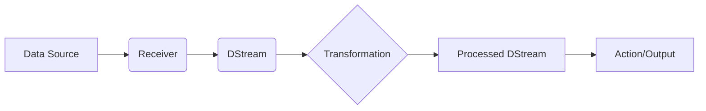

# 基于SparkStreaming的实时网络流量监控与分析

## 1. 背景介绍

在当今高度互联的数字世界中,网络已成为各行各业不可或缺的基础设施。随着网络规模的不断扩大和复杂度的增加,实时监控和分析网络流量变得至关重要。传统的批处理方法已经无法满足实时性和海量数据处理的需求。SparkStreaming作为Apache Spark生态系统中的核心组件之一,为实时流处理提供了高效、可扩展的解决方案。本文将深入探讨如何利用SparkStreaming构建实时网络流量监控与分析系统,揭示其内在原理,并提供实践指南和思考。

### 1.1 网络流量监控的重要性
#### 1.1.1 网络安全
#### 1.1.2 性能优化
#### 1.1.3 异常检测

### 1.2 传统方法的局限性
#### 1.2.1 批处理的延迟
#### 1.2.2 无法实时响应
#### 1.2.3 难以处理海量数据

### 1.3 SparkStreaming的优势
#### 1.3.1 实时流处理
#### 1.3.2 高吞吐低延迟
#### 1.3.3 可扩展和容错

## 2. 核心概念与联系

要掌握SparkStreaming的实时网络流量监控,首先需要理解其核心概念和它们之间的联系。

### 2.1 SparkStreaming核心概念
#### 2.1.1 DStream
DStream(Discretized Stream)是SparkStreaming的基础抽象,代表持续的数据流。它是一系列的RDD(弹性分布式数据集)序列,每个RDD包含一个时间间隔内的数据。

#### 2.1.2 Receiver
Receiver是用于接收实时数据流的组件。SparkStreaming提供了多种内置的Receiver,如KafkaReceiver、FlumReceiver等,也可以自定义Receiver。

#### 2.1.3 Transformation
Transformation是对DStream进行的各种操作,如map、filter、reduce等,用于数据处理和分析。这些操作会作用于DStream中的每个RDD。

### 2.2 核心概念之间的联系

下面是SparkStreaming核心概念之间联系的Mermaid流程图:



数据源通过Receiver不断接收数据并生成DStream,DStream经过一系列Transformation操作处理和分析数据,最终通过Action输出结果或触发外部系统。

## 3. 核心算法原理具体操作步骤

SparkStreaming的实时网络流量监控涉及多个核心算法和操作步骤。

### 3.1 数据采集
#### 3.1.1 网络流量镜像或分流
利用网络Tap或交换机端口镜像,将网络流量副本发送到SparkStreaming系统。

#### 3.1.2 Receiver接收数据
自定义或使用内置的Receiver接收网络流量数据,并生成DStream。

### 3.2 数据预处理
#### 3.2.1 数据清洗
对原始网络流量数据进行过滤、去重等清洗操作,去除无效或冗余数据。

#### 3.2.2 数据解析
解析网络流量数据包,提取关键字段如源IP、目的IP、协议类型、端口号等。

### 3.3 流量统计分析
#### 3.3.1 流量聚合
使用reduceByKey、aggregateByKey等算子,按照关键字段对流量进行聚合统计,如按IP统计流量总量。

#### 3.3.2 流量特征提取
利用统计学和信号处理方法,提取流量的各种统计特征,如包大小分布、流持续时间分布等。

### 3.4 异常检测
#### 3.4.1 基于规则的异常检测
设定流量阈值、比例等规则,实时检测超出规则的异常流量。

#### 3.4.2 基于机器学习的异常检测
使用无监督学习算法如K-Means、PCA等,对流量的多维特征进行建模,实时识别偏离正常模式的异常行为。

## 4. 数学模型和公式详细讲解举例说明

在实时网络流量监控中,一些数学模型和公式被广泛应用。

### 4.1 流量聚合的数学模型

对于给定的时间窗口 $T$,假设窗口内有 $n$ 个流量数据包,每个数据包的字节数为 $x_i$,则窗口内的总流量 $S$ 为:

$$S = \sum_{i=1}^{n} x_i$$

若按照源IP聚合流量,假设窗口内有 $m$ 个不同的源IP,每个源IP $j$ 的流量为 $y_j$,则可以建立如下映射关系:

$$f: j \rightarrow y_j, \quad j=1,2,\dots,m$$

其中,

$$y_j = \sum_{i=1}^{n} x_i \cdot \mathbb{I}({\rm srcIP}(x_i)=j)$$

$\mathbb{I}$ 为指示函数。这个映射关系可以用SparkStreaming的PairRDDFunctions中的reduceByKey算子高效实现。

### 4.2 异常检测的数学模型

以一维高斯分布为例,假设正常流量特征 $x$ 服从均值为 $\mu$,标准差为 $\sigma$ 的高斯分布,其概率密度函数为:

$$p(x) = \frac{1}{\sqrt{2\pi}\sigma} \exp\left(-\frac{(x-\mu)^2}{2\sigma^2}\right)$$

给定显著性水平 $\alpha$,可以计算出正常范围的上下界 $[L, U]$:

$$\int_{L}^{U} p(x) dx = 1 - \alpha$$

若流量特征超出 $[L, U]$,则可判定为异常。多维高斯分布的异常检测可以用Mahalanobis距离判定。

## 5. 项目实践：代码实例和详细解释说明

下面给出基于SparkStreaming进行实时网络流量监控的Scala代码示例。

```scala
import org.apache.spark._
import org.apache.spark.streaming._

object NetworkMonitor {
  def main(args: Array[String]) {
    val conf = new SparkConf().setAppName("NetworkMonitor")
    val ssc = new StreamingContext(conf, Seconds(10))

    // 自定义的网络流量Receiver
    val networkStream = ssc.receiverStream(new NetworkTrafficReceiver(port))

    // 流量聚合统计
    val ipTrafficStats = networkStream
      .map(packet => (packet.srcIP, packet.bytes))
      .reduceByKeyAndWindow(_ + _, Seconds(60))

    // 实时输出聚合结果
    ipTrafficStats.print()

    // 定义异常检测规则
    val threshold = 1000000
    val anomalies = ipTrafficStats.filter(_._2 > threshold)

    // 实时输出异常事件
    anomalies.foreachRDD(rdd => {
      rdd.foreach(event => {
        // 发送告警邮件或调用API
        println(s"Anomaly detected: ${event}")
      })
    })

    ssc.start()
    ssc.awaitTermination()
  }
}
```

这个例子中,首先创建了一个自定义的NetworkTrafficReceiver来接收网络流量数据。然后使用map和reduceByKeyAndWindow对流量按照源IP进行了聚合统计,时间窗口为60秒。聚合结果通过print输出。

接着定义了一个简单的异常检测规则,即流量超过100万字节即认为是异常。anomalies DStream包含了所有异常事件。最后通过foreachRDD遍历每个异常事件,可以在这里触发告警邮件或调用外部API。

这只是一个简单示例,实际应用中可以加入更复杂的数据解析、统计分析和机器学习算法。

## 6. 实际应用场景

SparkStreaming的实时网络流量监控可以应用于多个领域:

### 6.1 网络安全监控
实时检测DDoS攻击、端口扫描、蠕虫病毒传播等网络安全威胁。

### 6.2 ISP网络质量监控
ISP可以实时监控骨干网的流量分布和异常,及时定位和解决网络故障。

### 6.3 数据中心网络优化
数据中心运营商可以实时洞察网络流量模式,优化网络拓扑和资源配置。

### 6.4 应用性能监控
实时监控关键应用的网络性能指标,如延迟、抖动、丢包率等,保障应用的可用性和用户体验。

## 7. 工具和资源推荐

### 7.1 编程语言
- Scala：SparkStreaming的原生开发语言
- Java：Spark同样支持Java API
- Python：PySpark支持Python开发

### 7.2 集成组件
- Kafka：分布式消息队列,常用于数据管道
- Flume：分布式日志收集系统
- Elasticsearch：分布式搜索和分析引擎

### 7.3 部署工具
- YARN：Hadoop生态的资源管理系统
- Mesos：通用的集群资源管理系统
- Kubernetes：容器编排平台

### 7.4 学习资源
- 官方文档：[Spark Streaming Programming Guide](http://spark.apache.org/docs/latest/streaming-programming-guide.html)
- 在线课程：[Spark Streaming Course](https://www.udacity.com/course/learn-spark-at-udacity--ud2002)
- 书籍：[Spark: The Definitive Guide](http://shop.oreilly.com/product/0636920034957.do)

## 8. 总结：未来发展趋势与挑战

SparkStreaming为实时网络流量监控提供了高效、可扩展的解决方案。未来随着5G、物联网的发展,网络流量还将持续快速增长,对实时处理能力提出更高要求。同时,AI技术的进步也将赋能网络流量分析,从规则模型走向智能算法。

面向未来,实时网络流量监控还有几点挑战:

- 超大规模流量的低延迟处理
- 复杂网络环境的数据融合与关联分析
- 加密流量的分析与异常检测
- 流批处理一体化架构

SparkStreaming作为流处理技术的先驱,正在与Structured Streaming等新兴技术一起,不断突破这些挑战,推动实时网络流量监控的创新发展。

## 9. 附录：常见问题与解答

### Q1: SparkStreaming和Storm的区别是什么?
A1: SparkStreaming基于微批次处理,将数据流切分成一系列小批量数据集合,再进行处理;而Storm是纯实时处理,每个数据项都会触发计算。SparkStreaming整体吞吐量更高,Storm延迟更低。

### Q2: SparkStreaming的exactly-once语义如何保证?
A2: SparkStreaming通过checkpoint机制,将每个批次的处理状态保存到可靠存储,失败时可以从checkpoint恢复,避免数据丢失或重复处理。

### Q3: SparkStreaming能处理多大规模的流量?
A3: SparkStreaming可以横向扩展到上百个节点,每秒处理数百兆的数据流量。底层依赖Spark的分布式计算能力,理论上可以线性扩展。

### Q4: SparkStreaming的延迟如何?
A4: SparkStreaming的端到端延迟一般在秒级别,取决于批次间隔的设置。若要追求更低的延迟,可以减小批次间隔,但会增加调度开销,需要权衡吞吐量和延迟。

### Q5: SparkStreaming支持哪些数据源?
A5: SparkStreaming支持多种数据源,包括Kafka、Flume、Kinesis、TCP Socket等。也可以自定义数据源,只需要实现Receiver接口。

作者：禅与计算机程序设计艺术 / Zen and the Art of Computer Programming