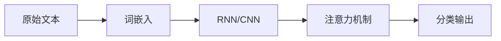
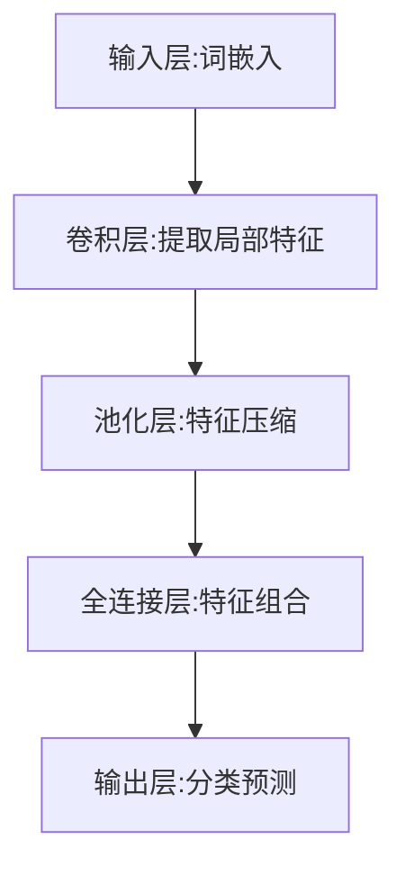

# 基于深度学习的文本分类

## 1. 背景介绍

### 1.1 文本分类的重要性
在当今信息爆炸的时代,海量的文本数据正以前所未有的速度增长。如何从这些海量的文本数据中快速、准确地提取有价值的信息,已经成为一个亟待解决的问题。文本分类技术为解决这一问题提供了有效的手段。

### 1.2 传统文本分类方法的局限性
传统的文本分类方法主要包括:基于规则的方法、基于统计的方法(如朴素贝叶斯、支持向量机等)。这些方法在处理小规模数据集时效果较好,但面对大规模、高维度的文本数据时,往往难以取得令人满意的效果。其主要局限性在于:

1. 特征工程复杂:需要大量的人工参与,耗时耗力。
2. 特征表示能力有限:难以刻画文本的语义信息。
3. 鲁棒性不足:模型的泛化能力较差,难以适应新的文本数据。

### 1.3 深度学习在文本分类中的优势
近年来,深度学习技术在计算机视觉、语音识别等领域取得了重大突破,其强大的特征学习和建模能力也被广泛应用于自然语言处理领域。将深度学习应用于文本分类,具有以下优势:

1. 自动学习特征表示:避免了复杂的特征工程,减少了人工参与。
2. 语义建模能力强:能够学习到文本的深层语义信息。
3. 模型泛化能力好:能够很好地适应新的文本数据。
4. 端到端学习:无需对文本进行预处理,直接输入原始文本即可。

## 2. 核心概念与联系

### 2.1 词嵌入(Word Embedding)
将词映射为稠密的实值向量表示,通过词向量之间的距离来表示词之间的语义相似性。常见的词嵌入模型有:Word2Vec、GloVe等。词嵌入是深度学习文本分类的基础。

### 2.2 循环神经网络(RNN)
一种适合处理序列数据的神经网络模型。通过循环连接,RNN能够建模文本序列的上下文信息。常见的RNN变体有:LSTM、GRU等。RNN能够学习到文本的上下文语义信息。

### 2.3 卷积神经网络(CNN)
一种适合处理网格拓扑结构数据(如图像)的神经网络模型。CNN通过局部感受野、权值共享等机制,能够自动提取数据的局部特征。将CNN应用于文本,可以提取文本的局部语义信息。

### 2.4 注意力机制(Attention Mechanism)
一种模仿人类视觉注意力机制的技术。通过为输入序列的每个元素分配权重,使模型能够关注到重要的信息。在文本分类任务中,注意力机制能够帮助模型聚焦于与分类相关的关键词。

### 2.5 概念之间的联系
在基于深度学习的文本分类任务中,这些核心概念之间紧密相连,互为补充:

- 词嵌入将离散的词映射为连续的向量表示,是深度学习模型的输入。
- RNN和CNN分别从序列和局部角度建模文本语义。
- 注意力机制帮助模型聚焦关键信息,提升分类性能。

它们共同构成了一个完整的文本分类流程,如下图所示:



## 3. 核心算法原理与具体操作步骤

下面以TextCNN模型为例,详细介绍基于深度学习的文本分类的核心算法原理与具体操作步骤。

### 3.1 TextCNN模型架构
TextCNN是一种将CNN应用于文本分类的经典模型。其基本架构如下:



### 3.2 具体操作步骤

#### 3.2.1 输入层:词嵌入
1. 将每个文本转化为词的序列 $[w_1, w_2, ..., w_n]$。
2. 将每个词映射为固定长度的词向量 $[e_1, e_2, ..., e_n]$。
3. 将词向量组合成文本矩阵 $E \in R^{n \times d}$,其中 $n$ 为文本长度, $d$ 为词向量维度。

#### 3.2.2 卷积层:提取局部特征
1. 定义卷积核 $W \in R^{h \times d}$,其中 $h$ 为卷积核高度。
2. 在文本矩阵上滑动卷积核,提取 $h$ 个词的局部特征:
$$c_i = f(W \cdot E_{i:i+h-1} + b)$$
其中 $f$ 为激活函数, $b$ 为偏置项。
3. 生成特征图 $c = [c_1, c_2, ..., c_{n-h+1}]$。

#### 3.2.3 池化层:特征压缩
1. 对特征图 $c$ 进行最大池化操作:
$$\hat{c} = max(c)$$
2. 将不同卷积核提取的特征拼接成向量 $v$。

#### 3.2.4 全连接层:特征组合
$$y = W_2(W_1v + b_1) + b_2$$

#### 3.2.5 输出层:分类预测
1. 通过 softmax 函数将全连接层输出转化为概率分布:
$$p(y_i|v) = \frac{exp(y_i)}{\sum_j exp(y_j)}$$
2. 选择概率最大的类别作为预测结果:
$$\hat{y} = argmax_i p(y_i|v)$$

### 3.3 模型训练
1. 定义交叉熵损失函数:
$$J(\theta) = -\sum_i y_i log(p(y_i|v))$$
2. 通过反向传播算法和优化器(如Adam)更新模型参数 $\theta$,最小化损失函数。

## 4. 数学模型和公式详解

### 4.1 词嵌入: Word2Vec
Word2Vec 是一种经典的词嵌入模型,包括 CBOW 和 Skip-gram 两种架构。以 CBOW 为例,其目标是根据上下文词预测中心词。数学模型如下:

已知上下文词向量 $\mathbf{v}_{c,1}, \mathbf{v}_{c,2}, ..., \mathbf{v}_{c,C}$,中心词 $w_t$ 的条件概率为:
$$\begin{aligned}
p(w_t | w_{c,1}, w_{c,2}, ..., w_{c,C}) &= softmax(\mathbf{v}_{w_t}^T \cdot \hat{\mathbf{v}}) \\
&= \frac{exp(\mathbf{v}_{w_t}^T \cdot \hat{\mathbf{v}})}{\sum_{i \in V} exp(\mathbf{v}_i^T \cdot \hat{\mathbf{v}})}
\end{aligned}$$
其中 $\hat{\mathbf{v}} = \frac{1}{C} \sum_{i=1}^C \mathbf{v}_{c,i}$ 为上下文词向量的平均, $V$ 为词表。

训练目标是最大化对数似然函数:
$$\mathcal{L} = \sum_{t=1}^T \log p(w_t | w_{c,1}, w_{c,2}, ..., w_{c,C})$$

### 4.2 TextCNN
TextCNN 的核心是卷积操作和池化操作。以一维卷积为例,给定文本矩阵 $\mathbf{E} \in \mathbb{R}^{n \times d}$ 和卷积核 $\mathbf{W} \in \mathbb{R}^{h \times d}$,卷积操作为:
$$\mathbf{c}_i = f(\mathbf{W} \cdot \mathbf{E}_{i:i+h-1} + b)$$
其中 $f$ 为激活函数, $b$ 为偏置项。

最大池化操作为:
$$\hat{c} = \max(\mathbf{c})$$

假设共有 $m$ 个卷积核,卷积结果拼接为 $\mathbf{v} = [\hat{c}_1, \hat{c}_2, ..., \hat{c}_m]$。

全连接层将 $\mathbf{v}$ 映射为输出向量 $\mathbf{y} \in \mathbb{R}^{|C|}$:
$$\mathbf{y} = \mathbf{W}_2(\mathbf{W}_1\mathbf{v} + \mathbf{b}_1) + \mathbf{b}_2$$
其中 $|C|$ 为类别数。

最后通过 softmax 函数将 $\mathbf{y}$ 转化为概率分布:
$$p(y_i|\mathbf{v}) = \frac{\exp(y_i)}{\sum_j \exp(y_j)}$$

模型的训练目标是最小化交叉熵损失:
$$J(\theta) = -\sum_{i=1}^N \sum_{j=1}^{|C|} y_{ij} \log(p(y_j|\mathbf{v}_i))$$
其中 $\theta$ 为模型参数, $N$ 为训练样本数。

## 5. 项目实践:代码实例和详解

下面以 Python 和 Keras 为例,实现一个基于 TextCNN 的文本分类模型。

### 5.1 数据准备

```python
import numpy as np
from keras.preprocessing.text import Tokenizer
from keras.preprocessing.sequence import pad_sequences

# 假设 texts 为文本列表, labels 为对应的标签列表
tokenizer = Tokenizer(num_words=MAX_NB_WORDS)
tokenizer.fit_on_texts(texts)
sequences = tokenizer.texts_to_sequences(texts)

word_index = tokenizer.word_index
print('Found %s unique tokens.' % len(word_index))

data = pad_sequences(sequences, maxlen=MAX_SEQUENCE_LENGTH)

labels = np.asarray(labels)
print('Shape of data tensor:', data.shape)
print('Shape of label tensor:', labels.shape)
```

### 5.2 模型构建

```python
from keras.layers import Input, Dense, Embedding, Conv1D, MaxPooling1D, Dropout, Concatenate, Flatten
from keras.models import Model

embedding_layer = Embedding(MAX_NB_WORDS,
                            EMBEDDING_DIM,
                            input_length=MAX_SEQUENCE_LENGTH)

sequence_input = Input(shape=(MAX_SEQUENCE_LENGTH,), dtype='int32')
embedded_sequences = embedding_layer(sequence_input)

convs = []
for kernel_size in [3, 4, 5]:
    c = Conv1D(128, kernel_size, activation='relu')(embedded_sequences)
    c = MaxPooling1D(5)(c)
    convs.append(c)

x = Concatenate()(convs)
x = Flatten()(x)
x = Dropout(0.5)(x)
x = Dense(128, activation='relu')(x)
output = Dense(len(labels_index), activation='softmax')(x)

model = Model(inputs=sequence_input, outputs=output)
model.compile(loss='categorical_crossentropy',
              optimizer='adam',
              metrics=['accuracy'])
```

### 5.3 模型训练与评估

```python
model.fit(data, labels,
          batch_size=128,
          epochs=20,
          validation_split=0.2)

scores = model.evaluate(data, labels)
print('Test loss:', scores[0])
print('Test accuracy:', scores[1])
```

## 6. 实际应用场景

基于深度学习的文本分类技术可以应用于多个领域,例如:

1. 情感分析:判断用户评论、反馈的情感倾向(积极、消极、中性)。
2. 垃圾邮件检测:自动识别垃圾邮件。
3. 新闻分类:将新闻文章自动归类到不同的主题(如政治、经济、体育等)。
4. 问题分类:将用户提问自动分类到不同的问题类型,如技术问题、账单问题等。
5. 医疗文本分类:自动对病历、医疗记录进行分类,辅助医疗诊断。

通过文本分类,企业和机构能够自动化处理大量的文本数据,提高工作效率,降低人工成本。

## 7. 工具和资源推荐

1. Keras: 基于 Python 的高层神经网络库,适合快速构建深度学习模型。官网:https://keras.io/
2. TensorFlow: 由 Google 开发的端到端开源机器学习平台。官网:https://www.tensorflow.org/
3. PyTorch: 由 Facebook 开发的深度学习框架,在学术界广泛使用。官网:https://pytorch.org/
4. Gensim: 用于主题建模