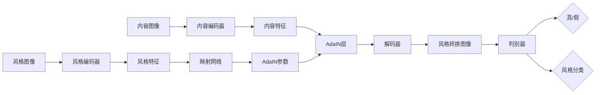

# 基于生成对抗网络的多风格图像转换模型研究

## 1. 背景介绍
### 1.1 图像风格转换的研究意义
图像风格转换是计算机视觉和深度学习领域的一个热门研究方向,其目标是将一幅输入图像转换成具有特定艺术风格的输出图像。图像风格转换技术不仅可以为图像处理和计算机视觉领域带来新的研究思路,还能在艺术创作、游戏设计、虚拟现实等领域得到广泛应用。
### 1.2 生成对抗网络的发展历程
生成对抗网络(Generative Adversarial Networks, GANs)自2014年被Goodfellow等人提出以来,迅速成为了深度学习领域的研究热点。GANs通过生成器和判别器的对抗学习,可以生成逼真的图像、视频等多媒体内容。近年来,GANs在图像风格转换任务上取得了显著的进展。
### 1.3 多风格图像转换面临的挑战
传统的图像风格转换方法通常只能转换成单一的艺术风格,难以灵活地控制生成图像的风格。如何设计一个高效、鲁棒的多风格图像转换模型,实现对不同风格的灵活控制和自由组合,是一个亟待解决的问题。

## 2. 核心概念与联系
### 2.1 风格迁移的定义与分类
风格迁移是指将一幅内容图像的视觉风格改变为另一幅风格参考图像的过程。根据风格表示的方式,可以分为基于纹理合成的方法和基于神经网络的方法两大类。
### 2.2 GAN的基本原理
GAN由生成器(Generator)和判别器(Discriminator)两部分组成。生成器的目标是生成逼真的样本去欺骗判别器,判别器则要去区分生成样本和真实样本。通过生成器和判别器的博弈对抗,两者的能力都会不断提升,最终生成高质量的图像。
### 2.3 GAN在图像风格转换中的应用
GAN在图像风格转换任务中展现出了强大的潜力。研究者利用GAN的生成能力和对抗训练思想,设计了一系列用于图像风格转换的GAN变体模型,如CycleGAN、StarGAN等,取得了令人瞩目的效果。

## 3. 核心算法原理具体操作步骤
### 3.1 StarGAN的网络结构与损失函数
StarGAN使用一个生成器和一个判别器,生成器接受内容图像和目标域标签作为输入,判别器输出图像的真假概率和域分类结果。损失函数包括对抗损失、循环一致性损失、域分类损失等。
### 3.2 AdaIN的特征归一化方法
自适应实例归一化(Adaptive Instance Normalization, AdaIN)是一种特征归一化方法,可以将内容特征与风格特征解耦,方便实现风格的自由组合和控制。AdaIN首先对内容特征做实例归一化,然后用风格特征的均值和方差进行仿射变换。
### 3.3 本文提出的多风格图像转换模型
本文提出了一种基于StarGAN和AdaIN的多风格图像转换模型。模型包含编码器、解码器、映射网络、判别器四个子网络。编码器提取内容特征,解码器生成风格转换后的图像,映射网络用于控制AdaIN层的风格均值和方差,判别器用于对抗训练。

## 4. 数学模型和公式详细讲解举例说明
### 4.1 StarGAN的数学模型
StarGAN的目标函数可以表示为:
$$
\begin{aligned}
\mathcal{L}_{StarGAN} &= \mathcal{L}_{adv} + \lambda_{cls}\mathcal{L}_{cls} + \lambda_{rec}\mathcal{L}_{rec} \\
\mathcal{L}_{adv} &= \mathbb{E}_{x}[\log D_{src}(x)] + \mathbb{E}_{x,c}[\log (1-D_{src}(G(x,c)))] \\
\mathcal{L}_{cls} &= \mathbb{E}_{x,c}[-\log D_{cls}(c|G(x,c))] \\
\mathcal{L}_{rec} &= \mathbb{E}_{x,c,c'}[||x-G(G(x,c),c')||_1]
\end{aligned}
$$
其中$\mathcal{L}_{adv}$是对抗损失, $\mathcal{L}_{cls}$是域分类损失, $\mathcal{L}_{rec}$是重建损失, $\lambda_{cls}$和$\lambda_{rec}$是平衡因子, $D_{src}$、$D_{cls}$分别是判别器的真假输出和域分类输出, $G$是生成器, $x$是输入图像, $c$是目标域标签, $c'$是源域标签。
### 4.2 AdaIN的计算公式
AdaIN的计算公式为:
$$AdaIN(x,y)=\sigma(y)(\frac{x-\mu(x)}{\sigma(x)})+\mu(y)$$
其中$x$是内容特征, $y$是风格特征, $\mu(·)$和$\sigma(·)$分别表示均值和标准差。
### 4.3 本文模型的目标函数
本文模型的目标函数包括StarGAN的损失和风格重建损失两部分:
$$\mathcal{L} = \mathcal{L}_{StarGAN} + \lambda_{sty}\mathcal{L}_{sty}$$
$$\mathcal{L}_{sty} = \mathbb{E}_{x,s}[||G(x,s)-x||_1]$$
其中$\mathcal{L}_{sty}$是风格重建损失, $\lambda_{sty}$是平衡因子, $s$是风格特征。

## 5. 项目实践：代码实例和详细解释说明
下面是本文模型的PyTorch代码实现关键部分:
```python
class Generator(nn.Module):
    def __init__(self):
        super().__init__()
        # 内容编码器
        self.enc_content = Encoder()
        # 风格编码器
        self.enc_style = StyleEncoder()
        # AdaIN层
        self.AdaIN = AdaIN()
        # 解码器
        self.decoder = Decoder()
        # 映射网络
        self.mlp = MLP()

    def forward(self, x, s):
        # 提取内容特征
        c = self.enc_content(x)
        # 提取风格特征
        s = self.enc_style(s)
        # 映射网络预测AdaIN参数
        s_mean, s_std = self.mlp(s)
        # AdaIN层融合内容和风格
        c_adain = self.AdaIN(c, s_mean, s_std)
        # 解码生成风格转换图像
        out = self.decoder(c_adain)
        return out
```
代码解读:
- Encoder: 内容编码器,用于提取图像的内容特征。
- StyleEncoder: 风格编码器,用于提取图像的风格特征。
- AdaIN: 自适应实例归一化层,用于将内容特征归一化并施加风格均值和方差。
- Decoder: 解码器,用于根据AdaIN的输出生成风格转换后的图像。
- MLP: 多层感知机,作为映射网络,将风格特征映射到AdaIN层的均值和方差。
- forward: 生成器的前向传播过程,输入内容图像x和风格图像s,输出风格转换后的图像。

## 6. 实际应用场景
多风格图像转换模型可以应用于以下场景:
- 艺术创作: 自动生成具有不同艺术风格的图像,辅助艺术家进行创作。
- 游戏设计: 快速生成游戏场景、角色、道具等不同风格的游戏素材。
- 虚拟试衣: 根据用户选择的服装风格,自动生成试穿效果图。
- 图像增强: 通过风格转换,对图像进行艺术化处理,提升视觉效果。
- 教育娱乐: 开发图像风格转换的有趣应用,普及艺术知识。

## 7. 工具和资源推荐
- PyTorch: 一个开源的Python机器学习库,支持动态计算图,使用简单灵活。
- TensorFlow: 由Google开发的开源机器学习框架,支持多种编程语言。
- CVPR/ICCV/ECCV: 计算机视觉领域的三大顶级会议,每年都有大量图像风格转换相关的研究论文发表。
- GitHub: 全球最大的开源社区,有许多优秀的图像风格转换项目代码仓库。

## 8. 总结：未来发展趋势与挑战
### 8.1 多风格控制的探索
现有方法在多风格控制的连续性和灵活性上还有待提高,未来可以探索更加精细和高效的风格表示与控制机制,实现风格的连续插值、任意组合等功能。
### 8.2 与其他任务的结合
图像风格转换与图像编辑、图像增强、图像修复等任务有着紧密的联系,可以将风格转换技术与这些任务相结合,开发更加强大的图像处理工具。
### 8.3 计算效率的提升
图像风格转换对计算资源要求较高,提升模型的计算效率是一个重要的研究方向。可以探索模型压缩、知识蒸馏等技术,在保证生成质量的同时降低计算开销。
### 8.4 理论基础的完善
尽管图像风格转换取得了长足进展,但其理论基础还不够完善,有待进一步探索。加强对风格转换中涉及的机器学习、计算机视觉、认知科学等理论的研究,对指导算法设计具有重要意义。

## 9. 附录：常见问题与解答
### Q1: 什么是生成对抗网络GAN?
A1: 生成对抗网络是一种无监督学习算法,由生成器和判别器组成。生成器负责生成逼真的样本,判别器负责区分真实样本和生成样本。通过两者的对抗训练,生成器可以生成以假乱真的数据。
### Q2: 多风格图像转换与普通的图像风格转换有何区别?
A2: 普通的图像风格转换通常只能转换成某一特定风格,而多风格图像转换可以同时转换和融合多种风格,具有更大的灵活性。多风格转换可以通过风格特征的插值、组合等方式实现连续可控的风格调整。
### Q3: AdaIN的作用是什么?
A3: AdaIN是一种自适应实例归一化方法,可以将内容特征归一化,并用风格特征的均值和方差进行仿射变换。通过AdaIN,可以将内容特征和风格特征解耦,方便实现风格的自由组合和控制。
### Q4: 如何平衡内容保真度和风格转换强度?
A4: 可以通过调整损失函数中内容损失和风格损失的权重来平衡二者。增大内容损失的权重有助于保持更多内容信息,增大风格损失的权重则会使风格转换更加明显。也可以引入参数化的风格强度控制机制,灵活调节转换程度。



作者：禅与计算机程序设计艺术 / Zen and the Art of Computer Programming