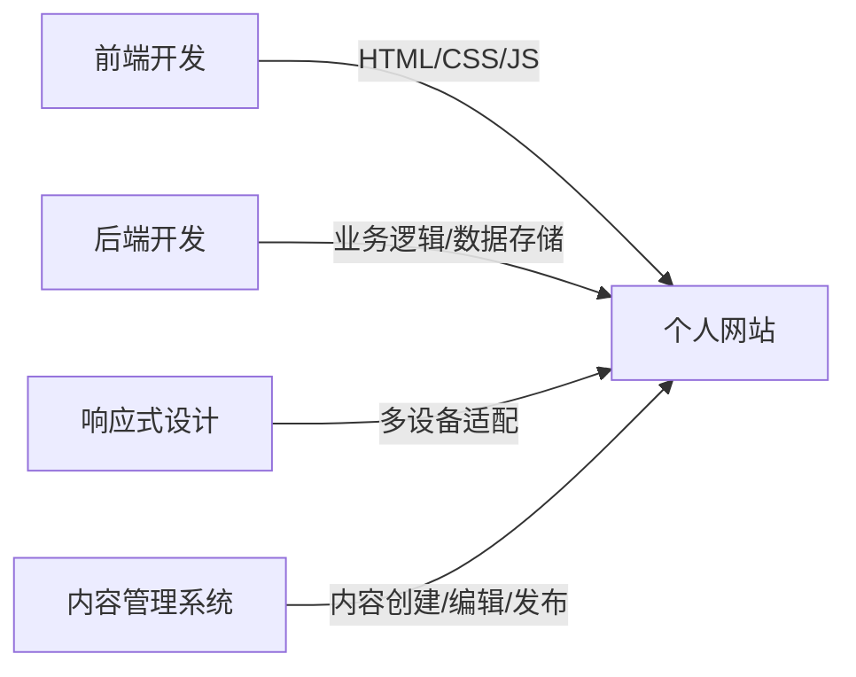

# 大学生求职通用个人网站详细设计与具体代码实现

## 1. 背景介绍

在当今竞争激烈的就业市场中,大学生需要尽一切可能提高自己的求职竞争力。拥有一个精心设计的个人网站,可以帮助大学生在求职过程中脱颖而出。个人网站不仅能展示个人的专业技能和项目经验,还能体现出求职者的个性特点和职业素养。本文将详细介绍如何为大学生求职设计和实现一个通用的个人网站。

### 1.1 个人网站的重要性

#### 1.1.1 提升个人品牌形象

#### 1.1.2 展示专业技能和项目经验  

#### 1.1.3 体现职业素养和个性特点

### 1.2 个人网站的主要功能

#### 1.2.1 个人简介和联系方式

#### 1.2.2 教育背景和工作经历

#### 1.2.3 专业技能和项目展示

#### 1.2.4 博客文章和个人感悟

## 2. 核心概念与联系

在设计个人网站时,需要掌握以下几个核心概念:

### 2.1 前端开发

前端开发主要涉及 HTML、CSS 和 JavaScript 等 Web 技术,用于实现网站的界面设计和交互功能。

### 2.2 后端开发  

后端开发负责处理网站的业务逻辑和数据存储,常用的技术栈包括 Node.js、Python、Java 等。

### 2.3 响应式设计

响应式设计能够让网站在不同设备上(如桌面电脑、平板、手机等)都能有良好的显示效果和使用体验。

### 2.4 内容管理系统(CMS)

内容管理系统可以帮助用户轻松地创建、编辑和发布网站内容,如 WordPress、Drupal 等。

下图展示了个人网站的核心概念之间的联系:



## 3. 核心算法原理具体操作步骤

在实现个人网站的过程中,需要用到一些常见的算法和技术,如下所述:

### 3.1 页面布局算法

常用的页面布局算法包括:

1. 基于浮动(Float)的布局
2. 基于定位(Position)的布局
3. 基于弹性盒子(Flexbox)的布局
4. 基于网格(Grid)的布局

以 Flexbox 布局为例,具体操作步骤如下:

1. 将父元素的 display 属性设置为 flex
2. 通过 flex-direction 属性设置主轴方向
3. 通过 justify-content 属性设置主轴上的对齐方式
4. 通过 align-items 属性设置交叉轴上的对齐方式
5. 为子元素设置 flex 属性,控制它们在主轴上的尺寸

### 3.2 图片懒加载算法

图片懒加载可以提高页面的加载速度,其基本原理是:

1. 初始时,图片的 src 属性设置为占位图片或空字符串
2. 监听页面滚动事件,判断图片是否进入可视区域
3. 当图片进入可视区域时,将其 src 属性设置为真实图片的 URL
4. 图片加载完成后,移除事件监听器

### 3.3 前端路由算法

前端路由可以实现单页应用(SPA)的无刷新导航,其核心原理是:

1. 监听 URL 的变化(通过 hashchange 事件或 history API)
2. 根据 URL 的变化,动态加载对应的页面组件
3. 将页面组件渲染到指定的容器中
4. 更新页面标题和其他相关状态

## 4. 数学模型和公式详细讲解举例说明

在个人网站的设计与实现过程中,可能会用到一些数学模型和公式,如下所述:

### 4.1 色彩空间转换公式

在处理图片和颜色时,常需要在不同的色彩空间之间进行转换,如 RGB 和 HSL 之间的转换:

- RGB 转 HSL:

$L = \frac{max(R,G,B) + min(R,G,B)}{2}$

$S = \begin{cases}
0, & \text{if } L = 0 \text{ or } max(R,G,B) = min(R,G,B) \
\frac{max(R,G,B) - min(R,G,B)}{1 - |2L - 1|}, & \text{otherwise}
\end{cases}$

$H = \begin{cases}
0, & \text{if } S = 0 \
60 \times \frac{G - B}{max(R,G,B) - min(R,G,B)}, & \text{if } R = max(R,G,B) \
60 \times (\frac{B - R}{max(R,G,B) - min(R,G,B)} + 2), & \text{if } G = max(R,G,B) \
60 \times (\frac{R - G}{max(R,G,B) - min(R,G,B)} + 4), & \text{if } B = max(R,G,B)
\end{cases}$

其中,R、G、B 分别表示红、绿、蓝三个通道的值(取值范围为 0~255),L 表示亮度(取值范围为 0~1),S 表示饱和度(取值范围为 0~1),H 表示色相(取值范围为 0~360)。

例如,将 RGB 色彩 (255, 0, 0) 转换为 HSL 色彩:

$L = \frac{255 + 0}{2} = 127.5$

$S = \frac{255 - 0}{1 - |2 \times 127.5 - 1|} = 1$

$H = 60 \times \frac{0 - 0}{255 - 0} = 0$

因此,RGB 色彩 (255, 0, 0) 对应的 HSL 色彩为 (0, 1, 0.5)。

### 4.2 贝塞尔曲线公式

在 CSS 动画中,常使用贝塞尔曲线来描述动画的时间函数,其公式为:

$B(t) = (1-t)^3P_0 + 3(1-t)^2tP_1 + 3(1-t)t^2P_2 + t^3P_3, t \in [0,1]$

其中,$P_0$,$P_1$,$P_2$,$P_3$ 分别表示贝塞尔曲线的四个控制点,t 表示时间参数(取值范围为 0~1)。

例如,常见的 ease-in-out 时间函数对应的贝塞尔曲线控制点为:

$P_0 = (0, 0), P_1 = (0.42, 0), P_2 = (0.58, 1), P_3 = (1, 1)$

将这些控制点代入贝塞尔曲线公式,可以得到 ease-in-out 时间函数的具体表达式:

$B(t) = (1-t)^3(0,0) + 3(1-t)^2t(0.42,0) + 3(1-t)t^2(0.58,1) + t^3(1,1)$

## 5. 项目实践：代码实例和详细解释说明

下面通过一个简单的个人网站项目,演示如何使用 HTML、CSS 和 JavaScript 实现网站的基本功能。

### 5.1 HTML 结构

```html
<!DOCTYPE html>
<html lang="en">
<head>
  <meta charset="UTF-8">
  <meta name="viewport" content="width=device-width, initial-scale=1.0">
  <title>My Personal Website</title>
  <link rel="stylesheet" href="style.css">
</head>
<body>
  <header>
    <nav>
      <ul>
        <li><a href="#home">Home</a></li>
        <li><a href="#about">About</a></li>
        <li><a href="#projects">Projects</a></li>
        <li><a href="#contact">Contact</a></li>
      </ul>
    </nav>
  </header>

  <main>
    <section id="home">
      <h1>Welcome to My Personal Website</h1>
      <p>Hi, I'm John Doe, a web developer.</p>
    </section>

    <section id="about">
      <h2>About Me</h2>
      <p>I'm a passionate web developer with 3 years of experience...</p>
    </section>

    <section id="projects">
      <h2>My Projects</h2>
      <ul>
        <li>Project 1</li>
        <li>Project 2</li>
        <li>Project 3</li>
      </ul>
    </section>

    <section id="contact">
      <h2>Contact Me</h2>
      <form>
        <label for="name">Name:</label>
        <input type="text" id="name" name="name" required>

        <label for="email">Email:</label>
        <input type="email" id="email" name="email" required>

        <label for="message">Message:</label>
        <textarea id="message" name="message" required></textarea>

        <button type="submit">Send</button>
      </form>
    </section>
  </main>

  <footer>
    <p>&copy; 2023 John Doe. All rights reserved.</p>
  </footer>

  <script src="script.js"></script>
</body>
</html>
```

这个 HTML 文件定义了网站的基本结构,包括头部导航、主要内容区域(个人简介、项目展示、联系表单等)和页脚。

### 5.2 CSS 样式

```css
/* Reset default styles */
* {
  margin: 0;
  padding: 0;
  box-sizing: border-box;
}

/* Global styles */
body {
  font-family: Arial, sans-serif;
  line-height: 1.6;
}

header {
  background-color: #333;
  color: #fff;
  padding: 1rem;
}

nav ul {
  list-style: none;
  display: flex;
}

nav ul li {
  margin-right: 1rem;
}

nav ul li a {
  color: #fff;
  text-decoration: none;
}

main {
  padding: 2rem;
}

section {
  margin-bottom: 2rem;
}

h1, h2 {
  margin-bottom: 1rem;
}

form label {
  display: block;
  margin-bottom: 0.5rem;
}

form input, form textarea {
  width: 100%;
  padding: 0.5rem;
  margin-bottom: 1rem;
}

form button {
  background-color: #333;
  color: #fff;
  padding: 0.5rem 1rem;
  border: none;
  cursor: pointer;
}

footer {
  background-color: #333;
  color: #fff;
  padding: 1rem;
  text-align: center;
}
```

这个 CSS 文件定义了网站的样式,包括全局样式、头部导航样式、主要内容区域样式和页脚样式。

### 5.3 JavaScript 功能

```javascript
// Smooth scrolling for navigation links
document.querySelectorAll('nav a').forEach(link => {
  link.addEventListener('click', e => {
    e.preventDefault();
    const target = document.querySelector(link.getAttribute('href'));
    target.scrollIntoView({ behavior: 'smooth' });
  });
});

// Form submission handling
document.querySelector('form').addEventListener('submit', e => {
  e.preventDefault();
  const name = document.getElementById('name').value;
  const email = document.getElementById('email').value;
  const message = document.getElementById('message').value;
  console.log(`Name: ${name}\nEmail: ${email}\nMessage: ${message}`);
  alert('Form submitted successfully!');
});
```

这个 JavaScript 文件实现了两个基本功能:

1. 平滑滚动:为导航链接添加点击事件监听器,实现平滑滚动到对应的页面区域。
2. 表单提交处理:为联系表单添加提交事件监听器,阻止默认提交行为,获取表单数据并输出到控制台,最后弹出提交成功的提示。

## 6. 实际应用场景

个人网站可以在多种场景下发挥作用,例如:

### 6.1 求职应聘

大学生可以通过个人网站展示自己的教育背景、专业技能、项目经验等,吸引招聘者的注意。

### 6.2 自由职业者

自由职业者可以使用个人网站作为作品集,展示自己的设计、写作、编程等方面的能力,获取潜在客户。

### 6.3 个人品牌建设

个人网站可以帮助个人建立和维护个人品牌,提高知名度和影响力。

### 6.4 知识分享

个人可以通过网站分享自己的专业知识、经验心得、学习笔记等,与他人交流互动。

## 7. 工具和资源推荐

以下是一些对个人网站设计和开发有帮助的工具和资源:

### 7.1 设计工具

- Sketch:矢量图形设计工具,适合用于设计网站界面和原型。