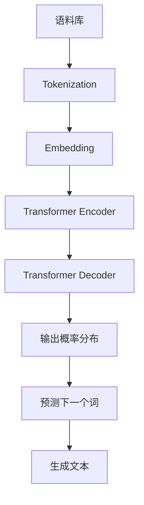

# 大语言模型 原理与代码实例讲解

## 1. 背景介绍
### 1.1 自然语言处理的发展历程
#### 1.1.1 早期的规则与统计方法
#### 1.1.2 深度学习的兴起
#### 1.1.3 Transformer模型的突破

### 1.2 大语言模型的定义与意义
#### 1.2.1 大语言模型的定义
#### 1.2.2 大语言模型的研究意义
#### 1.2.3 大语言模型的应用前景

## 2. 核心概念与联系
### 2.1 语言模型
#### 2.1.1 统计语言模型
#### 2.1.2 神经网络语言模型
#### 2.1.3 语言模型的评估指标

### 2.2 预训练与微调
#### 2.2.1 预训练的概念与方法
#### 2.2.2 微调的概念与方法
#### 2.2.3 预训练与微调的关系

### 2.3 注意力机制与Transformer
#### 2.3.1 注意力机制的原理
#### 2.3.2 自注意力机制
#### 2.3.3 Transformer模型结构

### 2.4 Transformer与大语言模型的关系
#### 2.4.1 Transformer在大语言模型中的应用
#### 2.4.2 Transformer的局限性
#### 2.4.3 后Transformer时代的探索



## 3. 核心算法原理具体操作步骤
### 3.1 Transformer的编码器
#### 3.1.1 输入表示
#### 3.1.2 自注意力层
#### 3.1.3 前馈神经网络层
#### 3.1.4 残差连接与层归一化

### 3.2 Transformer的解码器
#### 3.2.1 解码器自注意力层
#### 3.2.2 编码-解码注意力层
#### 3.2.3 前馈神经网络层
#### 3.2.4 残差连接与层归一化

### 3.3 Transformer的训练
#### 3.3.1 训练数据的准备
#### 3.3.2 损失函数与优化器
#### 3.3.3 训练过程与超参数选择

### 3.4 大语言模型的预训练与微调
#### 3.4.1 无监督预训练
#### 3.4.2 有监督微调
#### 3.4.3 预训练与微调的技巧

## 4. 数学模型和公式详细讲解举例说明
### 4.1 Transformer的数学表示
#### 4.1.1 自注意力机制的数学表示
$$Attention(Q,K,V) = softmax(\frac{QK^T}{\sqrt{d_k}})V$$
其中，$Q$, $K$, $V$ 分别表示查询、键、值矩阵，$d_k$ 为键向量的维度。

#### 4.1.2 多头注意力机制的数学表示
$$MultiHead(Q,K,V) = Concat(head_1,...,head_h)W^O$$
$$head_i = Attention(QW_i^Q, KW_i^K, VW_i^V)$$
其中，$W_i^Q$, $W_i^K$, $W_i^V$ 为第 $i$ 个注意力头的权重矩阵，$W^O$ 为输出的线性变换矩阵。

#### 4.1.3 前馈神经网络的数学表示
$$FFN(x) = max(0, xW_1 + b_1)W_2 + b_2$$
其中，$W_1$, $W_2$ 为权重矩阵，$b_1$, $b_2$ 为偏置项。

### 4.2 语言模型的数学表示
#### 4.2.1 统计语言模型
$$P(w_1, w_2, ..., w_n) = \prod_{i=1}^n P(w_i | w_1, w_2, ..., w_{i-1})$$
其中，$w_i$ 表示第 $i$ 个词，$P(w_i | w_1, w_2, ..., w_{i-1})$ 表示在给定前 $i-1$ 个词的条件下，第 $i$ 个词的条件概率。

#### 4.2.2 神经网络语言模型
$$P(w_t | w_1, w_2, ..., w_{t-1}) = softmax(h_t^TW + b)$$
其中，$h_t$ 为 $t$ 时刻的隐藏状态，$W$ 和 $b$ 为输出层的权重矩阵和偏置项。

### 4.3 预训练与微调的数学表示
#### 4.3.1 语言模型预训练的目标函数
$$L(\theta) = -\frac{1}{T}\sum_{t=1}^T \log P(w_t | w_1, w_2, ..., w_{t-1}; \theta)$$
其中，$\theta$ 为模型参数，$T$ 为序列长度。

#### 4.3.2 微调的目标函数
$$L(\theta) = -\frac{1}{N}\sum_{i=1}^N \log P(y_i | x_i; \theta)$$
其中，$x_i$ 和 $y_i$ 分别为第 $i$ 个样本的输入和输出，$N$ 为样本数量。

## 5. 项目实践：代码实例和详细解释说明
### 5.1 数据准备
#### 5.1.1 数据集介绍
#### 5.1.2 数据预处理
```python
import torch
from transformers import BertTokenizer

tokenizer = BertTokenizer.from_pretrained('bert-base-uncased')

def load_data(file_path, max_len):
    with open(file_path, 'r', encoding='utf-8') as f:
        data = f.readlines()

    inputs = []
    for text in data:
        tokens = tokenizer.tokenize(text)
        if len(tokens) > max_len - 2:
            tokens = tokens[:max_len - 2]
        tokens = ['[CLS]'] + tokens + ['[SEP]']
        input_ids = tokenizer.convert_tokens_to_ids(tokens)
        inputs.append(input_ids)

    return inputs
```

### 5.2 模型构建
#### 5.2.1 Transformer编码器的实现
```python
import torch
import torch.nn as nn

class TransformerEncoder(nn.Module):
    def __init__(self, d_model, nhead, dim_feedforward, num_layers, dropout=0.1):
        super(TransformerEncoder, self).__init__()
        encoder_layer = nn.TransformerEncoderLayer(d_model, nhead, dim_feedforward, dropout)
        self.transformer_encoder = nn.TransformerEncoder(encoder_layer, num_layers)

    def forward(self, src, src_mask=None, src_key_padding_mask=None):
        output = self.transformer_encoder(src, src_mask, src_key_padding_mask)
        return output
```

#### 5.2.2 语言模型的实现
```python
import torch
import torch.nn as nn

class LanguageModel(nn.Module):
    def __init__(self, vocab_size, d_model, nhead, dim_feedforward, num_layers, dropout=0.1):
        super(LanguageModel, self).__init__()
        self.embedding = nn.Embedding(vocab_size, d_model)
        self.pos_encoder = PositionalEncoding(d_model, dropout)
        self.transformer_encoder = TransformerEncoder(d_model, nhead, dim_feedforward, num_layers, dropout)
        self.fc = nn.Linear(d_model, vocab_size)

    def forward(self, src, src_mask=None, src_key_padding_mask=None):
        src = self.embedding(src) * math.sqrt(self.d_model)
        src = self.pos_encoder(src)
        output = self.transformer_encoder(src, src_mask, src_key_padding_mask)
        output = self.fc(output)
        return output
```

### 5.3 模型训练
#### 5.3.1 定义损失函数与优化器
```python
criterion = nn.CrossEntropyLoss()
optimizer = torch.optim.Adam(model.parameters(), lr=0.001)
```

#### 5.3.2 训练循环
```python
for epoch in range(num_epochs):
    for batch in dataloader:
        optimizer.zero_grad()
        input_ids = batch['input_ids'].to(device)
        labels = batch['labels'].to(device)
        outputs = model(input_ids)
        loss = criterion(outputs.view(-1, vocab_size), labels.view(-1))
        loss.backward()
        optimizer.step()
```

### 5.4 模型评估与测试
#### 5.4.1 困惑度(Perplexity)的计算
```python
def compute_perplexity(model, dataloader, device):
    model.eval()
    total_loss = 0
    total_tokens = 0
    with torch.no_grad():
        for batch in dataloader:
            input_ids = batch['input_ids'].to(device)
            labels = batch['labels'].to(device)
            outputs = model(input_ids)
            loss = criterion(outputs.view(-1, vocab_size), labels.view(-1))
            total_loss += loss.item() * labels.numel()
            total_tokens += labels.numel()
    perplexity = math.exp(total_loss / total_tokens)
    return perplexity
```

#### 5.4.2 文本生成示例
```python
def generate_text(model, tokenizer, device, max_len=50, num_samples=5):
    model.eval()
    generated_texts = []
    with torch.no_grad():
        for _ in range(num_samples):
            input_ids = torch.tensor([[tokenizer.cls_token_id]]).to(device)
            for _ in range(max_len):
                outputs = model(input_ids)
                next_token_logits = outputs[-1, :]
                next_token_id = torch.multinomial(torch.softmax(next_token_logits, dim=-1), num_samples=1)
                input_ids = torch.cat([input_ids, next_token_id], dim=-1)
                if next_token_id == tokenizer.sep_token_id:
                    break
            generated_text = tokenizer.decode(input_ids.squeeze().tolist())
            generated_texts.append(generated_text)
    return generated_texts
```

## 6. 实际应用场景
### 6.1 文本分类
#### 6.1.1 情感分析
#### 6.1.2 主题分类
#### 6.1.3 意图识别

### 6.2 文本生成
#### 6.2.1 对话生成
#### 6.2.2 故事生成
#### 6.2.3 诗歌生成

### 6.3 机器翻译
#### 6.3.1 中英翻译
#### 6.3.2 多语言翻译

### 6.4 问答系统
#### 6.4.1 阅读理解
#### 6.4.2 知识问答

## 7. 工具和资源推荐
### 7.1 开源工具包
#### 7.1.1 Transformers (Hugging Face)
#### 7.1.2 Fairseq (Facebook)
#### 7.1.3 OpenNMT (Harvard NLP)

### 7.2 预训练模型
#### 7.2.1 BERT (Google)
#### 7.2.2 GPT-2, GPT-3 (OpenAI)
#### 7.2.3 XLNet (Google & CMU)
#### 7.2.4 RoBERTa (Facebook)

### 7.3 数据集
#### 7.3.1 WikiText
#### 7.3.2 BookCorpus
#### 7.3.3 CC-News
#### 7.3.4 OpenWebText

## 8. 总结：未来发展趋势与挑战
### 8.1 模型效率与性能的提升
#### 8.1.1 模型压缩
#### 8.1.2 知识蒸馏
#### 8.1.3 模型并行化

### 8.2 多模态语言模型
#### 8.2.1 文本-图像语言模型
#### 8.2.2 文本-语音语言模型
#### 8.2.3 多模态融合

### 8.3 领域适应与个性化
#### 8.3.1 领域自适应预训练
#### 8.3.2 个性化语言模型
#### 8.3.3 低资源语言建模

### 8.4 可解释性与可控性
#### 8.4.1 注意力可视化
#### 8.4.2 可控文本生成
#### 8.4.3 公平性与去偏

## 9. 附录：常见问题与解答
### 9.1 如何选择合适的预训练模型？
### 9.2 如何处理训练过程中的梯度爆炸问题？
### 9.3 如何平衡模型的泛化能力和过拟合风险？
### 9.4 如何进一步提高生成文本的连贯性和多样性？
### 9.5 如何在资源有限的情况下训练大语言模型？

作者：禅与计算机程序设计艺术 / Zen and the Art of Computer Programming