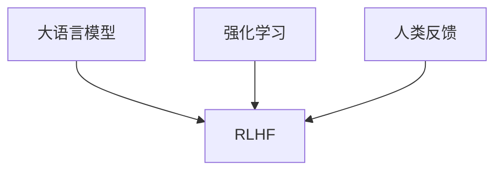

# 大语言模型原理与工程实践：RLHF 的难点和问题

## 1. 背景介绍
### 1.1 大语言模型的发展历程
#### 1.1.1 早期的语言模型
#### 1.1.2 Transformer 的出现
#### 1.1.3 预训练语言模型的崛起

### 1.2 RLHF 的提出
#### 1.2.1 RLHF 的动机
#### 1.2.2 RLHF 的基本思想
#### 1.2.3 RLHF 的潜在优势

## 2. 核心概念与联系
### 2.1 大语言模型
#### 2.1.1 语言模型的定义
#### 2.1.2 大语言模型的特点
#### 2.1.3 大语言模型的应用

### 2.2 强化学习
#### 2.2.1 强化学习的基本概念
#### 2.2.2 强化学习的关键要素
#### 2.2.3 强化学习在自然语言处理中的应用

### 2.3 人类反馈
#### 2.3.1 人类反馈的重要性
#### 2.3.2 人类反馈的形式
#### 2.3.3 人类反馈在 RLHF 中的作用

### 2.4 RLHF 的核心思想
#### 2.4.1 将强化学习应用于大语言模型微调
#### 2.4.2 利用人类反馈引导模型优化
#### 2.4.3 RLHF 与传统微调方法的区别

## 3. 核心算法原理具体操作步骤
### 3.1 RLHF 的整体流程
#### 3.1.1 数据准备
#### 3.1.2 模型初始化
#### 3.1.3 强化学习训练
#### 3.1.4 模型评估与迭代

### 3.2 强化学习算法
#### 3.2.1 策略梯度方法
#### 3.2.2 价值函数近似
#### 3.2.3 Actor-Critic 算法

### 3.3 人类反馈的收集与处理
#### 3.3.1 反馈数据的收集
#### 3.3.2 反馈数据的预处理
#### 3.3.3 反馈数据的表示与编码

### 3.4 模型训练与优化
#### 3.4.1 损失函数的设计
#### 3.4.2 梯度计算与更新
#### 3.4.3 超参数调优

## 4. 数学模型和公式详细讲解举例说明
### 4.1 语言模型的数学表示
#### 4.1.1 概率语言模型
$P(w_1, w_2, ..., w_n) = \prod_{i=1}^n P(w_i | w_1, w_2, ..., w_{i-1})$

#### 4.1.2 神经网络语言模型
$h_t = f(x_t, h_{t-1})$
$P(w_t | w_1, w_2, ..., w_{t-1}) = softmax(W_o h_t + b_o)$

### 4.2 强化学习的数学表示
#### 4.2.1 马尔可夫决策过程
$<S, A, P, R, \gamma>$

#### 4.2.2 策略与价值函数
$\pi(a|s) = P(A_t = a | S_t = s)$
$V^\pi(s) = \mathbb{E}[\sum_{k=0}^\infty \gamma^k R_{t+k+1} | S_t = s]$

#### 4.2.3 策略梯度定理
$\nabla_\theta J(\theta) = \mathbb{E}_{\tau \sim \pi_\theta}[\sum_{t=0}^T \nabla_\theta \log \pi_\theta(a_t|s_t) Q^\pi(s_t, a_t)]$

### 4.3 RLHF 的数学表示
#### 4.3.1 目标函数
$J(\theta) = \mathbb{E}_{\tau \sim \pi_\theta}[\sum_{t=0}^T r(s_t, a_t)]$

#### 4.3.2 人类反馈的数学建模
$r(s, a) = f(feedback(s, a))$

#### 4.3.3 梯度估计与更新
$\nabla_\theta J(\theta) \approx \frac{1}{N} \sum_{i=1}^N \sum_{t=0}^T \nabla_\theta \log \pi_\theta(a_t^{(i)}|s_t^{(i)}) \hat{Q}(s_t^{(i)}, a_t^{(i)})$

## 5. 项目实践：代码实例和详细解释说明
### 5.1 数据准备
#### 5.1.1 数据集的选择与下载
#### 5.1.2 数据预处理与特征提取
#### 5.1.3 数据集的划分与加载

### 5.2 模型构建
#### 5.2.1 模型结构的设计
#### 5.2.2 模型的初始化与加载预训练权重
#### 5.2.3 模型的训练与微调

### 5.3 强化学习训练
#### 5.3.1 环境的构建与交互
#### 5.3.2 奖励函数的设计与计算
#### 5.3.3 策略网络的更新与优化

### 5.4 人类反馈的集成
#### 5.4.1 反馈数据的收集与处理
#### 5.4.2 反馈信号的编码与融合
#### 5.4.3 反馈驱动的模型优化

### 5.5 模型评估与分析
#### 5.5.1 评估指标的选择与计算
#### 5.5.2 模型性能的对比与分析
#### 5.5.3 模型的可解释性与可视化

## 6. 实际应用场景
### 6.1 智能对话系统
#### 6.1.1 客服聊天机器人
#### 6.1.2 个人助理
#### 6.1.3 智能问答系统

### 6.2 内容生成
#### 6.2.1 文章写作助手
#### 6.2.2 新闻摘要生成
#### 6.2.3 创意写作辅助

### 6.3 语言翻译
#### 6.3.1 机器翻译系统
#### 6.3.2 同声传译
#### 6.3.3 跨语言信息检索

### 6.4 其他应用
#### 6.4.1 情感分析
#### 6.4.2 语音识别
#### 6.4.3 文本分类

## 7. 工具和资源推荐
### 7.1 开源框架与库
#### 7.1.1 TensorFlow
#### 7.1.2 PyTorch
#### 7.1.3 Hugging Face Transformers

### 7.2 预训练模型
#### 7.2.1 BERT
#### 7.2.2 GPT 系列
#### 7.2.3 T5

### 7.3 数据集
#### 7.3.1 Wikipedia
#### 7.3.2 BookCorpus
#### 7.3.3 OpenWebText

### 7.4 学习资源
#### 7.4.1 在线课程
#### 7.4.2 教程与博客
#### 7.4.3 学术论文

## 8. 总结：未来发展趋势与挑战
### 8.1 RLHF 的优势与局限
#### 8.1.1 RLHF 的主要优势
#### 8.1.2 RLHF 面临的挑战
#### 8.1.3 RLHF 的适用场景

### 8.2 未来研究方向
#### 8.2.1 更高效的人类反馈机制
#### 8.2.2 多模态信息的融合
#### 8.2.3 可解释性与可控性

### 8.3 伦理与安全考量
#### 8.3.1 隐私保护
#### 8.3.2 公平性与无偏见
#### 8.3.3 安全与鲁棒性

## 9. 附录：常见问题与解答
### 9.1 RLHF 与传统微调方法的区别
### 9.2 RLHF 训练过程中的难点
### 9.3 如何设计有效的人类反馈机制
### 9.4 RLHF 模型的部署与应用注意事项
### 9.5 RLHF 的未来发展前景

大语言模型（Language Model, LM）是自然语言处理（NLP）领域的重要基础模型，旨在学习语言的统计规律和语义表示。近年来，随着深度学习技术的发展和计算资源的增强，大语言模型取得了显著的进步，在许多 NLP 任务上展现出优异的性能。然而，传统的语言模型训练方法主要依赖于无监督的预训练和有限的监督微调，难以充分利用人类知识和反馈信息。

为了进一步提升大语言模型的性能和适应性，研究者提出了基于人类反馈的强化学习（Reinforcement Learning from Human Feedback, RLHF）方法。RLHF 将强化学习与人类反馈相结合，通过引入人类偏好和判断，引导模型朝着更加符合人类期望的方向优化。这种方法不仅可以提高模型生成内容的质量和相关性，还能够使模型具备更强的泛化能力和鲁棒性。

RLHF 的核心思想是将大语言模型视为一个智能体（agent），通过与环境（即人类）的交互来学习和优化策略。在训练过程中，模型根据当前的状态（上下文）生成一个动作（如生成一个单词或句子），然后接收来自人类的反馈作为奖励信号。通过不断地试错和学习，模型逐步调整其策略，以最大化累积奖励，从而生成更加符合人类偏好的内容。

RLHF 训练的具体流程可以概括为以下几个步骤：

1. 数据准备：收集和预处理大规模的无标签语料，作为模型的初始预训练数据。
2. 模型初始化：选择一个预训练的大语言模型作为基础模型，如 GPT、BERT 等。
3. 强化学习训练：
   - 环境设置：将人类反馈引入环境，构建人机交互的界面和机制。
   - 策略优化：使用强化学习算法（如 PPO、A2C 等）更新模型参数，以最大化累积奖励。
   - 人类反馈：收集人类对模型生成内容的评价和反馈，作为奖励信号。
4. 模型评估与迭代：在验证集上评估模型性能，根据评估结果进行模型迭代和改进。

RLHF 中的关键组件包括强化学习算法、人类反馈机制以及奖励函数的设计。常用的强化学习算法有策略梯度方法和 Actor-Critic 方法。策略梯度方法直接优化策略函数，通过梯度上升最大化期望奖励。而 Actor-Critic 方法引入了价值函数来评估状态的价值，通过梯度下降最小化策略函数和价值函数之间的差异。

人类反馈机制的设计也是 RLHF 的重要环节。常见的反馈形式包括显式反馈（如打分、排序等）和隐式反馈（如点击、浏览时间等）。为了有效利用人类反馈，需要对反馈数据进行预处理、表示和编码，将其转化为模型可以理解和学习的形式。此外，还需要设计合适的奖励函数，将人类反馈映射为数值化的奖励信号，引导模型朝着正确的方向优化。

尽管 RLHF 展现出了巨大的潜力，但在实际应用中仍然面临着诸多挑战。首先，人类反馈的质量和一致性是影响模型性能的关键因素。如何设计有效的反馈机制，减少噪声和偏差，是一个亟待解决的问题。其次，RLHF 训练通常需要大量的计算资源和人力成本，如何提高训练效率和降低成本也是一大挑战。此外，RLHF 模型的可解释性和可控性仍有待提高，需要进一步研究如何增强模型的透明度和可信度。

总的来说，RLHF 为大语言模型的优化提供了一种新的思路和方向。通过引入人类反馈和强化学习，RLHF 有望突破传统语言模型的局限，实现更加智能、灵活、贴近人类需求的自然语言处理系统。未来的研究方向可能包括更高效的人类反馈机制、多模态信息的融合、可解释性与可控性的提升等。同时，我们也需要关注 RLHF 在伦理、隐私、安全等方